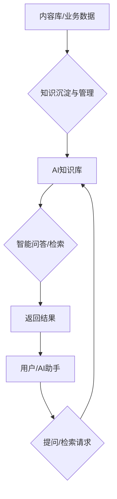

# 中台AI知识库前端功能说明

## 一、功能简介
中台AI知识库为AI手机端和各业务系统提供统一的专业知识、数据问答和智能检索能力。支持将内容库中的专业知识、业务数据、流程规范等沉淀为知识库，供AI助手、业务人员、终端用户随时调用，实现智能问答、业务辅助、内部培训等多场景应用。

---

## 二、AI知识库功能流程图

---

## 三、相关UI图片参考
- 工作台主界面（AI知识库入口）：`../4、前端/UI/工作台.png`
- 我的模块（可能涉及知识库设置）：`../4、前端/UI/我的.png`

---

## 四、主要功能模块

### 1. 知识内容管理与沉淀
- 支持将内容库中的专业知识、业务数据、流程规范、常见问题等一键沉淀为知识库条目。
- 支持知识条目的分组、标签、版本管理、批量导入导出。
- 支持知识内容的全文检索、智能推荐、自动归类。

### 2. AI问答与智能检索
- 支持AI手机端、Web端等多终端通过自然语言提问，智能检索知识库内容并返回专业答案。
- 支持多轮对话、上下文理解、知识引用、答案溯源。
- 支持知识库与内容库、业务数据的联动，自动补充最新知识。

### 3. 权限与多端接入
- 支持多角色、多账号权限控制，按部门/岗位/项目分配知识访问权限。
- 支持AI助手、业务系统、手机端等多端接入知识库API。
- 支持知识库内容的动态更新、权限同步、接口调用统计。

### 4. 数据统计与分析
- 实时统计知识库调用量、问答量、命中率、用户活跃度等。
- 支持多维度数据可视化、趋势分析、导出报表。
- 主要功能区：统计区块、图表区。

### 5. 安全与合规
- 支持知识内容加密存储、接口加密传输。
- 支持操作日志、问答日志、权限变更日志查询。
- 支持知识内容的合规审核、敏感词过滤、数据脱敏。

---

## 五、前端开发要点

### 1. 页面与功能结构
- 主要页面包括知识内容管理、知识条目编辑、AI问答入口、权限配置、统计分析等。
- 主要功能区包括知识表格、标签管理、AI问答区、权限配置区、统计区块、日志区等。

### 2. 数据流与接口调用
- 知识库管理相关：
  - 获取知识条目列表
  - 新增/编辑/删除知识条目
  - 知识分组、标签、版本管理
- AI问答相关：
  - AI提问接口
  - 智能检索接口
  - 多端接入API
- 权限与日志相关：
  - 获取权限配置
  - 获取操作日志、问答日志
- 数据统计相关：
  - 获取知识库统计数据
  - 导出统计报表

### 3. 交互细节
- 支持知识条目的批量管理、标签化、版本切换、全文检索。
- 支持AI问答的多轮对话、上下文理解、知识引用、答案溯源。
- 支持权限的灵活配置、多端接入、动态同步。
- 所有表单、弹窗、表格、按钮等均用统一UI风格。
- 数据加载、操作反馈均用 Skeleton 骨架屏和 Loading 状态。
- 路由跳转用 SPA 体验。
- 权限控制、入口自定义等按业务需求配置。

### 4. 开发建议
- 先梳理好知识内容管理、AI问答、权限配置、多端接入等结构，优先实现主流程。
- 充分利用已有的 UI 组件和 API 封装，减少重复开发。
- 交互细节（如批量管理、智能检索、骨架屏、权限控制）按实际业务需求逐步完善。
- 所有接口调用建议统一封装，便于维护。

---

> 本文档持续更新，已结合现有前端代码结构和业务需求，后续如有功能调整请及时补充。 