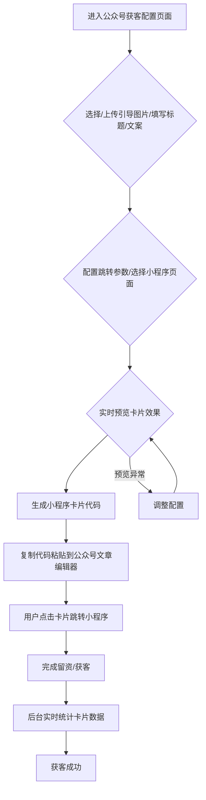

# 场景获客-公众号获客功能说明（重写版）

## 一、功能概述
公众号获客功能，核心是为运营者生成可直接嵌入公众号文章页面的小程序卡片。运营者可自定义卡片标题、引导图片、跳转配置等，用户在公众号文章内点击卡片即可跳转到存客宝小程序，完成留资、获客等动作。无需解绑公众号账号，无需复杂授权，聚焦于"生成-配置-粘贴-获客"全流程极简体验。

### 公众号获客前端功能流程图

## 二、核心功能模块

### 1. 小程序卡片生成
- 支持一键生成适配公众号文章的存客宝小程序卡片代码。
- 可自定义卡片标题、引导文案、引导图片（支持上传/选择模板）。
- 支持配置跳转参数（如活动ID、渠道码、分组等），便于后续数据归因。
- 生成的卡片代码可直接复制粘贴到公众号文章编辑器。

### 2. 配置与预览
- 实时预览卡片在公众号文章内的展示效果。
- 支持多种样式模板选择，适配不同运营场景。
- 可配置点击后跳转的小程序页面（如表单、活动页、内容页等）。

### 3. 数据统计与追踪
- 实时统计每个卡片的点击量、跳转量、转化量。
- 支持按渠道、活动、时间等多维度分析。
- 可导出数据报表，便于运营复盘。

### 4. 灵活集成与权限
- 生成的卡片代码无需复杂开发，直接粘贴即用。
- 支持多账号、多业务线灵活配置和管理。
- 首页入口、数据区块等支持权限控制和自定义显示。

---

## 三、功能流程
1. 进入公众号获客配置页面，选择/上传引导图片，填写标题、引导文案。
2. 配置跳转参数（如活动ID、渠道码、分组等），选择跳转的小程序页面。
3. 实时预览卡片效果，确认无误后生成小程序卡片代码。
4. 复制代码，粘贴到公众号文章编辑器指定位置。
5. 用户阅读公众号文章时，点击卡片自动跳转到存客宝小程序，完成留资/获客。
6. 后台实时统计卡片点击、跳转、转化等数据。

---

## 四、前端实现要点
- 采用 Shadcn UI + Tailwind CSS 实现卡片配置、预览、生成、数据统计等交互。
- 卡片生成支持多模板、图片上传、参数配置、实时预览。
- 生成代码支持一键复制，兼容公众号文章编辑器粘贴。
- 数据统计区块建议用 Chart.js/Echarts 实现。
- 支持Skeleton骨架屏提升加载体验。
- 首页入口、数据区块等支持权限控制和自定义显示。

---

## 五、数据结构与接口
- 卡片配置字段：标题、引导文案、引导图片、跳转参数、跳转页面、生成时间、创建人等。
- 卡片生成接口：/api/mpcard/generate
- 数据统计接口：/api/mpcard/stats
- 模板管理接口：/api/mpcard/templates

---

> 本文档已根据最新需求重写，专注于公众号文章内小程序卡片的生成、配置、粘贴与数据统计。如有新需求请及时补充。 

---

## 六、相关前端UI图片

以下是与公众号获客功能相关的部分前端UI截图，帮助理解用户界面：

### 场景获客 - 公众号获客入口与配置示例 (示意图)

> 本文档持续更新，已结合现有前端代码结构和业务需求，后续如有功能调整请及时补充。 