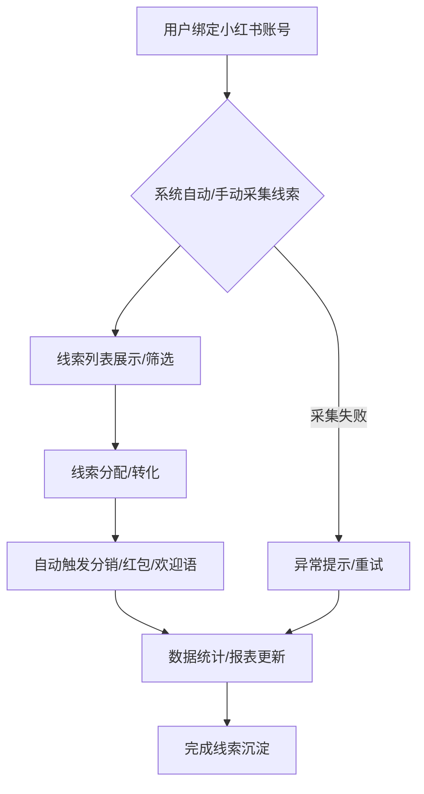

# 场景获客-小红书获客功能说明（通俗版）

## 一、功能简介
小红书获客就是通过对接小红书平台，把小红书上的客户线索（如私信、评论、表单等）自动采集到系统，分配给员工，自动发分销奖励、红包，数据实时统计，帮助企业高效获取小红书流量并沉淀到私域。

### 小红书获客前端功能流程图

## 二、主要功能模块

### 1. 小红书账号管理
- 支持绑定/解绑多个小红书号。
- 展示账号信息、状态、粉丝数等。
- 支持账号分组、标签、分销层级归属。

### 2. 线索采集与导入
- 自动采集小红书私信、评论、表单等线索。
- 支持手动录入或批量导入（手机号、微信号、昵称、来源笔记/直播、分销关系等）。
- 系统自动去重、校验有效性。

### 3. 线索分配与转化
- 线索可自动分配给员工、分组或分销层级。
- 分配规则可自定义（如按来源、时间、标签等）。
- 支持自动推送欢迎语、加微信、分组、分销奖励等。

### 4. 分销返利与红包
- 线索可绑定分销关系，自动计算返利。
- 支持自动发红包奖励。
- 分销和红包数据实时同步。

### 5. 数据统计与分析
- 实时统计小红书获客总量、转化率、各渠道/笔记/直播带来的线索数、分销返利、红包发放等。
- 支持多维度筛选（时间、账号、来源、员工、分销层级等）。
- 数据可视化展示（折线图、饼图、柱状图等）。

### 6. 互动与自动化
- 支持自动回复私信、评论，提升互动效率。
- 可配置自动化任务（如定时推送、自动分组、分销奖励、红包发放、AI内容推送等）。

---

## 三、前端开发要点
- 用 Shadcn UI + Tailwind CSS 做账号管理、线索列表、分销返利、红包池、统计报表等页面。
- 小红书授权、数据采集等通过后端API实现，前端只负责展示和交互。
- 所有加载过程用骨架屏（Skeleton）提升体验。
- 组件建议拆分：账号管理、线索采集、分配转化、分销返利、红包池、数据统计、自动化配置。
- 数据可视化建议用 Chart.js/Echarts 实现。
- 首页入口、数据区块、分销返利、红包池等支持权限控制和自定义显示。

---

## 四、接口说明（前端常用）
- 小红书账号：/api/xiaohongshu/account
- 线索采集：/api/xiaohongshu/leads
- 线索分配：/api/xiaohongshu/assign
- 分销返利：/api/xiaohongshu/distribution
- 红包池：/api/xiaohongshu/redpacket
- 数据统计：/api/xiaohongshu/stats
- 自动化配置：/api/xiaohongshu/automation

---

## 五、相关前端UI图片

以下是与小红书获客功能相关的部分前端UI截图，帮助理解用户界面：

### 场景获客 - 小红书获客入口与使用示例 (示意图)

> 本文档持续更新，欢迎补充建议。所有功能和接口都以"让前端开发和业务都能一眼看懂"为原则。 