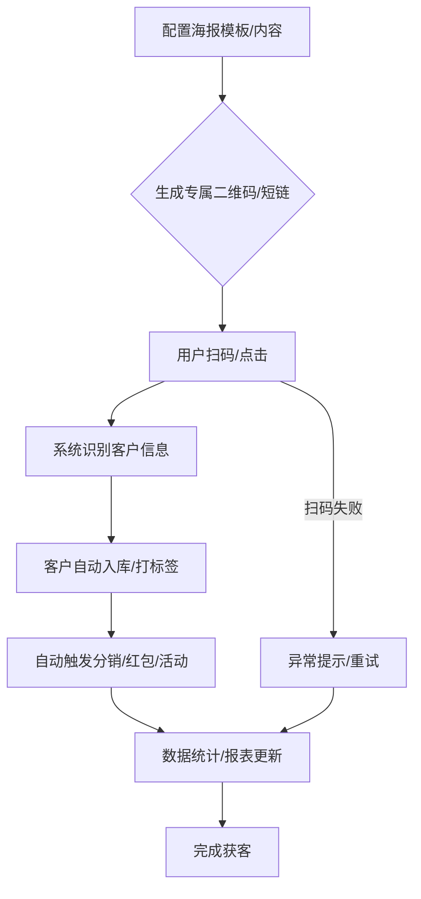
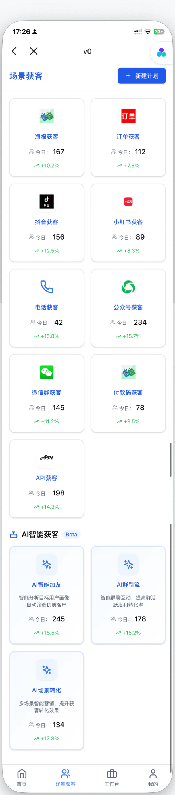

# 场景获客-海报获客功能说明（通俗版）

## 一、功能简介
海报获客就是通过生成专属二维码海报，用户扫码后自动进入私域流量池。支持分销奖励、红包、AI内容推送等自动化管理，扫码后可自动触发各种活动，数据实时统计，方便企业高效获客。

### 海报获客前端功能流程图

## 二、主要功能模块

### 1. 海报模板管理
- 多种海报模板选择和自定义。
- 可上传品牌LOGO、背景图、宣传语等。
- 实时预览海报效果。

### 2. 二维码生成与绑定
- 每个海报自动生成专属二维码。
- 二维码可绑定不同渠道、活动、推广人、分销层级。
- 支持批量生成和下载。

### 3. 渠道追踪与数据统计
- 统计每个海报的扫码次数、转化人数、转化率、分销返利、红包发放等。
- 支持多维度筛选和分析。
- 数据可视化展示（折线图、柱状图等）。

### 4. 用户分层与自动分组
- 新用户扫码后自动分配到指定分组、标签或分销层级。
- 支持自定义分组和分销规则。

### 5. 活动管理与自动化
- 支持为不同海报设置专属活动（如优惠券、抽奖、分销奖励、红包发放、AI内容推送等）。
- 用户扫码后自动触发活动和自动化任务。

### 6. 分享与传播
- 一键生成海报图片，支持保存到本地或直接分享到微信、朋友圈等社交平台。
- 支持生成带参数的短链，便于线上推广。

---

## 三、前端开发要点
- 用 Shadcn UI + Tailwind CSS 做模板选择、表单、预览、分销返利、红包池、活动配置等页面。
- 二维码生成可用 qrcode.react 或后端接口返回图片。
- 数据统计区块建议用 Chart.js/Echarts 实现。
- 所有加载过程用骨架屏（Skeleton）提升体验。
- 分享功能需兼容移动端 H5 与 PC。
- 组件建议拆分：模板选择、二维码生成、分销返利、红包池、数据统计、活动配置、分享区块。
- 首页入口、数据区块、分销返利、红包池等支持权限控制和自定义显示。

---

## 四、接口说明（前端常用）
- 海报模板、二维码、活动配置、分销返利、红包池等均通过 /lib/api 统一管理
- 数据统计接口需支持多维度筛选
- 用户分组/标签/分销接口需与后端约定格式

---

## 五、相关前端UI图片

以下是与海报获客功能相关的部分前端UI截图，帮助理解用户界面：

### 场景获客 - 海报获客入口与使用示例 (示意图)

> 本文档持续更新，已结合现有前端代码结构和业务需求，后续如有功能调整请及时补充。 

> 本文档持续更新，欢迎补充建议。所有功能和接口都以"让前端开发和业务都能一眼看懂"为原则。 