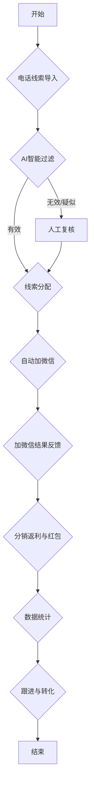
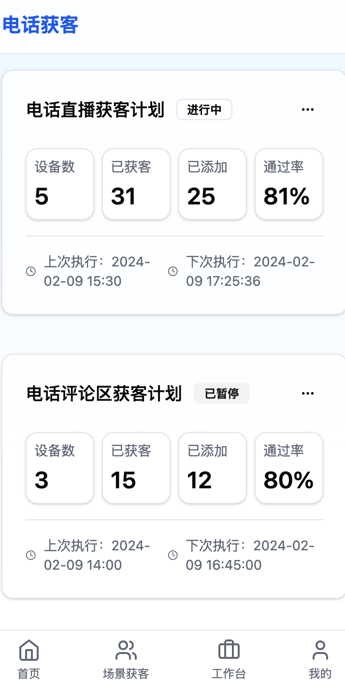

# 场景获客-电话获客功能说明（通俗版）

## 一、功能简介
电话获客就是通过收集客户电话号码，自动加微信、分配给员工、发红包、分销奖励等，帮助企业快速把电话线索变成微信好友，沉淀到私域客户池。整个过程自动化，省时省力。

## 二、主要功能模块

### 电话获客功能流程图

### 1. 电话线索导入
- 支持批量导入（Excel/CSV）和单条录入。
- 可以直接粘贴号码，或上传表格。
- 导入内容：电话、姓名、来源、场景、分销关系、红包奖励等。

### 2. 自动加微信
- 电话打进来，系统自动识别号码。
- 号码会推送到指定设备（如微信手机），自动发起加好友。
- 多台设备轮流加，效率高。
- 加好友结果会实时反馈（成功/失败/待确认）。

### 3. AI 智能过滤
- 系统自动去重、校验号码格式、过滤黑名单。
- 可识别无效或疑似垃圾号码。
- 结果分为：有效、疑似无效、需人工复核。
- 支持一键批量复核。

### 4. 线索分配
- 有效号码自动分配给员工、分组或分销层级。
- 分配规则可自定义（如按来源、场景等）。

### 5. 分销返利与红包
- 线索可绑定分销关系，自动计算返利。
- 支持自动发红包奖励。
- 分销和红包数据实时同步。

### 6. 数据统计
- 实时统计导入、有效、无效、加好友成功、分销返利、红包发放等数据。
- 支持历史记录查询和导出。

### 7. 跟进与转化
- 每条线索可记录跟进情况（如通话、备注、转化状态）。
- 支持自动化任务（如定时提醒、自动分组、自动发红包等）。
- 加微信后可自动推送欢迎语、标签分组等。

---

## 三、前端开发要点
- 用 Shadcn UI + Tailwind CSS 做表单、导入、设备配置、进度展示、分销返利、红包池、跟进记录等页面。
- 设备联动、加微信等通过后端API实现，前端只负责展示进度和结果。
- 所有加载过程用骨架屏（Skeleton）提升体验。
- 组件建议拆分：导入表单、设备配置、加微信进度、AI过滤结果、人工复核、分销返利、红包池、统计区块、跟进记录。
- 导入支持 Excel/CSV 文件解析（如用 xlsx.js）。
- 首页入口、数据区块、分销返利、红包池等支持权限控制和自定义显示。

---

## 四、接口说明（前端常用）
- 设备配置：/api/phone/device-config
- 自动加微信：/api/phone/add-wechat
- 加微信结果回传：/api/phone/add-wechat-result
- AI过滤：/api/phone/ai-filter
- 电话导入：/api/phone/import
- 线索分配：/api/phone/assign
- 分销返利：/api/phone/distribution
- 红包池：/api/phone/redpacket
- 跟进记录：/api/phone/followup
- 历史记录：/api/phone/history

---

> 本文档持续更新，欢迎补充建议。所有功能和接口都以"让前端开发和业务都能一眼看懂"为原则。 