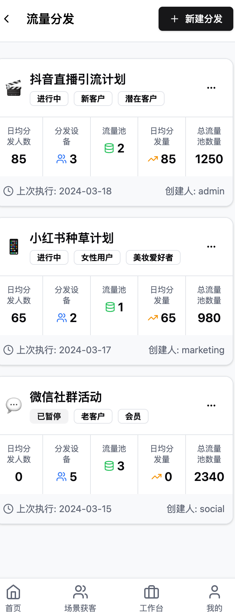

# 工作台-内容多平台分发前端功能说明

## 一、功能简介
内容多平台分发功能支持用户在内容库中选择任意内容（如图文、图片、视频、链接等），一键分发到全网主流可发朋友圈的平台（如微信朋友圈、视频号、抖音、快手、小红书、微博、B站、QQ空间等），实现内容高效触达和全渠道曝光。

### 内容多平台分发前端流程图

```mermaid
graph TD
    A[进入内容库/选择内容] --> B{点击"一键分发"};
    B --> C[选择目标平台/账号];
    C --> D{配置分发细节 (定时/批量)};
    D --> E[确认并创建分发任务];
    E --> F[任务进度跟踪/状态更新];
    F --> G[查看分发结果/报告];
    G --> H[完成/优化策略];
    E -- 任务失败 --> I[异常提示/重试];
    I --> G;
```

---

## 二、主要功能模块

### 1. 内容选择与分发入口
- 支持在内容库中批量选择内容素材。
- 支持多选、单选、内容预览、内容筛选。
- 提供一键分发入口，支持分发到多个平台。

### 2. 平台账号与分发配置
- 支持绑定和管理各主流平台账号（如微信、抖音、快手、小红书、微博、B站、QQ空间等）。
- 支持分发前选择目标平台、目标账号、分发方式（立即/定时/批量）。
- 支持分发内容的适配（如自动裁剪、格式转换、平台限制提示等）。

### 3. 分发任务管理
- 支持分发任务的创建、编辑、删除、进度跟踪、状态切换。
- 支持分发任务的批量操作、失败重试、分发日志查询。
- 支持分发结果回执、异常提醒。

### 4. 数据统计与分析
- 实时统计各平台分发量、成功率、覆盖人数、互动量等。
- 支持多维度数据可视化、趋势分析、导出报表。
- 主要功能区：统计区块、图表区。

### 5. 权限与安全
- 支持多角色、多账号权限控制。
- 支持操作日志、分发日志查询。
- 分发过程加密传输，保障数据安全。

---

## 三、前端开发要点

### 1. 页面与功能结构
- 主要页面包括内容选择、平台账号管理、分发配置、分发任务管理、统计分析等。
- 主要功能区包括内容表格、平台账号管理、分发配置区、批量操作区、统计区块、日志区等。

### 2. 数据流与接口调用
- 内容分发相关：
  - 获取内容库列表
  - 获取平台账号列表
  - 创建/编辑/删除分发任务
  - 获取分发进度、分发结果
- 日志与统计相关：
  - 获取分发日志
  - 获取分发统计数据

### 3. 交互细节
- 支持内容的多选、筛选、预览、批量分发。
- 支持分发前的内容适配、平台限制提示、分发方式选择。
- 支持分发任务的进度跟踪、失败重试、异常提醒。
- 所有表单、弹窗、表格、按钮等均用统一UI风格。
- 数据加载、操作反馈均用 Skeleton 骨架屏和 Loading 状态。
- 路由跳转用 SPA 体验。
- 权限控制、入口自定义等按业务需求配置。

### 4. 开发建议
- 先梳理好内容选择、平台账号管理、分发配置、分发任务管理的结构，优先实现主流程。
- 充分利用已有的 UI 组件和 API 封装，减少重复开发。
- 交互细节（如内容适配、批量分发、骨架屏、权限控制）按实际业务需求逐步完善。
- 所有接口调用建议统一封装，便于维护。

---

## 四、相关前端UI图片

以下是与内容多平台分发功能相关的部分前端UI截图，帮助理解用户界面：

### 工作台 - 流量分发入口示例 (示意图)


### 工作台 - 流量分发页面 (示意图)



> 本文档持续更新，已结合现有前端代码结构和业务需求，后续如有功能调整请及时补充。 