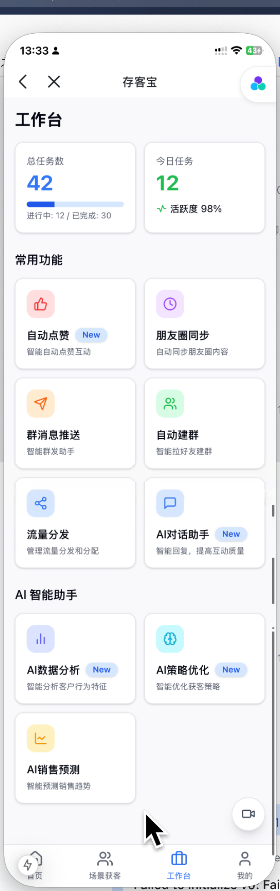

# 工作台-自动点赞前端功能说明

## 一、功能简介
自动点赞功能用于批量、自动地为指定微信号/设备下的朋友圈内容点赞，提升互动率和客户活跃度。支持多任务、多设备、多账号、定时、批量、标签筛选等自动化配置。

### 自动点赞任务前端功能流程图

```mermaid
graph TD
    A[进入自动点赞] --> B{新建点赞任务};
    B --> C[配置点赞规则 (设备/目标/时间)];
    C --> D[确认并发布任务];
    D --> E[任务进度跟踪/状态显示];
    E --> F[查看点赞统计/日志];
    F --> G[完成/优化];
    D -- 任务失败 --> H[错误提示/重试];
    H --> E;
```

---

## 二、主要功能模块

### 1. 自动点赞任务管理
- 支持新建、编辑、删除自动点赞任务。
- 每个任务可配置点赞设备、目标分组、点赞间隔、每日上限、时间区间、内容类型、目标标签、是否启用等。
- 支持任务的启动/暂停、进度展示、状态切换。
- 主要功能区：任务卡片、任务列表、顶部操作栏（新建、搜索、筛选、刷新）。

### 2. 设备与目标对象选择
- 支持批量选择设备、微信号，支持状态筛选（在线/离线）。
- 支持目标分组、标签筛选，灵活配置目标人群。
- 设备信息包括名称、微信号、在线状态等。

### 3. 点赞内容与规则配置
- 支持配置点赞内容类型（文本、图片、视频等）。
- 支持设置点赞间隔、每日点赞上限、点赞时间段、是否循环、是否启用等。
- 支持标签筛选、分组筛选、优先级设置等。

### 4. 点赞任务流程与步骤
- 支持多步骤流程（基础设置→设备选择→标签筛选→确认发布）。
- 每一步均有表单校验、进度指示、上一步/下一步操作。

### 5. 数据统计与分析
- 实时统计每个任务的点赞总数、已点赞数、失败数、覆盖好友数等。
- 支持数据可视化展示（折线图、柱状图等）。
- 支持导出点赞记录及统计数据。
- 主要功能区：统计区块、图表区。

### 6. 权限与安全
- 支持多角色、多账号权限控制。
- 支持操作日志、点赞日志查询。
- 点赞过程加密传输，保障数据安全。

---

## 三、前端开发要点

### 1. 页面与功能结构
- 主要页面包括任务列表、新建任务、编辑任务、任务详情/进度/统计等。
- 主要功能区包括基础配置表单、设备选择、标签筛选、多步骤流程指示、批量操作区、统计区块、日志区等。

### 2. 数据流与接口调用
- 自动点赞任务相关：
  - 创建任务
  - 获取任务列表
  - 获取任务详情
  - 更新任务
  - 删除任务
- 设备与微信号相关：
  - 获取设备列表
  - 获取微信号列表
- 点赞对象与内容相关：
  - 获取目标分组、标签、内容类型等
- 日志与统计相关：
  - 获取点赞日志
  - 数据统计

### 3. 交互细节
- 新建/编辑任务时，按步骤依次填写基础配置、选择设备、筛选标签、确认发布。
- 每一步均有表单校验、进度指示、上一步/下一步操作。
- 任务列表页支持任务的启动/暂停、编辑、删除、查看详情。
- 详情页支持进度查看、批量操作、统计分析、日志导出等。
- 所有表单、弹窗、表格、按钮等均用统一UI风格。
- 数据加载、操作反馈均用 Skeleton 骨架屏和 Loading 状态。
- 路由跳转用 SPA 体验。
- 权限控制、入口自定义等按业务需求配置。

### 4. 开发建议
- 先梳理好页面结构和功能拆分，优先实现任务管理、设备选择、标签筛选主流程。
- 充分利用已有的 UI 组件和 API 封装，减少重复开发。
- 交互细节（如批量操作、筛选、骨架屏、权限控制）按实际业务需求逐步完善。
- 所有接口调用建议统一封装，便于维护。

---

## 四、相关前端UI图片

以下是与自动点赞功能相关的部分前端UI截图，帮助理解用户界面：

### 工作台 - 自动点赞入口与任务列表 (示意图)



> 本文档持续更新，已结合现有前端代码结构和业务需求，后续如有功能调整请及时补充。 