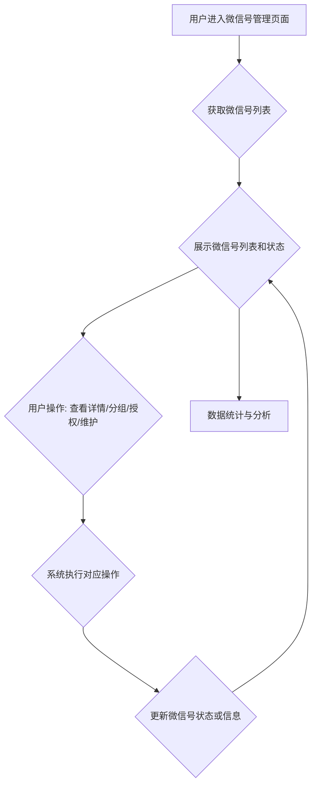

# 我的-微信号管理前端功能说明

## 一、功能简介
微信号管理功能用于对接入系统的所有微信号进行统一管理、状态监控、分组、授权和维护，便于多账号运营、风控和数据安全。

---

## 二、微信号管理流程图

---

## 三、相关UI图片参考
- 我的页面入口：`../4、前端/UI/我的.png`
- 设备管理页面（与微信号管理相关联）：`../4、前端/UI/我的-设备管理.png`

---

## 四、主要功能模块

### 1. 微信号列表与分组管理
- 支持展示所有已接入微信号的基本信息（微信号、昵称、绑定设备、在线状态、分组、授权状态等）。
- 支持微信号分组、批量分组、分组筛选、分组管理。
- 支持微信号的搜索、筛选、排序、批量操作。

### 2. 微信号状态监控
- 实时展示微信号的在线/离线状态、运行状态、异常告警等。
- 支持状态变更提醒、异常高亮、健康度评分。

### 3. 微信号授权与解绑
- 支持对微信号进行授权、解绑、重新绑定等操作。
- 支持批量授权、批量解绑。
- 支持微信号授权日志、操作记录查询。

### 4. 微信号详情与维护
- 支持查看微信号详细信息（绑定设备、历史任务、操作日志、标签、备注等）。
- 支持微信号维护操作，如重登、远程控制、升级、恢复初始状态等。
- 支持微信号备注、标签管理。

### 5. 数据统计与分析
- 实时统计微信号总数、在线微信号数、分组分布、授权状态等。
- 支持数据可视化展示（饼图、柱状图等）。
- 支持导出微信号列表及统计数据。
- 主要功能区：统计区块、图表区。

### 6. 权限与安全
- 支持多角色、多账号权限控制。
- 支持操作日志、微信号日志查询。
- 微信号管理过程加密传输，保障数据安全。

---

## 五、前端开发要点

### 1. 页面与功能结构
- 主要页面包括微信号列表、分组管理、微信号详情、微信号授权/解绑、微信号维护等。
- 主要功能区包括微信号表格、分组管理、状态监控、批量操作区、统计区块、日志区等。

### 2. 数据流与接口调用
- 微信号管理相关：
  - 获取微信号列表
  - 获取微信号详情
  - 微信号分组管理
  - 微信号授权/解绑/重新绑定
  - 微信号维护操作
- 微信号状态与日志相关：
  - 获取微信号状态
  - 获取微信号日志、操作记录
- 数据统计相关：
  - 获取微信号统计数据
  - 导出微信号列表及统计数据

### 3. 交互细节
- 支持微信号的搜索、筛选、排序、分组、批量操作。
- 支持微信号的授权、解绑、维护等操作，均有操作确认和反馈。
- 微信号状态、异常、健康度等信息实时展示。
- 详情页支持微信号信息、历史任务、日志等多维度展示。
- 所有表单、弹窗、表格、按钮等均用统一UI风格。
- 数据加载、操作反馈均用 Skeleton 骨架屏和 Loading 状态。
- 路由跳转用 SPA 体验。
- 权限控制、入口自定义等按业务需求配置。

### 4. 开发建议
- 先梳理好页面结构和功能拆分，优先实现微信号列表、分组管理、微信号详情主流程。
- 充分利用已有的 UI 组件和 API 封装，减少重复开发。
- 交互细节（如批量操作、筛选、骨架屏、权限控制）按实际业务需求逐步完善。
- 所有接口调用建议统一封装，便于维护。

---

> 本文档持续更新，已结合现有前端代码结构和业务需求，后续如有功能调整请及时补充。 