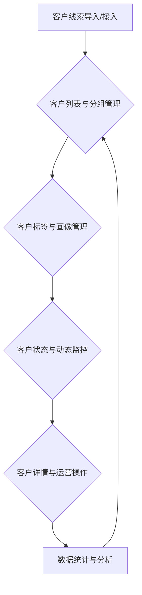

# 我的-流量池前端功能说明

## 一、功能简介
流量池功能用于统一管理和沉淀所有来源的客户流量，实现客户分层、标签化、动态分组、批量运营和数据分析，提升私域流量的转化和复用效率。

该功能主要通过与后端 `/api/v1/my/customer_pool/*` 系列接口进行交互实现数据的获取和操作。

---

## 二、流量池功能流程图

---

## 三、相关UI图片参考
- "我的"模块主界面（流量池入口）：`../4、前端/UI/我的.png`
- 流量池列表页面：`../4、前端/UI/我的-流量池.png`

---

## 四、主要功能模块及接口对应

### 1. 客户流量列表与分组管理

- **功能描述:** 支持展示所有流量客户的基本信息，提供客户分组、批量分组、分组筛选、分组管理功能，以及客户的搜索、筛选、排序、批量操作。
- **对应接口:**
    - 获取客户列表: `GET /api/v1/my/customer_pool/list` (用于获取客户列表数据，支持分页、搜索、筛选、排序)
    - 获取分组列表: `GET /api/v1/my/customer_pool/groups` (用于获取客户分组列表，用于筛选和分组管理)
    - 创建分组: `POST /api/v1/my/customer_pool/groups`
    - 更新分组: `PUT /api/v1/my/customer_pool/groups/{groupId}`
    - 删除分组: `DELETE /api/v1/my/customer_pool/groups/{groupId}`
    - 批量更新客户信息 (含批量分组): `POST /api/v1/my/customer_pool/batch_updatVe`
- **前端实现要点:**
    - 使用 Shadcn UI 的 `DataTable` 或类似的表格组件展示客户列表，支持分页、排序。
    - 实现搜索框和筛选条件的交互，参数变化时调用 `/api/v1/my/customer_pool/list` 接口刷新列表。
    - 使用 Shadcn UI 的 `Dialog` 或 `Sheet` 组件实现分组管理和创建/编辑分组的弹窗。
    - 实现批量选中客户的功能，批量操作按钮（如批量分组）根据选中状态和用户权限显示。

### 2. 客户标签与画像管理

- **功能描述:** 支持客户标签管理、批量打标签、标签筛选、标签分组。支持客户画像展示（基础信息、行为轨迹、互动记录等）。
- **对应接口:**
    - 获取标签列表: `GET /api/v1/my/customer_pool/tags` (用于获取客户标签列表，用于筛选和标签管理)
    - 创建标签: `POST /api/v1/my/customer_pool/tags`
    - 更新标签: `PUT /api/v1/my/customer_pool/tags/{tagId}`
    - 删除标签: `DELETE /api/v1/my/customer_pool/tags/{tagId}`
    - 批量更新客户信息 (含批量打标签): `POST /api/v1/my/customer_pool/batch_update`
    - 获取客户详情 (含画像相关信息): `GET /api/v1/my/customer_pool/detail/{customerId}`
    - 获取客户行为轨迹: `GET /api/v1/my/customer_pool/customer/{customerId}/behavior_trail`
    - 获取客户互动记录: `GET /api/v1/my/customer_pool/customer/{customerId}/interactions`
- **前端实现要点:**
    - 使用 Shadcn UI 组件构建标签管理界面或弹窗。
    - 在客户详情页，使用不同的区域或Tab展示客户基础信息、标签、分组、行为轨迹、互动记录等，分别调用对应的接口获取数据。
    - 实现标签的多选和批量打标签交互。

### 3. 客户状态与动态监控

- **功能描述:** 实时展示客户的活跃状态、最近互动、流转轨迹等。支持客户状态变更提醒、异常客户高亮、健康度评分（可能依赖后端和AI服务）。
- **对应接口:**
    - 获取客户列表 (含状态信息): `GET /api/v1/my/customer_pool/list`
    - 获取客户详情 (含状态、轨迹): `GET /api/v1/my/customer_pool/detail/{customerId}`
    - 获取客户状态/日志相关接口 (如行为轨迹、互动记录): `GET /api/v1/my/customer_pool/customer/{customerId}/...`
- **前端实现要点:**
    - 在客户列表中直观展示客户状态，对异常状态进行高亮。
    - 客户详情页展示客户的活跃状态和动态信息。
    - 实时性要求较高的数据（如在线状态），考虑使用 WebSocket 或短轮询。

### 4. 客户详情与运营操作

- **功能描述:** 支持查看客户详细信息，支持客户备注、分组、标签、批量运营操作（如批量加好友、批量分配、批量群发等）。支持客户归档、移除、导出等操作。
- **对应接口:**
    - 获取客户详情: `GET /api/v1/my/customer_pool/detail/{customerId}`
    - 更新客户信息 (含备注、分组、标签): `PUT /api/v1/my/customer_pool/update/{customerId}`
    - 批量更新客户信息: `POST /api/v1/my/customer_pool/batch_update`
    - 客户批量运营操作接口 (如批量加好友): `POST /api/v1/my/customer_pool/batch_add_friend`
    - 获取操作日志: `GET /api/v1/my/customer_pool/customer/{customerId}/operation_logs`
    - （归档、移除、导出接口待定，需在后端文档中补充）
- **前端实现要点:**
    - 构建客户详情页面，使用 Shadcn UI 组件展示信息和操作按钮。
    - 实现备注、分组、标签等的编辑和更新功能，调用 `PUT /api/v1/my/customer_pool/update/{customerId}` 接口。
    - 实现批量运营操作的交互流程，调用对应的批量操作接口，并处理异步任务的进度和结果反馈。
    - 在客户详情页展示操作日志。

### 5. 数据统计与分析

- **功能描述:** 实时统计流量池客户总数、分组分布、标签分布、活跃度等，支持数据可视化展示，支持导出客户列表及统计数据。
- **对应接口:**
    - 获取流量池统计数据: `GET /api/v1/my/customer_pool/statistics`
    - 获取客户列表 (用于导出): `GET /api/v1/my/customer_pool/list` (获取全量数据或根据筛选条件获取)
    - （导出接口待定，需在后端文档中补充）
- **前端实现要点:**
    - 使用 Chart.js 或 Echarts 组件根据 `/api/v1/my/customer_pool/statistics` 返回的数据绘制饼图、柱状图、折线图等。
    - 在统计区块展示关键数值。
    - 实现数据导出的交互。

### 6. 权限与安全

- **功能描述:** 支持多角色、多账号权限控制。支持操作日志、客户日志查询。客户数据管理过程加密传输，保障数据安全。
- **对应接口:**
    - 操作日志查询接口: `GET /api/v1/my/customer_pool/customer/{customerId}/operation_logs`
    - 后端接口均有权限校验 (在后端文档中已说明)
- **前端实现要点:**
    - 根据后端返回的用户权限信息，控制页面元素的显示与隐藏（如某些操作按钮）。
    - 所有敏感数据（如手机号、微信号）在前端只展示后端脱敏后的数据。
    - 所有与后端交互都应通过 HTTPS。

---

## 三、前端技术实现要点与优化

1.  **技术栈:** 基于 React 18 进行开发，使用 Shadcn UI 和 Tailwind CSS 构建界面。
2.  **UI组件:** 广泛使用 Shadcn UI 提供的表格、表单、弹窗、按钮、下拉框、日期选择器、Tooltip等组件，确保UI风格统一且符合设计规范。
3.  **样式与布局:** 使用 Tailwind CSS 进行灵活的布局、间距、颜色、字体、响应式设计。利用其工具类快速构建复杂界面。
4.  **iOS 风格优化:**
    - **颜色:** 使用 Tailwind 配置中定义的、从原型或设计稿提取的 iOS 风格颜色变量。
    - **字体:** 配置使用系统字体栈 (`font-sans`) 或指定接近 San Francisco 的字体。
    - **阴影与圆角:** 应用 Tailwind 的 `shadow-*` 和 `rounded-*` 类，根据设计稿微调阴影强度和圆角大小。
    - **间距与对齐:** 精确控制 `padding`, `margin`, `gap` 等属性，使元素间距和整体布局符合 iOS 设计细节。
5.  **性能与体验:**
    - **骨架屏 (Skeleton):** 在客户列表、客户详情、统计图表等数据加载期间，使用 Shadcn UI 的 `Skeleton` 组件作为占位符，提升用户体验。
    - **数据加载状态:** 管理 loading 和 error 状态，加载失败时提供友好的错误提示和重试机制。
    - **异步操作反馈:** 批量操作等异步任务，提供明确的状态反馈（如进度条、Toast 提示），避免用户误认为操作无响应。
6.  **状态管理:** 推荐使用 React Query 或 SWR 来管理组件的异步数据请求和缓存。对于全局状态，可以使用 Zustand 或 Jotai 等轻量级状态管理库。
7.  **代码结构:**
    - 采用 Feature-sliced 或类似的架构模式组织代码，按功能（customer-list, customer-detail, group-management, tag-management）划分目录。
    - 将可复用的UI组件放入 `components/ui` 或 `components/shared`。
    - 将 API 调用封装在单独的服务层或 hooks 中。
8.  **交互与动画:** 实现平滑的页面切换动画（如淡入淡出、滑动），提升用户体验。批量操作、状态变更等重要交互应有视觉反馈。
9.  **错误处理:** 统一处理 API 请求返回的错误状态码和错误信息，向用户展示清晰的错误提示。
10. **响应式设计:** 充分利用 Tailwind CSS 的响应式前缀，确保页面在手机、平板、桌面等不同设备上都能良好展示。

---

> 本文档持续更新，已结合现有前端代码结构和业务需求，后续如有功能调整请及时补充。
> 所有功能和接口都以"让前端开发和业务都能一眼看懂"为原则。 