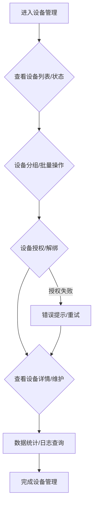

# 我的-设备管理前端功能说明

## 一、功能简介
设备管理功能用于对接入系统的所有设备（如手机、平板、虚拟设备等）进行统一管理、状态监控、分组、授权和维护，保障业务流程的稳定运行和数据安全。

### 设备管理前端功能流程图

---

## 二、主要功能模块

### 1. 设备列表与分组管理
- 支持展示所有已接入设备的基本信息（名称、IMEI、微信号、在线状态、分组、授权状态等）。
- 支持设备分组、批量分组、分组筛选、分组管理。
- 支持设备的搜索、筛选、排序、批量操作。

### 2. 设备状态监控
- 实时展示设备的在线/离线状态、运行状态、异常告警等。
- 支持设备状态变更提醒、异常设备高亮、设备健康度评分。

### 3. 设备授权与解绑
- 支持对设备进行授权、解绑、重新绑定等操作。
- 支持批量授权、批量解绑。
- 支持设备授权日志、操作记录查询。

### 4. 设备详情与维护
- 支持查看设备详细信息（硬件信息、系统信息、微信号、历史任务、操作日志等）。
- 支持设备维护操作，如重启、远程控制、升级、恢复出厂设置等。
- 支持设备备注、标签管理。

### 5. 数据统计与分析
- 实时统计设备总数、在线设备数、分组分布、授权状态等。
- 支持数据可视化展示（饼图、柱状图等）。
- 支持导出设备列表及统计数据。
- 主要功能区：统计区块、图表区。

### 6. 权限与安全
- 支持多角色、多账号权限控制。
- 支持操作日志、设备日志查询。
- 设备管理过程加密传输，保障数据安全。

---

## 三、前端开发要点

### 1. 页面与功能结构
- 主要页面包括设备列表、分组管理、设备详情、设备授权/解绑、设备维护等。
- 主要功能区包括设备表格、分组管理、状态监控、批量操作区、统计区块、日志区等。

### 2. 数据流与接口调用
- 设备管理相关：
  - 获取设备列表
  - 获取设备详情
  - 设备分组管理
  - 设备授权/解绑/重新绑定
  - 设备维护操作
- 设备状态与日志相关：
  - 获取设备状态
  - 获取设备日志、操作记录
- 数据统计相关：
  - 获取设备统计数据
  - 导出设备列表及统计数据

### 3. 交互细节
- 支持设备的搜索、筛选、排序、分组、批量操作。
- 支持设备的授权、解绑、维护等操作，均有操作确认和反馈。
- 设备状态、异常、健康度等信息实时展示。
- 详情页支持设备信息、历史任务、日志等多维度展示。
- 所有表单、弹窗、表格、按钮等均用统一UI风格。
- 数据加载、操作反馈均用 Skeleton 骨架屏和 Loading 状态。
- 路由跳转用 SPA 体验。
- 权限控制、入口自定义等按业务需求配置。

### 4. 开发建议
- 先梳理好页面结构和功能拆分，优先实现设备列表、分组管理、设备详情主流程。
- 充分利用已有的 UI 组件和 API 封装，减少重复开发。
- 交互细节（如批量操作、筛选、骨架屏、权限控制）按实际业务需求逐步完善。
- 所有接口调用建议统一封装，便于维护。

---

## 四、相关前端UI图片

以下是与设备管理功能相关的部分前端UI截图，帮助理解用户界面：

### 我的 - 设备管理入口 (示意图)

### 我的 - 设备管理页面 (示意图)

> 本文档持续更新，已结合现有前端代码结构和业务需求，后续如有功能调整请及时补充。 