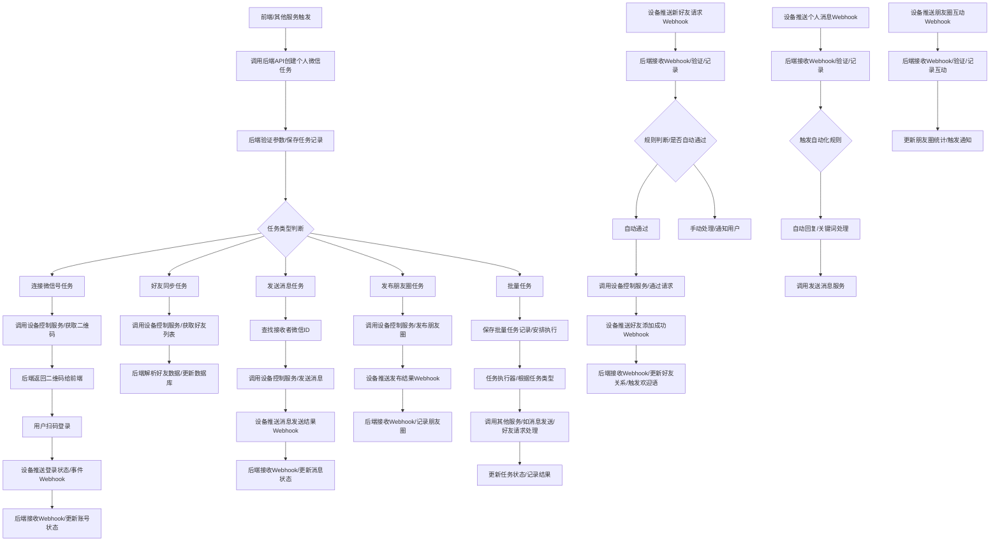

# 存客宝场景获客-个人微信获客功能开发文档

## 1. 模块概述

个人微信获客功能通过对接个人微信号，实现好友管理、朋友圈管理、自动通过好友请求、批量打招呼、自动化聊天互动等能力，帮助用户通过个人微信建立和维护私域流量。后端模块负责个人微信号的连接与管理、好友数据同步、消息接收与处理、朋友圈管理、自动化任务执行以及数据统计。

## 2. API接口设计

### 2.1 连接个人微信号

- **接口路径**：`/api/v1/lead-generation/wechat-personal/connect`
- **请求方法**：`POST`
- **接口说明**：发起连接个人微信号的请求，通常需要返回一个登录二维码给前端展示。
- **权限:** `wechat:personal:connect`
- **请求参数 (Request Body):**

| 参数名   | 类型    | 是否必需 | 说明             | 示例值 |
|----------|---------|----------|------------------|--------|
| deviceId | integer | 是       | 指定连接的设备ID | 1      |

- **响应数据 (统一格式 `data` 字段):**

```json
{
  "taskId": "CONNECT_TASK_ID",   // 连接任务ID，用于后续查询状态
  "qrCodeUrl": "个人微信登录二维码URL", // 前端需要展示给用户扫码的二维码图片URL
  "status": "PENDING_SCAN",      // 连接任务状态 (PENDING_SCAN, SCANNED, LOGGED_IN, FAILED, CANCELLED)
  "createTime": "2023-10-26T10:00:00Z" // 任务创建时间
}
```
- **可能返回状态码:** 200 (任务发起成功), 400 (参数错误/设备状态异常), 401, 403, 409 (设备忙碌), 500

### 2.2 获取个人微信号连接任务状态

- **接口路径**：`/api/v1/lead-generation/wechat-personal/connect-tasks/{taskId}/status`
- **请求方法**：`GET`
- **接口说明**：查询指定个人微信号连接任务的当前状态（如等待扫码、已扫码未确认、已登录、失败等）。前端通过此接口轮询连接进度。
- **权限:** `wechat:personal:view` 或 `wechat:personal:connect`
- **请求参数 (Path Parameters):**

| 参数名 | 类型   | 是否必需 | 说明         | 示例值 |
|--------|--------|----------|--------------|--------|
| taskId | string | 是       | 连接任务ID   | CONNECT_TASK_ID |

- **响应数据 (统一格式 `data` 字段):**

```json
{
  "taskId": "CONNECT_TASK_ID",   // 连接任务ID
  "status": "LOGGED_IN",         // 连接任务状态 (PENDING_SCAN, SCANNED, LOGGED_IN, FAILED, CANCELLED)
  "message": "登录成功",         // 状态描述信息
  "accountInfo": {               // 如果已登录，返回微信号基本信息
    "accountId": 1,            // 后端系统内的微信号ID
    "wechatId": "wxid_xxxxxxxxxxxx", // 微信内部ID
    "nickname": "用户昵称",
    "avatarUrl": "头像URL"
  },
  "qrCodeUrl": null // 如果不是等待扫码状态，二维码URL可能为空
}
```
- **可能返回状态码:** 200, 401, 403, 404 (任务不存在), 500

### 2.3 获取已连接个人微信号账号列表

- **接口路径**：`/api/v1/lead-generation/wechat-personal/accounts`
- **请求方法**：`GET`
- **接口说明**：获取当前用户已成功连接的个人微信号账号列表，支持按设备、状态等筛选和分页。
- **权限:** `wechat:personal:view`
- **请求参数 (Query Parameters):**

| 参数名   | 类型    | 是否必需 | 描述           | 示例值 |
|----------|--------|----------|----------------|--------|
| deviceId | integer| 否       | 按设备ID过滤   | 1      |
| status   | string | 否       | 账号状态过滤 (ACTIVE, OFFLINE, BANNED) | ACTIVE |
| page     | integer| 否       | 页码           | 1      |
| size     | integer| 否       | 每页条数       | 10     |
| sort     | string | 否       | 排序字段       | lastLoginTime, createTime |
| order    | string | 否       | 排序方向       | desc   |

- **响应数据 (统一格式 `data` 字段):**

```json
{
  "records": [
    {
      "accountId": 1,            // 后端系统内的微信号ID
      "deviceId": 1,             // 关联的设备ID
      "wechatId": "wxid_xxxxxxxxxxxx", // 微信内部ID
      "nickname": "用户昵称",
      "avatarUrl": "头像URL",
      "status": "ACTIVE",        // 账号状态 (ACTIVE, OFFLINE, BANNED)
      "loginStatus": "LOGGED_IN", // 登录状态 (LOGGED_IN, LOGGED_OUT, SCAN_REQUIRED)
      "lastLoginTime": "2023-10-26T09:00:00Z", // 最后登录时间
      "friendCount": 500,        // 好友数量
      "groupCount": 20           // 群数量
      // ... 其他账号信息
    }
    // ... 更多账号记录
  ],
  "total": 10,
  "size": 10,
  "current": 1,
  "pages": 1
}
```
- **可能返回状态码:** 200, 400, 401, 403, 500

### 2.4 同步个人微信号好友列表

- **接口路径**：`/api/v1/lead-generation/wechat-personal/accounts/{accountId}/friends/sync`
- **请求方法**：`POST`
- **接口说明**：触发同步指定个人微信号的好友列表。这是一个异步任务，前端可以通过其他接口查询同步进度。
- **权限:** `wechat:personal:friend:sync`
- **请求参数 (Path Parameters):**

| 参数名    | 类型    | 是否必需 | 说明               | 示例值 |
|-----------|---------|----------|--------------------|--------|
| accountId | integer | 是       | 个人微信号账号ID   | 1      |

- **请求体 (Request Body):** 通常为空 `{}` 或包含同步类型等可选参数。

- **响应数据 (统一格式 `data` 字段):** 返回触发同步任务的结果或任务ID。

```json
{
  "syncTaskId": "FRIEND_SYNC_TASK_ID", // 同步任务ID
  "status": "ACCEPTED",              // 任务状态：ACCEPTED, REJECTED
  "message": "好友同步任务已触发"
}
```
- **可能返回状态码:** 200, 400 (参数错误/账号状态异常), 401, 403, 404 (账号不存在), 409 (账号正在同步), 500

### 2.5 获取个人微信号好友列表

- **接口路径**：`/api/v1/lead-generation/wechat-personal/accounts/{accountId}/friends`
- **请求方法**：`GET`
- **接口说明**：获取指定个人微信号的好友列表，支持按昵称、备注、标签、来源、添加时间等筛选、搜索和分页。
- **权限:** `wechat:personal:friend:view` 或 `wechat:personal:friend:list`
- **请求参数 (Path Parameters):**

| 参数名    | 类型    | 是否必需 | 说明               | 示例值 |
|-----------|---------|----------|--------------------|--------|
| accountId | integer | 是       | 个人微信号账号ID   | 1      |

- **请求参数 (Query Parameters):**

| 参数名      | 类型    | 是否必需 | 描述             | 示例值       |
|-------------|--------|----------|------------------|--------------|
| keyword     | string | 否       | 昵称/备注关键字  | 张三         |
| tagIds      | array<integer> | 否 | 按标签ID过滤     | `[1, 2]`     |
| source      | string | 否       | 按添加来源过滤   | 海报获客      |
| addTimeStart| string | 否       | 添加时间范围始   | 2023-10-01Z  |
| addTimeEnd  | string | 否       | 添加时间范围末   | 2023-10-31Z  |
| page        | integer| 否       | 页码             | 1            |
| size        | integer| 否       | 每页条数         | 10           |
| sort        | string | 否       | 排序字段         | addTime, lastChatTime |
| order       | string | 否       | 排序方向         | desc         |

- **响应数据 (统一格式 `data` 字段):**

```json
{
  "records": [
    {
      "friendId": 1001, // 后端系统内的好友记录ID (对应客户/用户ID)
      "accountId": 1,     // 关联的个人微信号账号ID
      "customerId": 101,  // 关联的存客宝客户ID
      "wechatId": "wxid_yyyyyyyyyyyy", // 好友的微信内部ID
      "nickname": "好友昵称",
      "remark": "给好友的备注",
      "avatarUrl": "好友头像URL",
      "addTime": "2023-10-20T10:00:00Z", // 添加时间
      "lastChatTime": "2023-10-26T11:00:00Z", // 最后聊天时间
      "source": "海报获客", // 添加来源
      "tags": [{"tagId": 1, "tagName": "高意向"}] // 关联标签
      // ... 其他好友信息
    }
    // ... 更多好友记录
  ],
  "total": 500,
  "size": 10,
  "current": 1,
  "pages": 50
}
```
- **可能返回状态码:** 200, 400, 401, 403, 404 (账号不存在), 500

### 2.6 处理新好友请求推送 (Webhook)

- **接口路径**：`/api/v1/webhook/wechat-personal/friend-request`
- **请求方法**：`POST`
- **接口说明**：接收来自设备端的新好友请求推送。后端根据配置的规则检查是否自动通过好友请求，并触发后续处理（如记录、通知、打标签等）。此接口通常无需认证，但需要验证签名。
- **权限:** 无需认证，需验签
- **请求参数 (Request Body):** 具体结构依赖于设备端推送的数据格式，通常包含：

| 参数名            | 类型    | 说明                                   | 示例值 |
|-------------------|---------|----------------------------------------|--------|
| deviceId          | integer | 推送事件的设备ID                       | 1      |
| myWechatId        | string  | 接收到好友请求的个人微信号             | wxid_xxxxxxxxxxxx |
| requesterWechatId | string  | 发起好友请求的对方微信号             | wxid_yyyyyyyyyyyy |
| verificationText  | string  | 对方填写的验证信息                     | 您好，我是通过海报添加的 |
| source            | string  | 添加来源 (如：search, qrcode, group etc.) | qrcode |
| ticket            | string  | 用于通过好友请求的ticket/v3数据        | v3_... |
| createTime        | string  | 请求时间 (ISO 8601或其他约定格式)      | 2023-10-26T11:00:00Z |
| ...               | ...     | 其他请求相关数据                       | ...    |

- **响应数据:** 接收成功通常返回简单的成功标识或符合设备端要求的特定响应。

```json
{
  "code": 200,
  "message": "received"
}
```
- **可能返回状态码:** 200, 400 (数据格式错误/验签失败), 500

### 2.7 自动通过好友请求规则管理

- **接口路径**：`/api/v1/lead-generation/wechat-personal/auto-accept-rules`
- **请求方法**：`POST` (创建), `GET` (列表), `PUT` (更新), `DELETE` (删除)
- **接口说明**：管理自动通过好友请求的规则，支持按个人微信号账号、来源渠道、验证信息关键词等设置规则。
- **权限:** `wechat:personal:friend:rule:manage`
- **请求参数 (POST/PUT Request Body):**

| 参数名       | 类型    | 是否必需 | 描述                       | 示例值 |
|--------------|--------|----------|----------------------------|--------|
| accountId    | integer| 是       | 关联的个人微信号账号ID     | 1      |
| ruleName     | string | 是       | 规则名称                   | 海报自动通过 |
| ruleType     | string | 是       | 规则类型 (SOURCE, KEYWORD) | SOURCE |
| sourceKeyword| string | 否       | 来源渠道或验证信息关键词   | 海报    |
| status       | string | 是       | 规则状态 (ACTIVE, INACTIVE) | ACTIVE |
// 其他规则条件...

- **响应数据 (统一格式 `data` 字段):** 返回规则详情或列表。

```json
{
  "ruleId": 1,             // 规则ID
  "accountId": 1,
  "ruleName": "海报自动通过",
  "ruleType": "SOURCE",
  "sourceKeyword": "海报",
  "status": "ACTIVE",
  "createTime": "2023-10-26T11:30:00Z"
}
```
- **可能返回状态码:** 200, 201, 400, 401, 403, 404, 422, 500

### 2.8 发送个人聊天消息

- **接口路径**：`/api/v1/lead-generation/wechat-personal/accounts/{accountId}/messages`
- **请求方法**：`POST`
- **接口说明**：向指定个人微信号的指定好友或群发送消息（文本、图片、文件、链接等）。这是一个异步任务。
- **权限:** `wechat:personal:message:send`
- **请求参数 (Path Parameters):**

| 参数名    | 类型    | 是否必需 | 说明               | 示例值 |
|-----------|---------|----------|--------------------|--------|
| accountId | integer | 是       | 发送消息的个人微信号账号ID | 1      |

- **请求体 (Request Body):**

| 参数名       | 类型    | 是否必需 | 描述                     | 示例值 |
|--------------|--------|----------|--------------------------|--------|
| receiverId   | integer| 是       | 接收者ID (存客宝用户/客户ID或群ID) | 1001 (好友) 或 201 (群) |
| receiverType | string | 是       | 接收者类型 (FRIEND, GROUP) | FRIEND |
| messageType  | string | 是       | 消息类型 (TEXT, IMAGE, FILE, LINK etc.) | TEXT   |
| content      | string | 否       | 文本内容                 | 你好，最近怎么样？ |
| materialId   | integer| 否       | 如果是素材库中的素材，提供素材ID | 301    |
| fileUrl      | string | 否       | 如果直接提供文件URL (考虑安全性，优先使用materialId) | http://example.com/image.jpg |
// 更多消息类型和对应字段...

- **响应数据 (统一格式 `data` 字段):** 返回发送任务的结果或任务ID。

```json
{
  "sendTaskId": "MESSAGE_SEND_TASK_ID", // 发送任务ID
  "status": "ACCEPTED",             // 任务状态：ACCEPTED, REJECTED
  "message": "消息发送任务已触发"
}
```
- **可能返回状态码:** 200, 400 (参数错误/账号状态异常), 401, 403, 404 (账号/接收者不存在), 500

### 2.9 处理个人聊天消息推送 (Webhook)

- **接口路径**：`/api/v1/webhook/wechat-personal/message`
- **请求方法**：`POST`
- **接口说明**：接收来自设备端的个人聊天消息推送。后端根据消息内容触发自动回复、关键词处理、会话管理等逻辑。此接口通常无需认证，但需要验证签名。
- **权限:** 无需认证，需验签
- **请求参数 (Request Body):** 具体结构依赖于设备端推送的数据格式，通常包含：

| 参数名           | 类型    | 说明                                   | 示例值 |
|------------------|---------|----------------------------------------|--------|
| deviceId         | integer | 推送消息的设备ID                       | 1      |
| myWechatId       | string  | 接收消息的个人微信号                   | wxid_xxxxxxxxxxxx |
| senderWechatId   | string  | 发送者微信唯一标识                     | wxid_yyyyyyyyyyyy |
| receiverWechatId | string  | 接收者微信唯一标识 (通常是myWechatId)  | wxid_xxxxxxxxxxxx |
| messageType      | string  | 消息类型 (TEXT, IMAGE, FILE etc.)      | TEXT   |
| content          | string  | 消息内容                               | 你好   |
| messageId        | string  | 消息在设备端的唯一ID (用于去重)        | msg_id_abc |
| sendTime         | string  | 消息发送时间 (ISO 8601或其他约定格式)    | 2023-10-26T14:06:00Z |
| ...              | ...     | 其他消息相关数据 (图片URL, 文件URL等) | ...    |

- **响应数据:** 接收成功通常返回简单的成功标识或符合设备端要求的特定响应。

```json
{
  "code": 200,
  "message": "received"
}
```
- **可能返回状态码:** 200, 400 (数据格式错误/验签失败), 500

### 2.10 发布朋友圈

- **接口路径**：`/api/v1/lead-generation/wechat-personal/accounts/{accountId}/moments`
- **请求方法**：`POST`
- **接口说明**：通过指定个人微信号账号发布朋友圈（文本、图片、视频、链接等）。这是一个异步任务。
- **权限:** `wechat:personal:moment:publish`
- **请求参数 (Path Parameters):**

| 参数名    | 类型    | 是否必需 | 说明               | 示例值 |
|-----------|---------|----------|--------------------|--------|
| accountId | integer | 是       | 发布朋友圈的个人微信号账号ID | 1      |

- **请求体 (Request Body):**

| 参数名       | 类型    | 是否必需 | 描述                 | 示例值 |
|--------------|--------|----------|----------------------|--------|
| content      | string | 否       | 朋友圈文本内容       | 今天天气真好 |
| materialIds  | array<integer> | 否 | 关联的素材库素材ID列表 (图片/视频) | `[301, 302]` |
| mediaUrls    | array<string> | 否 | 媒体文件URL列表 (图片/视频)，优先使用materialIds | `["http://ex.com/a.jpg", "http://ex.com/b.mp4"]` |
| linkUrl      | string | 否       | 链接URL              | http://example.com |
| linkTitle    | string | 否       | 链接标题             | 示例链接 |
| linkImageUrl | string | 否       | 链接缩略图URL        | http://ex.com/thumb.jpg |
// 其他朋友圈类型和字段...

- **响应数据 (统一格式 `data` 字段):** 返回发布任务的结果或任务ID。

```json
{
  "publishTaskId": "MOMENT_PUBLISH_TASK_ID", // 发布任务ID
  "status": "ACCEPTED",                  // 任务状态：ACCEPTED, REJECTED
  "message": "朋友圈发布任务已触发"
}
```
- **可能返回状态码:** 200, 400 (参数错误/账号状态异常), 401, 403, 404 (账号不存在), 500

### 2.11 获取朋友圈列表

- **接口路径**：`/api/v1/lead-generation/wechat-personal/accounts/{accountId}/moments`
- **请求方法**：`GET`
- **接口说明**：获取指定个人微信号账号的朋友圈列表，支持分页和筛选。
- **权限:** `wechat:personal:moment:view`
- **请求参数 (Path Parameters):**

| 参数名    | 类型    | 是否必需 | 说明               | 示例值 |
|-----------|---------|----------|--------------------|--------|
| accountId | integer | 是       | 个人微信号账号ID   | 1      |

- **请求参数 (Query Parameters):**

| 参数名       | 类型    | 是否必需 | 描述           | 示例值       |
|--------------|--------|----------|----------------|--------------|
| content      | string | 否       | 内容关键字     | 活动         |
| publishTimeStart| string | 否     | 发布时间范围始 | 2023-10-01Z  |
| publishTimeEnd  | string | 否     | 发布时间范围末 | 2023-10-31Z  |
| page         | integer| 否       | 页码           | 1            |
| size         | integer| 否       | 每页条数       | 10           |
| sort         | string | 否       | 排序字段       | publishTime, createTime |
| order        | string | 否       | 排序方向       | desc         |

- **响应数据 (统一格式 `data` 字段):**

```json
{
  "records": [
    {
      "momentId": "设备端的朋友圈ID", // 设备端的朋友圈唯一标识
      "accountId": 1,             // 关联的个人微信号账号ID
      "content": "朋友圈内容",
      "mediaUrls": ["图片URL", "视频URL"], // 媒体文件URL列表
      "linkUrl": "链接URL",
      "publishTime": "2023-10-26T15:00:00Z", // 发布时间
      "likeCount": 10,            // 点赞数
      "commentCount": 5           // 评论数
      // ... 其他朋友圈信息
    }
    // ... 更多朋友圈记录
  ],
  "total": 100,
  "size": 10,
  "current": 1,
  "pages": 10
}
```
- **可能返回状态码:** 200, 400, 401, 403, 404 (账号不存在), 500

### 2.12 朋友圈互动推送 (Webhook)

- **接口路径**：`/api/v1/webhook/wechat-personal/moment-interaction`
- **请求方法**：`POST`
- **接口说明**：接收来自设备端的朋友圈评论或点赞推送。后端记录互动数据，并可能触发通知或自动化回复。此接口通常无需认证，但需要验证签名。
- **权限:** 无需认证，需验签
- **请求参数 (Request Body):** 具体结构依赖于设备端推送的数据格式，通常包含：

| 参数名          | 类型    | 说明                               | 示例值 |
|-----------------|---------|------------------------------------|--------|
| deviceId        | integer | 推送事件的设备ID                     | 1      |
| accountWechatId | string  | 发生互动的朋友圈所属微信号           | wxid_xxxxxxxxxxxx |
| momentId        | string  | 发生互动的朋友圈ID                   | moment_id_abc |
| interactionType | string  | 互动类型 (LIKE, COMMENT)           | COMMENT |
| interactorWechatId | string  | 发起互动者微信唯一标识             | wxid_zzzzzzzzzzz |
| commentContent  | string  | 如果是评论，评论内容               | 说得好！ |
| createTime      | string  | 互动时间 (ISO 8601或其他约定格式)    | 2023-10-26T15:05:00Z |
| ...             | ...     | 其他互动相关数据                   | ...    |

- **响应数据:** 接收成功通常返回简单的成功标识或符合设备端要求的特定响应。

```json
{
  "code": 200,
  "message": "received"
}
```
- **可能返回状态码:** 200, 400 (数据格式错误/验签失败), 500

### 2.13 批量任务管理 (批量发送消息、批量加好友等)

- **接口路径**：`/api/v1/lead-generation/wechat-personal/batch-tasks`
- **请求方法**：`POST` (创建任务), `GET` (查询任务列表/详情)
- **接口说明**：创建和管理批量任务，如批量发送消息给好友、批量通过好友请求等。批量任务通常是异步执行的。
- **权限:** `wechat:personal:task:manage`
- **请求参数 (POST Request Body):**

| 参数名       | 类型    | 是否必需 | 描述                     | 示例值 |
|--------------|--------|----------|--------------------------|--------|
| taskType     | string | 是       | 任务类型 (BATCH_MESSAGE, BATCH_ADD_FRIEND etc.) | BATCH_MESSAGE |
| accountId    | integer| 是       | 执行任务的个人微信号账号ID | 1      |
| targetIds    | array<integer> | 是 | 目标对象ID列表 (如好友ID列表、待通过好友请求ID列表) | `[1001, 1002]` |
| taskConfig   | object | 是       | 任务的具体配置           | `{ "messageType": "TEXT", "content": "你好" }` |
| scheduledTime| string | 否       | 计划执行时间 (ISO 8601格式) | 2023-10-26T18:00:00Z |

- **请求参数 (GET Query Parameters for list):** 支持按类型、账号、状态、时间范围过滤和分页。

| 参数名    | 类型    | 是否必需 | 描述           | 示例值 |
|-----------|--------|----------|----------------|--------|
| taskType  | string | 否       | 任务类型过滤   | BATCH_MESSAGE |
| accountId | integer| 否       | 按账号ID过滤   | 1      |
| status    | string | 否       | 任务状态过滤   | RUNNING |
| page      | integer| 否       | 页码           | 1      |
| size      | integer| 否       | 每页条数       | 10     |
// ... 其他查询参数

- **响应数据 (统一格式 `data` 字段):** 返回任务详情或列表。

```json
{
  "records": [
    {
      "taskId": 1,               // 批量任务ID
      "taskType": "BATCH_MESSAGE",
      "accountId": 1,
      "status": "COMPLETED",     // 任务状态 (PENDING, RUNNING, COMPLETED, FAILED)
      "totalCount": 100,         // 目标总数
      "completedCount": 98,      // 已完成数
      "failedCount": 2,          // 失败数
      "createTime": "2023-10-26T17:00:00Z",
      "startTime": "2023-10-26T17:05:00Z",
      "endTime": "2023-10-26T17:10:00Z",
      "taskConfig": { ... }      // 任务配置详情
      // ... 其他任务信息
    }
    // ... 更多批量任务记录
  ],
  "total": 10,
  "size": 10,
  "current": 1,
  "pages": 1
}
```
- **可能返回状态码:** 200, 201, 400, 401, 403, 404, 422, 500

## 3. 数据模型设计

### 3.1 主要数据表

| 表名                     | 说明            | 关键字段                                           | 与其他表关系 |
|-------------------------|----------------|---------------------------------------------------|------------|
| t_wechat_personal_account | 个人微信号授权表| id (PK), device_id (FK), wechat_id, nickname, avatar_url, status, sync_time, login_status, create_time, update_time | device_id -> t_device (假设设备表) |
| t_wechat_personal_friend| 个人微信号好友表| id (PK), account_id (FK), customer_id (FK), wechat_id, alias, remark, add_time, last_chat_time, source, tags (JSON/TEXT), create_time, update_time | account_id -> t_wechat_personal_account, customer_id -> t_user/t_customer |
| t_wechat_personal_message| 个人微信消息记录表| id (PK), account_id (FK), sender_id (FK), receiver_id (FK), message_type, content, material_id (FK), send_time, create_time | account_id -> t_wechat_personal_account, sender_id -> t_user, receiver_id -> t_user/t_wechat_group, material_id -> t_material (素材库表) |
| t_friend_request_rule   | 好友请求规则表  | id (PK), account_id (FK, 可空，表示全局规则), rule_type, keyword (TEXT), source, status, create_time, update_time | account_id -> t_wechat_personal_account |
| t_wechat_personal_moment| 朋友圈记录表    | id (PK), account_id (FK), moment_id (设备端ID), content, media_urls (JSON/TEXT), link_url, link_title, link_image_url, publish_time, like_count, comment_count, create_time, update_time | account_id -> t_wechat_personal_account |
| t_moment_interaction    | 朋友圈互动记录表| id (PK), moment_id (FK), interactor_id (FK), interaction_type, comment_content, create_time | moment_id -> t_wechat_personal_moment, interactor_id -> t_user |
| t_batch_task            | 批量任务表      | id (PK), task_type, account_id (FK), total_count, completed_count, failed_count, status, task_config (JSON/TEXT), create_time, start_time, end_time, update_time | account_id -> t_wechat_personal_account |

补充了数据表之间的关系、主键(PK)和外键(FK)标识，以及时间戳字段，并增加了朋友圈互动记录表 `t_moment_interaction`。

## 4. 服务实现

### 4.1 WechatPersonalAuthService

负责个人微信号的连接、登录状态管理、以及与设备控制服务交互获取登录二维码。

```java
@Service
@Slf4j
public class WechatPersonalAuthServiceImpl implements WechatPersonalAuthService {

    @Autowired
    private WechatPersonalAccountRepository accountRepository;
    
    @Autowired
    private DeviceControlService deviceControlService; // 调用设备控制服务

    @Override
    @Transactional
    public ConnectTaskVO connectAccount(Long deviceId) {
        log.info("Initiating Wechat personal account connection for device: {}", deviceId);
        
        try {
            // 1. 调用设备控制服务，发起登录请求，获取二维码数据
            DeviceCommand command = new DeviceCommand();
            command.setType(DeviceCommandType.LOGIN_WECHAT_PERSONAL);
            command.setDeviceId(deviceId);
            // 可选参数，如超时时间等
            
            DeviceCommandResult result = deviceControlService.executeCommand(deviceId, command);
            
            // 2. 解析设备返回的二维码URL和任务ID
            String qrCodeUrl = result.getData().get("qrCodeUrl").toString();
            String taskId = result.getData().get("taskId").toString();
            
            // 3. 创建连接任务记录 (可选，用于追踪状态)
            // SaveConnectTask(taskId, deviceId, ConnectStatus.WAITING_SCAN);
            
            log.info("Wechat personal account connection initiated, task ID: {}", taskId);
            return new ConnectTaskVO(taskId, qrCodeUrl);
            
        } catch (Exception e) {
            log.error("Failed to initiate Wechat personal account connection for device: " + deviceId, e);
            throw new WechatPersonalAuthException("发起微信登录失败", e);
        }
    }
    
    @Override
    public AccountStatusVO getConnectStatus(String taskId) {
         log.info("Getting connect status for task: {}", taskId);
         // TODO: 调用设备控制服务或查询本地任务记录，获取登录状态
         // 如果设备端有状态推送，优先通过 Webhook 更新本地状态，这里直接查本地记录。
         return null; // 返回包含登录状态、微信号信息等的VO
    }

    // TODO: 实现其他方法，如处理设备端推送的登录成功/失败回调，更新 t_wechat_personal_account 表
    // 处理登录二维码扫描事件 Webhook
    // 处理登录成功/失败事件 Webhook
    // 处理账号掉线/封号事件 Webhook
}
```

### 4.2 WechatPersonalFriendService

负责个人微信号好友的同步、管理和查询。处理新好友请求。

```java
@Service
@Slf4j
public class WechatPersonalFriendServiceImpl implements WechatPersonalFriendService {

    @Autowired
    private WechatPersonalFriendRepository friendRepository;
    
    @Autowired
    private WechatPersonalAccountRepository accountRepository;
    
    @Autowired
    private DeviceControlService deviceControlService; // 调用设备控制服务同步好友
    
    @Autowired
    private CustomerService customerService; // 客户服务
    
    @Autowired
    private FriendRequestRuleService ruleService; // 好友请求规则服务

    @Override
    @Transactional
    public void syncFriends(Long accountId) {
        log.info("Syncing friends for account: {}", accountId);
        
        WechatPersonalAccount account = accountRepository.findById(accountId)
                .orElseThrow(() -> new WechatAccountNotFoundException("Wechat personal account not found: " + accountId));
        
        try {
            // 1. 调用设备控制服务，获取指定微信号的好友列表
            DeviceCommand command = new DeviceCommand();
            command.setType(DeviceCommandType.GET_FRIENDS);
            command.setDeviceId(account.getDeviceId());
            command.setParams(Collections.singletonMap("wechatId", account.getWechatId()));
            
            DeviceCommandResult result = deviceControlService.executeCommand(account.getDeviceId(), command);
            
            // 2. 解析设备返回的好友数据
            List<WechatFriendDTO> friendData = parseFriendData(result.getData());
            
            // 3. 更新或保存好友信息到数据库
            for (WechatFriendDTO friendDto : friendData) {
                 // TODO: 查找或创建存客宝客户，并获取其ID
                 Customer friendCustomer = customerService.findOrCreateCustomerByWechatId(friendDto.getWechatId());
                 
                 WechatPersonalFriend friend = friendRepository.findByAccountIdAndCustomerId(accountId, friendCustomer.getId()).orElse(new WechatPersonalFriend());
                 friend.setAccountId(accountId);
                 friend.setCustomerId(friendCustomer.getId());
                 friend.setWechatId(friendDto.getWechatId());
                 friend.setAlias(friendDto.getAlias());
                 friend.setRemark(friendDto.getRemark());
                 // TODO: 更新添加时间、最后聊天时间等
                 friendRepository.save(friend);
            }
            log.info("Friend sync completed for account: {}", accountId);
            
            // TODO: 更新账号的同步时间
             account.setSyncTime(new Date());
             accountRepository.save(account);

        } catch (Exception e) {
            log.error("Failed to sync friends for account: " + accountId, e);
            throw new WechatPersonalSyncException("同步好友失败", e);
        }
    }
    
     private List<WechatFriendDTO> parseFriendData(Object deviceResultData) {
          // 解析设备控制服务返回的好友数据，转换为内部DTO列表
          // 需要处理设备端数据格式与内部DTO的映射
          return null;
     }

    // TODO: 实现获取好友列表、详情等方法 (包括分页、筛选、排序)
    // getFriendList(FriendQuery query): 分页查询好友列表
    // getFriendDetail(Long friendId): 获取好友详情 (关联客户信息)
    // updateFriendRemark/Tags(...): 更新好友备注或标签

    @Override
    @Transactional
    public void handleFriendRequest(FriendRequestEvent event) {
        log.info("Handling friend request from: {}", event.getRequesterWechatId());

        // TODO: 1. 查找对应的个人微信号 account
         WechatPersonalAccount account = accountRepository.findByWechatId(event.getMyWechatId()).orElse(null);
         if (account == null) {
              log.warn("Received friend request for unknown account: {}", event.getMyWechatId());
              // TODO: 返回错误响应给设备端或记录异常
              return;
         }

        // 2. 识别请求者，查找或创建客户
        // 使用 customerService.findOrCreateCustomerByWechatId(event.getRequesterWechatId(), event.getSource(), event.getVerificationText());
        // 在创建或查找客户时，可以根据来源和验证信息初始化客户信息或打标签
        Customer requester = customerService.findOrCreateCustomerByWechatId(event.getRequesterWechatId()); // TODO: 完善 findOrCreateCustomerByWechatId 方法

        // 3. 根据规则检查是否自动通过
        // ruleService.checkAutoAcceptRule(account.getId(), event.getSource(), event.getVerificationText()); // 规则检查应基于账号、来源和验证信息
        boolean autoAccept = ruleService.checkAutoAcceptRule(account.getId(), event); // 根据规则判断

        if (autoAccept) {
            log.info("Auto accepting friend request from: {}", event.getRequesterWechatId());
            // 4. 调用设备控制服务，自动通过好友请求
            try {
                 DeviceCommand command = new DeviceCommand();
                 command.setType(DeviceCommandType.ACCEPT_FRIEND_REQUEST);
                 command.setDeviceId(account.getDeviceId());
                 Map<String, Object> params = new HashMap<>();
                 params.put("friendWechatId", event.getRequesterWechatId()); // 需要通过的对方微信ID
                 params.put("ticket", event.getTicket()); // 使用ticket通过
                 // params.put("v3", event.getTicket()); // 根据设备端要求可能是 v3 字段
                 command.setParams(params);
                 
                 // 设备控制服务执行异步指令，等待设备端返回通过结果 Webhook
                 deviceControlService.executeCommand(account.getDeviceId(), command);

                 // TODO: 记录自动通过尝试日志

            } catch (Exception e) {
                 log.error("Failed to auto accept friend request from " + event.getRequesterWechatId(), e);
                 // TODO: 记录失败日志和告警
                 // TODO: 返回错误响应给设备端或记录异常
            }
        } else {
            log.info("Not auto accepting friend request from: {}", event.getRequesterWechatId());
            // TODO: 记录未自动通过日志
            // TODO: 可能需要通知用户手动处理 (通过内部消息或通知模块)
        }

        // TODO: 记录好友请求日志到专门的表 t_friend_request_log
        // friendRequestLogService.logRequest(event, autoAccept);
    }

    // TODO: 处理设备端推送的好友添加成功事件 Webhook，更新好友关系 t_wechat_personal_friend，触发后续流程 (如发送欢迎语)
    // handleFriendAddedEvent(FriendAddedEvent event): 接收好友添加成功事件，更新数据库，触发欢迎语等。
    // TODO: 处理好友删除事件 Webhook handleFriendDeletedEvent(...)
}
```

### 4.3 WechatPersonalMessageService

负责个人微信消息的发送、接收和自动化回复。

```java
@Service
@Slf4j
public class WechatPersonalMessageServiceImpl implements WechatPersonalMessageService {

    @Autowired
    private WechatPersonalMessageRepository messageRepository;
    
    @Autowired
    private WechatPersonalFriendRepository friendRepository;
    
    @Autowired
    private WechatPersonalAccountRepository accountRepository;
    
    @Autowired
    private DeviceControlService deviceControlService; // 调用设备控制服务发送消息
    
    @Autowired
    private AutoReplyService autoReplyService; // 自动回复规则服务
    
    @Autowired
    private CustomerService customerService; // 客户服务

    @Override
    @Transactional
    public void sendMessage(Long accountId, Long receiverId, MessageDTO dto) {
        log.info("Sending message from account {} to receiver {}: {}", accountId, receiverId, dto.getContent());

        WechatPersonalAccount account = accountRepository.findById(accountId)
                .orElseThrow(() -> new WechatAccountNotFoundException("Wechat personal account not found: " + accountId));

        // 根据 receiverId 和 receiverType 查找对应的微信ID
        String receiverWechatId = null;
        // TODO: 根据 dto.getReceiverType() 判断是好友还是群
        if ("FRIEND".equals(dto.getReceiverType())) { // TODO: 定义常量或枚举
            WechatPersonalFriend friend = friendRepository.findById(receiverId)
                 .orElseThrow(() -> new WechatFriendNotFoundException("Friend not found: " + receiverId));
             receiverWechatId = friend.getWechatId();
        } else if ("GROUP".equals(dto.getReceiverType())) {
             // TODO: 查找对应的群信息
             // WechatGroup group = groupRepository.findById(receiverId)...;
             // receiverWechatId = group.getWechatGroupId();
             throw new UnsupportedOperationException("Sending message to group not yet supported via personal account service"); // 或者调用群消息发送服务
        } else {
             throw new IllegalArgumentException("Invalid receiver type: " + dto.getReceiverType());
        }

        try {
            // 1. 调用设备控制服务发送消息
            DeviceCommand command = new DeviceCommand();
            command.setType(DeviceCommandType.SEND_MESSAGE);
            command.setDeviceId(account.getDeviceId());
            Map<String, Object> params = new HashMap<>();
            params.put("receiverWechatId", receiverWechatId);
            params.put("messageType", dto.getMessageType());
            // 根据消息类型设置内容或素材ID/URL
            if (MessageType.TEXT.equals(dto.getMessageType())) {
                params.put("content", dto.getContent());
            } else if (MessageType.IMAGE.equals(dto.getMessageType()) || MessageType.FILE.equals(dto.getMessageType())) {
                // TODO: 处理素材ID或URL，可能需要先下载素材并提供本地路径给设备端，或提供URL由设备端自行下载
                 String materialPath = null; // TODO: get material path/url from materialId
                 params.put("materialPath", materialPath); // 或 "fileUrl"
            } else if (MessageType.LINK.equals(dto.getMessageType())) {
                 // TODO: 处理链接消息参数
            }
            // ... 其他消息类型
            command.setParams(params);

            // 设备控制服务执行异步指令
            deviceControlService.executeCommand(account.getDeviceId(), command);

            // 2. 保存消息记录 (异步)
            // saveMessage(accountId, account.getWechatId(), receiverId, receiverWechatId, dto); // TODO: 实现保存消息逻辑
            // 可以先保存一个待发送状态的记录，等设备端回调确认发送成功再更新状态。

            log.info("Message sent task triggered from {} to {}", account.getWechatId(), receiverWechatId);

        } catch (Exception e) {
            log.error("Failed to trigger message send from account {} to receiver {}", accountId, receiverId, e);
            throw new MessageSendException("发送消息失败", e);
        }
    }
    
    @Override
    @Transactional
    public void handlePersonalMessage(PersonalMessageEvent event) {
         log.info("Handling personal message from {} to {}: {}", event.getSenderWechatId(), event.getReceiverWechatId(), event.getContent());

         // TODO: 1. 查找对应的个人微信号 account (receiver)
          WechatPersonalAccount account = accountRepository.findByWechatId(event.getReceiverWechatId()).orElse(null);
          if (account == null) {
               log.warn("Received message for unknown account: {}", event.getReceiverWechatId());
               // TODO: 返回错误响应给设备端或记录异常
               return;
          }

         // TODO: 2. 识别发送者和接收者，查找或创建客户
          Customer sender = customerService.findOrCreateCustomerByWechatId(event.getSenderWechatId()); // 发送消息的客户/好友
          Customer receiver = customerService.findOrCreateCustomerByWechatId(event.getReceiverWechatId()); // 接收消息的个人微信号对应的存客宝用户

         // TODO: 3. 保存消息记录
         // saveMessage(account.getId(), sender.getId(), receiver.getId(), event); // TODO: 实现保存消息逻辑
         // 需要考虑消息去重 (使用设备端提供的 messageId)，消息类型处理 (文本、图片、文件等)
         // 更新好友的 lastChatTime
         // friendRepository.updateLastChatTime(account.getId(), sender.getId(), event.getSendTime());

         // 4. 触发自动化处理 (如自动回复)
         if (MessageType.TEXT.equals(event.getMessageType())) { // TODO: 定义消息类型常量或枚举
              // check keyword rules, auto reply rules etc.
              String autoReplyContent = autoReplyService.getPersonalAutoReply(account.getId(), sender.getId(), event.getContent());
              if (autoReplyContent != null) {
                   // 调用发送消息方法 (异步发送)
                   sendMessage(account.getId(), sender.getId(), new MessageDTO(MessageType.TEXT, autoReplyContent, "FRIEND")); // TODO: Pass receiverType correctly
              }
         }

         // TODO: 其他消息处理逻辑，如关键词处理、会话管理、敏感词检测等
         // 会话管理服务处理会话状态和记录
         // SensitiveWordService 敏感词检测
    }

    // TODO: 实现获取消息记录、自动回复规则管理等方法
    // getMessageList(MessageQuery query): 分页查询消息记录
    // getMessageDetail(Long messageId): 获取消息详情
    // saveAutoReplyRule(...): 保存自动回复规则
    // getAutoReplyRules(...): 查询自动回复规则
}
```

### 4.4 WechatPersonalMomentService

负责朋友圈的发布、同步和互动处理。

```java
@Service
@Slf4j
public class WechatPersonalMomentServiceImpl implements WechatPersonalMomentService {

    @Autowired
    private WechatPersonalMomentRepository momentRepository;
    
    @Autowired
    private WechatPersonalAccountRepository accountRepository;
    
    @Autowired
    private DeviceControlService deviceControlService; // 调用设备控制服务
    
    @Autowired
    private CustomerService customerService; // 客户服务

    @Override
    @Transactional
    public void publishMoment(Long accountId, MomentDTO dto) {
        log.info("Publishing moment for account: {}", accountId);
        
        WechatPersonalAccount account = accountRepository.findById(accountId)
                .orElseThrow(() -> new WechatAccountNotFoundException("Wechat personal account not found: " + accountId));
        
        try {
            // 1. 调用设备控制服务发布朋友圈
            DeviceCommand command = new DeviceCommand();
            command.setType(DeviceCommandType.PUBLISH_MOMENT);
            command.setDeviceId(account.getDeviceId());
            Map<String, Object> params = new HashMap<>();
            params.put("content", dto.getContent());
            // TODO: 支持图片、视频、链接等
            if (dto.getMediaUrls() != null) {
                params.put("mediaUrls", dto.getMediaUrls());
            }
            command.setParams(params);
            
            DeviceCommandResult result = deviceControlService.executeCommand(account.getDeviceId(), command);
            
            // 2. 保存朋友圈记录 (如果设备端返回朋友圈ID)
            // TODO: Parse moment ID from result and save to t_wechat_personal_moment table
            // result.getData() might contain momentId
            // WechatPersonalMoment moment = new WechatPersonalMoment();
            // moment.setAccountId(accountId);
            // moment.setMomentId(result.getData().get("momentId").toString());
            // moment.setContent(dto.getContent());
            // ... save other fields
            // momentRepository.save(moment);
            log.info("Moment publish task triggered for account: {}", accountId);

        } catch (Exception e) {
            log.error("Failed to trigger moment publish task for account: " + accountId, e);
            throw new MomentPublishException("发布朋友圈失败", e);
        }
    }
    
    @Override
    @Transactional
    public void handleMomentInteraction(MomentInteractionEvent event) {
        log.info("Handling moment interaction for moment {} type {}", event.getMomentId(), event.getInteractionType());
        
        // TODO: 1. 根据event中的 momentId 查找对应的朋友圈记录
         WechatPersonalMoment moment = momentRepository.findByMomentId(event.getMomentId()).orElse(null);
         if (moment == null) {
              log.warn("Received interaction for unknown moment: {}", event.getMomentId());
              // TODO: 返回错误响应给设备端或记录异常
              return;
         }
        
        // TODO: 2. 识别互动用户，查找或创建客户
         Customer interactor = customerService.findOrCreateCustomerByWechatId(event.getInteractorWechatId()); // 发起互动者

        // TODO: 3. 记录互动事件 (点赞或评论) 到 t_moment_interaction 表
        // MomentInteraction interaction = new MomentInteraction();
        // interaction.setMomentId(moment.getId());
        // interaction.setInteractorId(interactor.getId());
        // interaction.setInteractionType(event.getInteractionType());
        // if ("COMMENT".equals(event.getInteractionType())) {
        //     interaction.setCommentContent(event.getCommentContent());
        // }
        // interaction.setCreateTime(event.getCreateTime());
        // momentInteractionRepository.save(interaction);

        // TODO: 4. 更新朋友圈的评论数或点赞数 (t_wechat_personal_moment 表的 like_count, comment_count 字段)
         updateMomentStats(moment.getId(), event.getInteractionType());

        // TODO: 5. 如果是评论，可能需要触发自动回复或通知
         if ("COMMENT".equals(event.getInteractionType())) {
              // handleMomentComment(moment, interactor, event.getCommentContent()); // 例如：检查关键词回复规则
              // NotificationService.notifyUserAboutComment(...); // 通知朋友圈主人有新的评论
         }
         // TODO: 如果是点赞，可能需要通知或记录
          if ("LIKE".equals(event.getInteractionType())) {
               // NotificationService.notifyUserAboutLike(...);
          }
    }
    
    // TODO: 实现获取朋友圈列表、同步朋友圈等方法
    // getMomentList(MomentQuery query): 分页查询朋友圈列表
    // getMomentDetail(Long momentId): 获取朋友圈详情 (可能包含互动列表)
    // syncMoments(Long accountId): 同步朋友圈记录
}
```

### 4.5 BatchTaskService

负责批量任务的创建、执行和状态管理。

```java
@Service
@Slf4j
public class BatchTaskServiceImpl implements BatchTaskService {

    @Autowired
    private BatchTaskRepository batchTaskRepository;

    @Autowired
    private WechatPersonalAccountRepository accountRepository;

    @Autowired
    private DeviceControlService deviceControlService;

    @Autowired
    private WechatPersonalFriendRepository friendRepository;

    @Autowired
    private WechatPersonalMessageService messageService; // 用于批量发送消息

    @Autowired
    private WechatPersonalFriendRepository friendRequestService; // 用于批量通过好友请求


    @Override
    @Transactional
    public BatchTaskVO createBatchTask(BatchTaskDTO dto) {
        log.info("Creating batch task of type {} for account {}", dto.getTaskType(), dto.getAccountId());

        WechatPersonalAccount account = accountRepository.findById(dto.getAccountId())
                .orElseThrow(() -> new WechatAccountNotFoundException("Wechat personal account not found: " + dto.getAccountId()));

        // TODO: 1. 验证任务参数的合法性 (targetIds, taskConfig)
        validateBatchTask(dto);

        // 2. 保存批量任务记录
        BatchTask task = new BatchTask();
        task.setTaskType(dto.getTaskType());
        task.setAccountId(dto.getAccountId());
        task.setTotalCount(dto.getTargetIds().size());
        task.setCompletedCount(0);
        task.setFailedCount(0);
        task.setStatus(BatchTaskStatus.PENDING); // 初始状态为待处理
        task.setTaskConfig(serializeTaskConfig(dto.getTaskConfig())); // 序列化任务配置
        task.setCreateTime(new Date());
        // TODO: 如果有 scheduledTime，设置 scheduledTime 字段

        BatchTask savedTask = batchTaskRepository.save(task);

        // 3. 触发任务执行 (如果是立即执行)
        if (dto.getScheduledTime() == null || dto.getScheduledTime().before(new Date())) {
            triggerBatchTaskExecution(savedTask.getId());
        } else {
             // TODO: 使用任务调度服务安排定时执行
             // taskSchedulerService.schedule(Runnable taskExecutor, dto.getScheduledTime());
        }

        log.info("Batch task {} created with ID: {}", task.getTaskType(), savedTask.getId());
        return buildBatchTaskVO(savedTask);
    }

    // TODO: 实现 validateBatchTask(BatchTaskDTO dto) 方法
    // TODO: 实现 serializeTaskConfig(Object config) / deserializeTaskConfig(String configJson, TaskType type) 方法
    // TODO: 实现 buildBatchTaskVO(BatchTask task) 方法

    // 触发批量任务执行的内部方法
    @Transactional
    public void triggerBatchTaskExecution(Long taskId) {
        log.info("Triggering execution for batch task: {}", taskId);

        BatchTask task = batchTaskRepository.findById(taskId)
                .orElseThrow(() -> new BatchTaskNotFoundException("Batch task not found: " + taskId));

        if (task.getStatus() != BatchTaskStatus.PENDING) {
            log.warn("Batch task {} is not in PENDING status, skipping execution.", taskId);
            return;
        }

        task.setStatus(BatchTaskStatus.RUNNING); // 更新状态为运行中
        task.setStartTime(new Date());
        batchTaskRepository.save(task);

        // 根据任务类型执行具体逻辑
        switch (task.getTaskType()) {
            case BATCH_MESSAGE:
                executeBatchMessageTask(task);
                break;
            case BATCH_ADD_FRIEND:
                executeBatchAddFriendTask(task);
                break;
            // TODO: 其他任务类型
            default:
                log.error("Unknown batch task type: {}", task.getTaskType());
                task.setStatus(BatchTaskStatus.FAILED);
                task.setEndTime(new Date());
                // TODO: 记录失败原因
                batchTaskRepository.save(task);
                break;
        }

        // 任务执行完毕，更新最终状态
        // 对于异步任务，这里的状态更新可能只是表示任务已提交到处理队列。
    }

    // 执行批量发送消息任务
    private void executeBatchMessageTask(BatchTask task) {
        log.info("Executing batch message task: {}", task.getId());
        BatchMessageConfig config = deserializeTaskConfig(task.getTaskConfig(), BatchMessageConfig.class); // TODO: 定义 BatchMessageConfig DTO
        List<Long> targetFriendIds = config.getTargetFriendIds(); // TODO: targetIds 字段如何存储和获取？可能需要单独的关联表或存储在 task_config JSON中。

        for (Long friendId : targetFriendIds) {
            try {
                // 调用消息发送服务发送消息 (异步发送)
                messageService.sendMessage(task.getAccountId(), friendId, new MessageDTO(config.getMessageType(), config.getContent(), "FRIEND")); // TODO: Pass receiverType correctly
                // TODO: 更新任务的 completedCount
                task.setCompletedCount(task.getCompletedCount() + 1);
            } catch (Exception e) {
                log.error("Failed to send message to friend {} in task {}", friendId, task.getId(), e);
                // TODO: 记录失败原因，更新任务的 failedCount
                task.setFailedCount(task.getFailedCount() + 1);
            }
             // TODO: 批量保存任务状态，而不是每次循环都保存
        }

        // 任务执行完毕，更新最终状态
        task.setStatus(task.getFailedCount() > 0 ? BatchTaskStatus.COMPLETED_WITH_ERRORS : BatchTaskStatus.COMPLETED);
        task.setEndTime(new Date());
        batchTaskRepository.save(task);
        log.info("Batch message task {} execution completed.", task.getId());
    }

    // 执行批量通过好友请求任务
    private void executeBatchAddFriendTask(BatchTask task) {
        log.info("Executing batch add friend task: {}", task.getId());
        BatchAddFriendConfig config = deserializeTaskConfig(task.getTaskConfig(), BatchAddFriendConfig.class); // TODO: 定义 BatchAddFriendConfig DTO
        List<Long> targetRequestIds = config.getTargetRequestIds(); // 待通过的好友请求记录ID列表

        for (Long requestId : targetRequestIds) {
            try {
                 // TODO: 根据 requestId 查找 FriendRequestEvent 数据 (或直接存储在 task_config 中)
                 // FriendRequestEvent event = friendRequestService.getFriendRequestEvent(requestId);

                 // 调用好友请求服务自动通过方法
                 // friendRequestService.autoAcceptFriendRequest(event);
                 // TODO: 更新任务的 completedCount
                task.setCompletedCount(task.getCompletedCount() + 1);
            } catch (Exception e) {
                log.error("Failed to auto accept friend request {} in task {}", requestId, task.getId(), e);
                // TODO: 记录失败原因，更新任务的 failedCount
                task.setFailedCount(task.getFailedCount() + 1);
            }
             // TODO: 批量保存任务状态
        }

        // 任务执行完毕，更新最终状态
         task.setStatus(task.getFailedCount() > 0 ? BatchTaskStatus.COMPLETED_WITH_ERRORS : BatchTaskStatus.COMPLETED);
         task.setEndTime(new Date());
         batchTaskRepository.save(task);
         log.info("Batch add friend task {} execution completed.", task.getId());
    }

    // TODO: 实现查询批量任务列表、详情等方法
    // getBatchTaskList(BatchTaskQuery query): 分页查询批量任务列表
    // getBatchTaskDetail(Long taskId): 获取批量任务详情
}
```

## 5. 流程图



## 6. 异常处理

- `WechatPersonalAuthException`: 个人微信授权/连接相关异常
- `WechatAccountNotFoundException`: 个人微信号账号不存在
- `WechatFriendNotFoundException`: 好友不存在
- `MessageSendException`: 发送消息失败
- `MomentPublishException`: 发布朋友圈失败
- `BatchTaskException`: 批量任务执行异常
- `FriendRequestRuleException`: 好友请求规则相关异常
- `InvalidSignatureException`: Webhook签名验证失败
- `DeviceControlException`: 调用设备控制服务异常

## 7. 与前端的交互流程

1. **连接微信号:** 前端调用连接接口，后端返回二维码URL和任务ID。前端展示二维码并轮询任务状态接口，直到状态变为已登录或失败。
2. **管理账号/好友:** 前端调用获取账号/好友列表接口，后端查询并返回数据。前端展示列表并提供筛选、搜索功能。更新好友信息等操作调用相应的PUT/POST接口。
3. **处理新好友请求:** 设备端推送Webhook到后端。后端处理规则，如果自动通过，调用设备控制服务；否则记录并通知用户。前端定期或通过WebSocket接收通知，显示新好友请求列表。
4. **发送消息:** 前端调用发送消息接口，指定接收者和消息内容。后端触发异步发送任务。发送结果可能通过Webhook推送，后端更新消息状态。
5. **朋友圈:** 前端调用发布朋友圈接口，后端触发异步任务。前端调用获取朋友圈列表接口展示朋友圈。朋友圈互动（点赞评论）通过Webhook推送，后端记录并更新统计。
6. **批量任务:** 前端调用创建批量任务接口，后端保存任务并安排执行。前端调用查询任务列表/详情接口查看任务状态和结果。

---

#### 开发注意事项和实现要点

1.  **与设备控制服务的交互:**
    - 个人微信的实际操作（登录、获取好友、发送消息、朋友圈、批量任务等）都依赖于设备控制服务。
    - 后端与设备控制服务之间的通信需要设计稳定可靠的协议，处理指令下发和事件推送。
    - 指令执行通常是异步的，需要通过任务ID或事件关联来追踪状态。
    - Webhook是设备向上报事件（新消息、新好友、登录状态变化、任务结果等）的关键机制，必须确保Webhook接口的高可用性和安全性（验签）。
2.  **数据同步:**
    - 好友列表、群列表、朋友圈等数据需要定期或手动从设备端同步到后端数据库。
    - 同步过程需要考虑增量更新、数据去重、长时间同步的处理（可能需要分批或后台任务）。
3.  **消息处理:**
    - 接收到的个人聊天消息需要进行处理，包括保存消息记录、触发自动回复、关键词检测、会话管理等。
    - 消息处理流程可能较复杂，建议设计为异步处理，例如将接收到的消息放入消息队列。
    - 需要考虑消息去重，确保同一消息只处理一次（使用设备端提供的messageId）。
4.  **自动化任务:**
    - 自动通过好友请求、自动回复、批量发送消息、批量加好友等自动化任务需要在后端实现。这些任务通常依赖于配置的规则，并通过设备控制服务执行。
    - 批量任务可能耗时较长且容易失败，需要设计任务执行器、状态追踪、失败重试、日志记录和告警机制。
5.  **规则引擎:**
    - 自动通过好友请求规则、自动回复规则等需要灵活配置和管理。
    - 可以考虑使用简单的规则引擎或表达式解析器来实现规则判断逻辑。
6.  **数据模型:**
    - 设计合理的数据表结构来存储个人微信号账号、好友、消息、朋友圈、规则、批量任务等数据。
    - 需要考虑数据之间的关联关系（如账号与设备、好友与客户、消息与账号/好友）。
    - 对于好友、消息、朋友圈等数据量可能较大的表，需要考虑索引优化和归档策略。
7.  **用户识别与关联:**
    - 在处理新好友请求、接收消息、朋友圈互动时，需要根据微信ID等信息在存客宝现有用户/客户中进行识别或创建新的客户记录，并建立关联关系。
8.  **错误处理:**
    - 遵循 `./前后端接口约定.md` 中的错误处理规范。
    - 捕获并处理与设备控制服务交互、数据库操作、规则执行、批量任务执行等过程中可能发生的各种异常。
    - Webhook 接口的异常处理需要特殊考虑，通常返回 200 表示接收成功，实际业务处理失败通过日志和告警监控。
9.  **日志记录:**
    - 记录所有关键操作日志，包括：
        - 个人微信号的连接、登录状态变化、掉线、封号。
        - 好友的添加、删除、信息更新、同步结果。
        - 消息的发送、接收、处理状态、自动回复触发。
        - 朋友圈的发布、同步、互动。
        - 好友请求的接收、规则判断、自动通过尝试、处理结果。
        - 批量任务的创建、执行状态变化、成功/失败详情。
        - 与设备控制服务的交互日志、Webhook接收日志。
        - 所有异常日志。
    - 日志应包含时间、相关ID（账号ID、好友ID、消息ID、任务ID）、操作类型、操作人（如果适用）、操作结果、错误信息等信息。
10. **安全性:**
    - 所有面向前端的接口必须进行认证授权校验。
    - Webhook 接口需要进行签名验证等安全措施，确保消息来源可信。
    - 存储敏感信息（如微信ID、聊天记录、朋友圈内容等）需要进行脱敏或加密处理。
    - 对自动化任务的配置和执行进行权限控制，防止滥用。
    - 与设备控制服务之间的通信需要加密。
11. **性能与并发:**
    - Webhook 接口可能面临高并发的消息和事件推送，需要设计为快速响应并将实际处理逻辑放入消息队列异步执行。
    - 批量任务、数据同步等可能耗时较长的操作应设计为后台异步任务。
    - 优化数据库查询性能。
12. **幂等性:**
    - 接收到的消息、好友添加事件等可能存在重复推送，后端需要实现幂等性处理，确保同一事件只处理一次（例如基于messageId或事件唯一标识进行去重）。

--- 