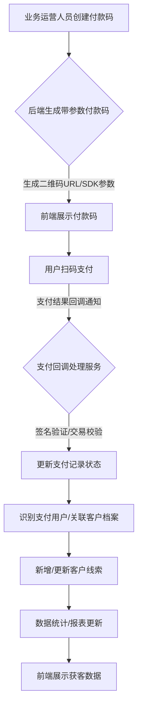
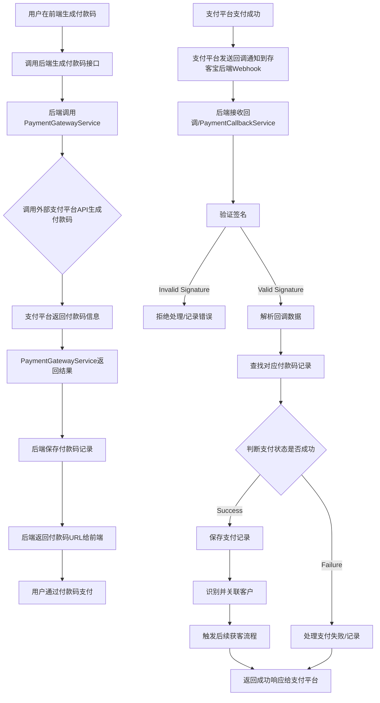

# 存客宝场景获客-付款码获客功能开发文档

## 1. 模块概述

付款码获客功能通过生成带有特定参数的付款码（如微信支付、支付宝），追踪用户的支付行为，并将支付用户识别为潜在客户或现有客户的成交记录。后端模块负责付款码的生成与管理、支付结果回调处理、用户识别与关联、数据存储和统计。

### 付款码获客流程图



## 2. API接口设计

### 2.1 生成付款码

- **接口路径**：`/api/v1/lead-generation/payment-codes`
- **请求方法**：`POST`
- **接口说明**：生成一个带有附加参数（如活动ID、渠道来源、员工ID等）的付款码。
- **请求参数 (Request Body):**

| 参数名          | 类型     | 是否必需 | 说明                         | 示例值                  |
|-----------------|----------|----------|------------------------------|-------------------------|
| paymentMethod   | string   | 是       | 支付方式：`WECHAT_PAY`, `ALIPAY` | `WECHAT_PAY`            |
| amount          | number   | 否       | 支付金额 (可选，如果需要固定金额) | 1.00                    |
| description     | string   | 是       | 支付描述，将显示给用户       | 加入社群费用            |
| metadata        | object   | 否       | 附加参数，用于追踪获客来源和关联业务数据，建议包含活动ID、渠道来源、员工ID等信息，需要序列化存储 | `{ "activityId": 101, "channel": "线下推广", "employeeId": 501 }` |

- **响应数据 (统一格式 `data` 字段):**

```json
{
  "paymentCodeId": 301,        // 后端系统生成的付款码ID
  "paymentMethod": "WECHAT_PAY", // 支付方式
  "amount": 1.00, // 支付金额 (如果设置)
  "description": "加入社群费用", // 支付描述
  "qrCodeUrl": "微信支付生成的二维码图片URL", // 前端展示的二维码URL
  "status": "ACTIVE",          // 付款码状态 (ACTIVE, INACTIVE, EXPIRED)
  "createTime": "2023-10-26T11:00:00Z", // 创建时间 (ISO 8601格式)
  "metadata": { ... }          // 附加参数
}
```
- **可能返回状态码:** 201 (创建成功), 400 (参数错误/支付网关拒绝), 401, 403, 422 (数据验证失败), 500

### 2.2 获取付款码列表

- **接口路径**：`/api/v1/lead-generation/payment-codes`
- **请求方法**：`GET`
- **接口说明**：获取已生成的付款码列表，支持按状态、支付方式、创建时间等查询和分页。
- **权限:** `lead:paymentcode:view` 或 `lead:paymentcode:list`
- **请求参数 (Query Parameters):**

| 参数名        | 类型    | 是否必需 | 描述                       | 示例值                |
|---------------|--------|----------|----------------------------|-----------------------|
| status        | string | 否       | 付款码状态过滤 (ACTIVE, INACTIVE, EXPIRED) | ACTIVE          |
| createTimeStart | string | 否       | 创建开始时间 (ISO 8601格式)    | 2023-10-01T00:00:00Z |
| createTimeEnd | string | 否       | 创建结束时间 (ISO 8601格式)    | 2023-10-31T23:59:59Z |
| page          | integer| 否       | 页码，从1开始 (默认: 1)        | 1               |
| size          | integer| 否       | 每页条数 (默认: 10)          | 10              |
| sort          | string | 否       | 排序字段 (如: createTime)      | createTime      |
| order         | string | 否       | 排序方向 (asc/desc)            | desc            |

- **响应数据 (统一格式 `data` 字段):**

```json
{
  "records": [
    {
      "paymentCodeId": 301,
      "paymentMethod": "WECHAT_PAY",
      "amount": 1.00,
      "description": "加入社群费用",
      "qrCodeUrl": "微信支付生成的二维码图片URL",
      "status": "ACTIVE",
      "createTime": "2023-10-26T11:00:00Z",
      "metadata": { ... },
      "totalPayments": 5, // 关联的支付记录数
      "totalAmountPaid": 5.00 // 关联支付记录的总金额
    }
    // ... 更多付款码记录
  ],
  "total": 50,            // 总记录数
  "size": 10,             // 每页大小
  "current": 1,           // 当前页码
  "pages": 5              // 总页数
}
```
- **可能返回状态码:** 200, 400, 401, 403, 500

### 2.3 获取付款码详情

- **接口路径**：`/api/v1/lead-generation/payment-codes/{paymentCodeId}`
- **请求方法**：`GET`
- **接口说明**：根据付款码ID获取付款码详情，包括关联的支付记录简要列表。
- **权限:** `lead:paymentcode:view`
- **请求参数 (Path Parameters):**

| 参数名        | 类型    | 是否必需 | 说明           | 示例值 |
|---------------|---------|----------|----------------|--------|
| paymentCodeId | integer | 是       | 付款码ID       | 301    |

- **响应数据 (统一格式 `data` 字段):**

```json
{
  "paymentCodeId": 301,
  "paymentMethod": "WECHAT_PAY",
  "amount": 1.00,
  "description": "加入社群费用",
  "qrCodeUrl": "微信支付生成的二维码图片URL",
  "status": "ACTIVE",
  "createTime": "2023-10-26T11:00:00Z",
  "metadata": { ... },
  "paymentRecords": [ // 关联的支付记录简要列表
    {
      "recordId": 401,
      "transactionId": "WX1234567890",
      "platformUserId": "oq_xxxxxxxxxxxx", // 支付平台用户标识
      "totalAmount": 1.00,
      "paymentTime": "2023-10-26T11:05:00Z",
      "status": "SUCCESS"
    }
    // ... 更多支付记录
  ]
}
```
- **可能返回状态码:** 200, 401, 403, 404, 500

### 2.4 处理支付结果回调

- **接口路径**：`/api/v1/webhook/payment/{paymentMethod}`
- **请求方法**：`POST`
- **接口说明**：接收支付平台（微信支付、支付宝等）的支付成功/失败回调通知。后端需要进行签名验证并处理支付结果。此接口通常无需认证，但需要验证签名。
- **权限:** 无需认证，需验签
- **请求参数 (Request Body):** 具体结构完全依赖于不同支付平台的回调协议，例如微信支付的回调数据是XML格式，支付宝可能是JSON。

| 参数名         | 类型    | 说明                               | 示例值 |
|----------------|---------|------------------------------------|--------|
| payload        | string  | 支付平台推送的原始回调数据（XML/JSON等） | `<xml>...</xml>` 或 `{...}` |
| headers        | object  | HTTP请求头，包含签名信息           | `{ "Signature": "..." }` |
| paymentMethod  | string  | 支付方式（作为Path参数）           | WECHAT_PAY |

- **响应数据:** 接收成功通常返回符合支付平台要求的特定格式响应（例如微信支付要求返回`<xml><return_code><![CDATA[SUCCESS]]></return_code><return_msg><![CDATA[OK]]></return_msg></xml>`）。处理失败也需要返回相应的错误格式。

- **可能返回状态码:** 200 (处理成功), 400 (参数错误/验签失败), 500 (内部处理异常)

### 2.5 获取支付记录列表

- **接口路径**：`/api/v1/lead-generation/payment-records`
- **请求方法**：`GET`
- **接口说明**：获取支付记录列表，支持按付款码、支付状态、支付时间等查询和分页。
- **权限:** `lead:paymentrecord:view` 或 `lead:paymentrecord:list`
- **请求参数 (Query Parameters):**

| 参数名        | 类型    | 是否必需 | 描述                       | 示例值                |
|---------------|--------|----------|----------------------------|-----------------------|
| paymentCodeId | integer| 否       | 按付款码ID过滤             | 301                   |
| transactionId | string | 否       | 按支付平台交易ID过滤       | WX1234567890          |
| status        | string | 否       | 支付状态过滤 (SUCCESS, FAILED, REFUNDING, REFUNDED) | SUCCESS               |
| paymentTimeStart| string | 否     | 支付开始时间范围起始 (ISO 8601)| 2023-10-01T00:00:00Z |
| paymentTimeEnd| string | 否     | 支付开始时间范围结束 (ISO 8601)| 2023-10-31T23:59:59Z |
| page          | integer| 否       | 页码                     | 1                     |
| size          | integer| 否       | 每页条数                 | 10                    |
| sort          | string | 否       | 排序字段                 | paymentTime           |
| order         | string | 否       | 排序方向                 | desc                  |

- **响应数据 (统一格式 `data` 字段):**

```json
{
  "records": [
    {
      "recordId": 401,       // 支付记录ID
      "paymentCodeId": 301,  // 关联的付款码ID
      "transactionId": "WX1234567890", // 支付平台交易ID
      "platformUserId": "oq_xxxxxxxxxxxx", // 支付平台用户标识
      "totalAmount": 1.00,   // 支付金额
      "paymentTime": "2023-10-26T11:05:00Z", // 支付时间
      "status": "SUCCESS",   // 支付状态
      "paymentMethod": "WECHAT_PAY", // 支付方式
      "metadata": { ... } // 关联付款码的metadata
      // notification_data字段不返回给前端
    }
    // ... 更多支付记录
  ],
  "total": 80,
  "size": 10,
  "current": 1,
  "pages": 8
}
```
- **可能返回状态码:** 200, 400, 401, 403, 500

## 3. 数据模型设计

### 3.1 主要数据表

| 表名                 | 说明            | 关键字段                                  |
|---------------------|----------------|------------------------------------------|
| t_payment_code      | 付款码表        | id, payment_method, amount, description, metadata (TEXT/JSON), qr_code_url, status, create_time, update_time |
| t_payment_record    | 支付记录表      | id, payment_code_id (FK), transaction_id, platform_user_id, total_amount, payment_time, status, notification_data (TEXT), user_id (FK, 关联存客宝用户/客户), create_time, update_time | payment_code_id -> t_payment_code, user_id -> t_user/t_customer |

## 4. 服务实现

### 4.1 PaymentCodeService

负责付款码的生成、管理和查询。调用外部支付平台的API生成实际的付款码（如通过支付接口获取二维码链接）。

```java
@Service
@Slf4j
public class PaymentCodeServiceImpl implements PaymentCodeService {

    @Autowired
    private PaymentCodeRepository paymentCodeRepository;
    
    @Autowired
    private PaymentGatewayService paymentGatewayService; // 调用支付网关服务生成付款码

    @Override
    @Transactional
    public PaymentCodeVO generatePaymentCode(PaymentCodeDTO dto) {
        log.info("Generating payment code for method: {}", dto.getPaymentMethod());
        
        // 1. 调用支付网关服务生成付款码（获取二维码URL等）
        PaymentCodeResult paymentCodeResult = paymentGatewayService.createPaymentCode(dto);
        
        // 2. 保存付款码记录
        PaymentCode paymentCode = new PaymentCode();
        paymentCode.setPaymentMethod(dto.getPaymentMethod());
        paymentCode.setAmount(dto.getAmount());
        paymentCode.setDescription(dto.getDescription());
        // TODO: 保存metadata，可能需要序列化为JSON
        paymentCode.setMetadata(serializeMetadata(dto.getMetadata()));
        paymentCode.setQrCodeUrl(paymentCodeResult.getQrCodeUrl());
        paymentCode.setStatus(PaymentCodeStatus.ACTIVE);
        paymentCode.setCreateTime(new Date());
        
        PaymentCode savedPaymentCode = paymentCodeRepository.save(paymentCode);
        
        return buildPaymentCodeVO(savedPaymentCode);
    }
    
    private String serializeMetadata(Map<String, Object> metadata) {
        // 实现metadata的序列化
        return null;
    }
    
    private Map<String, Object> deserializeMetadata(String metadataJson) {
         // 实现metadata的反序列化
         return null;
    }
    
    // TODO: 其他方法，如获取付款码列表、详情等
}
```

### 4.2 PaymentCallbackService

负责接收和处理来自支付平台的回调通知，进行签名验证、支付结果处理、更新支付记录、识别用户并进行后续获客流程。

```java
@Service
@Slf4j
public class PaymentCallbackServiceImpl implements PaymentCallbackService {

    @Autowired
    private PaymentCodeRepository paymentCodeRepository;
    
    @Autowired
    private PaymentRecordRepository paymentRecordRepository;
    
    @Autowired
    private PaymentGatewayService paymentGatewayService; // 用于签名验证等
    
    @Autowired
    private CustomerService customerService; // 客户服务，用于识别和关联客户
    
    @Autowired
    private LeadGenerationService leadGenerationService; // 获客服务，用于触发后续获客流程

    @Override
    @Transactional
    public void handlePaymentCallback(String paymentMethod, String payload, Map<String, String> headers) {
        log.info("Handling payment callback for method: {}", paymentMethod);
        
        try {
            // 1. 验证回调签名的合法性
            if (!paymentGatewayService.verifySignature(paymentMethod, payload, headers)) {
                log.error("Invalid payment callback signature for method: {}", paymentMethod);
                // TODO: 返回错误响应给支付平台
                return;
            }
            
            // 2. 解析回调数据，提取关键信息（如订单号、支付状态、支付金额、用户标识等）
            PaymentCallbackData callbackData = paymentGatewayService.parseCallbackData(paymentMethod, payload);
            
            // 3. 根据订单号查找对应的付款码记录
            PaymentCode paymentCode = paymentCodeRepository.findByPaymentCodeId(callbackData.getPaymentCodeId())
                    .orElseThrow(() -> new PaymentCodeNotFoundException("Payment code not found: " + callbackData.getPaymentCodeId()));
            
            // 4. 检查支付状态，如果是支付成功
            if (callbackData.isSuccess()) {
                // 5. 保存支付记录
                PaymentRecord paymentRecord = new PaymentRecord();
                paymentRecord.setPaymentCodeId(paymentCode.getId());
                paymentRecord.setTransactionId(callbackData.getTransactionId());
                paymentRecord.setPlatformUserId(callbackData.getPlatformUserId()); // 支付平台的用户标识
                paymentRecord.setTotalAmount(callbackData.getTotalAmount());
                paymentRecord.setPaymentTime(callbackData.getPaymentTime());
                paymentRecord.setStatus(PaymentStatus.SUCCESS);
                // TODO: 保存原始回调数据到notification_data字段
                paymentRecord.setNotificationData(payload);
                
                PaymentRecord savedPaymentRecord = paymentRecordRepository.save(paymentRecord);
                
                // 6. 识别并关联客户
                // 根据支付平台用户标识、付款码metadata中的信息，识别或创建存客宝客户
                Customer customer = customerService.findOrCreateCustomerFromPayment(callbackData.getPlatformUserId(), paymentCode.getMetadata());
                // TODO: 关联支付记录到客户
                // savedPaymentRecord.setUserId(customer.getId());
                // paymentRecordRepository.save(savedPaymentRecord);

                // 7. 触发后续获客流程 (如打标签、发送欢迎语等)
                leadGenerationService.processPaymentLead(customer.getId(), paymentCode.getMetadata());
                
                log.info("Payment successful and processed for payment code: {}", paymentCode.getId());
            } else {
                // TODO: 处理支付失败或退款等情况
                 log.warn("Payment callback indicates non-success status for payment code: {}", paymentCode.getId());
                 // 保存失败的支付记录或更新状态
            }
            
            // TODO: 返回成功响应给支付平台
            
        } catch (Exception e) {
            log.error("Failed to handle payment callback", e);
            // TODO: 记录异常，返回错误响应
        }
    }
    
    // TODO: 其他辅助方法
}
```

### 4.3 PaymentGatewayService

作为与外部支付平台（微信支付、支付宝等）交互的适配层，封装不同支付平台的API调用细节（如生成付款码、查询订单、退款、签名验证等）。

```java
@Service
public class PaymentGatewayServiceImpl implements PaymentGatewayService {

    @Autowired
    private ApiService apiService; // 调用通用API服务封装支付平台API
    
    @Override
    public PaymentCodeResult createPaymentCode(PaymentCodeDTO dto) {
        // TODO: 根据paymentMethod调用相应的支付平台API生成付款码
        // 使用apiService.callApi("WECHAT_PAY.createCode", request);
        return null; // 返回包含二维码URL等信息的对象
    }
    
    @Override
    public boolean verifySignature(String paymentMethod, String payload, Map<String, String> headers) {
        // TODO: 根据paymentMethod调用相应的支付平台SDK或API进行签名验证
        return false;
    }
    
    @Override
    public PaymentCallbackData parseCallbackData(String paymentMethod, String payload) {
        // TODO: 根据paymentMethod解析回调数据
        return null; // 返回包含订单号、支付状态、用户标识等信息的对象
    }
    
    // TODO: 实现查询订单、退款等方法
}
```

## 5. 流程图



## 6. 异常处理

- `PaymentCodeGenerationException`: 付款码生成失败
- `PaymentCodeNotFoundException`: 付款码记录不存在
- `InvalidSignatureException`: 支付回调签名验证失败
- `PaymentCallbackProcessingException`: 支付回调处理异常
- `PaymentGatewayApiException`: 调用支付平台API异常

## 7. 与前端的交互流程

1. 前端收集生成付款码所需信息（如金额、描述、附加参数等）。
2. 前端调用"生成付款码"接口，后端调用支付平台API生成付款码，并返回二维码URL。
3. 前端展示二维码供用户扫码支付。
4. 用户支付成功后，支付平台异步发送回调通知到存客宝后端Webhook接口。
5. 后端Webhook服务验证签名，处理支付结果，保存支付记录，识别并关联客户，触发后续获客流程。
6. 前端可以通过查询"支付记录列表"或"付款码详情"来查看支付状态和结果。 

#### 开发注意事项和实现要点

1.  **与支付平台的对接:**
    - 需要集成微信支付、支付宝等支付平台的SDK或API。
    - 实现生成付款码、处理支付回调、查询订单、退款等核心功能。
    - 特别注意支付平台的回调机制，需要实现可靠的Webhook接收和处理服务。
2.  **数据安全:**
    - 支付相关的敏感信息（如App Secret、API Key、证书、回调数据等）必须安全存储和处理。
    - 传输过程中使用HTTPS。
    - 存储的metadata字段如果包含敏感信息，需要进行加密或脱敏。
    - 支付回调接口需要进行严格的签名验证，防止伪造请求。
3.  **数据验证:**
    - 对所有接收到的请求参数进行严格验证，例如金额格式、支付方式合法性等。
    - 对支付回调数据进行格式和内容验证。
    - 使用 Spring Validation 框架结合注解进行声明式验证。验证失败时，按照 `./前后端接口约定.md` 中的约定返回 422 状态码和详细的错误信息列表。
4.  **错误处理:**
    - 遵循 `./前后端接口约定.md` 中的错误处理规范。
    - 捕获并处理与支付平台交互中可能发生的各种异常（如网络错误、API调用失败、签名错误等），返回统一的错误响应格式。
    - 支付回调处理中的异常需要记录详细日志并进行告警，但通常需要向支付平台返回成功响应，以避免重复回调（具体取决于支付平台的回调机制）。
5.  **日志记录:**
    - 记录所有关键操作日志，包括：
        - 付款码的生成。
        - 支付回调的接收、验签结果、处理状态、关键数据（脱敏后）。
        - 支付记录的保存、状态更新。
        - 用户识别与关联过程。
        - 与支付平台API的交互日志。
        - 所有异常日志。
    - 日志应包含时间、相关ID（付款码ID、交易ID）、操作类型、操作结果、错误信息等。
6.  **事务管理:**
    - 在处理支付回调时，保存支付记录、识别关联客户、触发后续流程等操作可能涉及多个数据库表和外部服务调用，需要使用 `@Transactional` 注解或其他方式确保操作的原子性，防止数据不一致。
7.  **幂等性:**
    - 支付平台可能会重复发送回调通知，后端必须实现幂等性处理，确保同一个交易ID的支付结果只处理一次，避免重复创建支付记录或触发获客流程。通常可以通过检查支付记录是否已存在（基于transaction_id）来实现。
8.  **用户识别与关联:**
    - 根据支付回调数据中提供的支付平台用户标识（如微信OpenID/UnionID, 支付宝UID）和付款码中携带的metadata信息，尝试在存客宝现有客户中进行识别。
    - 如果无法识别到现有客户，则根据metadata等信息创建新的潜在客户或用户记录。
    - 将支付记录与识别或关联到的存客宝用户/客户进行关联。
9.  **后续获客流程触发:**
    - 支付成功并识别关联客户后，根据付款码的metadata（如活动ID、渠道）触发后续的获客流程，例如：
        - 为客户打上特定标签。
        - 将客户分配给特定的员工。
        - 自动发送欢迎消息或入群邀请。
        - 更新客户的消费记录或价值评分。
10. **接口版本控制:**
    - 当前接口版本为 `/api/v1`。未来若接口发生不兼容变更，需升级版本号并维护旧版本一段过渡期。
11. **性能与并发:**
    - 支付回调接口可能面临高并发请求，需要设计为快速响应（尤其是在验签通过后），并将后续的业务处理（保存记录、识别客户、触发流程）放入消息队列进行异步处理，避免阻塞回调响应。
    - 优化数据库操作以提高性能。 

## 相关前端UI图片

以下是与付款码获客功能可能相关的部分前端UI截图，帮助理解付款码获客功能在前端的体现：

### 场景获客 - 付款码获客入口示例 (示意图)

 