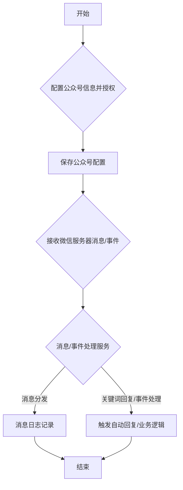
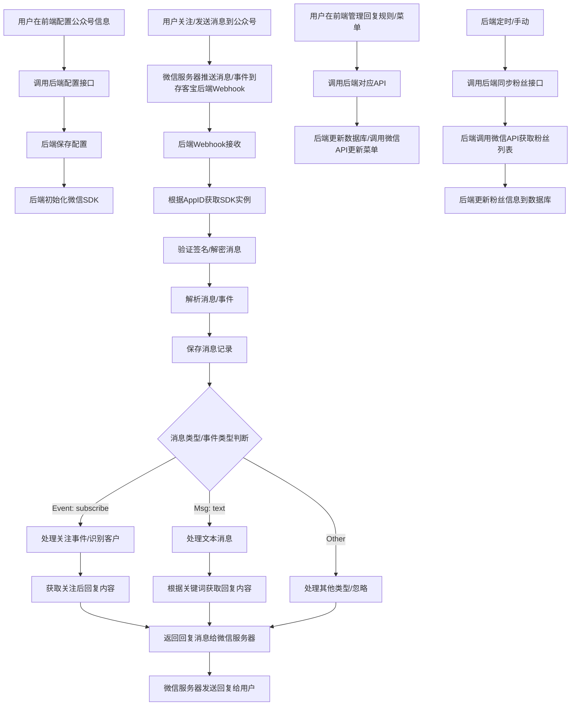

# 存客宝场景获客-公众号获客功能开发文档

## 1. 模块概述

公众号获客功能通过集成微信公众号，实现自动回复、关键词回复、菜单管理、粉丝互动、模板消息等能力，帮助用户通过公众号 جذب and retain customers。后端模块负责微信公众号的对接配置、消息接收与处理、素材管理、用户管理以及通过公众号进行用户触达。

### 公众号获客功能流程图



## 2. API接口设计

### 2.1 配置公众号信息

- **接口路径**：`/api/v1/lead-generation/wechat-mp/config`
- **请求方法**：`POST`
- **接口说明**：配置微信公众号的基本信息（AppID, AppSecret, Token, EncodingAESKey）。
- **请求参数**：

```json
{
  "appId": "YOUR_APPID",
  "appSecret": "YOUR_APPSECRET",
  "token": "YOUR_TOKEN",
  "encodingAesKey": "YOUR_ENCODING_AES_KEY"
}
```

- **响应结果**：

```json
{
  "code": 200,
  "msg": "success",
  "data": {
    "configId": 401,
    "appId": "YOUR_APPID",
    "status": "CONFIGURED" // 表示配置成功
  },
  "timestamp": 1698290400000
}
```

### 2.2 获取公众号配置

- **接口路径**：`/api/v1/lead-generation/wechat-mp/config`
- **请求方法**：`GET`
- **接口说明**：获取已配置的微信公众号信息。

### 2.3 处理微信服务器验证与消息回调

- **接口路径**：`/api/v1/webhook/wechat-mp/{appId}`
- **请求方法**：`GET` (服务器验证) / `POST` (消息回调)
- **接口说明**：接收微信公众号服务器发送的验证请求和用户消息/事件推送。后端需要根据微信的协议进行验证和消息处理。
- **请求参数**：根据微信公众号回调协议而定（signature, timestamp, nonce, echostr for GET; encrypted message data for POST）。

### 2.4 管理自动回复规则

- **接口路径**：`/api/v1/lead-generation/wechat-mp/auto-replies`
- **请求方法**：`POST`/`GET`/`PUT`/`DELETE`
- **接口说明**：对关键词回复和关注后回复规则进行增删改查。

### 2.5 管理公众号菜单

- **接口路径**：`/api/v1/lead-generation/wechat-mp/menu`
- **请求方法**：`GET`/`POST`
- **接口说明**：获取或更新公众号菜单。

### 2.6 发送模板消息

- **接口路径**：`/api/v1/lead-generation/wechat-mp/template-messages`
- **请求方法**：`POST`
- **接口说明**：发送模板消息给指定用户。
- **请求参数**：

```json
{
  "openId": "USER_OPENID",
  "templateId": "TEMPLATE_ID",
  "url": "TARGET_URL",
  "data": { // 模板消息数据
    "first": {
      "value": "欢迎加入",
      "color": "#173177"
    },
    "keyword1": {
      "value": "新用户",
      "color": "#173177"
    },
    // ... 其他关键词
  }
}
```

## 3. 数据模型设计

### 3.1 主要数据表

| 表名                 | 说明            | 关键字段                                   |
|---------------------|----------------|-------------------------------------------|
| t_wechat_mp_config  | 公众号配置表    | id, app_id, app_secret, token, encoding_aes_key, status |
| t_wechat_mp_message | 公众号消息记录表| id, app_id, msg_id, msg_type, event, open_id, content, create_time |
| t_wechat_mp_reply_rule| 公众号回复规则表| id, app_id, rule_type, keyword, reply_content, status |
| t_wechat_mp_user    | 公众号粉丝信息表| id, app_id, open_id, union_id, nickname, subscribe_time, status |

## 4. 服务实现

### 4.1 WechatMpConfigService

负责微信公众号配置信息的管理。

```java
@Service
@Slf4j
public class WechatMpConfigServiceImpl implements WechatMpConfigService {

    @Autowired
    private WechatMpConfigRepository configRepository;

    @Override
    @Transactional
    public WechatMpConfigVO saveConfig(WechatMpConfigDTO dto) {
        log.info("Saving Wechat MP config for appId: {}", dto.getAppId());
        
        // 1. 保存或更新配置信息
        WechatMpConfig config = configRepository.findByAppId(dto.getAppId()).orElse(new WechatMpConfig());
        config.setAppId(dto.getAppId());
        config.setAppSecret(dto.getAppSecret());
        config.setToken(dto.getToken());
        config.setEncodingAesKey(dto.getEncodingAesKey());
        config.setStatus(ConfigStatus.CONFIGURED);
        
        WechatMpConfig savedConfig = configRepository.save(config);
        
        // TODO: 初始化或更新微信SDK配置
        initWechatMpSdk(savedConfig);
        
        return buildConfigVO(savedConfig);
    }
    
    // TODO: 实现获取配置、删除配置等方法
    
    private void initWechatMpSdk(WechatMpConfig config) {
        // 使用 savedConfig 的信息初始化或更新微信公众号SDK (如WxJava)
        // 例如: WxMpService wxMpService = new WxMpServiceImpl();
        // WxMpDefaultConfigImpl wxConfigProvider = new WxMpDefaultConfigImpl();
        // wxConfigProvider.setAppId(config.getAppId());
        // ... 设置其他信息
        // wxMpService.setWxMpConfigStorage(wxConfigProvider);
        // TODO: 将初始化的 service 存储起来，供后续使用 (可能需要考虑多公众号)
    }
}
```

### 4.2 WechatMpMessageService

负责处理微信公众号接收到的消息和事件。

```java
@Service
@Slf4j
public class WechatMpMessageServiceImpl implements WechatMpMessageService {

    @Autowired
    private WechatMpMessageRepository messageRepository;
    
    @Autowired
    private WechatMpReplyService replyService; // 自动回复服务
    
    @Autowired
    private CustomerService customerService; // 客户服务

    @Override
    @Transactional
    public String handleMessage(String appId, String requestBody, Map<String, String> headers) {
        log.info("Handling Wechat MP message for appId: {}", appId);
        
        // TODO: 根据appId获取对应的微信SDK实例
        WxMpService wxMpService = getWxMpService(appId);
        if (wxMpService == null) {
             log.error("Wechat MP config not found for appId: {}", appId);
             return ""; // 或返回错误响应
        }

        try {
            // 1. 解密和解析微信消息
            WxMpXmlMessage wxMessage = wxMpService.getMessageHandler().handle(requestBody);
            log.info("Received Wechat MP message: {}", wxMessage.toJson());
            
            // 2. 保存原始消息记录
            saveMessage(appId, wxMessage);
            
            // 3. 根据消息类型和内容进行处理
            WxMpXmlOutMessage responseMessage = null;
            
            switch (wxMessage.getMsgType()) {
                case WxConsts.XmlMsgType.EVENT:
                    responseMessage = handleEvent(wxMessage); // 处理事件，如关注、扫码等
                    break;
                case WxConsts.XmlMsgType.TEXT:
                    responseMessage = handleTextMsg(wxMessage); // 处理文本消息
                    break;
                // TODO: 处理其他消息类型，如IMAGE, VOICE, VIDEO, SHORTVIDEO, LOCATION, LINK
                default:
                    log.warn("Unknown Wechat MP message type: {}", wxMessage.getMsgType());
                    break;
            }
            
            // 4. 返回响应给微信服务器 (如果需要)
            if (responseMessage != null) {
                return responseMessage.toXml();
            } else {
                return "success"; // 告诉微信服务器已收到消息
            }
            
        } catch (Exception e) {
            log.error("Failed to handle Wechat MP message", e);
            return ""; // 返回空字符串或错误响应
        }
    }
    
    private void saveMessage(String appId, WxMpXmlMessage wxMessage) {
        // 将微信消息保存到 t_wechat_mp_message 表
    }
    
    private WxMpXmlOutMessage handleEvent(WxMpXmlMessage wxMessage) {
        // 处理微信事件，如用户关注(subscribe)、取消关注(unsubscribe)、扫码(SCAN)
        if (WxConsts.Event.SUBSCRIBE.equals(wxMessage.getEvent())) {
            // 用户关注事件
            log.info("User subscribed: {}", wxMessage.getFromUser());
            // TODO: 识别或创建存客宝客户，并标记为公众号粉丝
             customerService.processWechatMpSubscribe(wxMessage.getFromUser(), wxMessage.getAppId(), wxMessage.getEventKey());
             
            // 调用自动回复服务获取关注后回复内容
            return replyService.getSubscribeReply(wxMessage.getAppId(), wxMessage.getFromUser());
            
        } else if (WxConsts.Event.UNSUBSCRIBE.equals(wxMessage.getEvent())) {
            // 用户取消关注事件
             log.info("User unsubscribed: {}", wxMessage.getFromUser());
             // TODO: 更新存客宝客户的公众号粉丝状态
             customerService.processWechatMpUnsubscribe(wxMessage.getFromUser(), wxMessage.getAppId());
        }
        // TODO: 处理其他事件，如SCAN, CLICK, VIEW等
        return null;
    }
    
    private WxMpXmlOutMessage handleTextMsg(WxMpXmlMessage wxMessage) {
        log.info("Received text message from {}: {}", wxMessage.getFromUser(), wxMessage.getContent());
        // 调用自动回复服务，根据关键词获取回复内容
        return replyService.getKeywordReply(wxMessage.getAppId(), wxMessage.getContent(), wxMessage.getFromUser());
    }

    // TODO: 获取WxMpService实例的方法 (需要考虑多公众号的情况)
    private WxMpService getWxMpService(String appId) {
        return null; // 从缓存或注册中心获取
    }
}
```

### 4.3 WechatMpReplyService

负责管理和提供公众号的自动回复内容（关注后回复、关键词回复）。

```java
@Service
@Slf4j
public class WechatMpReplyServiceImpl implements WechatMpReplyService {

    @Autowired
    private WechatMpReplyRuleRepository replyRuleRepository;
    
    // TODO: 其他服务，如素材服务，用于构建图文消息回复

    @Override
    public WxMpXmlOutMessage getSubscribeReply(String appId, String openId) {
        log.info("Getting subscribe reply for appId: {}", appId);
        // TODO: 查询关注后回复规则，构建回复消息
        // 可能返回文本、图片、图文等类型的消息
        return null; 
    }
    
    @Override
    public WxMpXmlOutMessage getKeywordReply(String appId, String keyword, String openId) {
         log.info("Getting keyword reply for appId: {} and keyword: {}", appId, keyword);
        // TODO: 查询关键词回复规则，匹配关键词，构建回复消息
        return null; 
    }
    
    // TODO: 实现规则的增删改查方法
}
```

### 4.4 WechatMpUserService

负责同步和管理公众号粉丝信息。

```java
@Service
@Slf4j
public class WechatMpUserServiceImpl implements WechatMpUserService {

    @Autowired
    private WechatMpUserRepository userRepository;
    
    // TODO: 其他服务，如调用微信API获取粉丝列表等

    @Override
    @Transactional
    public void syncFansList(String appId) {
        log.info("Syncing fans list for appId: {}", appId);
        // TODO: 调用微信API获取粉丝列表，更新或保存到 t_wechat_mp_user 表
        // 需要处理分页获取、增量更新等逻辑
    }
    
     @Override
     @Transactional
     public void processWechatMpSubscribe(String openId, String appId, String eventKey) {
         log.info("Processing subscribe event for openId: {}", openId);
         // TODO: 查找或创建存客宝客户，并记录其公众号openId和关注状态
         // 如果 eventKey 包含场景值，也需要处理，用于追踪获客来源
     }
     
     @Override
     @Transactional
     public void processWechatMpUnsubscribe(String openId, String appId) {
         log.info("Processing unsubscribe event for openId: {}", openId);
          // TODO: 更新存客宝客户的公众号关注状态
     }

    // TODO: 实现获取粉丝信息等方法
}
```

## 5. 流程图



## 6. 异常处理

- `WechatMpConfigException`: 公众号配置异常
- `InvalidSignatureException`: 微信消息签名验证失败
- `MessageHandlingException`: 微信消息处理异常
- `WechatApiException`: 调用微信公众号API异常

## 7. 定时任务

- 定时同步公众号粉丝列表，确保粉丝数据的准确性。
- 定时检查Access Token是否过期，触发刷新逻辑。

## 8. 与前端的交互流程

1. 前端提供公众号配置入口，用户输入公众号信息后调用后端"配置公众号信息"接口。
2. 后端保存配置，并提供Webhook URL给用户在微信公众号后台配置。
3. 用户在微信公众号后台完成服务器配置。
4. 用户关注公众号或发送消息时，微信服务器将消息推送至存客宝后端Webhook接口。
5. 后端Webhook服务处理消息，根据规则自动回复，并更新客户信息（如关注状态）。
6. 前端调用API管理自动回复规则和公众号菜单。
7. 后端定时同步粉丝列表，前端可展示粉丝数据。
8. 后端提供发送模板消息接口，前端可触发向用户发送服务通知等。 

## 相关前端UI图片

以下是与公众号获客功能相关的部分前端UI截图，帮助理解后端功能在前端界面的展现：

### 场景获客页面 - 公众号获客入口 (示意图)

 