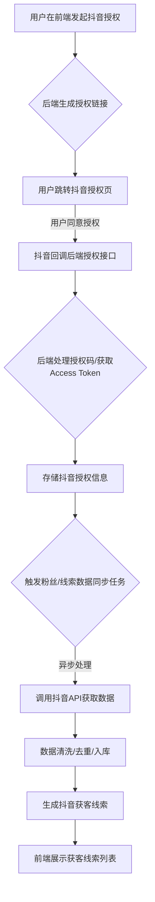

# 存客宝场景获客 - 抖音获客功能后端开发文档

## 1. 模块概述

抖音获客功能旨在通过对接抖音开放平台或相关渠道，实现从抖音平台获取潜在客户信息的能力。这可能包括用户授权、数据抓取、线索同步等。

### 抖音获客功能流程图



## 2. API接口设计

### 2.1 抖音授权回调接口

- **接口路径**：`/api/v1/lead/douyin/auth/callback`
- **请求方法**：`GET`
- **接口说明**：处理抖音开放平台的授权回调请求，获取授权码并进一步获取 access_token。
- **权限:** 无需登录权限，但需要进行签名校验等安全措施。
- **请求参数 (Query Parameters):**

| 参数名  | 类型    | 是否必需 | 描述         | 示例值 |
|---------|--------|----------|--------------|--------|
| code    | string | 是       | 抖音授权码   | xxx    |
| state   | string | 是       | 状态码，用于防止 CSRF 攻击 | yyy |

- **响应数据 (统一格式 `data` 字段):** 返回授权结果或重定向到前端页面。

```json
{
  "message": "授权成功",
  "userId": 1001, // 关联的存客宝用户ID
  "douyinUserId": "抖音用户在平台的唯一标识"
}
```
- **可能返回状态码:** 200 (成功), 400 (参数错误), 500 (服务器错误)

### 2.2 获取抖音授权链接

- **接口路径**：`/api/v1/lead/douyin/auth/url`
- **请求方法**：`GET`
- **接口说明**：生成抖音授权链接，供前端引导用户进行授权。
- **权限:** `lead:douyin:auth:get_url`
- **请求参数 (Query Parameters):**

| 参数名     | 类型    | 是否必需 | 描述         | 示例值 |
|------------|--------|----------|--------------|--------|
| redirectUrl| string | 否       | 授权成功后的回调URL (前端页面) | http://your-app.com/callback |

- **响应数据 (统一格式 `data` 字段):** 返回抖音授权链接。

```json
{
  "authUrl": "https://open.douyin.com/platform/oauth/connect?client_key=xxx&redirect_uri=yyy&response_type=code&scope=zzz&state=aaa"
}
```
- **可能返回状态码:** 200, 401, 403, 500

### 2.3 同步抖音粉丝数据

- **接口路径**：`/api/v1/lead/douyin/fans/sync`
- **请求方法**：`POST`
- **接口说明**：根据用户授权，同步抖音账号的粉丝列表数据。
- **权限:** `lead:douyin:fans:sync`
- **请求参数 (Request Body):**

| 参数名      | 类型   | 是否必需 | 描述         | 示例值 |
|-------------|--------|----------|--------------|--------|
| douyinUserId| string | 是       | 抖音用户在平台的唯一标识 | "抖音用户ID" |
| syncStrategy| string | 否       | 同步策略 (INCREMENTAL, FULL) | INCREMENTAL |

- **响应数据 (统一格式 `data` 字段):** 返回同步任务状态或结果概述。

```json
{
  "taskId": "同步任务ID",
  "status": "PROCESSING", // PENDING, PROCESSING, COMPLETED, FAILED
  "message": "粉丝数据同步中"
}
```
- **可能返回状态码:** 200, 202 (已接受处理), 400, 401, 403, 500

### 2.4 查询抖音获客线索列表

- **接口路径**：`/api/v1/lead/douyin/leads`
- **请求方法**：`GET`
- **接口说明**：查询通过抖音渠道获取的线索列表。
- **权限:** `lead:douyin:leads:view`
- **请求参数 (Query Parameters):**

| 参数名      | 类型    | 是否必需 | 描述             | 示例值 |
|-------------|--------|----------|------------------|--------|
| startTime   | string | 否       | 获取时间开始 (ISO 8601) |        |
| endTime     | string | 否       | 获取时间结束 (ISO 8601) |        |
| keyword     | string | 否       | 关键字搜索 (昵称, 备注等) |        |
| page        | integer| 否       | 页码             | 1      |
| size        | integer| 否       | 每页条数         | 10     |

- **响应数据 (统一格式 `data` 字段):** 返回线索列表（支持分页）。

```json
{
  "records": [
    {
      "leadId": 1001,
      "channel": "抖音获客",
      "nickname": "抖音用户昵称",
      "avatarUrl": "头像URL",
      "douyinUserId": "抖音用户ID",
      "acquireTime": "2023-10-26T11:00:00Z", // 获取时间
      "status": "NEW", // NEW, CONTACTED, CONVERTED
      "notes": "用户备注"
    }
    // ... 更多线索
  ],
  "total": 100,
  "size": 10,
  "current": 1,
  "pages": 10
}
```
- **可能返回状态码:** 200, 400, 401, 403, 500

## 3. 数据模型设计

### 3.1 抖音授权信息表 `t_douyin_auth`

存储存客宝用户与抖音账号的授权关联信息。

| 字段名        | 类型         | 是否必需 | 说明             | 索引        |
|--------------|--------------|----------|------------------|------------|
| id           | BIGINT (PK)  | 是       | 主键             |            |
| user_id      | BIGINT (FK)  | 是       | 存客宝用户ID     | Index      |
| douyin_user_id| VARCHAR(100) | 是       | 抖音开放平台用户唯一标识 | UNIQUE Index |
| access_token | VARCHAR(255) | 是       | 抖音 API 访问令牌 |            |
| refresh_token| VARCHAR(255) | 是       | 抖音 API 刷新令牌 |            |
| expire_time  | DATETIME     | 是       | access_token 过期时间 |            |
| scope        | VARCHAR(255) | 否       | 授权范围         |            |
| create_time  | DATETIME     | 是       | 创建时间         |            |
| update_time  | DATETIME     | 是       | 更新时间         |            |

### 3.2 抖音获客线索表 `t_douyin_lead`

存储从抖音获取的线索信息。

| 字段名        | 类型         | 是否必需 | 说明             | 索引        |
|--------------|--------------|----------|------------------|------------|
| id           | BIGINT (PK)  | 是       | 主键             |            |
| lead_id      | BIGINT (FK)  | 是       | 关联到统一线索表的ID (如果存在) | Index      |
| douyin_user_id| VARCHAR(100) | 是       | 抖音开放平台用户唯一标识 | Index      |
| nickname     | VARCHAR(100) | 否       | 抖音用户昵称     |            |
| avatar_url   | VARCHAR(500) | 否       | 抖音用户头像URL  |            |
| acquire_time | DATETIME     | 是       | 线索获取时间     | Index      |
| status       | VARCHAR(20)  | 是       | 线索状态 (NEW, CONTACTED, CONVERTED) | Index      |
| notes        | TEXT         | 否       | 用户备注         |            |
| create_time  | DATETIME     | 是       | 创建时间         |            |
| update_time  | DATETIME     | 是       | 更新时间         |            |

## 4. 异常处理

- `DouyinApiException`: 调用抖音开放平台 API 异常
- `DouyinAuthException`: 抖音授权相关异常
- `DouyinLeadSyncException`: 抖音线索同步异常
- `InvalidDouyinLeadQueryException`: 查询参数无效异常

## 5. 开发注意事项和实现要点

1.  **抖音开放平台对接:**
    - 熟悉抖音开放平台的 API 文档，特别是授权、用户信息、粉丝列表等接口。
    - 处理 access_token 的获取、存储和刷新机制。
    - 确保 API 请求的安全性，包括签名、参数校验等。
2.  **授权流程:**
    - 实现 OAuth 2.0 授权流程，包括引导用户跳转到抖音授权页、处理回调、获取 access_token 和 refresh_token。
    - 使用 state 参数防止 CSRF 攻击。
3.  **数据同步:**
    - 设计稳定可靠的粉丝数据同步任务，可以采用定时任务或异步队列的方式。
    - 处理数据重复和增量更新问题。
    - 考虑抖音 API 的调用频率限制。
4.  **线索统一管理:**
    - 如果有统一的线索管理模块，需要将从抖音获取的线索数据同步到统一线索表，保持数据一致性。
    - 设计线索状态流转（如新线索 -> 已联系 -> 已转化）。
5.  **异常处理:**
    - 捕获并处理与抖音 API 交互过程中可能出现的各种异常，并记录详细日志。
    - 对于授权失败或同步失败，需要有重试或告警机制。
6.  **敏感信息:**
    - 抖音 API 的 access_token 和 refresh_token 是敏感信息，需要加密存储。
7.  **前端交互:**
    - 前端需要调用接口获取授权链接，并在用户完成授权后，由后端处理回调。
    - 前端需要调用接口查询和展示抖音获客线索列表。

## 相关前端UI图片

以下是与抖音获客功能可能相关的部分前端UI截图，帮助理解用户如何在前端界面查看和管理抖音获客：

### 场景获客 - 抖音获客入口示例 (示意图)


--- 