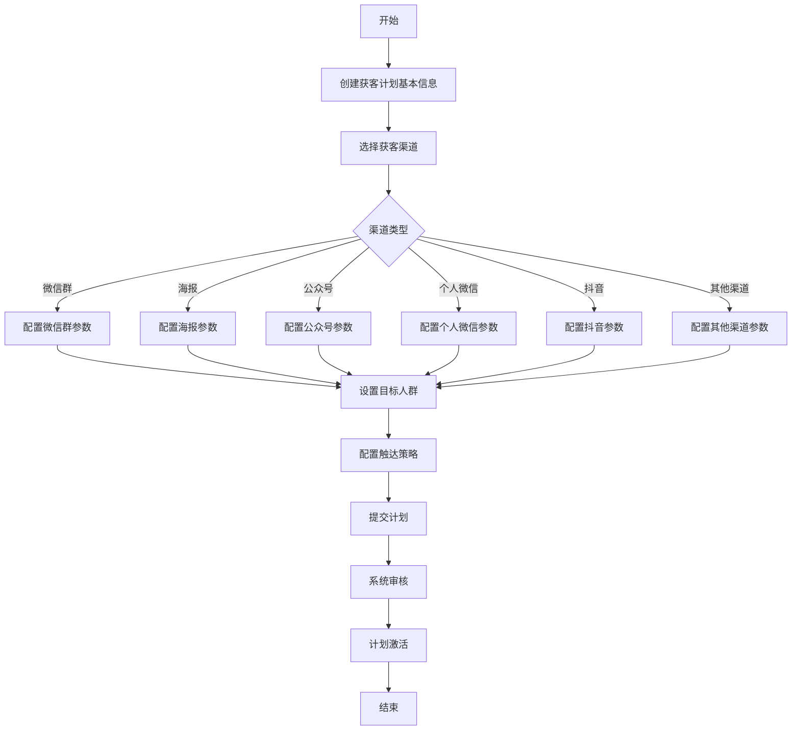

# 后端-场景获客-新建获客计划功能开发文档

## 1. 功能概述
新建获客计划功能允许用户创建、配置和管理多渠道获客活动。获客计划可整合微信群、公众号、海报、付款码、个人微信、抖音等多种获客渠道，通过统一管理提高获客效率和转化率。

## 2. 业务架构
获客计划在系统中处于核心业务流程位置，具有以下特点：
- 支持多种获客渠道的集成管理
- 提供获客渠道效果的统一分析
- 可配置获客目标人群和预期转化目标
- 集成现有的各类获客功能模块

### 2.1 系统位置
获客计划模块建立在存客宝现有业务架构之上，与以下模块交互：
- 内容库模块：为获客计划提供素材
- 设备管理模块：提供获客所需的设备资源
- 微信号管理模块：提供社交媒体渠道
- 流量池模块：为获客计划提供流量支持

## 3. 功能流程图


## 4. 系统设计
### 4.1 数据库设计
#### 4.1.1 计划主表 `acquisition_plans`
| 字段名          | 类型       | 描述                                |
|-----------------|------------|-------------------------------------|
| id              | BIGINT     | 主键，自增                          |
| tenant_id       | BIGINT     | 租户ID                              |
| plan_name       | VARCHAR(100)| 计划名称                          |
| plan_desc       | VARCHAR(500)| 计划描述                           |
| status          | VARCHAR(20)| 状态(DRAFT/PENDING/ACTIVE/PAUSED/ENDED) |
| start_time      | DATETIME   | 开始时间                            |
| end_time        | DATETIME   | 结束时间                            |
| target_audience | JSON       | 目标受众配置                        |
| budget          | DECIMAL    | 计划预算                            |
| expected_converts| INT       | 预期转化数                          |
| created_by      | BIGINT     | 创建人ID                            |
| created_at      | TIMESTAMP  | 创建时间                            |
| updated_at      | TIMESTAMP  | 更新时间                            |

#### 4.1.2 渠道配置表 `acquisition_plan_channels`
| 字段名           | 类型        | 描述                              |
|------------------|-------------|----------------------------------|
| id               | BIGINT      | 主键，自增                        |
| plan_id          | BIGINT      | 关联计划ID                        |
| channel_type     | VARCHAR(30) | 渠道类型(WECHAT_GROUP/POSTER/etc) |
| channel_config   | JSON        | 渠道配置参数                      |
| priority         | INT         | 优先级                            |
| status           | VARCHAR(20) | 状态(ACTIVE/PAUSED)              |
| created_at       | TIMESTAMP   | 创建时间                          |
| updated_at       | TIMESTAMP   | 更新时间                          |

#### 4.1.3 计划执行记录表 `acquisition_plan_executions`
| 字段名           | 类型        | 描述                              |
|------------------|-------------|----------------------------------|
| id               | BIGINT      | 主键，自增                        |
| plan_id          | BIGINT      | 关联计划ID                        |
| channel_id       | BIGINT      | 关联渠道ID                        |
| execution_time   | DATETIME    | 执行时间                          |
| reach_count      | INT         | 触达人数                          |
| convert_count    | INT         | 转化人数                          |
| execution_status | VARCHAR(20) | 执行状态(SUCCESS/FAILED/PARTIAL)  |
| error_message    | TEXT        | 错误信息                          |
| created_at       | TIMESTAMP   | 创建时间                          |

### 4.2 服务架构
获客计划功能将整合到`business`模块中，新增以下核心组件：

#### 4.2.1 控制器
- `AcquisitionPlanController.java`：处理获客计划相关请求
- `AcquisitionPlanChannelController.java`：处理渠道配置相关请求

#### 4.2.2 实体类
- `AcquisitionPlan.java`：获客计划实体
- `AcquisitionPlanChannel.java`：渠道配置实体
- `AcquisitionPlanExecution.java`：执行记录实体

#### 4.2.3 服务类
- `AcquisitionPlanService.java`：核心业务逻辑实现
- `AcquisitionChannelFactory.java`：渠道策略工厂
- 各渠道策略实现类

## 5. 接口设计
### 5.1 新建获客计划
- **URL**: `/api/acquisition/plans`
- **Method**: `POST`
- **权限**: `acquisition:plan:create`
- **请求参数**:
  ```json
  {
    "planName": "618大促获客计划",
    "planDesc": "618促销活动获客计划，面向25-45岁的厦门地区用户",
    "startTime": "2025-06-01T00:00:00Z",
    "endTime": "2025-06-20T23:59:59Z",
    "targetAudience": {
      "ageRange": [25, 45],
      "regions": ["厦门", "福州"],
      "gender": "ALL",
      "interests": ["电子产品", "服装"]
    },
    "budget": 5000,
    "expectedConverts": 500
  }
  ```
- **响应参数**:
  ```json
  {
    "code": 200,
    "message": "成功",
    "data": {
      "planId": 10001,
      "status": "DRAFT"
    }
  }
  ```

### 5.2 添加获客渠道
- **URL**: `/api/acquisition/plans/{planId}/channels`
- **Method**: `POST`
- **权限**: `acquisition:channel:add`
- **请求参数**:
  ```json
  {
    "channelType": "WECHAT_GROUP",
    "channelConfig": {
      "wechatGroupIds": [100, 101, 102],
      "joinMessageTemplate": "欢迎加入我们的活动群，本次活动将提供...",
      "materialIds": [200, 201]
    },
    "priority": 1
  }
  ```
- **响应参数**:
  ```json
  {
    "code": 200,
    "message": "成功",
    "data": {
      "channelId": 2001,
      "status": "ACTIVE"
    }
  }
  ```

### 5.3 提交获客计划
- **URL**: `/api/acquisition/plans/{planId}/submit`
- **Method**: `POST`
- **权限**: `acquisition:plan:submit`
- **请求参数**: 无
- **响应参数**:
  ```json
  {
    "code": 200,
    "message": "成功",
    "data": {
      "planId": 10001,
      "status": "PENDING"
    }
  }
  ```

### 5.4 获取计划列表
- **URL**: `/api/acquisition/plans`
- **Method**: `GET`
- **权限**: `acquisition:plan:list`
- **请求参数**:
  - `status`: 状态筛选
  - `page`: 页码
  - `size`: 每页条数
- **响应参数**:
  ```json
  {
    "code": 200,
    "message": "成功",
    "data": {
      "total": 100,
      "list": [
        {
          "planId": 10001,
          "planName": "618大促获客计划",
          "status": "ACTIVE",
          "startTime": "2025-06-01T00:00:00Z",
          "endTime": "2025-06-20T23:59:59Z",
          "channelCount": 3,
          "reachCount": 1500,
          "convertCount": 200
        }
      ]
    }
  }
  ```

## 6. 服务实现
### 6.1 核心服务类
```java
@Service
public class AcquisitionPlanService {
    
    @Autowired
    private AcquisitionPlanMapper planMapper;
    
    @Autowired
    private AcquisitionPlanChannelMapper channelMapper;
    
    @Autowired
    private AcquisitionChannelFactory channelFactory;
    
    /**
     * 创建获客计划
     */
    public AcquisitionPlanVO createPlan(AcquisitionPlanDTO planDTO) {
        // 参数校验
        validatePlanParams(planDTO);
        
        // 构建实体
        AcquisitionPlan plan = new AcquisitionPlan();
        BeanUtils.copyProperties(planDTO, plan);
        plan.setStatus("DRAFT");
        plan.setCreatedAt(new Date());
        plan.setUpdatedAt(new Date());
        
        // 保存实体
        planMapper.insert(plan);
        
        // 返回结果
        AcquisitionPlanVO result = new AcquisitionPlanVO();
        result.setPlanId(plan.getId());
        result.setStatus(plan.getStatus());
        return result;
    }
    
    /**
     * 添加获客渠道
     */
    public AcquisitionChannelVO addChannel(Long planId, AcquisitionChannelDTO channelDTO) {
        // 查询计划
        AcquisitionPlan plan = planMapper.selectById(planId);
        if (plan == null) {
            throw new BusinessException("计划不存在");
        }
        
        // 校验渠道类型
        ChannelStrategy strategy = channelFactory.getStrategy(channelDTO.getChannelType());
        if (strategy == null) {
            throw new BusinessException("不支持的渠道类型");
        }
        
        // 渠道参数校验
        strategy.validateConfig(channelDTO.getChannelConfig());
        
        // 构建实体
        AcquisitionPlanChannel channel = new AcquisitionPlanChannel();
        channel.setPlanId(planId);
        BeanUtils.copyProperties(channelDTO, channel);
        channel.setStatus("ACTIVE");
        channel.setCreatedAt(new Date());
        channel.setUpdatedAt(new Date());
        
        // 保存实体
        channelMapper.insert(channel);
        
        // 返回结果
        AcquisitionChannelVO result = new AcquisitionChannelVO();
        result.setChannelId(channel.getId());
        result.setStatus(channel.getStatus());
        return result;
    }
    
    /**
     * 提交计划
     */
    public AcquisitionPlanVO submitPlan(Long planId) {
        // 查询计划
        AcquisitionPlan plan = planMapper.selectById(planId);
        if (plan == null) {
            throw new BusinessException("计划不存在");
        }
        
        // 校验计划状态
        if (!"DRAFT".equals(plan.getStatus())) {
            throw new BusinessException("只有草稿状态的计划可以提交");
        }
        
        // 校验渠道配置
        List<AcquisitionPlanChannel> channels = channelMapper.selectByPlanId(planId);
        if (channels == null || channels.isEmpty()) {
            throw new BusinessException("至少需要配置一个获客渠道");
        }
        
        // 更新状态
        plan.setStatus("PENDING");
        plan.setUpdatedAt(new Date());
        planMapper.updateById(plan);
        
        // 返回结果
        AcquisitionPlanVO result = new AcquisitionPlanVO();
        result.setPlanId(plan.getId());
        result.setStatus(plan.getStatus());
        return result;
    }
    
    // 其他方法...
}
```

### 6.2 渠道策略工厂
```java
@Component
public class AcquisitionChannelFactory {
    
    private Map<String, ChannelStrategy> strategyMap = new HashMap<>();
    
    @Autowired
    public AcquisitionChannelFactory(List<ChannelStrategy> strategies) {
        for (ChannelStrategy strategy : strategies) {
            strategyMap.put(strategy.getType(), strategy);
        }
    }
    
    public ChannelStrategy getStrategy(String channelType) {
        return strategyMap.get(channelType);
    }
}

public interface ChannelStrategy {
    String getType();
    void validateConfig(JSONObject config);
    void executeAcquisition(AcquisitionPlanChannel channel);
}
```

## 7. 部署与测试
### 7.1 部署步骤
1. 在MySQL数据库中创建相关表结构
2. 添加新的控制器、服务和实体类到项目中
3. 集成到现有的权限体系
4. 更新API文档
5. 部署到测试环境进行功能验证

### 7.2 测试用例
| 测试场景 | 测试步骤 | 预期结果 |
|---------|---------|---------|
| 创建有效的获客计划 | 1. 登录管理后台<br>2. 访问获客计划页面<br>3. 填写有效的计划信息<br>4. 提交 | 成功创建计划，返回计划ID和状态为"草稿" |
| 添加获客渠道 | 1. 在已创建的计划中<br>2. 添加微信群渠道<br>3. 配置渠道参数<br>4. 提交 | 成功添加渠道，返回渠道ID和状态为"激活" |
| 提交计划审核 | 1. 选择草稿状态的计划<br>2. 点击提交审核按钮 | 计划状态变为"待审核" |
| 无效参数测试 | 1. 创建计划时使用无效的日期范围(结束日期早于开始日期) | 返回参数错误提示 |
| 缺少渠道测试 | 1. 创建计划但不添加任何渠道<br>2. 尝试提交审核 | 返回错误提示"至少需要配置一个获客渠道" |

## 8. 注意事项
1. 获客计划需要与现有的微信群、海报、公众号等获客功能模块集成，确保数据一致性。
2. 计划执行过程中需要记录执行日志，便于后续分析和优化。
3. 应考虑多租户场景下的数据隔离要求。
4. 对于计划中的预算控制，需要与计费系统进行对接。
5. 计划执行状态的变更需要有相应的通知机制，以便运营人员及时了解。

## 9. 设备管理规则（新增章节）

### 9.1 设备添加控制规则

#### 9.1.1 添加间隔配置
| 参数名          | 类型   | 必填 | 默认值 | 说明                                                                 |
|-----------------|--------|------|--------|----------------------------------------------------------------------|
| addInterval     | INT    | 是   | 300    | 单位：秒，控制同一设备两次添加操作的最小间隔时间                     |
| dailyAddLimit   | INT    | 否   | 50     | 单台设备每日最大添加次数，为空表示不限制                             |
| weeklyAddLimit  | INT    | 否   | 200    | 单台设备每周最大添加次数，为空表示不限制                             |
| monthlyAddLimit | INT    | 否   | 500    | 单台设备每月最大添加次数，为空表示不限制                             |

#### 9.1.2 添加行为规则
1. **基础规则**：
   - 同一设备在间隔时间内重复添加同一用户，系统自动去重
   - 达到日/周/月添加上限后，自动暂停该设备的添加功能

2. **智能调节规则**：
   - 当设备添加通过率低于60%时，系统自动延长添加间隔时间（原间隔×1.5）
   - 当设备被投诉率超过5%时，系统自动将该设备加入观察名单，限制其添加频率

### 9.2 设备异常处理流程

#### 9.2.1 自动停止场景
当出现以下情况时，系统将自动停止设备参与获客计划：
1. 设备连续3次添加操作失败
2. 设备被目标用户举报
3. 设备添加通过率连续2小时低于30%
4. 设备硬件指纹发生变更（可能为更换设备）

#### 9.2.2 停止后处理机制
| 停止原因               | 冷却时间 | 恢复条件                                                                 |
|------------------------|----------|--------------------------------------------------------------------------|
| 连续添加失败           | 2小时    | 1. 冷却时间结束<br>2. 人工检查设备状态                                   |
| 用户举报               | 24小时   | 1. 冷却时间结束<br>2. 运营人员审核通过                                   |
| 低通过率               | 4小时    | 1. 冷却时间结束<br>2. 通过率恢复到50%以上                                |
| 设备指纹变更           | 永久     | 需重新注册设备                                                           |

#### 9.2.3 人工干预流程
1. **设备解封申请**：
   - 运营人员可在管理后台提交解封申请
   - 需填写解封理由和整改措施
2. **设备替换**：
   - 对于永久停用的设备，可申请替换为新设备
   - 新设备需通过7天观察期才能参与高频率获客计划

### 9.3 相关接口增强

#### 9.3.1 设备状态查询接口（新增）
- **URL**: `/api/devices/{deviceId}/status`
- **Method**: `GET`
- **响应示例**：
```json
{
  "deviceId": "DEV123",
  "status": "NORMAL",
  "todayAddCount": 15,
  "lastAddTime": "2025-06-15T14:30:00Z",
  "restrictions": {
    "currentInterval": 300,
    "remainingDailyQuota": 35
  }
}
```

#### 9.3.2 获客计划接口增强
在现有获客计划接口中增加设备控制参数：
```json
{
  "deviceControl": {
    "enableSmartThrottling": true,
    "maxParallelDevices": 5,
    "fallbackDevices": ["DEV789", "DEV456"]
  }
}
```

### 9.4 数据库变更
#### 9.4.1 新增设备状态表 `device_acquisition_status`
| 字段名          | 类型        | 描述                          |
|-----------------|-------------|-------------------------------|
| id              | BIGINT      | 主键                          |
| device_id       | VARCHAR(50) | 设备ID                        |
| plan_id         | BIGINT      | 关联的获客计划ID              |
| status          | VARCHAR(20) | 状态(NORMAL/WARNING/BLOCKED)  |
| today_add_count | INT         | 今日已添加次数                |
| last_add_time   | DATETIME    | 最后一次添加时间              |
| restricted_until| DATETIME    | 限制结束时间                  |
| created_at      | TIMESTAMP   | 创建时间                      |
| updated_at      | TIMESTAMP   | 更新时间                      |

#### 9.4.2 设备操作记录表 `device_operation_logs`
| 字段名          | 类型        | 描述                          |
|-----------------|-------------|-------------------------------|
| id              | BIGINT      | 主键                          |
| device_id       | VARCHAR(50) | 设备ID                        |
| operation_type  | VARCHAR(20) | 操作类型(ADD/UNBLOCK/REPLACE) |
| operation_time  | DATETIME    | 操作时间                      |
| result          | VARCHAR(20) | 结果(SUCCESS/FAILURE)         |
| details         | TEXT        | 详细日志                      |
| operator        | VARCHAR(50) | 操作人(系统/用户ID)           |
| created_at      | TIMESTAMP   | 创建时间                      |
 
## 7. 相关前端UI图片

为了更直观地理解后端功能在前端界面的展现，以下是新建获客计划功能相关的UI截图：

### 新建获客计划 - 步骤一 (基本信息)


### 新建获客计划 - 步骤二 (选择渠道)


### 新建获客计划 - 步骤三 (渠道配置示例)


### 新建获客计划 - 步骤四 (完成)


> 本文档详细说明了存客宝后端场景获客-新建获客计划功能的设计与实现要点，开发时请严格遵循上述规范，确保系统功能完善和安全稳定。
 