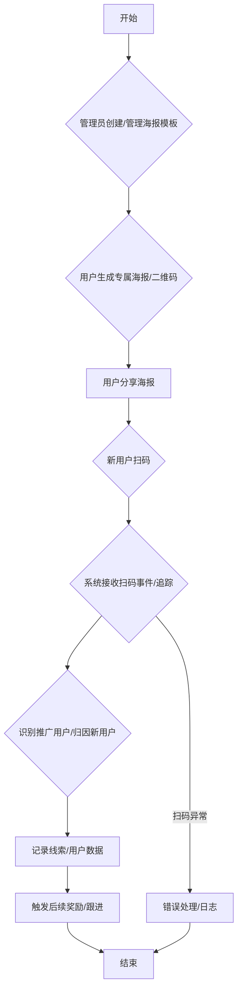
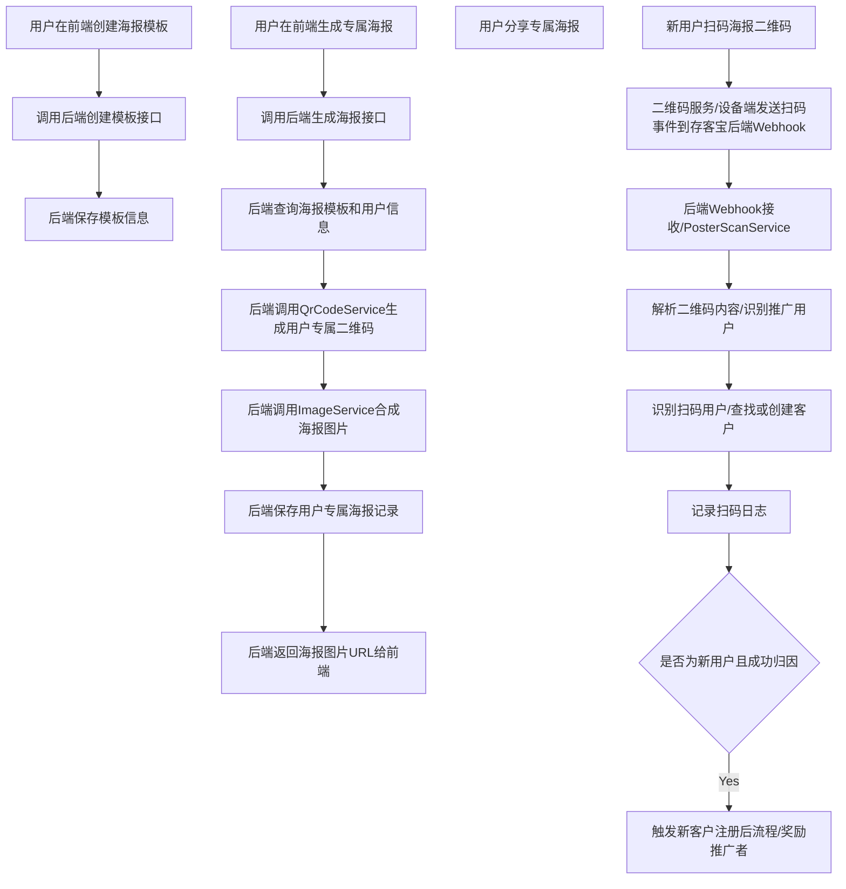

# 存客宝场景获客-海报获客功能开发文档

## 1. 模块概述

海报获客功能通过生成带有用户专属二维码的个性化推广海报，鼓励用户分享，并追踪通过海报扫描带来的新用户，实现裂变获客。后端模块负责海报模板管理、用户专属二维码生成、海报合成、扫码事件追踪、新用户归因及数据统计。

### 海报获客功能流程图



## 2. API接口设计

### 2.1 创建海报模板

- **接口路径**：`/api/v1/lead-generation/posters/templates`
- **请求方法**：`POST`
- **接口说明**：上传或定义一个海报模板，包含背景图、文本区域、二维码占位符等。
- **权限:** `poster:template:create`
- **请求参数 (Request Body):**

| 参数名            | 类型             | 是否必需 | 说明                                  | 示例值 |
|-------------------|------------------|----------|---------------------------------------|--------|
| name              | string           | 是       | 海报模板名称                          | 裂变活动推广海报 |
| description       | string           | 否       | 海报模板描述                          | 用于分享推广新用户的海报 |
| backgroundImageUrl| string           | 是       | 海报背景图片URL (OSS地址)             | http://oss.example.com/bg.png |
| elements          | array<object>    | 是       | 海报元素列表 (文本、图片、二维码占位符) | `[...]` |

`elements` 数组中的对象结构示例：

**文本元素 (type="TEXT"):**
| 参数名   | 类型   | 是否必需 | 说明     | 示例值   |
|----------|--------|----------|----------|----------|
| type     | string | 是       | 元素类型 | TEXT     |
| content  | string | 是       | 文本内容 | 邀请你加入 |
| x        | integer| 是       | X坐标    | 100      |
| y        | integer| 是       | Y坐标    | 200      |
| fontSize | integer| 是       | 字体大小 | 24       |
| color    | string | 是       | 字体颜色 | #333     |
| font     | string | 否       | 字体名称 | SimHei   |

**二维码元素 (type="QR_CODE"):**
| 参数名      | 类型   | 是否必需 | 说明           | 示例值        |
|-------------|--------|----------|----------------|---------------|
| type        | string | 是       | 元素类型       | QR_CODE       |
| size        | integer| 是       | 二维码边长像素 | 150           |
| x           | integer| 是       | X坐标          | 300           |
| y           | integer| 是       | Y坐标          | 500           |
| placeholder | string | 是       | 占位符标记     | [[QR_CODE_URL]] |

**用户头像元素 (type="AVATAR"):**
| 参数名 | 类型   | 是否必需 | 说明     | 示例值 |
|--------|--------|----------|----------|--------|
| type   | string | 是       | 元素类型 | AVATAR |
| size   | integer| 是       | 边长像素 | 80     |
| x      | integer| 是       | X坐标    | 50     |
| y      | integer| 是       | Y坐标    | 50     |
| round  | boolean| 否       | 是否圆形 | true   |

**用户昵称元素 (type="NICKNAME"):**
| 参数名   | 类型   | 是否必需 | 说明     | 示例值   |
|----------|--------|----------|----------|----------|
| type     | string | 是       | 元素类型 | NICKNAME |
| x        | integer| 是       | X坐标    | 150      |
| y        | integer| 是       | Y坐标    | 70       |
| fontSize | integer| 是       | 字体大小 | 20       |
| color    | string | 是       | 字体颜色 | #000     |
| font     | string | 否       | 字体名称 | SimHei   |

- **响应数据 (统一格式 `data` 字段):**

```json
{
  "templateId": 501,
  "name": "裂变活动推广海报",
  "status": "ACTIVE", // 模板状态 (ACTIVE, INACTIVE)
  "createTime": "2023-10-26T10:00:00Z"
}
```
- **可能返回状态码:** 201 (创建成功), 400 (参数错误), 401, 403, 500

### 2.2 获取海报模板列表

- **接口路径**：`/api/v1/lead-generation/posters/templates`
- **请求方法**：`GET`
- **接口说明**：获取海报模板列表，支持分页和筛选。
- **权限:** `poster:template:view`
- **请求参数 (Query Parameters):**

| 参数名 | 类型    | 是否必需 | 描述         | 示例值 |
|--------|--------|----------|--------------|--------|
| name   | string | 否       | 模板名称关键字 | 活动   |
| status | string | 否       | 模板状态     | ACTIVE |
| page   | integer| 否       | 页码         | 1      |
| size   | integer| 否       | 每页条数     | 10     |

- **响应数据 (统一格式 `data` 字段):**

```json
{
  "records": [
    {
      "templateId": 501,
      "name": "裂变活动推广海报",
      "description": "用于分享推广新用户的海报",
      "backgroundImageUrl": "http://oss.example.com/bg.png",
      "status": "ACTIVE",
      "createTime": "2023-10-26T10:00:00Z"
      // elements 列表通常在获取详情时返回
    }
    // ... 更多模板记录
  ],
  "total": 10,
  "size": 10,
  "current": 1,
  "pages": 1
}
```
- **可能返回状态码:** 200, 400, 401, 403, 500

### 2.3 获取海报模板详情

- **接口路径**：`/api/v1/lead-generation/posters/templates/{templateId}`
- **请求方法**：`GET`
- **接口说明**：获取指定海报模板的详细信息，包括所有元素配置。
- **权限:** `poster:template:view`
- **请求参数 (Path Parameters):**

| 参数名     | 类型    | 是否必需 | 说明         | 示例值 |
|------------|--------|----------|--------------|--------|
| templateId | integer | 是       | 海报模板ID   | 501    |

- **响应数据 (统一格式 `data` 字段):** 返回包含elements完整信息的模板详情。

```json
{
  "templateId": 501,
  "name": "裂变活动推广海报",
  "description": "用于分享推广新用户的海报",
  "backgroundImageUrl": "http://oss.example.com/bg.png",
  "elements": [ // 海报元素，如文本、图片、二维码
    { "type": "TEXT", "content": "邀请你加入", "x": 100, "y": 200, "fontSize": 24, "color": "#333", "font": "SimHei" },
    { "type": "QR_CODE", "size": 150, "x": 300, "y": 500, "placeholder": "[[QR_CODE_URL]]" },
    { "type": "AVATAR", "size": 80, "x": 50, "y": 50, "round": true },
    { "type": "NICKNAME", "x": 150, "y": 70, "fontSize": 20, "color": "#000" }
  ],
  "status": "ACTIVE",
  "createTime": "2023-10-26T10:00:00Z",
  "updateTime": "2023-10-26T10:30:00Z"
}
```
- **可能返回状态码:** 200, 401, 403, 404 (模板不存在), 500

### 2.4 更新海报模板

- **接口路径**：`/api/v1/lead-generation/posters/templates/{templateId}`
- **请求方法**：`PUT`
- **接口说明**：更新指定海报模板的信息。
- **权限:** `poster:template:update`
- **请求参数 (Path Parameters):**

| 参数名     | 类型    | 是否必需 | 说明         | 示例值 |
|------------|--------|----------|--------------|--------|
| templateId | integer | 是       | 海报模板ID   | 501    |

- **请求体 (Request Body):** 结构与创建模板类似，可以只包含需要更新的字段。

- **响应数据 (统一格式 `data` 字段):** 返回更新后的模板详情。

```json
{
  "templateId": 501,
  "name": "裂变活动推广海报 - V2",
  "status": "ACTIVE",
  "updateTime": "2023-10-26T11:00:00Z"
  // ... 其他更新后的字段
}
```
- **可能返回状态码:** 200, 400, 401, 403, 404, 422 (数据校验失败), 500

### 2.5 删除海报模板

- **接口路径**：`/api/v1/lead-generation/posters/templates/{templateId}`
- **请求方法**：`DELETE`
- **接口说明**：删除指定的海报模板。
- **权限:** `poster:template:delete`
- **请求参数 (Path Parameters):**

| 参数名     | 类型    | 是否必需 | 说明         | 示例值 |
|------------|--------|----------|--------------|--------|
| templateId | integer | 是       | 海报模板ID   | 501    |

- **响应数据 (统一格式 `data` 字段):** 返回成功或失败信息。

```json
{
  "message": "海报模板删除成功"
}
```
- **可能返回状态码:** 200, 401, 403, 404, 409 (模板正在使用), 500

### 2.6 生成用户专属推广海报

- **接口路径**：`/api/v1/lead-generation/posters/generate`
- **请求方法**：`POST`
- **接口说明**：根据指定海报模板和用户ID，生成包含该用户专属推广二维码的海报图片。
- **权限:** `poster:generate`
- **请求参数 (Request Body):**

| 参数名     | 类型    | 是否必需 | 说明               | 示例值 |
|------------|--------|----------|--------------------|--------|
| templateId | integer | 是       | 使用的海报模板ID   | 501    |
| userId     | integer | 是       | 生成海报的用户ID   | 1001   |
| activityId | integer | 否       | 关联的活动ID (用于追踪) | 101    |

- **响应数据 (统一格式 `data` 字段):**

```json
{
  "userPosterId": 1,           // 生成的用户专属海报记录ID
  "posterUrl": "生成的专属海报图片URL (OSS)", // 前端展示用的海报图片URL
  "qrcodeUrl": "海报中的专属二维码URL", // 扫码事件会带上此URL或其中的参数
  "userId": 1001,
  "templateId": 501,
  "createTime": "2023-10-26T14:30:00Z"
}
```
- **可能返回状态码:** 200, 400 (参数错误/模板或用户不存在), 401, 403, 500

### 2.7 处理海报扫码事件推送 (Webhook)

- **接口路径**：`/api/v1/webhook/poster/scan`
- **请求方法**：`POST`
- **接口说明**：接收来自二维码服务或设备端的扫码事件推送。根据二维码携带的参数，识别推广用户（referrer）和扫码用户（scanner），记录扫码日志，并将新注册用户归因到推广用户，触发后续奖励流程。此接口通常无需认证，但需要验证签名。
- **权限:** 无需认证，需验签
- **请求参数 (Request Body):** 具体结构依赖于二维码服务或设备端推送的数据格式，通常包含：

| 参数名            | 类型    | 说明                                   | 示例值 |
|-------------------|---------|----------------------------------------|--------|
| qrcodeContent     | string  | 二维码中包含的原始内容 (如推广链接)    | https://your.domain.com/invite?userId=1001 |
| scannerIdentifier | string  | 扫码用户的唯一标识 (如微信OpenID, UnionID等) | oabc123... |
| scanTime          | string  | 扫码时间 (ISO 8601或其他约定格式)      | 2023-10-26T15:00:00Z |
| scanLocation      | string  | 扫码地点 (如果可获取)                  | 北京   |
| deviceId          | integer | 如果扫码事件来自设备端，设备ID         | 1      |
| ...               | ...     | 其他相关数据                           | ...    |

- **响应数据:** 接收成功通常返回简单的成功标识或符合推送方要求的特定响应。

```json
{
  "code": 200,
  "message": "received"
}
```
- **可能返回状态码:** 200, 400 (数据格式错误/验签失败), 500

### 2.8 获取海报推广效果统计

- **接口路径**：`/api/v1/lead-generation/posters/statistics`
- **请求方法**：`GET`
- **接口说明**：获取海报推广效果统计数据，包括总生成海报数、总扫码数、总新客户数、总归因客户数等。支持按海报模板、推广用户、时间范围进行筛选和分组统计。
- **权限:** `poster:stats:view`
- **请求参数 (Query Parameters):**

| 参数名         | 类型    | 是否必需 | 描述                 | 示例值       |
|----------------|--------|----------|----------------------|--------------|
| templateId     | integer| 否       | 按海报模板ID过滤     | 501          |
| userId         | integer| 否       | 按推广用户ID过滤     | 1001         |
| startTime      | string | 否       | 统计时间范围始 (ISO 8601) | 2023-10-01Z  |
| endTime        | string | 否       | 统计时间范围末 (ISO 8601) | 2023-10-31Z  |
| groupBy        | string | 否       | 分组方式 (TEMPLATE, USER, DAY) | TEMPLATE |
// 其他统计维度...

- **响应数据 (统一格式 `data` 字段):** 返回统计结果，具体结构取决于分组方式。

```json
// 按模板分组统计示例
[
  {
    "templateId": 501,
    "templateName": "裂变活动推广海报",
    "generatedCount": 1000, // 生成海报数
    "scanCount": 800,       // 总扫码数
    "newCustomerCount": 500, // 带来的新客户数
    "attributedCustomerCount": 450 // 成功归因的客户数
  }
  // ... 其他模板的统计数据
]
// 按用户分组或按天分组结构类似，包含相应分组字段和统计指标
```
- **可能返回状态码:** 200, 400, 401, 403, 500

## 3. 数据模型设计

### 3.1 主要数据表

| 表名                 | 说明            | 关键字段                                   | 与其他表关系 |
|---------------------|----------------|-------------------------------------------|------------|
| t_poster_template   | 海报模板表      | id (PK), name, description, background_image_url, elements_json (TEXT), status, create_time, update_time |            |
| t_user_poster       | 用户专属海报表  | id (PK), user_id (FK), template_id (FK), activity_id (FK, 否), poster_url, qrcode_url, create_time | user_id -> t_user/t_customer, template_id -> t_poster_template, activity_id -> t_activity (假设活动表) |
| t_poster_scan_log   | 海报扫码日志表  | id (PK), qrcode_content (TEXT), scanner_customer_id (FK), scan_time, scan_location (TEXT), referrer_user_id (FK, 否), new_customer_id (FK, 否), device_id (FK, 否), create_time | scanner_customer_id -> t_user/t_customer, referrer_user_id -> t_user/t_customer, new_customer_id -> t_user/t_customer, device_id -> t_device |

更新了字段名以更清晰表达（如 scanner_id 改为 scanner_customer_id），增加了与活动表、设备表的潜在关系。

## 4. 服务实现

### 4.1 PosterTemplateService

负责海报模板的增删改查。

```java
@Service
@Slf4j
public class PosterTemplateServiceImpl implements PosterTemplateService {

    @Autowired
    private PosterTemplateRepository templateRepository;

    @Override
    @Transactional
    public PosterTemplateVO createTemplate(PosterTemplateDTO dto) {
        log.info("Creating poster template: {}", dto.getName());

        // TODO: 1. 校验模板参数的合法性 (elements结构)
        validateTemplateElements(dto.getElements());

        // 2. 保存模板信息
        PosterTemplate template = new PosterTemplate();
        template.setName(dto.getName());
        template.setDescription(dto.getDescription());
        template.setBackgroundImageUrl(dto.backgroundImageUrl());
        // TODO: 将elements列表序列化为JSON存储
        template.setElementsJson(serializeElements(dto.getElements()));
        template.setStatus(TemplateStatus.ACTIVE);
        template.setCreateTime(new Date());

        PosterTemplate savedTemplate = templateRepository.save(template);

        return buildTemplateVO(savedTemplate);
    }

    private String serializeElements(List<PosterElementDTO> elements) {
         // 实现elements序列化，使用Jackson或其他库
         try {
             return new ObjectMapper().writeValueAsString(elements);
         } catch (JsonProcessingException e) {
             throw new RuntimeException("Failed to serialize poster elements", e);
         }
    }

    private void validateTemplateElements(List<PosterElementDTO> elements) {
         // 校验elements结构，确保必要字段存在，坐标、大小等合理
         if (elements == null || elements.isEmpty()) {
              throw new IllegalArgumentException("Poster elements cannot be empty");
         }
         boolean hasQrCode = false;
         for (PosterElementDTO element : elements) {
              // TODO: 更详细的校验逻辑，检查type, x, y, size/fontSize等
              if ("QR_CODE".equals(element.getType())) {
                   hasQrCode = true;
              }
         }
         if (!hasQrCode) {
              throw new IllegalArgumentException("Poster template must contain a QR_CODE element");
         }
    }

    // TODO: 实现获取模板列表、详情、更新、删除等方法
    // getTemplateList(TemplateQuery query): 分页查询模板列表
    // getTemplateDetail(Long templateId): 获取模板详情
    // updateTemplate(Long templateId, PosterTemplateDTO dto): 更新模板
    // deleteTemplate(Long templateId): 删除模板 (检查是否有用户海报关联)
}
```

### 4.2 UserPosterService

负责生成用户专属海报，包括生成专属二维码和海报图片合成。

```java
@Service
@Slf4j
public class UserPosterServiceImpl implements UserPosterService {

    @Autowired
    private PosterTemplateRepository templateRepository;

    @Autowired
    private UserPosterRepository userPosterRepository;

    @Autowired
    private QrCodeService qrCodeService; // 二维码生成服务

    @Autowired
    private ImageService imageService; // 图片处理服务，用于海报合成

    @Autowired
    private CustomerService customerService; // 获取用户信息

    @Override
    @Transactional
    public UserPosterVO generateUserPoster(Long templateId, Long userId) {
        log.info("Generating user poster for user {} with template {}", userId, templateId);

        PosterTemplate template = templateRepository.findById(templateId)
                .orElseThrow(() -> new PosterTemplateNotFoundException("Poster template not found: " + templateId));

        Customer user = customerService.getCustomerById(userId)
                 .orElseThrow(() -> new CustomerNotFoundException("User not found: " + userId));

        // 1. 生成用户专属推广二维码 (二维码中包含用户ID或其他标识，用于扫码后归因)
        // TODO: 二维码内容应包含足够信息，如活动ID、推广用户ID等，可以是推广链接带参数
        String qrcodeContent = "https://your.domain.com/invite?userId=" + userId + "&templateId=" + templateId; // + "&activityId=" + activityId
        String qrcodeUrl = qrCodeService.generateQrCode(qrcodeContent); // 调用二维码生成服务

        // 2. 合成海报图片
        // TODO: 将模板元素、背景图、用户头像昵称、生成的二维码等合成为一张图片
        // 需要传递完整的模板对象（包含elements），用户对象和二维码URL给图片处理服务
        String posterUrl = imageService.composePoster(template, user, qrcodeUrl); // 调用图片处理服务

        // 3. 保存用户专属海报记录
        UserPoster userPoster = new UserPoster();
        userPoster.setUserId(userId);
        userPoster.setTemplateId(templateId);
        // userPoster.setActivityId(activityId); // 如果有活动关联
        userPoster.setPosterUrl(posterUrl);
        userPoster.setQrcodeUrl(qrcodeUrl); // 保存二维码URL用于追踪
        userPoster.setCreateTime(new Date());

        UserPoster savedUserPoster = userPosterRepository.save(userPoster);

        log.info("User poster generated: {}", savedUserPoster.getPosterUrl());
        return buildUserPosterVO(savedUserPoster);
    }

    // TODO: 实现获取用户专属海报等方法 (支持按用户ID、模板ID查询)
    // getUserPosterList(UserPosterQuery query): 分页查询用户专属海报列表
    // getUserPosterDetail(Long userPosterId): 获取用户专属海报详情
}
```

### 4.3 PosterScanService

负责接收和处理海报扫码事件，记录扫码日志，并将新用户归因到推广者。

```java
@Service
@Slf4j
public class PosterScanServiceImpl implements PosterScanService {

    @Autowired
    private PosterScanLogRepository scanLogRepository;

    @Autowired
    private UserPosterRepository userPosterRepository;

    @Autowired
    private CustomerService customerService; // 客户服务，用于识别新老用户和归因

    @Override
    @Transactional
    public void handleScanEvent(PosterScanEvent event) {
        log.info("Handling poster scan event for qrcode: {}", event.getQrcodeUrl());

        // TODO: 1. 解析二维码内容，提取推广用户ID、模板ID、活动ID等信息
        // 二维码内容示例: https://your.domain.com/invite?userId=1001&templateId=501&activityId=101
        Map<String, String> qrcodeParams = parseQrCodeContent(event.getQrcodeContent()); // event现在应该包含qrcodeContent
        Long referrerUserId = Long.parseLong(qrcodeParams.get("userId")); // 推广用户ID
        Long templateId = Long.parseLong(qrcodeParams.get("templateId")); // 模板ID
        Long activityId = qrcodeParams.containsKey("activityId") ? Long.parseLong(qrcodeParams.get("activityId")) : null; // 活动ID

        // 校验 referrerUserId 是否存在
        Customer referrerUser = customerService.getCustomerById(referrerUserId).orElse(null);
        if (referrerUser == null) {
            log.warn("Referrer user not found for ID: {}", referrerUserId);
            // TODO: 记录无法归因的扫码事件
            referrerUserId = null; // 清空推广用户ID，表示无法归因
        }


        // 2. 识别扫码用户 (可能是新用户或已注册用户)
        // TODO: 根据event中的扫码用户标识（如微信OpenID, UnionID等）查找或创建客户
        // findOrCreateCustomerFromScan 方法应该处理新用户的创建和老用户的查找
        Customer scannerCustomer = customerService.findOrCreateCustomerFromScan(event.getScannerIdentifier(), event.getScanSource(), referrerUserId, activityId); // 传递来源、推广人和活动信息

        // 3. 记录扫码日志
        PosterScanLog scanLog = new PosterScanLog();
        scanLog.setQrcodeContent(event.getQrcodeContent()); // 记录原始二维码内容
        scanLog.setScannerCustomerId(scannerCustomer.getId());
        scanLog.setScanTime(new Date()); // event应包含扫码时间
        scanLog.setScanLocation(event.getScanLocation()); // 如果可获取
        scanLog.setReferrerUserId(referrerUserId);
        // 判断是否为新客户的标准可能需要调整，例如检查 createTime 是否接近 scanTime
        scanLog.setNewCustomerId(scannerCustomer.getCreateTime().getTime() >= (event.getScanTime().getTime() - 5000) ? scannerCustomer.getId() : null); // 假设5秒内创建算新客户
        scanLog.setTemplateId(templateId);
        scanLog.setActivityId(activityId);
        scanLog.setDeviceId(event.getDeviceId()); // 如果来自设备端

        scanLogRepository.save(scanLog);

        // 4. 如果是新用户且成功归因，触发新用户注册后的后续流程 (如给推广者发奖励)
        if (scanLog.getNewCustomerId() != null && scanLog.getReferrerUserId() != null) {
            log.info("New customer {} registered via poster scan, referred by {}", scanLog.getNewCustomerId(), scanLog.getReferrerUserId());
            // TODO: 触发奖励机制或其他裂变成功后的业务逻辑
            // rewardService.rewardReferrer(scanLog.getReferrerUserId(), scanLog.getNewCustomerId(), scanLog.getActivityId());
        }
    }

    private Map<String, String> parseQrCodeContent(String qrcodeContent) {
         // 解析二维码内容，提取参数 (例如解析URL的query string)
         return null; // TODO: 实现解析逻辑
    }

    // TODO: 实现获取统计数据的方法 (支持筛选、分组、分页)
    // getScanStatistics(ScanStatsQuery query): 获取扫码统计数据
    // getScanLogList(ScanLogQuery query): 获取扫码日志列表
}
```

### 4.4 QrCodeService

负责生成二维码图片并上传到文件存储。

```java
@Service
@Slf4j
public class QrCodeServiceImpl implements QrCodeService {

    @Autowired
    private FileStorageService fileStorageService; // 文件存储服务，如OSS

    @Override
    public String generateQrCode(String content) {
        log.info("Generating QR code for content: {}", content);
        // TODO: 使用二维码生成库生成二维码图片（字节数组或文件）
        byte[] qrCodeImageBytes = generateQrCodeImage(content);

        // TODO: 将图片上传到文件存储服务
        // 文件路径可以包含一些标识，如用户ID、模板ID等，方便管理和查找
        String fileKey = String.format("qrcodes/user_%d/template_%d/%s.png", userId, templateId, UUID.randomUUID().toString()); // TODO: 获取userId, templateId
        String imageUrl = fileStorageService.uploadFile(fileKey, qrCodeImageBytes);

        log.info("QR code generated and uploaded: {}", imageUrl);
        return imageUrl;
    }

    private byte[] generateQrCodeImage(String content) {
        // 使用zxing或其他库生成二维码图片字节数组
        // 需要考虑二维码容错率、编码格式等参数
        return null; // TODO: 实现生成逻辑
    }
}
```

### 4.5 ImageService

负责海报图片的合成。

```java
@Service
@Slf4j
public class ImageServiceImpl implements ImageService {

    @Autowired
    private FileStorageService fileStorageService; // 文件存储服务

    @Autowired
    private CustomerService customerService; // 获取用户头像等信息

    @Override
    public String composePoster(PosterTemplate template, Customer user, String qrcodeUrl) {
        log.info("Composing poster for user {} with template {}", user.getId(), template.getId());

        // TODO: 1. 下载背景图、用户头像（如果模板需要）、二维码图片
        // 从template和user对象获取URL，调用fileStorageService下载为本地文件或字节数组
        byte[] backgroundImageBytes = fileStorageService.downloadFile(template.backgroundImageUrl());
        byte[] avatarImageBytes = null;
        if (template.getElements().stream().anyMatch(e -> "AVATAR".equals(e.getType())) && user.getAvatarUrl() != null) {
             avatarImageBytes = fileStorageService.downloadFile(user.getAvatarUrl());
        }
        byte[] qrcodeImageBytes = fileStorageService.downloadFile(qrcodeUrl);

        // TODO: 2. 根据模板定义的元素位置和样式，将文本、图片、二维码绘制到背景图上
        // 使用Java Graphics2D 或其他图片处理库 (如 ImageIO, Graphics2D, TwelveMonkeys, imgscalr等)
        // 需要处理图片缩放、裁剪、文字绘制（颜色、字体、大小）、二维码叠加等
        byte[] composedImageBytes = composeImage(backgroundImageBytes, avatarImageBytes, qrcodeImageBytes, template.getElements(), user); // TODO: 实现合成逻辑，传递必要参数

        // TODO: 3. 将合成后的图片上传到文件存储服务
        // 文件路径可以包含用户ID、模板ID等信息
        String fileKey = String.format("posters/user_%d/template_%d/%s.png", user.getId(), template.getId(), UUID.randomUUID().toString());
        String posterUrl = fileStorageService.uploadFile(fileKey, composedImageBytes);

        log.info("Poster composed and uploaded: {}", posterUrl);
        return posterUrl;
    }

    private byte[] composeImage(byte[] backgroundImageBytes, byte[] avatarImageBytes, byte[] qrcodeImageBytes, List<PosterElementDTO> elements, Customer user) {
        // 实现图片合成逻辑，根据elements绘制内容
        // 例如：
        // 1. 读取背景图
        // 2. 创建Graphics2D对象
        // 3. 遍历elements:
        //    - 如果是TEXT，绘制文本，考虑换行、字体、颜色、大小、位置
        //    - 如果是IMAGE/AVATAR，绘制图片，考虑缩放、裁剪、圆角（头像）、位置
        //    - 如果是QR_CODE，绘制二维码，考虑缩放、位置
        // 4. 释放Graphics2D资源
        // 5. 将合成后的BufferedImage转为字节数组
        return null; // 返回合成后的图片字节数组
    }
}
```

## 5. 流程图



## 6. 异常处理

- `PosterTemplateNotFoundException`: 海报模板不存在
- `UserNotFoundException`: 用户不存在 (应改为 CustomerNotFoundException)
- `QrCodeGenerationException`: 二维码生成失败
- `ImageCompositionException`: 海报图片合成失败
- `ScanEventHandlingException`: 扫码事件处理异常
- `InvalidQrCodeContentException`: 二维码内容格式无效
- `WebhookSignatureException`: Webhook签名验证失败

## 7. 定时任务

- 可能需要定时清理过期的二维码或用户专属海报（根据业务需求）。
- 定期统计和更新海报推广效果数据（如果统计接口是实时计算，则无需此定时任务）。

## 8. 与前端的交互流程

1. 前端提供海报模板创建和管理界面，用户通过API (`/api/v1/lead-generation/posters/templates`) 进行模板的增删改查。
2. 用户选择一个海报模板，点击生成专属海报，前端调用"生成用户专属推广海报"接口 (`/api/v1/lead-generation/posters/generate`)，传递模板ID和当前用户ID。
3. 后端生成海报图片并上传，返回图片URL给前端。
4. 前端展示专属海报图片，供用户下载或分享。
5. 新用户扫描海报上的二维码时，触发扫码事件，通过Webhook (`/api/v1/webhook/poster/scan`) 发送到后端。
6. 后端处理扫码事件，记录日志 (`t_poster_scan_log`)，识别新客户并归因到推广者，触发后续业务逻辑（如调用奖励服务）。
7. 前端调用"获取推广效果统计"接口 (`/api/v1/lead-generation/posters/statistics`)，展示海报的推广效果数据，支持按模板、用户、时间等维度查询。

---

#### 开发注意事项和实现要点

1.  **二维码内容设计:**
    - 二维码中应包含足够的信息用于扫码后的归因，例如推广用户的唯一标识 (userId)、海报模板ID、活动ID等。
    - 可以设计一个专门的短链服务或在二维码中直接编码包含这些参数的推广落地页URL。
    - 推广落地页（前端页面）在用户访问时，需要解析URL参数，将推广信息（如referrerUserId, activityId）记录下来，并在用户注册或成为客户时传递给后端。
2.  **扫码事件接收和处理:**
    - 扫码事件可能来自不同的渠道（例如：直接扫描公众号/小程序码、或者设备控制服务捕获的扫码事件）。后端Webhook接口需要能够处理不同来源和格式的扫码数据。
    - Webhook接口必须保证高可用性和快速响应，实际的扫码处理逻辑（解析二维码、识别用户、记录日志、触发归因）应设计为异步处理（例如放入消息队列）。
    - 扫码事件可能重复推送，需要实现幂等性处理，防止重复记录日志或重复触发奖励。
    - Webhook接口需要进行严格的签名验证，确保请求的合法性。
3.  **用户识别与归因:**
    - 在处理扫码事件时，根据扫码用户的标识（如微信OpenID, UnionID）在现有客户库中查找。如果是新标识，则创建新的客户记录。
    - 归因逻辑需要准确：将新创建的客户关联到扫描海报的推广用户 (`referrer_user_id`)。
    - 需要考虑边缘情况：例如已注册用户扫描海报是否记录日志？是否更新最后互动时间？
    - `customerService.findOrCreateCustomerFromScan` 方法需要能够根据扫码事件提供的标识和推广信息来查找或创建客户。
4.  **图片合成服务 (ImageService):**
    - 图片合成是核心且可能耗时的操作。
    - 需要选择合适的图片处理库，并考虑性能优化。
    - 需要处理各种海报元素类型的绘制（文本、图片、二维码），包括位置、大小、颜色、字体、图层顺序等。
    - 处理用户头像时，可能需要进行裁剪和圆角处理。
    - 合成后的图片需要上传到文件存储服务（如OSS）。
5.  **二维码生成服务 (QrCodeService):**
    - 需要选择可靠的二维码生成库。
    - 生成的二维码图片需要上传到文件存储服务。
    - 考虑生成的二维码图片的存储路径命名规则，方便查找和管理。
6.  **文件存储服务 (FileStorageService):**
    - 海报背景图、用户头像、生成的二维码图片和合成后的海报图片都需要存储在文件服务中（如阿里云OSS、腾讯云COS等）。
    - 后端需要封装文件上传、下载、删除等操作。
7.  **数据模型:**
    - `t_poster_template` 表用于存储海报模板定义，elements字段使用JSON存储复杂结构。
    - `t_user_poster` 表关联用户和模板，存储生成的专属海报URL和二维码URL，用于追踪和后续查找。
    - `t_poster_scan_log` 表记录每一次扫码事件，是统计和归因的基础。需要记录扫码用户、推广用户、时间、二维码内容等关键信息。
    - 考虑增加活动表 (`t_activity`) 来关联海报和活动，便于按活动进行统计和管理。
8.  **统计接口:**
    - 统计接口 (`/api/v1/lead-generation/posters/statistics`) 需要能够根据 `t_poster_scan_log` 表的数据进行各种维度的统计和分组。
    - 可以考虑使用数据库的聚合函数进行实时统计，或者通过定时任务预计算统计结果存储到专门的统计表中，以提高查询性能。
9.  **错误处理:**
    - 遵循 `./前后端接口约定.md` 中的错误处理规范。
    - 捕获并处理模板查找失败、用户查找失败、二维码生成失败、图片合成失败、文件上传下载失败、扫码事件处理失败等各种异常。
    - Webhook 接口的错误处理需要特殊考虑，通常返回 200 表示接收成功，实际业务处理失败通过日志和告警监控。
10. **日志记录:**
    - 记录所有关键操作日志，包括：
        - 海报模板的创建、更新、删除。
        - 用户专属海报的生成请求和结果。
        - 二维码生成请求和结果、文件上传结果。
        - 图片合成请求和结果、文件上传结果。
        - 扫码事件的接收、处理过程、识别出的推广用户和扫码用户、归因结果、触发的后续业务（如奖励）。
        - 统计查询日志。
        - 所有异常日志。
    - 日志应包含时间、相关ID（模板ID、用户ID、海报记录ID、扫码日志ID）、操作类型、操作人（如果适用）、操作结果、错误信息等信息。
11. **安全性:**
    - 所有面向前端的接口必须进行认证授权校验。
    - Webhook 接口需要进行签名验证等安全措施。
    - 文件存储服务的访问控制需要严格限制。
    - 敏感信息存储需要脱敏或加密。
12. **性能与并发:**
    - 图片合成和二维码生成可能耗时，应设计为异步任务，避免阻塞主线程。
    - Webhook 接口可能面临高并发的扫码事件，需要设计为快速响应并将处理逻辑异步化（消息队列）。
    - 优化数据库查询性能，特别是统计相关的查询。

--- 

## 相关前端UI图片

以下是与海报获客功能相关的部分前端UI截图，帮助理解后端功能在前端界面的展现：

### 场景获客页面 - 海报获客入口 (示意图)


### 海报生成/管理页面 (示意图)

 