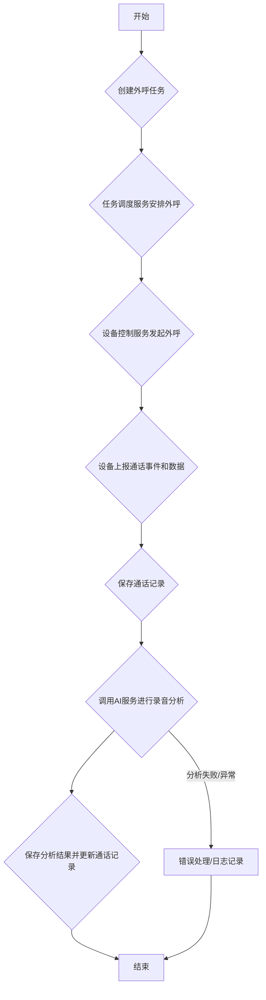

# 存客宝场景获客-电话获客功能开发文档

## 1. 模块概述

电话获客功能是存客宝平台场景获客模块的一部分，主要通过自动化外呼、电话录音分析、意向客户筛选等方式，帮助用户高效获取潜在客户。后端模块负责管理电话资源、外呼任务、通话记录、录音存储及分析结果的处理。本模块与设备控制服务和AI分析服务进行交互。

### 后端电话获客功能流程图



## 2. API接口设计 (`/api/v1/lead-generation`)

所有接口遵循 **`../前后端接口约定.md`** 定义的 RESTful 规范、请求响应格式、错误处理和认证授权机制。所有接口需要相应的权限控制，具体权限标识符根据权限设计定义（如 `lead:call:create`, `lead:call:view`, `lead:call:edit`）。

### 2.1 创建外呼任务

- **接口路径**：`/api/v1/lead-generation/call-tasks`
- **请求方法**：`POST`
- **接口说明**：创建一个电话外呼任务。
- **权限:** `lead:call:create`
- **请求参数 (Request Body):**

| 参数名          | 类型     | 是否必需 | 说明                         | 示例值                |
|-----------------|----------|----------|------------------------------|-----------------------|
| name            | string   | 是       | 任务名称                     | 新产品推广外呼任务    |
| description     | string   | 否       | 任务描述                     | 针对潜在客户进行新产品推广 |
| phoneNumbers    | array<string> | 是       | 需要外呼的电话号码列表        | `["13800000001", "13800000002"]` |
| callScript      | string   | 是       | 外呼脚本内容                 | 您好，这里是存客宝，... |
| scheduledTime   | string   | 否       | 计划执行时间 (ISO 8601格式)  | 2023-10-26T10:00:00Z   |
| callerId        | string   | 否       | 外显号码                     | 0592-XXXXXXX         |
| deviceIds       | array<integer> | 否       | 指定执行任务的设备或线路ID列表 | `[1, 2]`              |
| tags            | array<string> | 否       | 为本次获客添加标签           | `["高意向", "新客"]`     |
| source          | string   | 否       | 线索来源 (例如: "电话外呼")  | 电话外呼              |

- **响应数据 (统一格式 `data` 字段):**

```json
{
  "taskId": 101,           // 新创建任务的ID
  "name": "新产品推广外呼任务",
  "status": "SCHEDULED", // 任务状态 (SCHEDULED, RUNNING, COMPLETED, FAILED, CANCELLED)
  "createTime": "2023-10-25T15:00:00Z"
}
```
- **可能返回状态码:** 201, 400 (参数错误), 401, 403, 422 (数据验证失败), 500

### 2.2 获取外呼任务列表

- **接口路径**：`/api/v1/lead-generation/call-tasks`
- **请求方法**：`GET`
- **接口说明**：获取外呼任务列表，支持多条件查询和分页。
- **权限:** `lead:call:view` 或 `lead:call:list`
- **请求参数 (Query Parameters):**

| 参数名       | 类型    | 是否必需 | 描述                           | 示例值                       |
|-------------|--------|----------|--------------------------------|-----------------------------|
| name        | string | 否       | 任务名称关键字 (模糊匹配)      | 推广                         |
| status      | string | 否       | 任务状态 (SCHEDULED, RUNNING...) | RUNNING                     |
| startTime   | string | 否       | 创建开始时间 (ISO 8601格式)    | 2023-10-01T00:00:00Z        |
| endTime     | string | 否       | 创建结束时间 (ISO 8601格式)    | 2023-10-31T23:59:59Z        |
| page        | integer| 否       | 页码，从1开始 (默认: 1)        | 1                           |
| size        | integer| 否       | 每页条数 (默认: 10)          | 10                          |
| sort        | string | 否       | 排序字段 (如: createTime)      | createTime                  |
| order       | string | 否       | 排序方向 (asc/desc)            | desc                        |

- **响应数据 (统一格式 `data` 字段):**

```json
{
  "records": [
    {
      "taskId": 101,
      "name": "新产品推广外呼任务",
      "description": "针对潜在客户进行新产品推广",
      "status": "COMPLETED",
      "scheduledTime": "2023-10-26T10:00:00Z",
      "createTime": "2023-10-25T15:00:00Z",
      "completedTime": "2023-10-26T11:30:00Z",
      "totalCalls": 100,     // 总外呼次数
      "successfulCalls": 80, // 成功接通次数
      "intendedCustomers": 30 // 意向客户数 (根据分析结果)
      // ... 其他任务统计信息
    }
    // ... 更多任务记录
  ],
  "total": 50,            // 总记录数
  "size": 10,             // 每页大小
  "current": 1,           // 当前页码
  "pages": 5              // 总页数
}
```
- **可能返回状态码:** 200, 400, 401, 403, 500

### 2.3 获取外呼任务详情

- **接口路径**：`/api/v1/lead-generation/call-tasks/{taskId}`
- **请求方法**：`GET`
- **接口说明**：获取指定外呼任务的详情，包括任务基本信息、关联的通话记录列表等。
- **权限:** `lead:call:view`
- **请求参数 (Path Parameters):**

| 参数名 | 类型    | 是否必需 | 描述    | 示例值 |
|--------|---------|----------|---------|--------|
| taskId | integer | 是       | 任务ID  | 101    |

- **响应数据 (统一格式 `data` 字段):**

```json
{
  "taskId": 101,
  "name": "新产品推广外呼任务",
  "description": "针对潜在客户进行新产品推广",
  "status": "COMPLETED",
  "scheduledTime": "2023-10-26T10:00:00Z",
  "createTime": "2023-10-25T15:00:00Z",
  "completedTime": "2023-10-26T11:30:00Z",
  "totalCalls": 100,
  "successfulCalls": 80,
  "intendedCustomers": 30,
  "phoneNumbers": ["13800000001", "13800000002", ...], // 任务包含的电话列表
  "callScript": "您好，这里是存客宝，...",
  "callerId": "0592-XXXXXXX",
  "deviceIds": [1, 2], // 任务使用的设备列表
  "callRecords": [     // 关联的通话记录简要列表
    {
      "recordId": 201,
      "phoneNumber": "13800000001",
      "startTime": "2023-10-26T10:01:00Z",
      "duration": 60, // 秒
      "analysisStatus": "COMPLETED"
    }
    // ... 更多通话记录
  ]
}
```
- **可能返回状态码:** 200, 401, 403, 404, 500

### 2.4 获取通话记录列表

- **接口路径**：`/api/v1/lead-generation/call-records`
- **请求方法**：`GET`
- **接口说明**：获取通话记录列表，支持多条件查询、分页和按任务筛选。
- **权限:** `lead:call:view` 或 `lead:call:record:list`
- **请求参数 (Query Parameters):**

| 参数名        | 类型    | 是否必需 | 描述                     | 示例值                |
|---------------|--------|----------|--------------------------|-----------------------|
| taskId        | integer| 否       | 按任务ID过滤             | 101                   |
| phoneNumber   | string | 否       | 按电话号码过滤 (精确匹配)| 13800000001           |
| analysisStatus| string | 否       | 分析状态过滤 (PENDING...) | COMPLETED             |
| startTime     | string | 否       | 通话开始时间范围起始 (ISO 8601)| 2023-10-01T00:00:00Z |
| endTime       | string | 否       | 通话开始时间范围结束 (ISO 8601)| 2023-10-31T23:59:59Z |
| page          | integer| 否       | 页码                     | 1                     |
| size          | integer| 否       | 每页条数                 | 10                    |
| sort          | string | 否       | 排序字段                 | startTime             |
| order         | string | 否       | 排序方向                 | desc                  |

- **响应数据 (统一格式 `data` 字段):**

```json
{
  "records": [
    {
      "recordId": 201,
      "taskId": 101,
      "phoneNumber": "13800000001",
      "startTime": "2023-10-26T10:01:00Z",
      "endTime": "2023-10-26T10:02:00Z",
      "duration": 60, // 秒
      "recordingUrl": "https://example.com/recordings/abc.mp3",
      "analysisStatus": "COMPLETED", // 分析状态
      "analysisResult": { // 分析结果简要信息
          "sentiment": "POSITIVE",
          "intention": "高意向"
      }
      // ... 其他通话记录详情
    }
    // ... 更多通话记录
  ],
  "total": 80,
  "size": 10,
  "current": 1,
  "pages": 8
}
```
- **可能返回状态码:** 200, 400, 401, 403, 500

### 2.5 获取通话记录详情 (包含完整分析结果)

- **接口路径**：`/api/v1/lead-generation/call-records/{recordId}`
- **请求方法**：`GET`
- **接口说明**：获取指定通话记录的详细信息，包括完整的录音分析结果。
- **权限:** `lead:call:record:view`
- **请求参数 (Path Parameters):**

| 参数名   | 类型    | 是否必需 | 描述       | 示例值 |
|----------|---------|----------|------------|--------|
| recordId | integer | 是       | 通话记录ID | 201    |

- **响应数据 (统一格式 `data` 字段):**

```json
{
  "recordId": 201,
  "taskId": 101,
  "phoneNumber": "13800000001",
  "startTime": "2023-10-26T10:01:00Z",
  "endTime": "2023-10-26T10:02:00Z",
  "duration": 60, // 秒
  "recordingUrl": "https://example.com/recordings/abc.mp3",
  "analysisStatus": "COMPLETED",
  "analysisResult": { // 完整的分析结果
    "sentiment": "POSITIVE",        // 情感分析
    "intention": "高意向",          // 意向判断
    "keywords": ["产品", "价格", "合作"], // 关键词提取
    "summary": "用户对产品表现出高意向，询问了价格和合作方式...", // 通话摘要
    "transcription": "用户：你好，请问...\n客服：您好，..." // 通话转录文本
    // ... 其他分析维度
  }
  // ... 其他通话记录详情
}
```
- **可能返回状态码:** 200, 401, 403, 404, 500

### 2.6 获取通话录音文件

- **接口路径**：`/api/v1/lead-generation/call-records/{recordId}/recording`
- **请求方法**：`GET`
- **接口说明**：获取指定通话记录的录音文件URL或直接返回文件流。
- **权限:** `lead:call:record:download`
- **请求参数 (Path Parameters):**

| 参数名   | 类型    | 是否必需 | 描述       | 示例值 |
|----------|---------|----------|------------|--------|
| recordId | integer | 是       | 通话记录ID | 201    |

- **响应数据:** 直接返回文件流或重定向到文件URL。如果返回URL，响应格式可能如下：

```json
{
  "code": 200,
  "message": "操作成功",
  "data": {
    "recordingUrl": "https://example.com/recordings/abc.mp3?token=..." // 带有时效性签名的URL
  }
}
```
- **可能返回状态码:** 200, 401, 403, 404, 500

### 2.7 启动/停止外呼任务

- **接口路径**：`/api/v1/lead-generation/call-tasks/{taskId}/status`
- **请求方法**：`PUT`
- **接口说明**：启动或停止指定的外呼任务。
- **权限:** `lead:call:control`
- **请求参数 (Path Parameters):**

| 参数名 | 类型    | 是否必需 | 描述    | 示例值 |\
|--------|---------|----------|---------|--------|\
| taskId | integer | 是       | 任务ID  | 101    |\

- **请求参数 (Request Body):**

| 参数名 | 类型   | 是否必需 | 说明               | 示例值   |\
|--------|--------|----------|--------------------|----------|\
| action | string | 是       | 操作：`START` 或 `STOP` | START    |\

- **响应数据 (统一格式 `data` 字段):**

```json
{
  "taskId": 101,
  "status": "RUNNING" // 或 "STOPPED"
}
```
- **可能返回状态码:** 200, 400, 401, 403, 404, 500

### 2.8 取消外呼任务

- **接口路径**：`/api/v1/lead-generation/call-tasks/{taskId}/cancel`
- **请求方法**：`PUT`
- **接口说明**：取消一个外呼任务。已完成或已停止的任务无法取消。
- **权限:** `lead:call:cancel`
- **请求参数 (Path Parameters):**

| 参数名 | 类型    | 是否必需 | 描述    | 示例值 |\
|--------|---------|----------|---------|--------|\
| taskId | integer | 是       | 任务ID  | 101    |\

- **响应数据 (统一格式 `data` 字段):**

```json
{
  "taskId": 101,
  "status": "CANCELLED"
}
```
- **可能返回状态码:** 200, 400, 401, 403, 404, 409 (任务状态不允许取消), 500

## 3. 数据模型设计

### 3.1 主要数据表

| 表名                 | 说明          | 关键字段                     | 与其他表关系 |
|---------------------|--------------|-----------------------------|------------|
| t_call_task         | 外呼任务表    | id, name, status, scheduled_time |            |
| t_call_record       | 通话记录表    | id, task_id, phone_number, start_time, end_time, duration, recording_url, analysis_status | task_id -> t_call_task |
| t_call_analysis     | 通话分析结果表| id, record_id, sentiment, keywords, intention_score, summary, transcription | record_id -> t_call_record |
| t_call_task_phones  | 任务电话号码关联表 | task_id, phone_number      | task_id -> t_call_task |
| t_call_task_devices | 任务设备关联表 | task_id, device_id         | task_id -> t_call_task, device_id -> t_device (假设的设备表) |

补充了任务与电话号码和设备的关联表，以支持一个任务包含多个电话或使用多个设备。

## 4. 服务实现 (Service Implementation)

### 4.1 `CallTaskService`

负责外呼任务的生命周期管理：创建、查询、更新状态、删除。协调与设备控制服务和任务调度服务的交互。

- **关键方法:**
    - `createCallTask(CallTaskDTO dto)`: 创建任务记录，安排定时任务或立即执行。
    - `executeCallTask(Long taskId)`: 获取任务详情和关联电话/设备，调用设备控制服务发起外呼，更新任务状态。
    - `scheduleCallTask(CallTask task)`: 使用任务调度服务安排定时执行。
    - `getCallTaskList(CallTaskQuery query)`: 分页查询任务列表。
    - `getCallTaskDetail(Long taskId)`: 获取任务详情。
    - `updateCallTaskStatus(Long taskId, CallTaskStatus status)`: 更新任务状态。

### 4.2 `CallRecordService`

负责通话记录的管理：保存、查询。接收设备端上报的通话数据，触发录音分析。

- **关键方法:**
    - `saveCallRecord(CallRecordDTO dto)`: 保存通话记录，触发分析。
    - `getCallRecordList(CallRecordQuery query)`: 分页查询通话记录列表。
    - `getCallRecordDetail(Long recordId)`: 获取通话记录详情。
    - `getRecordingUrl(Long recordId)`: 获取录音文件URL。

### 4.3 `CallAnalysisService`

负责调用AI服务进行录音分析：转录、关键词提取、情感/意向判断、摘要生成。保存分析结果。

- **关键方法:**
    - `analyzeRecording(Long recordId, String recordingUrl)`: 调用AI服务进行分析，保存结果，更新通话记录分析状态。
    - `getAnalysisResult(Long recordId)`: 获取指定通话记录的分析结果。

### 4.4 `DeviceControlService` (依赖模块)

负责与实际外呼设备进行通信，执行外呼指令，上报通话事件和数据。

- **关键方法:**
    - `executeCommand(Long deviceId, DeviceCommand command)`: 向指定设备发送指令 (如 MAKE_CALL)。
    - `handleCallEvent(CallEvent event)`: 处理设备上报的通话事件 (如接通、挂断、录音上传)。

### 4.5 `TaskSchedulerService` (依赖模块)

负责管理定时任务的调度。

- **关键方法:**
    - `schedule(Runnable task, Date time)`: 安排一个一次性定时任务。
    - `cancel(Long taskId)`: 取消定时任务。

## 5. 数据验证

对所有接收到的请求参数和请求体进行严格验证，例如：

- 创建外呼任务时，校验 `name`, `phoneNumbers`, `callScript` 是否为空，`phoneNumbers` 是否为有效的电话号码列表。
- 更新任务状态时，校验 `status` 是否为有效的状态值。

使用 Spring Validation 框架结合注解实现。

## 6. 错误处理

遵循 `./前后端接口约定.md` 中的错误处理规范。捕获并处理常见的异常，例如：

- 参数校验失败 (`MethodArgumentNotValidException`) 返回 422。
- 资源未找到 (`TaskNotFoundException`, `RecordNotFoundException`) 返回 404。
- 权限不足 (`AccessDeniedException`) 返回 403。
- 业务逻辑错误（如设备不足、状态转换非法）返回 400 或特定的业务错误码。
- 系统内部错误返回 500。

## 7. 日志记录

记录关键操作日志，包括：

- 外呼任务的创建、更新、状态变更。
- 通话记录的保存、分析结果更新。
- 与设备控制服务和AI分析服务的交互日志。
- 异常日志。

日志应包含操作人、操作时间、任务/记录ID、操作结果等信息。

## 8. 性能与并发

- 对于大规模外呼任务，考虑将外呼执行逻辑放入消息队列进行异步处理，避免阻塞。
- 合理设计数据库索引，优化查询性能。
- 适当使用缓存（如 Redis）存储任务状态、设备状态等常用数据。

## 9. 安全性

- 所有接口必须进行认证授权校验。
- 对外显号码、外呼脚本等敏感信息进行适当的安全处理和访问控制。
- 录音文件存储和访问需要安全保障，例如使用带有时效性签名的URL。

---

## 10. 相关前端UI图片

为了更直观地理解后端功能在前端界面的展现，以下是电话获客功能相关的UI截图：

### 电话获客计划列表


> 本文档详细说明了存客宝后端场景获客-电话获客功能的设计与实现要点，开发时请严格遵循上述规范，确保系统功能完善和安全稳定。 