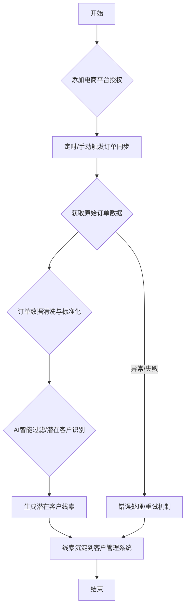

# 存客宝场景获客-订单获客功能开发文档

## 1. 模块概述

订单获客功能旨在通过对接电商平台，自动化抓取用户的订单数据，从中识别潜在的私域客户，并进行后续的触达和转化。后端模块负责电商平台的授权管理、订单数据同步、数据清洗与分析、潜在客户识别及数据存储。本模块与客户管理、线索管理和AI智能过滤服务进行交互。

### 订单获客功能流程图



## 2. API接口设计 (`/api/v1/lead-generation/orders`)

所有接口遵循 **`../前后端接口约定.md`** 定义的 RESTful 规范、请求响应格式、错误处理和认证授权机制。所有接口需要相应的权限控制，具体权限标识符根据权限设计定义（如 `lead:order:auth`, `lead:order:sync`, `lead:order:view`）。

##### 2.1 添加电商平台授权

- **接口路径**：`/api/v1/lead-generation/orders/platforms/auth`
- **请求方法**：`POST`
- **接口说明**：添加一个电商平台的授权信息（如淘宝、京东）。
- **权限:** `lead:order:auth`
- **请求参数 (Request Body):**

| 参数名          | 类型     | 是否必需 | 说明                         | 示例值                  |
|-----------------|----------|----------|------------------------------|-------------------------|
| platformType    | string   | 是       | 电商平台类型：`TAOBAO`, `JD`, `PDD`等 | `TAOBAO`                |
| authInfo        | object   | 是       | 平台授权信息，具体结构依赖平台 | `{ "appKey": "...", "appSecret": "...", "callbackUrl": "..." }` |
| redirectUrl     | string   | 否       | 授权成功后回调前端的URL      | `https://your-frontend.com/auth/callback` |

- **响应数据 (统一格式 `data` 字段):**

```json
{
  "platformId": 201,        // 新创建的平台授权记录ID
  "platformType": "TAOBAO",
  "status": "PENDING_AUTH", // 授权状态 (PENDING_AUTH, ACTIVE, EXPIRED, INVALID)
  "authUrl": "https://auth.example.com/oauth?clientId=..." // 如果需要前端跳转授权，返回授权URL
}
```
- **可能返回状态码:** 201, 400 (参数错误), 401, 403, 422 (数据验证失败), 500

##### 2.2 获取授权列表

- **接口路径**：`/api/v1/lead-generation/orders/platforms`
- **请求方法**：`GET`
- **接口说明**：获取已添加的电商平台授权列表。
- **权限:** `lead:order:view`
- **请求参数 (Query Parameters):** 支持分页、按平台类型过滤等（根据需要补充详细参数）

| 参数名       | 类型    | 是否必需 | 描述                 | 示例值 |
|-------------|--------|----------|----------------------|--------|
| platformType| string | 否       | 按平台类型过滤       | TAOBAO |
| status      | string | 否       | 按授权状态过滤       | ACTIVE |
| page        | integer| 否       | 页码                 | 1      |
| size        | integer| 否       | 每页条数             | 10     |

- **响应数据 (统一格式 `data` 字段):**

```json
{
  "records": [
    {
      "platformId": 201,
      "platformType": "TAOBAO",
      "status": "ACTIVE",
      "expiryTime": "2024-10-25T15:00:00Z",
      "createTime": "2023-10-25T15:00:00Z"
      // 授权信息（authInfo）通常不直接返回给前端，除非必要且脱敏处理
    }
    // ... 更多授权记录
  ],
  "total": 10,
  "size": 10,
  "current": 1,
  "pages": 1
}
```
- **可能返回状态码:** 200, 401, 403, 500

##### 2.3 手动触发订单同步

- **接口路径**：`/api/v1/lead-generation/orders/platforms/{platformId}/sync`
- **请求方法**：`POST`
- **接口说明**：手动触发指定电商平台的订单数据同步任务。
- **权限:** `lead:order:sync`
- **请求参数 (Path Parameters):**

| 参数名      | 类型    | 是否必需 | 描述           | 示例值 |
|-------------|---------|----------|----------------|--------|
| platformId  | integer | 是       | 电商平台授权ID | 201    |

- **请求体 (Request Body):** 通常为空或包含同步的时间范围等可选参数。

```json
{
  "startTime": "2023-10-01T00:00:00Z", // 可选：指定同步的起始时间
  "endTime": "2023-10-31T23:59:59Z"   // 可选：指定同步的结束时间
}
```
- **响应数据 (统一格式 `data` 字段):** 返回触发同步任务的结果或任务ID。

```json
{
  "syncTaskId": 301,         // 同步任务ID
  "status": "ACCEPTED"       // 任务状态：ACCEPTED, REJECTED
}
```
- **可能返回状态码:** 200, 400 (参数错误/平台状态异常), 401, 403, 404, 409 (任务已在运行), 500

##### 2.4 获取订单同步记录

- **接口路径**：`/api/v1/lead-generation/orders/sync-records`
- **请求方法**：`GET`
- **接口说明**：获取订单同步记录列表，查看同步状态和结果。
- **权限:** `lead:order:view`
- **请求参数 (Query Parameters):** 支持分页、按平台、状态、时间范围过滤。

| 参数名       | 类型    | 是否必需 | 描述                 | 示例值                       |
|-------------|--------|----------|----------------------|-----------------------------|
| platformId  | integer| 否       | 按平台授权ID过滤     | 201                         |
| status      | string | 否       | 按同步状态过滤       | COMPLETED                   |
| startTime   | string | 否       | 同步开始时间范围起始 | 2023-10-01T00:00:00Z        |
| endTime     | string | 否       | 同步开始时间范围结束 | 2023-10-31T23:59:59Z        |
| page        | integer| 否       | 页码                 | 1                           |
| size        | integer| 否       | 每页条数             | 10                          |
| sort        | string | 否       | 排序字段             | syncTime                    |
| order       | string | 否       | 排序方向             | desc                        |

- **响应数据 (统一格式 `data` 字段):**

```json
{
  "records": [
    {
      "syncId": 301,
      "platformId": 201,
      "platformType": "TAOBAO",
      "syncTime": "2023-10-26T15:00:00Z",
      "status": "COMPLETED", // 同步状态 (RUNNING, COMPLETED, FAILED, CANCELLED)
      "successCount": 100, // 成功同步订单数
      "failureCount": 5,   // 同步失败订单数
      "errorMessage": ""   // 失败原因
    }
    // ... 更多同步记录
  ],
  "total": 20,
  "size": 10,
  "current": 1,
  "pages": 2
}
```
- **可能返回状态码:** 200, 400, 401, 403, 500

##### 2.5 获取潜在客户列表（来自订单）

- **接口路径**：`/api/v1/lead-generation/orders/leads`
- **请求方法**：`GET`
- **接口说明**：获取从订单数据中识别出的潜在客户列表，支持多条件查询和分页。
- **权限:** `lead:order:view`
- **请求参数 (Query Parameters):** 支持分页、按平台、时间、客户信息、处理状态等过滤。

| 参数名        | 类型    | 是否必需 | 描述                     | 示例值                |
|---------------|--------|----------|--------------------------|-----------------------|
| platformId    | integer| 否       | 按平台授权ID过滤         | 201                   |
| orderTimeStart| string | 否       | 订单时间范围起始 (ISO 8601)| 2023-10-01T00:00:00Z |
| orderTimeEnd  | string | 否       | 订单时间范围结束 (ISO 8601)| 2023-10-31T23:59:59Z |
| contactInfo   | string | 否       | 客户联系信息关键字       | 138                   |
| processStatus | string | 否       | 处理状态 (PENDING, PROCESSED) | PENDING             |
| intentionTags | array<string> | 否 | 按意向标签过滤           | `["高意向"]`         |
| page          | integer| 否       | 页码                     | 1                     |
| size          | integer| 否       | 每页条数                 | 10                    |
| sort          | string | 否       | 排序字段                 | orderTime             |
| order         | string | 否       | 排序方向                 | desc                  |

- **响应数据 (统一格式 `data` 字段):**

```json
{
  "records": [
    {
      "leadId": 401,         // 潜在客户记录ID
      "orderId": "123456789",// 关联的电商订单ID
      "platformType": "TAOBAO",
      "orderTime": "2023-10-26T10:00:00Z",
      "contactInfo": "13800000001", // 客户联系信息 (可能已脱敏)
      "productInfo": "XX产品",     // 订单商品信息简要
      "intentionTags": ["高意向", "购买过"], // 识别出的意向标签
      "processStatus": "PENDING",  // 处理状态 (待处理, 已处理, 无效)
      "createTime": "2023-10-26T11:00:00Z"
      // ... 其他相关信息
    }
    // ... 更多潜在客户记录
  ],
  "total": 50,
  "size": 10,
  "current": 1,
  "pages": 5
}
```
- **可能返回状态码:** 200, 400, 401, 403, 500

---

## 3. 数据模型设计

##### 3.1 主要数据表

| 表名                       | 说明              | 关键字段                                         | 与其他表关系 |
|---------------------------|------------------|-------------------------------------------------|------------|
| t_ecom_platform_auth      | 电商平台授权表    | id, platform_type, auth_info (加密), status, expiry_time, last_sync_time |            |
| t_ecom_order_raw          | 电商原始订单数据表| id, platform_id, order_id (平台方), raw_data, sync_time, process_status | platform_id -> t_ecom_platform_auth |
| t_ecom_order_processed    | 电商处理后订单表  | id, platform_id, order_id (平台方), user_id (关联客户/线索), amount, order_time, product_info, contact_info (脱敏/加密) | platform_id -> t_ecom_platform_auth, user_id -> t_customer/t_lead |
| t_order_lead              | 订单潜在客户表    | id, order_id (系统生成), raw_order_id (关联原始订单), contact_info, intention_tags, process_status, create_time | raw_order_id -> t_ecom_order_raw |

补充了数据表之间的关系，并在字段说明中增加了加密/脱敏的提示。

#### 4. 服务实现 (Service Implementation)

简要说明核心服务的职责和关键方法。

##### 4.1 `EcomPlatformAuthService`

负责电商平台授权信息的管理：添加、更新、查询授权状态。处理 OAuth 流程，包括生成授权 URL，处理授权回调，刷新令牌等。负责授权信息的安全存储（加密）。

- **关键方法:**
    - `addPlatformAuth(EcomPlatformAuthDTO dto)`: 添加授权记录，生成授权URL。
    - `handleAuthCallback(CallbackDTO dto)`: 处理平台授权回调，获取并保存Access/Refresh Token，更新授权状态。
    - `refreshAccessToken(Long platformId)`: 刷新过期Access Token。
    - `getAuthList(AuthQuery query)`: 查询授权列表。
    - `getAuthDetail(Long platformId)`: 获取授权详情。
    - `updateAuthStatus(Long platformId, AuthStatus status)`: 更新授权状态。

##### 4.2 `OrderSyncService`

负责与电商平台API对接，定期或手动触发订单数据同步任务。协调与 `ApiService`、`OrderProcessingService`、`OrderSyncLogRepository` 的交互。处理同步过程中的异常和日志记录。

- **关键方法:**
    - `scheduledSyncOrders()`: 定时扫描并触发订单同步。
    - `manualSyncOrders(Long platformId, Date startTime, Date endTime)`: 手动触发指定时间范围的订单同步。
    - `syncOrdersFromPlatform(EcomPlatformAuth auth, Date startTime, Date endTime)`: 根据授权信息和时间范围调用 `ApiService` 获取订单，保存原始数据，触发处理。
    - `getSyncRecords(SyncRecordQuery query)`: 查询同步记录列表。

##### 4.3 `ApiService` (依赖或通用服务)

负责封装和适配不同电商平台的API调用细节，提供统一的接口供 `OrderSyncService` 调用。内部根据 `platformType` 调用不同的平台SDK或HTTP客户端。

- **关键方法:**
    - `callApi(String platformType, String apiMethod, Map<String, Object> params)`: 调用指定平台、方法的API，返回原始响应。
    - `getOrders(String platformType, Map<String, Object> queryParams)`: 封装获取订单列表的通用API调用。

##### 4.4 `OrderProcessingService`

负责对原始订单数据进行清洗、标准化，识别潜在客户信息，进行 AI 智能过滤，并保存到相应的表中（`t_ecom_order_processed`, `t_order_lead`）。可能需要调用客户管理或线索管理服务将潜在客户数据沉淀到主业务表中。

- **关键方法:**
    - `processRawOrders(List<EcomOrderRaw> rawOrders)`: 处理原始订单列表，进行清洗、转换、识别潜在客户。
    - `identifyLead(EcomOrderProcessed order)`: 根据订单信息识别是否为潜在客户，提取关键联系信息。
    - `applyAiFilter(OrderLead lead)`: 调用AI智能过滤服务对潜在客户进行过滤或意向判断。
    - `saveProcessedOrder(EcomOrderProcessed order)`: 保存处理后的订单数据。
    - `saveOrderLead(OrderLead lead)`: 保存潜在客户信息，并同步到客户/线索模块。

##### 4.5 `AiFilteringService` (依赖模块)

负责提供 AI 智能过滤能力，例如对客户联系方式进行有效性校验、判断潜在客户的意向程度等。

- **关键方法:**
    - `filterContactInfo(String contactInfo)`: 校验联系信息有效性。
    - `predictIntention(OrderLead lead)`: 预测潜在客户意向。

#### 5. 数据验证

对所有接收到的请求参数和请求体进行严格验证，例如：

- 添加授权时，校验 `platformType` 和 `authInfo` 的合法性。
- 手动触发同步时，校验 `platformId` 是否有效，时间范围是否合法。

使用 Spring Validation 框架结合注解实现。验证失败时，按照 `../前后端接口约定.md` 中的约定返回 422 状态码和详细的错误信息列表。

#### 6. 错误处理

遵循 `./前后端接口约定.md` 中的错误处理规范。捕获并处理常见的异常，例如：

- 参数校验失败 (`MethodArgumentNotValidException`) 返回 422。
- 电商平台授权相关的错误（如授权过期、Token 无效）返回 400 或特定业务错误码。
- 调用电商平台 API 失败返回 500 或特定业务错误码。
- 数据处理过程中的异常返回 500 或特定业务错误码。
- 权限不足 (`AccessDeniedException`) 返回 403。

#### 7. 日志记录

记录关键操作日志，包括：

- 电商平台授权的添加、更新。
- 订单同步任务的触发、状态变更、成功/失败数量。
- 订单数据处理过程中的关键步骤和异常。
- 潜在客户的识别和沉淀日志。
- 与外部服务（电商平台 API, AI 服务）的交互日志。

日志应包含操作人、操作时间、平台/任务ID、操作结果、错误信息等信息。

#### 8. 性能与并发

- 订单数据同步和处理可能涉及大量数据，考虑使用消息队列进行异步处理，避免阻塞请求。
- 电商平台 API 调用可能存在限流，需要实现相应的限流和重试机制。
- 数据库操作（批量插入原始订单、批量更新处理状态）需要进行性能优化。

#### 9. 安全性

- 电商平台授权信息（App Secret, Access Token, Refresh Token 等）必须进行加密存储。
- 传输过程中使用 HTTPS 保护敏感数据。
- 潜在客户的联系方式等敏感信息在存储和展示时需要进行脱敏处理。
- 所有接口必须进行认证授权校验。

---

## 5. 开发注意事项与扩展

> 本文档详细说明了存客宝后端场景获客-订单获客功能的设计与实现要点，开发时请严格遵循上述规范，确保系统功能完善和安全稳定。

---

## 相关前端UI图片

以下是与订单获客功能相关的部分前端UI截图，帮助理解后端功能在前端界面的展现：

### 场景获客 - 订单获客入口 (示意图)


### 订单获客 - 授权管理页面 (示意图)


### 订单获客 - 潜在客户列表 (示意图)

 