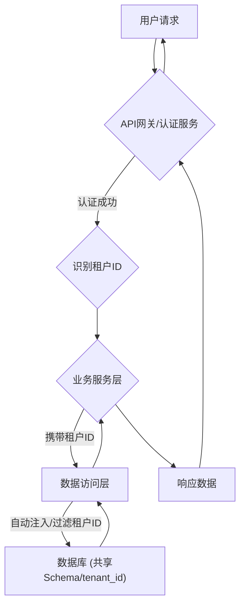

### 多租户管理模块后端开发文档

#### 模块概述

负责支持平台的多租户架构，管理租户信息，确保租户之间的数据隔离和资源分配。

#### 多租户数据隔离流程图

#### 后端技术栈

- 主要技术：Spring Boot, MyBatis-Plus (或ORM框架)
- 数据库：MySQL (支持多租户模式)

#### 核心实体与数据表

- 租户表 (tenant)
- 可能需要在其他业务表中增加租户ID字段 (tenant_id)

#### 主要API接口

*(注：多租户管理相关的核心API通常由平台管理员使用，对普通租户用户不可见)*

- GET /api/tenants: 获取租户列表
- POST /api/tenants: 创建新租户
- PUT /api/tenants/{id}: 更新租户信息
- DELETE /api/tenants/{id}: 删除租户

#### 开发注意事项

- **租户识别：** 如何在每个请求中识别当前操作属于哪个租户 (例如通过请求头、JWT Claim)。
- **数据隔离：** 实现租户数据的严格隔离。常见模式有：
    - Schema-per-tenant (每个租户一个数据库Schema)
    - Database-per-tenant (每个租户一个数据库)
    - Shared-schema, isolated-table (共享Schema，业务表含tenant_id字段，通过WHERE子句过滤)
    - *根据项目实际情况，当前采用共享Schema，业务表含tenant_id字段模式。*
- **ORM框架集成：** 配置MyBatis-Plus或其他ORM框架支持多租户字段的自动填充或过滤。
- **SQL注入风险：** 确保所有数据库操作都正确地包含了租户ID过滤条件，防止跨租户数据访问。
- **资源分配：** 管理不同租户的资源限制（如存储空间、请求频率等）。
- **租户生命周期：** 租户的创建、激活、暂停、删除流程。 

---

## 相关前端UI图片

以下是与多租户管理可能相关的部分前端UI截图，帮助理解平台管理员如何在前端界面进行租户管理：

### 系统设置 - 租户管理入口 (示意图)

### 我的页面 (通用管理入口示意)

 