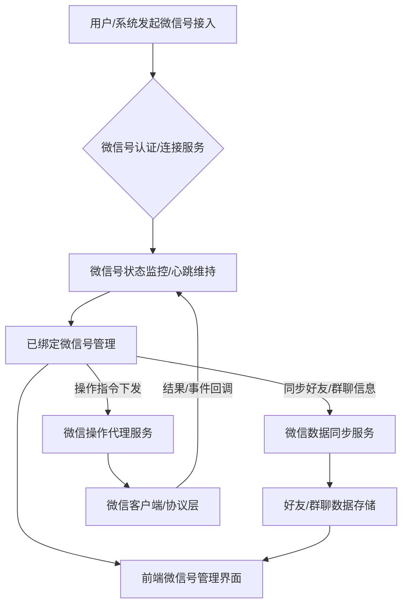

# 微信号管理模块后端开发指南

## 1. 引言与目标

### 1.1. 模块定位
本模块负责管理用户（员工/运营人员）绑定的个人微信号信息，支撑基于个人微信的客户关系管理、营销互动等业务场景。它涉及到微信号的接入、状态监控、信息同步以及与业务操作的关联。

### 微信号管理核心流程图

### 1.2. 设计目标
- **统一管理**：提供集中的微信号信息管理功能。
// ... existing code ...
## 相关前端UI图片

以下是与微信号管理模块可能相关的部分前端UI截图，帮助理解用户如何在前端界面查看和管理微信号：

### 我的 - 微信号管理入口示例 (示意图)

### 我的 - 设备管理中微信号关联示例 (示意图)

