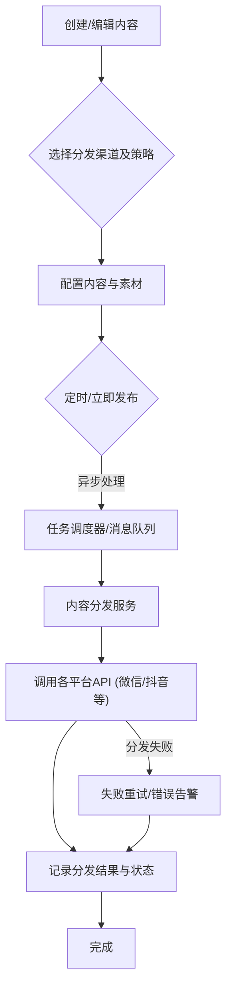

# 存客宝工作台功能实现文档

## 1. 模块概述

工作台模块是存客宝私域流量运营平台的核心操作中心，提供内容管理、社交媒体互动、自动化任务等功能，帮助运营人员高效管理私域客户资产。本模块基于Spring Boot实现，采用微服务架构设计，支持内容多平台分发、朋友圈同步、群发助手、群同步、自动点赞、自动建群、AI助手等多种功能。

### 1.1 核心功能

- 内容多平台分发管理
- 朋友圈自动同步与互动
- 群发助手与消息模板管理
- 微信群同步与管理
- 自动点赞与互动增强
- 自动建群与群管理
- AI助手内容生成与优化

## 2. 技术架构

- **核心框架**：Spring Boot 2.7.5 + Spring Cloud
- **数据访问**：MyBatis-Plus 3.5.2
- **数据库**：MySQL 8.0
- **缓存**：Redis
- **消息队列**：RocketMQ（用于异步任务处理）
- **定时任务**：Spring Task + XXL-Job
- **AI集成**：FastAPI（Python服务集成）
- **设备控制**：自研WebSocket协议

## 3. 数据模型设计

### 3.1 核心实体关系

```
内容(Content) --> 内容分发(ContentDistribution) --> 渠道(Channel)
          |
          v
素材(Material) --> 素材分类(MaterialCategory)
          |
          v
消息模板(MessageTemplate) --> 消息任务(MessageTask)
          |
          v
设备(Device) --> 设备状态(DeviceStatus)
          |
          v
群组(Group) --> 群成员(GroupMember)
```

### 3.2 主要数据表

| 表名                       | 说明                      | 关键字段                    |
|---------------------------|--------------------------|----------------------------|
| t_content                 | 内容表                    | id, title, body, type, status |
| t_content_distribution    | 内容分发表                | id, content_id, channel_id, status |
| t_material                | 素材表                    | id, name, type, url, category_id |
| t_material_category       | 素材分类表                | id, name, parent_id        |
| t_message_template        | 消息模板表                | id, name, content, variables |
| t_message_task            | 消息任务表                | id, template_id, status, scheduled_time |
| t_device                  | 设备表                    | id, name, type, status, wechat_id |
| t_group                   | 群组表                    | id, name, owner_id, member_count |
| t_group_member            | 群成员表                  | id, group_id, member_id, join_time |

### 3.3 内容多平台分发流程图



## 4. API接口设计

### 4.1 内容多平台分发接口

#### 4.1.1 创建内容

- **接口路径**：`/api/v1/contents`
- **请求方法**：`POST`
- **接口说明**：创建内容，可同时设置分发渠道
- **请求参数**：

```json
{
  "title": "七夕营销活动攻略",
  "body": "## 七夕活动方案\n1. 优惠券发放\n2. 产品套装促销\n3. 社交媒体互动话题",
  "type": "ARTICLE",
  "materials": [
    {
      "id": 1001,
      "type": "IMAGE"
    }
  ],
  "tags": ["营销", "节日", "七夕"],
  "distribution": {
    "channels": ["WECHAT_MOMENTS", "WECHAT_OFFICIAL", "DOUYIN"],
    "scheduledTime": "2023-08-15T10:00:00",
    "status": "DRAFT"
  }
}
```

- **响应结果**：

```json
{
  "code": 200,
  "msg": "success",
  "data": {
    "id": 5001,
    "title": "七夕营销活动攻略",
    "status": "DRAFT",
    "createTime": "2023-08-01T14:30:00",
    "distribution": {
      "channels": [
        {
          "id": 1,
          "name": "微信朋友圈",
          "status": "PENDING"
        },
        {
          "id": 2,
          "name": "微信公众号",
          "status": "PENDING"
        },
        {
          "id": 3,
          "name": "抖音",
          "status": "PENDING"
        }
      ],
      "scheduledTime": "2023-08-15T10:00:00"
    }
  },
  "timestamp": 1628247972123
}
```

#### 4.1.2 获取内容列表

- **接口路径**：`/api/v1/contents`
- **请求方法**：`GET`
- **接口说明**：获取内容列表，支持多条件查询和分页
- **请求参数**：

| 参数名      | 类型    | 必填 | 描述                  | 示例值           |
|------------|--------|-----|----------------------|-----------------|
| title      | string | 否  | 标题关键字            | 七夕             |
| type       | string | 否  | 内容类型              | ARTICLE         |
| status     | string | 否  | 状态                  | DRAFT/PUBLISHED |
| tag        | string | 否  | 标签                  | 营销             |
| startTime  | string | 否  | 创建开始时间          | 2023-08-01      |
| endTime    | string | 否  | 创建结束时间          | 2023-08-30      |
| page       | int    | 否  | 页码                  | 1               |
| size       | int    | 否  | 每页条数              | 10              |

#### 4.1.3 发布内容

- **接口路径**：`/api/v1/contents/{id}/publish`
- **请求方法**：`POST`
- **接口说明**：发布内容到指定渠道
- **请求参数**：

```json
{
  "channels": ["WECHAT_MOMENTS", "WECHAT_OFFICIAL"],
  "now": true
}
```

### 4.2 朋友圈同步接口

#### 4.2.1 创建朋友圈同步任务

- **接口路径**：`/api/v1/wechat/moments/tasks`
- **请求方法**：`POST`
- **接口说明**：创建朋友圈同步任务，支持定时发布
- **请求参数**：

```json
{
  "content": "七夕将至，我们推出了限时优惠活动，戳链接了解详情 👉 https://example.com/promo",
  "images": [
    {
      "materialId": 1001,
      "url": "https://example.com/images/promo1.jpg"
    },
    {
      "materialId": 1002,
      "url": "https://example.com/images/promo2.jpg"
    }
  ],
  "devices": [1, 2, 3],
  "scheduledTime": "2023-08-15T10:00:00",
  "visibleTo": "ALL",
  "autoLike": true,
  "autoComment": true,
  "commentTexts": ["太赞了！", "好漂亮！", "喜欢这个！"]
}
```

- **响应结果**：

```json
{
  "code": 200,
  "msg": "success",
  "data": {
    "taskId": 10001,
    "status": "SCHEDULED",
    "scheduledTime": "2023-08-15T10:00:00",
    "devices": [
      {
        "id": 1,
        "name": "iPhone 13",
        "status": "ONLINE"
      },
      {
        "id": 2,
        "name": "OPPO Find X5",
        "status": "ONLINE"
      },
      {
        "id": 3,
        "name": "Redmi Note 11",
        "status": "OFFLINE"
      }
    ]
  },
  "timestamp": 1628247972123
}
```

#### 4.2.2 获取朋友圈同步任务列表

- **接口路径**：`/api/v1/wechat/moments/tasks`
- **请求方法**：`GET`
- **接口说明**：获取朋友圈同步任务列表，支持多条件查询和分页
- **请求参数**：

| 参数名      | 类型    | 必填 | 描述                  | 示例值           |
|------------|--------|-----|----------------------|-----------------|
| status     | string | 否  | 任务状态              | SCHEDULED/PROCESSING/COMPLETED/FAILED |
| deviceId   | int    | 否  | 设备ID                | 1               |
| startTime  | string | 否  | 开始时间              | 2023-08-01      |
| endTime    | string | 否  | 结束时间              | 2023-08-30      |
| page       | int    | 否  | 页码                  | 1               |
| size       | int    | 否  | 每页条数              | 10              |

### 4.3 群发助手接口

#### 4.3.1 创建消息模板

- **接口路径**：`/api/v1/message/templates`
- **请求方法**：`POST`
- **接口说明**：创建消息模板，用于群发消息
- **请求参数**：

```json
{
  "name": "七夕促销通知",
  "type": "TEXT_WITH_IMAGE",
  "content": "亲爱的{nickname}，七夕将至，我们特别推出了{product}限时7折优惠，仅限3天，先到先得！详情请看图片👇",
  "variables": ["nickname", "product"],
  "materialIds": [1001, 1002]
}
```

#### 4.3.2 创建群发任务

- **接口路径**：`/api/v1/message/tasks`
- **请求方法**：`POST`
- **接口说明**：创建群发任务，支持客户分组和定时发送
- **请求参数**：

```json
{
  "templateId": 2001,
  "name": "七夕促销群发",
  "receivers": {
    "type": "TAG", // ALL/TAG/GROUP/CUSTOMERS
    "tagIds": [101, 102], // 标签：意向客户、高消费
    "groupIds": [], // 群组ID
    "customerIds": [] // 指定客户ID
  },
  "variables": {
    "product": "尊享会员"
  },
  "devices": [1, 2, 3],
  "scheduledTime": "2023-08-15T09:00:00",
  "intervalSeconds": 5, // 发送间隔，避免被封
  "batchSize": 50 // 每批发送数量
}
```

### 4.4 自动点赞与互动接口

#### 4.4.1 创建自动点赞任务

- **接口路径**：`/api/v1/wechat/interaction/like`
- **请求方法**：`POST`
- **接口说明**：创建自动点赞任务
- **请求参数**：

```json
{
  "devices": [1, 2, 3],
  "frequency": "DAILY", // ONCE/DAILY/WEEKLY
  "targetType": "ALL_CONTACTS", // ALL_CONTACTS/TAGS/GROUPS
  "tagIds": [101, 102],
  "groupIds": [],
  "maxPerDay": 20, // 每天最大点赞数量
  "timeRange": {
    "start": "09:00:00",
    "end": "21:00:00"
  },
  "active": true
}
```

### 4.5 自动建群接口

#### 4.5.1 创建建群任务

- **接口路径**：`/api/v1/wechat/group/create`
- **请求方法**：`POST`
- **接口说明**：创建自动建群任务
- **请求参数**：

```json
{
  "name": "七夕活动交流群",
  "devices": [1],
  "members": {
    "type": "TAG", // TAG/CUSTOMERS
    "tagIds": [101, 102],
    "customerIds": []
  },
  "welcome": "欢迎加入七夕活动交流群，这里会发布最新的活动信息和优惠券！",
  "scheduledTime": "2023-08-10T14:00:00",
  "maxMembers": 100
}
```

### 4.6 AI助手接口

#### 4.6.1 生成内容

- **接口路径**：`/api/v1/ai/generate/content`
- **请求方法**：`POST`
- **接口说明**：使用AI生成内容
- **请求参数**：

```json
{
  "prompt": "请生成一篇关于七夕节的营销文案，包含促销信息和感情诉求",
  "type": "ARTICLE", // ARTICLE/MOMENTS/MESSAGE
  "length": "MEDIUM", // SHORT/MEDIUM/LONG
  "tone": "WARM", // PROFESSIONAL/WARM/HUMOROUS
  "keywords": ["七夕", "促销", "礼物", "爱情"],
  "includeImage": true
}
```

- **响应结果**：

```json
{
  "code": 200,
  "msg": "success",
  "data": {
    "title": "爱的告白，从一份走心的七夕礼物开始",
    "content": "...(生成的内容)...",
    "suggestions": [
      "增加产品具体折扣信息",
      "添加促销截止日期增加紧迫感"
    ],
    "imageUrl": "https://example.com/images/ai_generated_1.jpg"
  },
  "timestamp": 1628247972123
}
```

## 5. 服务实现

### 5.1 内容分发服务

```java
@Service
@Slf4j
public class ContentDistributionServiceImpl implements ContentDistributionService {

    @Autowired
    private ContentRepository contentRepository;
    
    @Autowired
    private DistributionRepository distributionRepository;
    
    @Autowired
    private ChannelService channelService;
    
    @Autowired
    private RocketMQTemplate rocketMQTemplate;
    
    @Override
    @Transactional
    public ContentDistributionVO createDistribution(Long contentId, ContentDistributionDTO dto) {
        log.info("Creating distribution for content: {}", contentId);
        
        // 1. 验证内容是否存在
        Content content = contentRepository.findById(contentId)
                .orElseThrow(() -> new ContentNotFoundException("Content not found: " + contentId));
        
        // 2. 创建分发记录
        List<ContentDistribution> distributions = new ArrayList<>();
        
        for (String channelCode : dto.getChannels()) {
            Channel channel = channelService.getByCode(channelCode);
            
            ContentDistribution distribution = new ContentDistribution();
            distribution.setContentId(contentId);
            distribution.setChannelId(channel.getId());
            distribution.setStatus(DistributionStatus.PENDING);
            distribution.setScheduledTime(dto.getScheduledTime());
            
            distributions.add(distribution);
        }
        
        List<ContentDistribution> savedDistributions = distributionRepository.saveAll(distributions);
        
        // 3. 如果是立即发布，发送消息到队列处理
        if (dto.isPublishNow()) {
            for (ContentDistribution distribution : savedDistributions) {
                sendDistributionMessage(distribution);
            }
        }
        
        // 4. 返回结果
        return buildDistributionVO(content, savedDistributions);
    }
    
    @Override
    public void processScheduledDistributions() {
        log.info("Processing scheduled distributions");
        
        // 查找所有已到发布时间但尚未发布的分发记录
        Date now = new Date();
        List<ContentDistribution> distributions = distributionRepository
                .findByStatusAndScheduledTimeBefore(DistributionStatus.PENDING, now);
        
        for (ContentDistribution distribution : distributions) {
            sendDistributionMessage(distribution);
            
            // 更新状态为处理中
            distribution.setStatus(DistributionStatus.PROCESSING);
            distributionRepository.save(distribution);
        }
    }
    
    private void sendDistributionMessage(ContentDistribution distribution) {
        DistributionMessage message = new DistributionMessage();
        message.setDistributionId(distribution.getId());
        message.setContentId(distribution.getContentId());
        message.setChannelId(distribution.getChannelId());
        
        rocketMQTemplate.convertAndSend(
            "content-distribution-topic",
            message
        );
    }
    
    private ContentDistributionVO buildDistributionVO(Content content, List<ContentDistribution> distributions) {
        // 构建返回VO对象
    }
}
```

### 5.2 朋友圈同步服务

```java
@Service
@Slf4j
public class MomentsSyncServiceImpl implements MomentsSyncService {

    @Autowired
    private MomentsTaskRepository taskRepository;
    
    @Autowired
    private DeviceService deviceService;
    
    @Autowired
    private MaterialService materialService;
    
    @Autowired
    private RocketMQTemplate rocketMQTemplate;
    
    @Autowired
    private TaskScheduler taskScheduler;

    @Override
    @Transactional
    public MomentsTaskVO createMomentsTask(MomentsTaskDTO dto) {
        log.info("Creating moments sync task");
        
        // 1. 验证设备状态
        List<Device> devices = deviceService.getDevicesByIds(dto.getDevices());
        validateDevices(devices);
        
        // 2. 创建任务记录
        MomentsTask task = new MomentsTask();
        task.setContent(dto.getContent());
        task.setScheduledTime(dto.getScheduledTime());
        task.setVisibleTo(dto.getVisibleTo());
        task.setAutoLike(dto.isAutoLike());
        task.setAutoComment(dto.isAutoComment());
        task.setCommentTexts(String.join("|", dto.getCommentTexts()));
        task.setStatus(MomentsTaskStatus.SCHEDULED);
        
        // 3. 保存任务和关联信息
        MomentsTask savedTask = taskRepository.save(task);
        
        // 4. 保存图片关联
        saveMomentsImages(savedTask.getId(), dto.getImages());
        
        // 5. 保存设备关联
        saveMomentsDevices(savedTask.getId(), dto.getDevices());
        
        // 6. 如果是立即执行的任务，触发执行
        if (dto.getScheduledTime() == null || dto.getScheduledTime().before(new Date())) {
            executeMomentsTask(savedTask.getId());
        } else {
            // 安排定时任务
            scheduleMomentsTask(savedTask);
        }
        
        // 7. 返回结果
        return buildMomentsTaskVO(savedTask, devices);
    }
    
    @Override
    public void executeMomentsTask(Long taskId) {
        log.info("Executing moments task: {}", taskId);
        
        MomentsTask task = taskRepository.findById(taskId)
                .orElseThrow(() -> new TaskNotFoundException("Moments task not found: " + taskId));
        
        // 更新状态为处理中
        task.setStatus(MomentsTaskStatus.PROCESSING);
        taskRepository.save(task);
        
        // 获取关联设备
        List<Long> deviceIds = getMomentsTaskDevices(taskId);
        
        // 发送消息到队列处理
        MomentsExecutionMessage message = new MomentsExecutionMessage();
        message.setTaskId(taskId);
        message.setDeviceIds(deviceIds);
        
        rocketMQTemplate.convertAndSend(
            "moments-execution-topic",
            message
        );
    }
    
    private void validateDevices(List<Device> devices) {
        // 验证设备状态逻辑
    }
    
    private void saveMomentsImages(Long taskId, List<MomentsImageDTO> images) {
        // 保存图片关联逻辑
    }
    
    private void saveMomentsDevices(Long taskId, List<Long> deviceIds) {
        // 保存设备关联逻辑
    }
    
    private void scheduleMomentsTask(MomentsTask task) {
        // 安排定时任务逻辑
        taskScheduler.schedule(
            () -> executeMomentsTask(task.getId()),
            task.getScheduledTime()
        );
    }
}
```

### 5.3 设备控制服务

```java
@Service
@Slf4j
public class DeviceControlServiceImpl implements DeviceControlService {

    @Autowired
    private DeviceRepository deviceRepository;
    
    @Autowired
    private DeviceSessionRegistry sessionRegistry;
    
    @Override
    public DeviceCommandResult executeCommand(Long deviceId, DeviceCommand command) {
        log.info("Executing command {} on device {}", command.getType(), deviceId);
        
        // 1. 检查设备状态
        Device device = deviceRepository.findById(deviceId)
                .orElseThrow(() -> new DeviceNotFoundException("Device not found: " + deviceId));
                
        if (device.getStatus() != DeviceStatus.ONLINE) {
            throw new DeviceOfflineException("Device is offline: " + deviceId);
        }
        
        // 2. 获取设备会话
        DeviceSession session = sessionRegistry.getSession(deviceId);
        if (session == null) {
            throw new DeviceSessionNotFoundException("Device session not found: " + deviceId);
        }
        
        // 3. 发送命令到设备
        DeviceCommandResult result = null;
        try {
            // 构建命令
            String commandJson = buildCommandJson(command);
            
            // 发送命令
            String responseJson = session.sendCommand(commandJson);
            
            // 解析结果
            result = parseCommandResult(responseJson);
        } catch (Exception e) {
            log.error("Failed to execute command on device: " + deviceId, e);
            throw new DeviceCommandException("Command execution failed", e);
        }
        
        return result;
    }
    
    @Override
    public List<DeviceStatusVO> getDevicesStatus(List<Long> deviceIds) {
        // 获取设备状态逻辑
    }
    
    private String buildCommandJson(DeviceCommand command) {
        // 构建命令JSON
    }
    
    private DeviceCommandResult parseCommandResult(String responseJson) {
        // 解析命令结果
    }
}
```

### 5.4 AI内容生成服务

```java
@Service
@Slf4j
public class AiContentServiceImpl implements AiContentService {

    @Value("${ai.service.url}")
    private String aiServiceUrl;
    
    @Autowired
    private RestTemplate restTemplate;
    
    @Autowired
    private MaterialService materialService;

    @Override
    public AiGeneratedContentVO generateContent(AiContentGenerationDTO dto) {
        log.info("Generating AI content for prompt: {}", dto.getPrompt());
        
        // 1. 构建请求参数
        Map<String, Object> requestParams = new HashMap<>();
        requestParams.put("prompt", dto.getPrompt());
        requestParams.put("type", dto.getType().name());
        requestParams.put("length", dto.getLength().name());
        requestParams.put("tone", dto.getTone().name());
        requestParams.put("keywords", dto.getKeywords());
        requestParams.put("includeImage", dto.isIncludeImage());
        
        // 2. 调用AI服务
        AiGeneratedContentVO result = null;
        try {
            result = restTemplate.postForObject(
                aiServiceUrl + "/generate",
                requestParams,
                AiGeneratedContentVO.class
            );
        } catch (Exception e) {
            log.error("Failed to generate AI content", e);
            throw new AiServiceException("AI content generation failed", e);
        }
        
        // 3. 如果生成了图片，保存到素材库
        if (result != null && result.getImageUrl() != null) {
            saveMaterial(result);
        }
        
        return result;
    }
    
    private void saveMaterial(AiGeneratedContentVO content) {
        // 保存生成的图片到素材库
        MaterialDTO materialDTO = new MaterialDTO();
        materialDTO.setName("AI生成图片-" + System.currentTimeMillis());
        materialDTO.setType(MaterialType.IMAGE);
        materialDTO.setUrl(content.getImageUrl());
        materialDTO.setCategoryId(getAiGeneratedCategoryId());
        
        Material material = materialService.createMaterial(materialDTO);
        content.setMaterialId(material.getId());
    }
    
    private Long getAiGeneratedCategoryId() {
        // 获取或创建AI生成内容分类
    }
}
```

## 6. 定时任务

### 6.1 朋友圈同步任务

```java
@Component
@Slf4j
public class MomentsSyncScheduler {

    @Autowired
    private MomentsSyncService momentsSyncService;
    
    @Autowired
    private MomentsTaskRepository taskRepository;
    
    /**
     * 每分钟检查待执行的朋友圈同步任务
     */
    @Scheduled(cron = "0 * * * * ?")
    public void processMomentsTasks() {
        log.info("Processing scheduled moments tasks");
        
        // 查找所有已到执行时间但尚未执行的任务
        Date now = new Date();
        List<MomentsTask> tasks = taskRepository.findByStatusAndScheduledTimeBefore(
            MomentsTaskStatus.SCHEDULED, now);
        
        for (MomentsTask task : tasks) {
            try {
                momentsSyncService.executeMomentsTask(task.getId());
            } catch (Exception e) {
                log.error("Failed to execute moments task: " + task.getId(), e);
                
                // 更新任务状态为失败
                task.setStatus(MomentsTaskStatus.FAILED);
                task.setErrorMessage(e.getMessage());
                taskRepository.save(task);
            }
        }
    }
}
```

### 6.2 自动点赞任务

```java
@Component
@Slf4j
public class AutoLikeScheduler {

    @Autowired
    private AutoLikeService autoLikeService;
    
    /**
     * 每小时执行一次自动点赞任务
     */
    @Scheduled(cron = "0 0 * * * ?")
    public void processAutoLikeTasks() {
        log.info("Processing auto like tasks");
        
        try {
            autoLikeService.executeAutoLikeTasks();
        } catch (Exception e) {
            log.error("Failed to process auto like tasks", e);
        }
    }
}
```

## 7. 异常处理

### 7.1 异常类型

| 异常类                        | 错误码   | 说明                           |
|------------------------------|---------|-------------------------------|
| ContentNotFoundException     | 404     | 内容不存在                      |
| DeviceNotFoundException      | 404     | 设备不存在                      |
| DeviceOfflineException       | 400     | 设备离线                        |
| TaskExecutionException       | 500     | 任务执行失败                    |
| AiServiceException           | 503     | AI服务调用异常                  |
| MaterialNotFoundException    | 404     | 素材不存在                      |
| ContentPublishException      | 500     | 内容发布失败                    |
| RateLimitExceededException   | 429     | 超过频率限制                    |

## 8. 数据统计分析

### 8.1 内容效果统计接口

- **接口路径**：`/api/v1/statistics/content`
- **请求方法**：`GET`
- **接口说明**：获取内容发布效果统计

### 8.2 设备使用统计接口

- **接口路径**：`/api/v1/statistics/devices`
- **请求方法**：`GET`
- **接口说明**：获取设备使用情况统计

## 9. 与前端的交互流程

1. 前端创建内容或任务，通过相应接口发送到后端
2. 后端处理请求，创建数据库记录，返回任务ID和状态
3. 对于定时任务，后端安排定时执行
4. 任务执行时，后端通过消息队列分发到相应的处理服务
5. 处理服务调用设备控制接口执行具体操作
6. 前端可通过轮询或WebSocket获取任务执行状态和结果
7. 任务完成后，前端展示执行结果和统计数据

## 10. 安全与性能优化

### 10.1 安全措施

1. 所有接口必须进行JWT认证
2. 设备通信采用WebSocket + TLS加密
3. AI服务调用采用API密钥认证
4. 防止短时间内创建过多任务，实施速率限制
5. 敏感操作记录详细日志

### 10.2 性能优化

1. 使用消息队列分散任务处理压力
2. 大批量任务采用分批执行策略
3. 设备命令执行采用异步模式
4. 高频访问数据使用Redis缓存
5. 定时任务使用分布式调度器，避免单点压力 

## 相关前端UI图片

以下是与工作台功能相关的部分前端UI截图，帮助理解后端功能在前端界面的展现：

### 存客宝工作台主页


### 内容多平台分发 (流量分发) 页面


### 新建流量分发任务 - 步骤一


### 新建流量分发任务 - 步骤二


### 新建流量分发任务 - 步骤三

 