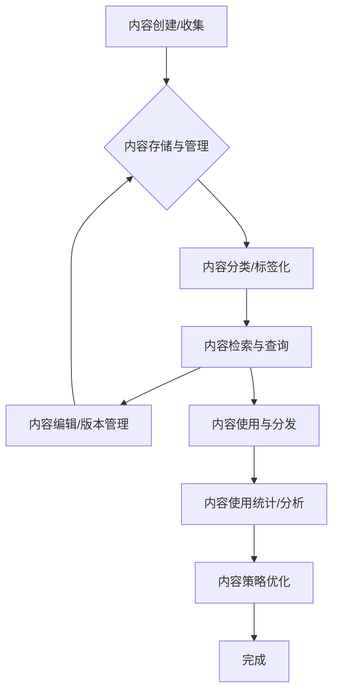

# 内容库管理模块后端开发指南

## 1. 引言与目标

### 1.1. 模块定位
本模块为应用中的核心功能之一，负责管理用户创建和收集的营销内容资源，是内容营销策略的数据基础。内容库作为知识资产的集中管理中心，支持内容的创建、分类、标签化、检索和重用，提高营销内容的管理效率和使用价值。

### 内容库管理流程图

### 1.2. 设计目标
- **集中管理**: 提供统一的内容资源库，便于内容的存储、访问和重用。
- **分类组织**: 支持通过分类、标签等多维度组织和查找内容。
- **灵活存取**: 支持多种类型内容（文章、图片、视频、链接等）的存储和管理。
- **高效检索**: 提供强大的搜索和过滤功能，快速定位所需内容。
- **版本控制**: 支持内容的版本管理，追踪内容变更历史。
- **使用分析**: 记录和分析内容的使用情况，支持数据驱动的内容策略优化。

## 2. 核心概念

- **内容资源 (Content Resource)**: 内容库中存储的基本单元，可以是文章、图片、视频、链接等多种类型。
- **内容分类 (Content Category)**: 用于组织内容的分类体系，支持树形层级结构。
- **内容标签 (Content Tag)**: 用于多维度标记内容特征的标签体系。
- **内容附件 (Content Attachment)**: 与内容关联的文件，如图片、文档、视频等。
- **内容版本 (Content Version)**: 内容的历史版本记录，支持版本对比和回滚。
- **使用统计 (Usage Statistics)**: 内容被使用（如被引用、推送、分享）的统计数据。
- **权限控制 (Access Control)**: 控制用户对内容的访问和操作权限。

## 3. 核心数据实体/模型 (Conceptual)

- **`Content` (内容资源)**
    - `contentId` (内容唯一标识)
    - `title` (标题)
    - `type` (类型：文章、图片、视频、链接等)
    - `body` (内容主体，根据类型不同存储形式可能不同)
    - `coverImageUrl` (封面图片URL，可选)
    - `status` (状态：草稿、已发布、已归档等)
    - `categoryId` (所属分类ID，可选)
    - `createdBy` (创建者ID)
    - `createdAt` (创建时间)
    - `updatedAt` (更新时间)
    - `notes` (备注，可选)

- **`ContentCategory` (内容分类)**
    - `categoryId` (分类唯一标识)
    - `name` (分类名称)
    - `createdBy` (创建者ID)
    - `createdAt` (创建时间)
    - `updatedAt` (更新时间)

- **`ContentTag` (内容标签)**
    - `tagId` (标签唯一标识)
    - `name` (标签名称)
    - `createdBy` (创建者ID)
    - `createdAt` (创建时间)

- **`ContentTagRelation` (内容-标签关联)**
    - `relationId` (关联唯一标识)
    - `contentId` (内容ID)
    - `tagId` (标签ID)

- **`ContentAttachment` (内容附件)**
    - `attachmentId` (附件唯一标识)
    - `contentId` (关联的内容ID)
    - `name` (附件名称)
    - `url` (附件URL)
    - `type` (附件类型：图片、文档、视频等)
    - `size` (附件大小，可选)
    - `uploadedAt` (上传时间)

- **`ContentVersion` (内容版本)**
    - `versionId` (版本唯一标识)
    - `contentId` (内容ID)
    - `versionData` (版本内容快照)
    - `createdBy` (创建者ID)
    - `createdAt` (创建时间)

- **`ContentUsage` (内容使用记录)**
    - `usageId` (使用记录唯一标识)
    - `contentId` (内容ID)
    - `usageType` (使用类型：推送、分配、引用等)
    - `usedBy` (使用者ID)
    - `usedAt` (使用时间)
    - `context` (使用上下文信息，可选)

## 4. 功能模块划分

### 4.1. 内容管理核心模块
- **功能**:
    - 内容的创建、查询、更新、删除操作
    - 内容状态管理（发布、归档、恢复等）
    - 内容版本管理（创建版本、版本回滚等）
- **主要接口 (Conceptual)**:
    - 内容列表查询：支持分页、搜索、筛选、排序
    - 内容详情查询
    - 内容创建/更新/删除
    - 内容状态变更
    - 内容版本管理

### 4.2. 分类与标签管理模块
- **功能**:
    - 分类的创建、查询、更新、删除操作
    - 标签的创建、查询、更新、删除操作
    - 内容与标签的关联管理
- **主要接口 (Conceptual)**:
    - 分类列表查询
    - 分类创建/更新/删除
    - 标签列表查询
    - 标签创建/更新/删除
    - 内容标签关联/解除

### 4.3. 附件管理模块
- **功能**:
    - 附件的上传、查询、删除操作
    - 附件与内容的关联管理
    - 附件存储与访问控制
- **主要接口 (Conceptual)**:
    - 附件上传
    - 附件列表查询
    - 附件删除
    - 附件与内容关联/解除

### 4.4. 批量操作模块
- **功能**:
    - 多内容批量标签管理
    - 多内容批量分类调整
    - 多内容批量状态变更
    - 批量操作任务管理与进度追踪
- **主要接口 (Conceptual)**:
    - 批量更新操作
    - 批量任务进度查询

### 4.5. 统计分析模块
- **功能**:
    - 内容使用情况统计与分析
    - 内容分布统计（按分类、标签、类型等）
    - 内容创建、使用趋势分析
- **主要接口 (Conceptual)**:
    - 内容使用统计查询
    - 内容分布统计查询
    - 内容趋势分析查询

## 5. 主要业务流程示例

### 5.1. 内容创建与管理流程
1. 用户发起内容创建请求，提供内容标题、类型、主体内容等信息。
2. 系统验证请求参数，创建内容记录。
3. 用户可选择上传附件，系统将附件与内容关联。
4. 用户可选择设置分类和标签，系统更新关联关系。
5. 用户可选择发布内容或保存为草稿，系统更新内容状态。
6. 系统记录操作日志，便于后续追踪。

### 5.2. 内容检索与使用流程
1. 用户通过搜索、筛选条件查询内容列表。
2. 系统根据条件返回匹配的内容列表（支持分页）。
3. 用户查看内容详情，系统展示内容主体、附件、标签等信息。
4. 用户使用内容（如推送、引用），系统记录使用行为。
5. 系统更新内容使用统计数据。

### 5.3. 内容批量操作流程
1. 用户选择多个内容，发起批量操作请求（如批量添加标签、批量移动分类）。
2. 系统验证请求参数，创建批量操作任务。
3. 系统异步处理批量操作任务，更新操作进度。
4. 用户可查询批量操作任务进度。
5. 批量操作完成后，系统更新相关统计数据和关联关系。
## 6. 技术考量与开发注意事项

### 6.1. 数据存储与访问
- **存储策略**: 根据内容类型和大小，选择适合的存储策略：
    - 小型文本内容可直接存入数据库
    - 大型文本内容考虑使用文本存储服务
    - 媒体文件（图片、视频等）应使用专门的文件存储服务
- **缓存策略**: 热门内容、分类列表、标签列表等可以考虑缓存，提升访问性能
- **查询优化**: 针对内容列表的复杂查询（多条件、排序、分页），需优化数据库查询性能

### 6.2. 文件处理
- **文件上传**: 支持断点续传、分片上传大文件
- **文件安全**: 上传前检查文件类型、大小，防止恶意文件上传
- **文件存储**: 考虑使用专门的对象存储服务，支持高可用和快速访问
- **文件链接**: 考虑生成带访问控制的临时链接，控制文件访问权限

### 6.3. 并发与性能
- **批量操作**: 大量内容的批量操作应采用异步处理机制，避免长时间阻塞
- **读写分离**: 考虑内容查询和内容修改的读写分离，优化性能
- **数据库索引**: 针对常用查询条件（如标题、分类、标签、创建时间等）建立适当的索引

### 6.4. 安全与权限
- **数据权限**: 确保用户只能访问和操作自己有权限的内容
- **操作审计**: 记录关键操作的日志，支持后续审计和问题追踪
- **敏感数据**: 考虑加密存储敏感内容和附件

## 7. 接口设计指导原则 (Conceptual)

### 7.1. 内容列表查询接口
- **支持多条件查询**: 标题关键词、分类、标签、类型、状态等
- **支持灵活排序**: 创建时间、更新时间、使用频率等
- **支持分页**: 页码、每页数量
- **返回数据**: 分页内容列表、总数、当前页信息

### 7.2. 内容详情查询接口
- **支持按ID查询**: 根据内容ID获取详细信息
- **返回数据**: 内容基本信息、主体内容、相关附件、标签、分类、版本历史、使用统计等

### 7.3. 内容创建/更新接口
- **必要参数**: 标题、内容类型、主体内容
- **可选参数**: 分类、标签、封面图、状态、附件等
- **返回数据**: 创建/更新成功的内容基本信息

### 7.4. 批量操作接口
- **批量更新**: 支持一次更新多个内容的共同属性（如分类、标签、状态）
- **异步处理**: 大量内容的批量操作返回任务ID，支持后续查询进度
- **返回数据**: 任务ID、任务初始状态

## 8. 数据校验与错误处理

### 8.1. 常见数据校验规则
- **内容标题**: 长度限制、禁止特殊字符
- **内容类型**: 枚举值验证（article, image, video, link等）
- **标签/分类**: 存在性验证、数量限制
- **附件**: 类型限制、大小限制、数量限制

### 8.2. 错误处理策略
- **参数错误**: 返回具体错误字段和原因，指导前端修正
- **权限错误**: 明确指出权限不足的具体原因
- **资源不存在**: 明确指出哪些请求的资源未找到
- **系统错误**: 记录详细错误日志，但对外展示友好的错误信息

## 9. 安全性考量

- **访问控制**: 根据用户角色和权限控制内容的可见性和操作权限
- **数据隔离**: 确保多租户环境下的数据严格隔离
- **输入验证**: 防止XSS、SQL注入等常见攻击
- **文件安全**: 上传文件的类型验证、病毒扫描
- **敏感操作审计**: 记录内容创建、修改、删除等关键操作日志

## 10. 可扩展性设计

- **模块解耦**: 内容管理核心与附件存储、标签管理等模块解耦，便于独立扩展
- **版本管理**: API接口版本化，支持平滑迭代
- **自定义字段**: 支持自定义内容属性字段，满足不同业务场景需求
- **事件通知**: 采用事件驱动设计，关键操作触发事件通知，便于系统间集成

## 相关前端UI图片

以下是与内容库管理模块可能相关的部分前端UI截图，帮助理解用户如何在前端界面查看和管理内容库：

### 我的 - 内容库入口示例 (示意图)

### 工作台 - 内容库相关功能入口示例 (示意图)

 