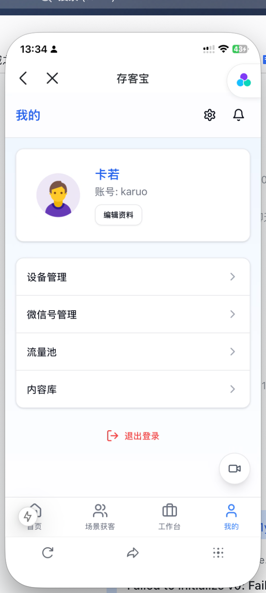

# 微信号管理模块后端开发指南

## 1. 引言与目标

### 1.1. 模块定位
本模块负责管理用户（员工/运营人员）绑定的个人微信号信息，支撑基于个人微信的客户关系管理、营销互动等业务场景。它涉及到微信号的接入、状态监控、信息同步以及与业务操作的关联。

### 微信号管理核心流程图

```mermaid
graph TD
    A[用户/系统发起微信号接入] --> B{微信号认证/连接服务};
    B --> C[微信号状态监控/心跳维持];
    C --> D[已绑定微信号管理];
    D -- 同步好友/群聊信息 --> E[微信数据同步服务];
    E --> F[好友/群聊数据存储];
    D -- 操作指令下发 --> G[微信操作代理服务];
    G --> H[微信客户端/协议层];
    H -- 结果/事件回调 --> C;
    D --> I[前端微信号管理界面];
    F --> I;
```

### 1.2. 设计目标
- **统一管理**：提供集中的微信号信息管理功能。
- **状态可见**：能够实时或准实时地监控绑定微信号的在线状态、健康状况。
- **信息同步**：支持同步微信号的基础信息（如昵称、头像）以及好友列表、群聊列表等（根据具体业务需求和技术可行性）。
- **安全隔离**：确保不同用户/员工的微信号数据隔离与安全。
- **可扩展性**：支持未来可能接入的不同微信客户端类型或版本，以及新的管理需求。

## 2. 核心概念

- **绑定微信号 (Bound WeChat Account)**: 指员工/用户授权接入系统进行管理的个人微信号。
- **微信实例 (WeChat Instance)**: 代表一个已登录并与系统建立通信的微信客户端会话。
- **账号状态 (Account Status)**: 微信号的当前状态，如：离线、登录中、在线、异常、被封禁等。
- **好友 (Contact/Friend)**: 绑定微信号的好友列表。
- **群聊 (ChatRoom/Group)**: 绑定微信号加入的群聊列表。
- **标签 (Tag)**: 为好友或群聊打上的分类标签。
- **同步策略 (Synchronization Strategy)**: 定义信息（如好友、群聊、消息）同步的频率和方式。

## 3. 核心数据实体/模型 (Conceptual)

- **`ManagedWeChatAccount` (受控微信号信息)**
    - `accountId` (系统内微信号唯一ID)
    - `userId` (关联的系统用户ID)
    - `wxid` (微信号原始ID，可选)
    - `nickname` (微信昵称)
    - `avatarUrl` (微信头像链接)
    - `loginQrCode` (当前登录二维码，如有)
    - `status` (在线状态: OFFLINE, LOGGING_IN, ONLINE, ERROR, BANNED)
    - `lastLoginTime` (最后登录时间)
    - `lastSyncTime` (信息最后同步时间)
    - `deviceInfo` (登录设备信息摘要)
    - `remarks` (备注)

- **`WeChatContact` (微信联系人/好友)**
    - `contactId` (系统内联系人唯一ID)
    - `managedAccountId` (所属受控微信号ID)
    - `wxid` (好友原始wxid)
    - `nickname` (好友昵称)
    - `alias` (好友备注名)
    - `avatarUrl` (好友头像)
    - `gender` (性别)
    - `region` (地区)
    - `tags` (标签列表)
    - `isFriend` (是否为好友关系)

- **`WeChatChatRoom` (微信群聊)**
    - `chatRoomId` (系统内群聊唯一ID)
    - `managedAccountId` (所属受控微信号ID)
    - `roomId` (群聊原始ID)
    - `topic` (群名称)
    - `avatarUrl` (群头像)
    - `ownerWxid` (群主wxid)
    - `memberCount` (群成员数量)
    - `members` (群成员列表摘要，可选，可能非常大)
    - `isMuted` (是否免打扰)

## 4. 功能模块划分

### 4.1. 微信号接入与认证模块
- **功能**:
    - 提供扫码登录、授权链接等方式接入新的个人微信号。
    - 管理登录会话，处理登录状态的回调。
    - 安全存储和管理认证凭据（如token）。
- **主要接口 (Conceptual)**:
    - `GET /wechat/accounts/login-qrcode` (获取登录二维码)
    - `POST /wechat/accounts/callback/login-status` (接收登录状态回调)

### 4.2. 微信号信息管理模块
- **功能**:
    - 查看已绑定的微信号列表及其状态。
    - 编辑微信号备注信息。
    - 解绑/删除微信号。
- **主要接口 (Conceptual)**:
    - `GET /wechat/accounts` (查询用户绑定的微信号列表)
    - `PUT /wechat/accounts/{accountId}` (更新微信号备注等)
    - `DELETE /wechat/accounts/{accountId}` (解绑微信号)

### 4.3. 状态监控与心跳模块
- **功能**:
    - 定期检测绑定微信号的在线状态。
    - 处理异常掉线和重连逻辑。
    - 提供状态变更通知。
- **内部机制**:
    - 可能依赖于微信客户端SDK或协议的心跳包。

### 4.4. 数据同步模块 (按需实现)
- **功能**:
    - 同步微信号的好友列表、群聊列表。
    - 同步好友/群聊的详细信息（昵称、头像等）。
    - (可选) 同步聊天记录（需谨慎评估隐私和合规风险）。
- **主要接口 (Conceptual)**:
    - `POST /wechat/accounts/{accountId}/sync/contacts` (手动触发联系人同步)
    - `POST /wechat/accounts/{accountId}/sync/chatrooms` (手动触发群聊同步)
- **内部机制**:
    - 定时任务或事件驱动的同步。

### 4.5. 微信操作代理模块 (支撑上层业务)
- **功能**:
    - 代表绑定的微信号执行操作，如发送消息、添加好友、邀请入群等（具体能力取决于微信客户端SDK或协议）。
    - 这些接口通常由其他业务模块（如CRM、营销自动化）调用。
- **主要接口 (Conceptual, 示例)**:
    - `POST /wechat/actions/send-message`
    - `POST /wechat/actions/add-friend`

## 5. 技术考量与开发注意事项

- **微信客户端集成方案**:
    - **基于官方SDK/API**: 如果微信官方提供针对个人号管理的开发者工具（可能性较低，通常针对公众号/企业微信）。
    - **非官方库/协议封装**: 使用第三方开源库（如Wechaty, Puppet等）或自行逆向/实现微信客户端协议。此方案存在稳定性、合规性及被封号的风险。
    - **Hook技术/Xposed模块**: 在安卓模拟器或真实设备上通过Hook方式控制微信APP。此方案技术门槛高，且同样面临风险。
    - **明确所选方案的技术栈、优缺点及潜在风险。**
- **安全性**:
    - 认证凭据的安全存储。
    - 防止未授权访问和操作。
    - 操作频率控制，避免因操作过于频繁导致账号异常。
- **稳定性与容错**:
    - 处理网络波动、微信客户端崩溃、API变更等问题。
    - 设计合理的重试机制和状态恢复机制。
- **合规性与隐私**:
    - 严格遵守微信平台的使用协议。
    - 明确告知用户数据收集和使用的范围，获取用户授权。
    - 对于好友信息、聊天记录等敏感数据，需有严格的权限控制和审计。
- **资源消耗**:
    - 每个微信实例可能会消耗一定的内存和CPU资源，需要评估服务器承载能力。
- **可维护性**:
    - 微信协议或客户端版本更新可能导致接口失效，需要预留快速迭代和修复的能力。

## 6. 数据校验与错误处理

- 对来自微信客户端的数据进行有效性校验。
- 定义清晰的错误码和错误信息，便于排查问题。
- 记录详细的操作日志和错误日志。

## 7. 安全性考量

- **账号安全**: 防止用户微信号被盗用或滥用。提醒用户开启微信自身安全设置。
- **数据安全**: 传输加密，敏感信息存储加密。
- **操作风险**: 避免执行可能被微信平台判定为违规的操作（如频繁加好友、骚扰信息等）。
- **系统访问安全**: 对管理接口进行严格的权限控制。

## 8. 演进与扩展

- 支持更多类型的微信客户端 (如不同平台的PC版、Mac版等)。
- 增强自动化交互能力 (如基于规则的自动回复)。
- 与更多业务系统集成，提供更丰富的基于个人微信的解决方案。

## 相关前端UI图片

以下是与微信号管理模块可能相关的部分前端UI截图，帮助理解用户如何在前端界面查看和管理微信号：

### 我的 - 微信号管理入口示例 (示意图)

### 我的 - 设备管理中微信号关联示例 (示意图)

 