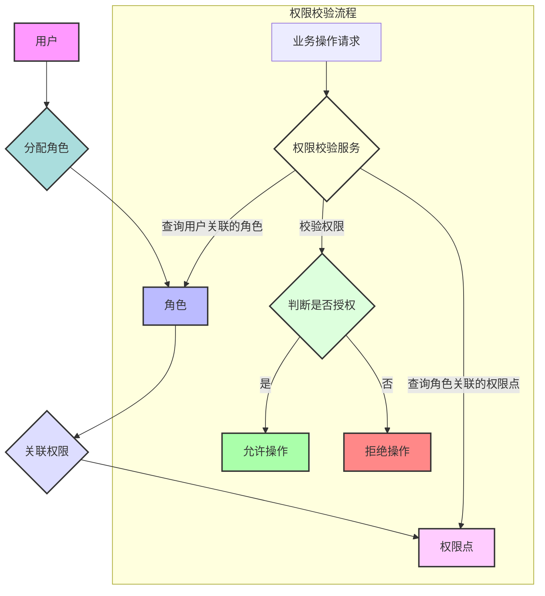

# 存客宝权限管理模块后端开发文档

## 1. 模块概述

权限管理模块负责构建和维护系统内部的访问控制体系，确保用户只能执行其被授权的操作和访问其被允许的数据。本系统采用基于角色的访问控制 (RBAC) 模型，通过将权限赋予角色，再将角色分配给用户来实现权限管理。

模块功能包括：权限点定义、角色管理、角色与权限的关联、用户与角色的关联、以及提供权限校验服务供其他模块调用。

### 权限管理流程图 (RBAC模型)



## 2. API接口设计

### 2.1 获取所有权限点列表

- **接口路径**：`/api/v1/permissions`
- **请求方法**：`GET`
- **接口说明**：获取系统中所有已定义的权限点列表。通常用于前端展示权限树或权限选择。
- **权限:** `permission:view` 或 `permission:list`
- **请求参数 (Query Parameters):**

| 参数名 | 类型    | 是否必需 | 描述         | 示例值 |
|--------|--------|----------|--------------|--------|
| name   | string | 否       | 权限点名称关键字 | 用户管理 |
| code   | string | 否       | 权限点编码关键字 | user:view |
| page   | integer| 否       | 页码         | 1      |
| size   | integer| 否       | 每页条数     | 10     |

- **响应数据 (统一格式 `data` 字段):** 返回权限点列表（支持分页）。

```json
{
  "records": [
    {
      "permissionId": 1,
      "name": "用户列表查看",
      "code": "user:view", // 权限点唯一编码，用于后端校验
      "resource": "用户管理", // 关联的资源名称 (可选)
      "description": "查看用户列表数据",
      "createTime": "2023-10-26T10:00:00Z"
    }
    // ... 更多权限点
  ],
  "total": 50,
  "size": 10,
  "current": 1,
  "pages": 5
}
```
- **可能返回状态码:** 200 (成功), 400, 401, 403, 500

### 2.2 创建权限点

- **接口路径**：`/api/v1/permissions`
- **请求方法**：`POST`
- **接口说明**：创建一个新的权限点。
- **权限:** `permission:create`
- **请求参数 (Request Body):**

| 参数名      | 类型   | 是否必需 | 描述         | 示例值 |
|-------------|--------|----------|--------------|--------|
| name        | string | 是       | 权限点名称   | 用户删除 |
| code        | string | 是       | 权限点唯一编码 | user:delete |
| resource    | string | 否       | 关联的资源名称 | 用户管理 |
| description | string | 否       | 权限点描述   | 删除用户记录 |

- **响应数据 (统一格式 `data` 字段):** 返回新创建的权限点信息。

```json
{
  "permissionId": 2,
  "name": "用户删除",
  "code": "user:delete",
  "createTime": "2023-10-26T10:05:00Z"
}
```
- **可能返回状态码:** 201 (创建成功), 400 (参数错误/编码重复), 401, 403, 422 (数据校验失败), 500

### 2.3 更新权限点

- **接口路径**：`/api/v1/permissions/{permissionId}`
- **请求方法**：`PUT`
- **接口说明**：更新指定权限点的信息。
- **权限:** `permission:update`
- **请求参数 (Path Parameters):**

| 参数名       | 类型    | 是否必需 | 说明         | 示例值 |
|--------------|--------|----------|--------------|--------|
| permissionId | integer | 是       | 权限点ID     | 1      |

- **请求体 (Request Body):** 结构与创建权限点类似，可以只包含需要更新的字段。

- **响应数据 (统一格式 `data` 字段):** 返回更新后的权限点信息。

```json
{
  "permissionId": 1,
  "name": "用户列表查看 (更新)",
  "updateTime": "2023-10-26T10:10:00Z"
}
```
- **可能返回状态码:** 200 (更新成功), 400, 401, 403, 404 (权限点不存在), 422, 500

### 2.4 删除权限点

- **接口路径**：`/api/v1/permissions/{permissionId}`
- **请求方法**：`DELETE`
- **接口说明**：删除指定权限点。如果该权限点已与角色关联，则不允许删除或需要先解除关联。
- **权限:** `permission:delete`
- **请求参数 (Path Parameters):**

| 参数名       | 类型    | 是否必需 | 说明         | 示例值 |
|--------------|--------|----------|--------------|--------|
| permissionId | integer | 是       | 权限点ID     | 2      |

- **响应数据 (统一格式 `data` 字段):** 返回成功信息。

```json
{
  "message": "权限点删除成功"
}
```
- **可能返回状态码:** 200, 401, 403, 404, 409 (已关联角色), 500

### 2.5 获取角色列表

- **接口路径**：`/api/v1/roles`
- **请求方法**：`GET`
- **接口说明**：获取系统中所有角色列表。支持分页和筛选。
- **权限:** `role:view` 或 `role:list`
- **请求参数 (Query Parameters):**

| 参数名 | 类型    | 是否必需 | 描述       | 示例值 |
|--------|--------|----------|------------|--------|
| name   | string | 否       | 角色名称关键字 | 管理员 |
| page   | integer| 否       | 页码       | 1      |
| size   | integer| 否       | 每页条数   | 10     |

- **响应数据 (统一格式 `data` 字段):** 返回角色列表（支持分页）。

```json
{
  "records": [
    {
      "roleId": 101,
      "name": "系统管理员",
      "code": "ROLE_ADMIN", // 角色唯一编码，通常以 ROLE_ 开头
      "description": "拥有系统最高权限",
      "createTime": "2023-10-26T10:20:00Z"
    }
    // ... 更多角色
  ],
  "total": 5,
  "size": 10,
  "current": 1,
  "pages": 1
}
```
- **可能返回状态码:** 200, 400, 401, 403, 500

### 2.6 创建新角色

- **接口路径**：`/api/v1/roles`
- **请求方法**：`POST`
- **接口说明**：创建一个新的角色。
- **权限:** `role:create`
- **请求参数 (Request Body):**

| 参数名      | 类型   | 是否必需 | 描述         | 示例值 |
|-------------|--------|----------|--------------|--------|
| name        | string | 是       | 角色名称     | 运营专员 |
| code        | string | 是       | 角色唯一编码 | ROLE_OPERATOR |
| description | string | 否       | 角色描述     | 负责日常运营工作 |

- **响应数据 (统一格式 `data` 字段):** 返回新创建的角色信息。

```json
{
  "roleId": 102,
  "name": "运营专员",
  "code": "ROLE_OPERATOR",
  "createTime": "2023-10-26T10:25:00Z"
}
```
- **可能返回状态码:** 201, 400 (参数错误/编码重复), 401, 403, 422, 500

### 2.7 更新角色信息

- **接口路径**：`/api/v1/roles/{roleId}`
- **请求方法**：`PUT`
- **接口说明**：更新指定角色的信息。
- **权限:** `role:update`
- **请求参数 (Path Parameters):**

| 参数名 | 类型    | 是否必需 | 说明   | 示例值 |
|--------|--------|----------|--------|--------|
| roleId | integer | 是       | 角色ID | 101    |

- **请求体 (Request Body):** 结构与创建角色类似，可以只包含需要更新的字段。

- **响应数据 (统一格式 `data` 字段):** 返回更新后的角色信息。

```json
{
  "roleId": 101,
  "name": "超级管理员",
  "updateTime": "2023-10-26T10:30:00Z"
}
```
- **可能返回状态码:** 200, 400, 401, 403, 404 (角色不存在), 422, 500

### 2.8 删除角色

- **接口路径**：`/api/v1/roles/{roleId}`
- **请求方法**：`DELETE`
- **接口说明**：删除指定角色。如果该角色已分配给用户或已关联权限点，则不允许删除或需要先解除关联。
- **权限:** `role:delete`
- **请求参数 (Path Parameters):**

| 参数名 | 类型    | 是否必需 | 说明   | 示例值 |
|--------|--------|----------|--------|--------|
| roleId | integer | 是       | 角色ID | 102    |

- **响应数据 (统一格式 `data` 字段):** 返回成功信息。

```json
{
  "message": "角色删除成功"
}
```
- **可能返回状态码:** 200, 401, 403, 404, 409 (已分配用户或关联权限), 500

### 2.9 获取角色关联的权限点列表

- **接口路径**：`/api/v1/roles/{roleId}/permissions`
- **请求方法**：`GET`
- **接口说明**：获取指定角色当前关联的所有权限点列表。
- **权限:** `role:permission:view`
- **请求参数 (Path Parameters):**

| 参数名 | 类型    | 是否必需 | 说明   | 示例值 |
|--------|--------|----------|--------|--------|
| roleId | integer | 是       | 角色ID | 101    |

- **响应数据 (统一格式 `data` 字段):** 返回该角色关联的权限点列表。

```json
[
  {
    "permissionId": 1,
    "name": "用户列表查看",
    "code": "user:view"
  },
  {
    "permissionId": 3,
    "name": "用户创建",
    "code": "user:create"
  }
  // ... 更多权限点
]
```
- **可能返回状态码:** 200, 401, 403, 404, 500

### 2.10 为角色分配权限点

- **接口路径**：`/api/v1/roles/{roleId}/permissions`
- **请求方法**：`POST`
- **接口说明**：为指定角色批量分配权限点。通常是全量更新，即提交该角色应拥有的所有权限点ID。
- **权限:** `role:permission:assign`
- **请求参数 (Path Parameters):**

| 参数名 | 类型    | 是否必需 | 说明   | 示例值 |
|--------|--------|----------|--------|--------|
| roleId | integer | 是       | 角色ID | 101    |

- **请求体 (Request Body):**

| 参数名         | 类型           | 是否必需 | 描述             | 示例值     |
|----------------|----------------|----------|------------------|------------|
| permissionIds  | array<integer> | 是       | 要分配的权限点ID列表 | `[1, 3, 5]` |

- **响应数据 (统一格式 `data` 字段):** 返回更新后的角色关联权限信息或成功信息。

```json
{
  "message": "角色权限分配成功",
  "roleId": 101,
  "assignedPermissionIds": [1, 3, 5] // 返回实际关联的权限ID列表
}
```
- **可能返回状态码:** 200, 400, 401, 403, 404, 422, 500

### 2.11 获取用户关联的角色列表

- **接口路径**：`/api/v1/users/{userId}/roles`
- **请求方法**：`GET`
- **接口说明**：获取指定用户当前关联的所有角色列表。
- **权限:** `user:role:view`
- **请求参数 (Path Parameters):**

| 参数名 | 类型    | 是否必需 | 说明   | 示例值 |
|--------|--------|----------|--------|--------|
| userId | integer | 是       | 用户ID | 1001   |

- **响应数据 (统一格式 `data` 字段):** 返回该用户关联的角色列表。

```json
[
  {
    "roleId": 101,
    "name": "系统管理员",
    "code": "ROLE_ADMIN"
  },
  {
    "roleId": 103,
    "name": "产品经理",
    "code": "ROLE_PRODUCT_MANAGER"
  }
  // ... 更多角色
]
```
- **可能返回状态码:** 200, 401, 403, 404, 500

### 2.12 为用户分配角色

- **接口路径**：`/api/v1/users/{userId}/roles`
- **请求方法**：`POST`
- **接口说明**：为指定用户批量分配角色。通常是全量更新，即提交该用户应拥有的所有角色ID。
- **权限:** `user:role:assign`
- **请求参数 (Path Parameters):**

| 参数名 | 类型    | 是否必需 | 说明   | 示例值 |
|--------|--------|----------|--------|--------|
| userId | integer | 是       | 用户ID | 1001   |

- **请求体 (Request Body):**

| 参数名   | 类型           | 是否必需 | 描述         | 示例值     |
|----------|----------------|----------|--------------|------------|
| roleIds  | array<integer> | 是       | 要分配的角色ID列表 | `[101, 103]` |

- **响应数据 (统一格式 `data` 字段):** 返回更新后的用户关联角色信息或成功信息。

```json
{
  "message": "用户角色分配成功",
  "userId": 1001,
  "assignedRoleIds": [101, 103] // 返回实际关联的角色ID列表
}
```
- **可能返回状态码:** 200, 400, 401, 403, 404, 422, 500

## 3. 数据模型设计

基于角色的访问控制 (RBAC) 模型涉及权限点、角色以及它们与用户的关联。

### 3.1 权限点表 `t_permission`

用于定义系统中的各种操作权限点。

| 字段名        | 类型         | 是否必需 | 说明                                   | 索引        |
|--------------|--------------|----------|----------------------------------------|------------|
| id           | BIGINT (PK)  | 是       | 主键                                   |            |
| name         | VARCHAR(100) | 是       | 权限点名称 (如 "用户列表查看")             | Index      |
| code         | VARCHAR(100) | 是       | 权限点唯一编码 (如 "user:view")，用于后端校验 | UNIQUE Index |
| resource     | VARCHAR(100) | 否       | 关联的资源名称 (如 "用户管理")，用于界面分组展示 | Index      |
| description  | VARCHAR(500) | 否       | 权限点描述                             |            |
| create_time  | DATETIME     | 是       | 创建时间                               |            |
| update_time  | DATETIME     | 是       | 更新时间                               |            |

### 3.2 角色表 `t_role`

用于定义系统中的各种角色。

| 字段名        | 类型         | 是否必需 | 说明                       | 索引        |
|--------------|--------------|----------|----------------------------|------------|
| id           | BIGINT (PK)  | 是       | 主键                       |            |
| name         | VARCHAR(100) | 是       | 角色名称 (如 "系统管理员")       | Index      |
| code         | VARCHAR(100) | 是       | 角色唯一编码 (如 "ROLE_ADMIN") | UNIQUE Index |
| description  | VARCHAR(500) | 否       | 角色描述                   |            |
| create_time  | DATETIME     | 是       | 创建时间                   |            |
| update_time  | DATETIME     | 是       | 更新时间                   |            |

### 3.3 角色权限关联表 `t_role_permission`

关联角色和权限点，表示某个角色拥有哪些权限。

| 字段名        | 类型         | 是否必需 | 说明         | 索引        | 与其他表关系              |
|--------------|--------------|----------|--------------|------------|--------------------------|
| id           | BIGINT (PK)  | 是       | 主键         |            |                          |
| role_id      | BIGINT (FK)  | 是       | 角色ID       | Index      | role_id -> t_role.id     |
| permission_id| BIGINT (FK)  | 是       | 权限点ID     | Index      | permission_id -> t_permission.id |
| create_time  | DATETIME     | 是       | 创建时间     |            |                          |

**注意:** `role_id` 和 `permission_id` 的组合应是唯一的，防止重复关联。

### 3.4 用户角色关联表 `t_user_role`

关联用户和角色，表示某个用户拥有哪些角色。

| 字段名        | 类型         | 是否必需 | 说明     | 索引        | 与其他表关系           |
|--------------|--------------|----------|----------|------------|-----------------------|
| id           | BIGINT (PK)  | 是       | 主键     |            |                       |
| user_id      | BIGINT (FK)  | 是       | 用户ID   | Index      | user_id -> t_user.id  |
| role_id      | BIGINT (FK)  | 是       | 角色ID   | Index      | role_id -> t_role.id |
| create_time  | DATETIME     | 是       | 创建时间 |            |                       |

**注意:** `user_id` 和 `role_id` 的组合应是唯一的，防止重复分配。

## 4. 异常处理

- `PermissionNotFoundException`: 权限点不存在异常
- `RoleNotFoundException`: 角色不存在异常
- `UserNotFoundException`: 用户不存在异常
- `PermissionAlreadyExistsException`: 权限点编码已存在异常
- `RoleAlreadyExistsException`: 角色编码已存在异常
- `RoleInUseException`: 角色已分配给用户或关联权限，无法删除异常
- `PermissionInUseException`: 权限点已关联角色，无法删除异常
- `PermissionAssignmentException`: 权限分配异常
- `RoleAssignmentException`: 角色分配异常

## 5. 开发注意事项和实现要点

1.  **RBAC模型实现:**
    - 核心在于维护 `t_role_permission` 和 `t_user_role` 两张关联表。
    - 在代码层面，实现 RoleService, PermissionService, UserRoleService, RolePermissionService 等服务类来管理权限点、角色和它们之间的关联关系。
2.  **权限校验集成:**
    - 将权限校验逻辑集成到 Spring Security 或类似的 AOP (面向切面编程) 框架中。
    - 在需要进行权限控制的 API 接口或方法上使用注解 (如 `@PreAuthorize("hasAuthority('user:view')")`) 来声明所需的权限。
    - 实现自定义的权限评估器，根据当前登录用户的角色和角色权限关联表来判断用户是否拥有某个权限。
3.  **用户权限信息加载和缓存:**
    - 用户登录成功后，需要加载该用户拥有的所有角色，并通过角色关联查询其拥有的所有权限点。
    - 将用户的角色和权限信息缓存起来 (如使用 Redis)，以提高后续权限校验的效率，避免每次请求都查询数据库。
    - 考虑缓存的过期时间和更新策略（例如，角色或权限更新后，需要清除相关用户的缓存）。
4.  **数据验证:**
    - 对创建和更新权限点、角色、分配关联关系的请求参数进行严格验证，如名称、编码的格式和唯一性，关联ID的有效性等。
    - 使用 Spring Validation 框架结合注解进行声明式验证。验证失败时，按照 `./前后端接口约定.md` 中的约定返回 422 状态码和详细的错误信息列表。
5.  **错误处理:**
    - 遵循 `./前后端接口约定.md` 中的错误处理规范。
    - 捕获并处理权限点/角色不存在、编码重复、关联关系错误、权限不足等异常，返回统一的错误响应格式。
6.  **日志记录:**
    - 记录所有权限管理相关的操作日志，包括权限点和角色的增删改、角色权限分配、用户角色分配等。
    - 日志应包含操作人、操作时间、操作类型、操作对象（如权限点ID、角色ID、用户ID）、操作结果等信息。
    - 记录权限校验失败的日志，便于安全审计。
7.  **数据权限 (扩展):**
    - 当前 RBAC 模型主要控制功能权限。如果需要实现数据权限（例如，某个用户只能看到自己创建的数据），需要在业务代码中结合用户与数据的关联关系进行额外的过滤或使用更复杂的权限模型 (如 ABAC)。
8.  **接口设计:**
    - 获取权限点和角色列表的接口应支持分页、筛选和排序。
    - 为角色或用户分配权限/角色的接口可以设计为全量更新，或者提供增量更新的接口。
9.  **初始化数据:**
    - 系统启动时，需要初始化一些基础权限点和角色（如超级管理员角色和基本权限），以及将初始管理员用户与超级管理员角色关联。

## 相关前端UI图片

以下是与权限管理模块可能相关的部分前端UI截图，帮助理解用户或管理员如何在前端界面查看和管理权限：

### 首页 - 登录后权限控制示例 (示意图)


### 我的 - 角色/权限相关入口示例 (示意图)


### 系统设置 - 权限管理入口示例 (示意图)


--- 