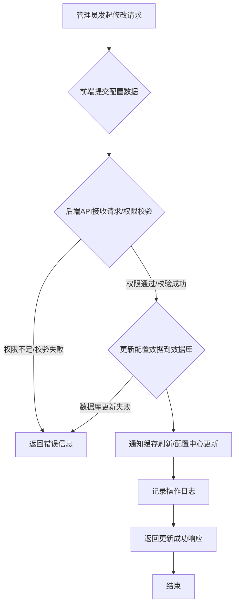

# 存客宝系统设置模块后端开发文档

## 1. 模块概述

系统设置模块负责管理平台的全局配置和各项设置，为系统功能的正常运行提供基础配置。这些设置可能影响用户体验、业务流程、第三方服务对接等方面。通过此模块，管理员可以方便地查看和修改系统级配置，而无需修改代码。

模块功能包括但不限于：系统基础参数、通知配置、第三方服务（如短信、邮件、对象存储、支付接口）配置、功能开关等。

### 系统设置更新流程图



## 2. API接口设计

### 2.1 获取所有系统设置

- **接口路径**：`/api/v1/settings`
- **请求方法**：`GET`
- **接口说明**：获取系统所有的配置项列表。此接口通常仅供管理员使用。
- **权限:** `system:settings:view`
- **请求参数 (Query Parameters):**

| 参数名 | 类型    | 是否必需 | 描述         | 示例值 |
|--------|--------|----------|--------------|--------|
| group  | string | 否       | 按配置分组过滤 | notification |

- **响应数据 (统一格式 `data`字段):** 返回系统配置项列表，敏感信息应已脱敏。

```json
[
  {
    "key": "site.name",
    "value": "存客宝",
    "group": "basic",
    "description": "网站名称",
    "valueType": "string"
  },
  {
    "key": "notification.sms.enabled",
    "value": "true",
    "group": "notification",
    "description": "短信通知是否开启",
    "valueType": "boolean"
  },
   {
    "key": "thirdparty.oss.endpoint",
    "value": "oss-cn-hangzhou.aliyuncs.com", // 敏感信息可能需要脱敏
    "group": "thirdparty",
    "description": "对象存储服务Endpoint",
    "valueType": "string"
  }
  // ... 更多配置项
]
```
- **可能返回状态码:** 200 (成功), 401, 403, 500

### 2.2 获取特定系统设置

- **接口路径**：`/api/v1/settings/{key}`
- **请求方法**：`GET`
- **接口说明**：根据配置项的 key 获取其详细信息和值。此接口通常仅供管理员使用，敏感信息应已脱敏。
- **权限:** `system:settings:view`
- **请求参数 (Path Parameters):**

| 参数名 | 类型   | 是否必需 | 说明           | 示例值 |
|--------|--------|----------|----------------|--------|
| key    | string | 是       | 配置项的唯一键 | site.name |

- **响应数据 (统一格式 `data`字段):** 返回单个配置项的详细信息。

```json
{
  "key": "site.name",
  "value": "存客宝",
  "group": "basic",
  "description": "网站名称",
  "valueType": "string",
  "isSensitive": false // 是否敏感信息
  // ... 其他元信息
}
```
- **可能返回状态码:** 200 (成功), 401, 403, 404 (配置项不存在), 500

### 2.3 更新特定系统设置

- **接口路径**：`/api/v1/settings/{key}`
- **请求方法**：`PUT`
- **接口说明**：更新指定配置项的值。此接口仅供管理员使用。
- **权限:** `system:settings:update`
- **请求参数 (Path Parameters):**

| 参数名 | 类型   | 是否必需 | 说明           | 示例值 |
|--------|--------|----------|----------------|--------|
| key    | string | 是       | 配置项的唯一键 | site.name |

- **请求体 (Request Body):**

| 参数名 | 类型    | 是否必需 | 描述     | 示例值 |
|--------|--------|----------|----------|--------|
| value  | string | 是       | 新的配置值 | 存客宝私域系统 |

- **响应数据 (统一格式 `data`字段):** 返回更新后的配置项信息（通常包含 key, value, updateTime等）。

```json
{
  "key": "site.name",
  "value": "存客宝私域系统",
  "updateTime": "2023-10-26T16:00:00Z"
  // ... 其他更新后的字段
}
```
- **可能返回状态码:** 200 (更新成功), 400 (参数错误/值格式不匹配), 401, 403, 404, 422 (数据校验失败), 500

## 3. 数据模型设计

系统配置信息存储在一张专门的配置表中。

### 3.1 系统配置表 `t_system_config`

| 字段名        | 类型         | 是否必需 | 说明                                   | 索引        |
|--------------|--------------|----------|----------------------------------------|------------|
| id           | BIGINT (PK)  | 是       | 主键                                   |            |
| `key`        | VARCHAR(255) | 是       | 配置项的唯一键 (如 `site.name`)          | UNIQUE Index |
| `value`      | TEXT         | 是       | 配置项的值。使用 TEXT 类型以便存储较长值。 |            |
| `group`      | VARCHAR(50)  | 否       | 配置项所属分组 (如 `basic`, `notification`) | Index      |
| description  | VARCHAR(500) | 否       | 配置项描述                             |            |
| value_type   | VARCHAR(20)  | 是       | 值的类型 (string, int, boolean, json)    |            |
| is_sensitive | BOOLEAN      | 是       | 是否敏感信息，需要加密存储和脱敏展示     |            |
| create_time  | DATETIME     | 是       | 创建时间                               |            |
| update_time  | DATETIME     | 是       | 更新时间                               |            |

**注意:** `value` 字段的数据类型应根据 `value_type` 进行解析和转换。敏感信息 (`is_sensitive = true`) 在存储时需要加密，在查询返回给前端时需要脱敏处理（例如返回 `********`）。

## 4. 异常处理

- `SettingNotFoundException`: 配置项不存在异常
- `InvalidSettingValueException`: 配置值格式或类型不匹配异常
- `SystemSettingUpdateException`: 系统设置更新失败异常
- `SensitiveDataEncryptionException`: 敏感数据加密解密异常

## 5. 开发注意事项和实现要点

1.  **配置读取和缓存:**
    - 系统在启动时应加载所有配置项到内存中，并使用缓存机制（如 Redis 或本地缓存）提高读取效率。
    - 配置更新后，需要通知缓存进行刷新，确保获取到最新的配置值。
2.  **敏感信息处理:**
    - 对于标记为敏感的信息（如第三方服务密钥、密码等），在存入数据库前必须进行加密。
    - 在从数据库读取并返回给前端时，必须进行脱敏处理，避免泄露敏感信息。
    - 加密密钥需要妥善管理，不能与应用代码一起存储，可以考虑使用密钥管理服务。
3.  **数据验证:**
    - 在更新配置项时，需要根据 `value_type` 对提交的值进行严格的格式和类型验证。
    - 使用 Spring Validation 框架结合注解进行声明式验证。验证失败时，按照 `./前后端接口约定.md` 中的约定返回 422 状态码和详细的错误信息列表。
4.  **权限控制:**
    - 系统设置模块的接口应只对具有特定管理员权限的用户开放。
    - 使用 Spring Security 或类似的权限框架进行接口级别的权限校验。
5.  **错误处理:**
    - 遵循 `./前后端接口约定.md` 中的错误处理规范。
    - 捕获并处理配置项不存在、值格式错误、权限不足等异常，返回统一的错误响应格式。
6.  **日志记录:**
    - 记录所有系统设置的修改操作日志，包括操作人、修改时间、修改前后的值（敏感信息脱敏）。
    - 记录配置读取异常、缓存刷新异常、敏感数据处理异常等日志。
7.  **配置项管理:**
    - 考虑提供配置项的元信息管理，如配置项的类型、默认值、取值范围、是否必需、描述等，方便前端界面生成和后端校验。
    - 如果配置项较多且变动频繁，可以考虑引入外部配置中心（如 Nacos, Apollo）来集中管理和动态刷新配置。
8.  **事务管理:**
    - 配置项的更新操作涉及数据库写入，需要使用 `@Transactional` 注解或其他方式确保操作的原子性。
9.  **版本控制 (可选):**
    - 对于重要的配置项，可以考虑记录配置值的历史版本，以便回溯。

---

## 相关前端UI图片

以下是与系统设置模块相关的部分前端UI截图，帮助理解后端功能在前端界面的展现：

### 系统设置页面


--- 