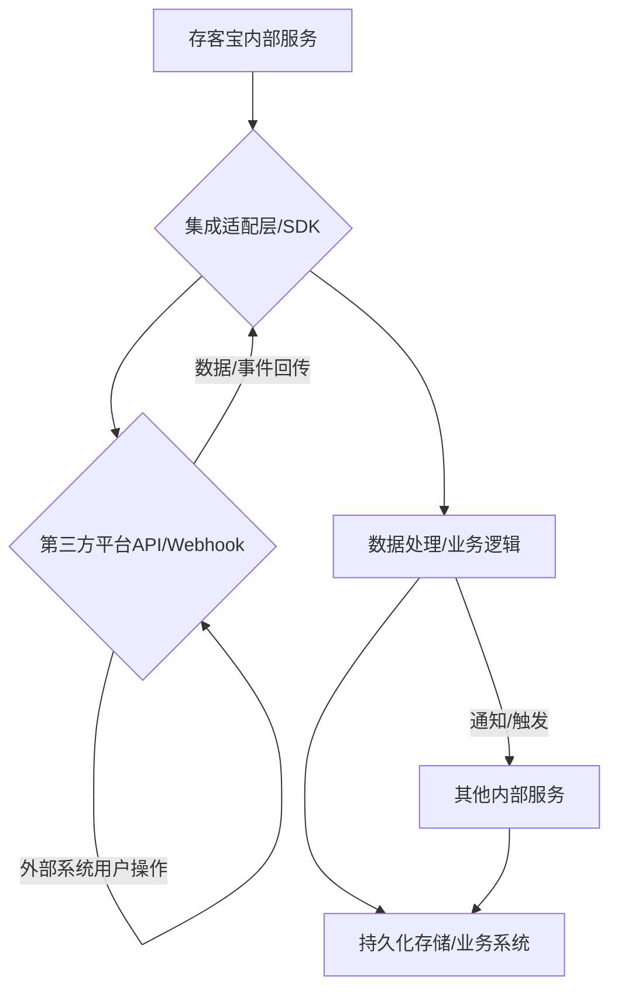

# 存客宝系统集成与第三方平台对接文档

## 1. 概述

存客宝私域流量运营平台需要与多种第三方平台进行集成，包括微信、抖音、小红书等社交媒体平台，以及CRM、ERP等企业内部系统。本文档描述了系统与各平台的对接方式、接口调用流程、授权管理以及常见问题处理方法。

### 1.1 主要集成平台

- **社交媒体平台**：微信（个人号、公众号、小程序）、抖音、小红书
- **电商平台**：淘宝、京东、拼多多
- **企业协作平台**：钉钉、企业微信
- **AI服务**：OpenAI、智谱AI
- **内部系统**：CRM、ERP、OA系统

### 1.2 集成架构

### 系统集成与第三方平台对接流程图



存客宝采用中间适配层设计，通过统一的集成适配器封装各平台的差异，对内部系统提供一致的接口和数据结构。

## 2. 微信平台集成

### 2.1 微信个人号集成

存客宝通过自研设备控制方案实现微信个人号的集成，主要包含以下功能：

- 自动登录与状态维护
- 好友添加与管理
- 消息收发与管理
- 朋友圈发布与互动
- 群管理与群消息
- 素材分发与文件传输

#### 2.1.1 设备控制协议

```java
/**
 * 设备命令类型
 */
public enum DeviceCommandType {
    LOGIN,               // 登录
    SEND_MESSAGE,        // 发送消息
    ADD_FRIEND,          // 添加好友
    CREATE_GROUP,        // 创建群
    POST_MOMENTS,        // 发朋友圈
    LIKE_MOMENTS,        // 点赞朋友圈
    COMMENT_MOMENTS,     // 评论朋友圈
    ACCEPT_FRIEND,       // 接受好友请求
    UPLOAD_FILE,         // 上传文件
    DOWNLOAD_FILE,       // 下载文件
    GET_FRIENDS,         // 获取好友列表
    GET_GROUPS,          // 获取群列表
    GET_MOMENTS,         // 获取朋友圈列表
    LOGOUT               // 登出
}

/**
 * 设备命令请求
 */
public class DeviceCommandRequest {
    private String commandId;
    private DeviceCommandType type;
    private Map<String, Object> params;
    private Date timestamp;
}

/**
 * 设备命令响应
 */
public class DeviceCommandResponse {
    private String commandId;
    private boolean success;
    private Object data;
    private String errorMessage;
    private Date timestamp;
}
```

#### 2.1.2 设备链接管理服务

```java
@Service
public class DeviceConnectionService {

    private final Map<Long, DeviceSession> deviceSessions = new ConcurrentHashMap<>();
    
    @Autowired
    private DeviceRepository deviceRepository;
    
    /**
     * 设备连接处理
     */
    public void handleConnection(WebSocketSession session, String deviceKey) {
        Device device = deviceRepository.findByDeviceKey(deviceKey);
        if (device == null) {
            closeSession(session, "Unknown device");
            return;
        }
        
        DeviceSession deviceSession = new DeviceSession(session, device);
        deviceSessions.put(device.getId(), deviceSession);
        
        // 更新设备状态
        device.setStatus(DeviceStatus.ONLINE);
        device.setLastActiveTime(new Date());
        deviceRepository.save(device);
    }
    
    /**
     * 设备断开处理
     */
    public void handleDisconnection(WebSocketSession session) {
        // 实现设备断开逻辑
    }
    
    /**
     * 发送命令到设备
     */
    public DeviceCommandResponse sendCommand(Long deviceId, DeviceCommandRequest command) {
        DeviceSession session = deviceSessions.get(deviceId);
        if (session == null) {
            throw new DeviceOfflineException("Device is not connected: " + deviceId);
        }
        
        return session.sendCommand(command);
    }
}
```

### 2.2 微信公众号集成

通过微信公众号开放平台API实现自动化管理，包括：

- 消息接收与处理
- 自动回复配置
- 图文素材管理
- 粉丝管理
- 模板消息发送
- 菜单配置

#### 2.2.1 公众号授权配置

```java
@Service
public class WechatMpService {

    @Value("${wechat.mp.appId}")
    private String appId;
    
    @Value("${wechat.mp.appSecret}")
    private String appSecret;
    
    @Value("${wechat.mp.token}")
    private String token;
    
    @Value("${wechat.mp.aesKey}")
    private String aesKey;
    
    @Autowired
    private WechatMpAccountRepository accountRepository;
    
    private WxMpService wxMpService;
    
    @PostConstruct
    public void init() {
        WxMpDefaultConfigImpl config = new WxMpDefaultConfigImpl();
        config.setAppId(appId);
        config.setSecret(appSecret);
        config.setToken(token);
        config.setAesKey(aesKey);
        
        wxMpService = new WxMpServiceImpl();
        wxMpService.setWxMpConfigStorage(config);
    }
    
    /**
     * 处理微信服务器验证
     */
    public String verifyServer(String signature, String timestamp, String nonce, String echostr) {
        if (wxMpService.checkSignature(timestamp, nonce, signature)) {
            return echostr;
        }
        return "非法请求";
    }
    
    /**
     * 处理微信消息
     */
    public String processMessage(String requestBody, String signature, String timestamp, String nonce, String encType, String msgSignature) {
        // 实现消息处理逻辑
    }
    
    /**
     * 发送模板消息
     */
    public boolean sendTemplateMessage(String openId, String templateId, String url, Map<String, String> data) {
        // 实现模板消息发送逻辑
    }
}
```

### 2.3 微信小程序集成

通过微信小程序的开放接口，实现以下功能：

- 用户登录与授权
- 获取用户信息
- 消息订阅与推送
- 小程序码生成
- 数据解密

#### 2.3.1 小程序登录流程

```java
@RestController
@RequestMapping("/api/v1/wechat/mini")
public class WechatMiniController {

    @Autowired
    private WechatMiniService wechatMiniService;
    
    @Autowired
    private UserService userService;
    
    /**
     * 小程序登录
     */
    @PostMapping("/login")
    public R<WechatMiniLoginVO> login(@RequestBody WechatMiniLoginDTO dto) {
        // 通过code获取会话信息
        WxMaJscode2SessionResult sessionResult = wechatMiniService.getSessionInfo(dto.getCode());
        
        // 解密用户信息
        WxMaUserInfo userInfo = null;
        if (dto.getEncryptedData() != null && dto.getIv() != null) {
            userInfo = wechatMiniService.decryptUserInfo(
                    sessionResult.getSessionKey(), dto.getEncryptedData(), dto.getIv());
        }
        
        // 用户注册或登录
        Long userId = userService.loginByWechatMini(sessionResult.getOpenid(), userInfo);
        
        // 生成登录令牌
        String token = authService.generateToken(userId);
        
        // 返回登录结果
        WechatMiniLoginVO result = new WechatMiniLoginVO();
        result.setToken(token);
        result.setOpenid(sessionResult.getOpenid());
        
        return R.ok(result);
    }
}
```

## 3. 抖音平台集成

### 3.1 抖音开放平台授权

通过抖音开放平台实现以下功能：

- 账号授权与管理
- 视频发布与管理
- 用户数据获取
- 评论管理
- 粉丝互动

#### 3.1.1 抖音授权流程

```java
@Service
public class DouyinService {

    @Value("${douyin.clientKey}")
    private String clientKey;
    
    @Value("${douyin.clientSecret}")
    private String clientSecret;
    
    @Autowired
    private DouyinAccountRepository accountRepository;
    
    /**
     * 获取授权URL
     */
    public String getAuthUrl(String redirectUri, String state) {
        return "https://open.douyin.com/platform/oauth/connect?" +
                "client_key=" + clientKey +
                "&response_type=code" +
                "&scope=user_info,video.create,video.list,video.data" +
                "&redirect_uri=" + URLEncoder.encode(redirectUri, StandardCharsets.UTF_8) +
                "&state=" + state;
    }
    
    /**
     * 获取访问令牌
     */
    public DouyinTokenVO getAccessToken(String code) {
        // 调用抖音API获取访问令牌
        String url = "https://open.douyin.com/oauth/access_token?" +
                "client_key=" + clientKey +
                "&client_secret=" + clientSecret +
                "&code=" + code +
                "&grant_type=authorization_code";
        
        // 发送请求并处理响应
        RestTemplate restTemplate = new RestTemplate();
        DouyinTokenResponse response = restTemplate.getForObject(url, DouyinTokenResponse.class);
        
        if (response == null || response.getData() == null) {
            throw new DouyinApiException("Failed to get access token");
        }
        
        // 保存或更新授权信息
        saveDouyinAccount(response.getData());
        
        return buildTokenVO(response.getData());
    }
    
    /**
     * 发布视频
     */
    public DouyinVideoVO createVideo(Long accountId, DouyinVideoDTO dto) {
        // 实现视频发布逻辑
    }
    
    /**
     * 获取视频列表
     */
    public List<DouyinVideoVO> getVideos(Long accountId, Integer page, Integer size) {
        // 实现视频列表获取逻辑
    }
}
```

### 3.2 抖音数据同步

定期同步抖音平台数据，包括：

- 视频数据（播放量、点赞数、评论数）
- 粉丝数据（新增粉丝、粉丝画像）
- 互动数据（评论内容、私信）

```java
@Component
public class DouyinDataSyncJob {

    @Autowired
    private DouyinService douyinService;
    
    @Autowired
    private DouyinDataRepository dataRepository;
    
    /**
     * 每天凌晨2点同步抖音数据
     */
    @Scheduled(cron = "0 0 2 * * ?")
    public void syncDouyinData() {
        List<DouyinAccount> accounts = douyinService.getAllActiveAccounts();
        
        for (DouyinAccount account : accounts) {
            try {
                // 同步视频数据
                syncVideoData(account);
                
                // 同步粉丝数据
                syncFansData(account);
                
                // 同步互动数据
                syncInteractionData(account);
                
                // 更新同步状态
                account.setLastSyncTime(new Date());
                douyinService.updateAccount(account);
            } catch (Exception e) {
                log.error("Failed to sync data for douyin account: " + account.getId(), e);
            }
        }
    }
    
    private void syncVideoData(DouyinAccount account) {
        // 实现视频数据同步
    }
    
    private void syncFansData(DouyinAccount account) {
        // 实现粉丝数据同步
    }
    
    private void syncInteractionData(DouyinAccount account) {
        // 实现互动数据同步
    }
}
```

## 4. 小红书平台集成

### 4.1 小红书开放平台授权

通过小红书开放平台实现以下功能：

- 账号授权与管理
- 笔记发布与管理
- 用户数据获取
- 评论管理

### 4.2 小红书数据采集

对于没有完整API的功能，使用爬虫技术采集数据：

```java
@Service
public class XiaohongshuCrawlerService {

    @Autowired
    private WebDriverPool webDriverPool;
    
    @Autowired
    private XiaohongshuDataRepository dataRepository;
    
    /**
     * 抓取笔记数据
     */
    public XiaohongshuNoteVO crawlNote(String noteUrl) {
        WebDriver driver = null;
        try {
            driver = webDriverPool.getDriver();
            
            // 加载页面
            driver.get(noteUrl);
            WebDriverWait wait = new WebDriverWait(driver, Duration.ofSeconds(10));
            wait.until(ExpectedConditions.visibilityOfElementLocated(By.className("note-content")));
            
            // 解析数据
            XiaohongshuNoteVO note = new XiaohongshuNoteVO();
            note.setTitle(driver.findElement(By.className("title")).getText());
            note.setContent(driver.findElement(By.className("content")).getText());
            note.setLikes(parseNumber(driver.findElement(By.className("like-count")).getText()));
            note.setCollects(parseNumber(driver.findElement(By.className("collect-count")).getText()));
            note.setComments(parseNumber(driver.findElement(By.className("comment-count")).getText()));
            
            // 获取图片
            List<WebElement> imgElements = driver.findElements(By.cssSelector(".img-container img"));
            List<String> images = new ArrayList<>();
            for (WebElement imgElement : imgElements) {
                String imgUrl = imgElement.getAttribute("src");
                if (imgUrl != null && !imgUrl.isEmpty()) {
                    images.add(imgUrl);
                }
            }
            note.setImages(images);
            
            return note;
        } finally {
            if (driver != null) {
                webDriverPool.returnDriver(driver);
            }
        }
    }
    
    private int parseNumber(String text) {
        // 解析数字，处理"1.2w"这样的格式
    }
}
```

## 5. AI服务集成

### 5.1 OpenAI服务集成

集成OpenAI的GPT模型，实现以下功能：

- 文本内容生成
- 内容摘要与改写
- 智能客服回复
- 情感分析
- 标签提取

```java
@Service
public class OpenAIService {

    @Value("${openai.api-key}")
    private String apiKey;
    
    @Value("${openai.model}")
    private String model;
    
    @Value("${openai.api-url}")
    private String apiUrl;
    
    private final RestTemplate restTemplate;
    
    public OpenAIService() {
        this.restTemplate = new RestTemplate();
    }
    
    /**
     * 生成内容
     */
    public String generateContent(String prompt, int maxTokens) {
        HttpHeaders headers = new HttpHeaders();
        headers.setContentType(MediaType.APPLICATION_JSON);
        headers.set("Authorization", "Bearer " + apiKey);
        
        Map<String, Object> requestBody = new HashMap<>();
        requestBody.put("model", model);
        requestBody.put("prompt", prompt);
        requestBody.put("max_tokens", maxTokens);
        requestBody.put("temperature", 0.7);
        
        HttpEntity<Map<String, Object>> entity = new HttpEntity<>(requestBody, headers);
        
        try {
            ResponseEntity<OpenAIResponse> response = restTemplate.postForEntity(
                    apiUrl + "/completions",
                    entity,
                    OpenAIResponse.class);
            
            if (response.getStatusCode() == HttpStatus.OK && response.getBody() != null) {
                return response.getBody().getChoices().get(0).getText().trim();
            } else {
                throw new AIServiceException("Failed to generate content");
            }
        } catch (Exception e) {
            throw new AIServiceException("OpenAI service error", e);
        }
    }
    
    /**
     * 内容改写
     */
    public String rewriteContent(String content, String style) {
        String prompt = "Please rewrite the following content in " + style + " style:\n\n" + content;
        return generateContent(prompt, 1000);
    }
    
    /**
     * 情感分析
     */
    public SentimentAnalysisVO analyzeSentiment(String text) {
        String prompt = "Analyze the sentiment of the following text. " +
                "Return result as JSON with sentiment (POSITIVE, NEUTRAL, NEGATIVE) and confidence score (0-100):\n\n" + text;
        
        String result = generateContent(prompt, 500);
        
        // 解析JSON结果
        try {
            ObjectMapper mapper = new ObjectMapper();
            return mapper.readValue(result, SentimentAnalysisVO.class);
        } catch (Exception e) {
            throw new AIServiceException("Failed to parse sentiment analysis result", e);
        }
    }
}
```

### 5.2 智谱AI集成

集成智谱AI的中文大模型，实现以下功能：

- 中文内容生成
- 行业知识问答
- 客户意图识别
- 文本分类

```java
@Service
public class ZhipuAIService {

    @Value("${zhipu.api-key}")
    private String apiKey;
    
    @Value("${zhipu.api-url}")
    private String apiUrl;
    
    /**
     * 生成内容
     */
    public String generateContent(String prompt) {
        // 实现智谱AI调用逻辑
    }
    
    /**
     * 行业知识问答
     */
    public String answerQuestion(String question, String domain) {
        // 实现行业知识问答逻辑
    }
}
```

## 6. CRM系统集成

### 6.1 客户数据同步

与企业CRM系统进行客户数据双向同步：

```java
@Service
public class CRMIntegrationService {

    @Autowired
    private CustomerRepository customerRepository;
    
    @Autowired
    private CustomerSyncLogRepository syncLogRepository;
    
    @Autowired
    private RestTemplate restTemplate;
    
    @Value("${crm.api-url}")
    private String crmApiUrl;
    
    @Value("${crm.api-key}")
    private String crmApiKey;
    
    /**
     * 将客户数据同步到CRM
     */
    @Transactional
    public void syncCustomerToCRM(Long customerId) {
        Customer customer = customerRepository.findById(customerId)
                .orElseThrow(() -> new CustomerNotFoundException("Customer not found: " + customerId));
        
        if (customer.getLastSyncTime() != null && 
                customer.getUpdateTime().before(customer.getLastSyncTime())) {
            // 数据未修改，无需同步
            return;
        }
        
        // 构建请求数据
        CRMCustomerDTO crmCustomer = buildCRMCustomerDTO(customer);
        
        // 发送同步请求
        try {
            HttpHeaders headers = new HttpHeaders();
            headers.setContentType(MediaType.APPLICATION_JSON);
            headers.set("API-Key", crmApiKey);
            
            HttpEntity<CRMCustomerDTO> entity = new HttpEntity<>(crmCustomer, headers);
            
            ResponseEntity<CRMResponse> response;
            if (customer.getCrmId() != null) {
                // 更新已有客户
                response = restTemplate.exchange(
                        crmApiUrl + "/customers/" + customer.getCrmId(),
                        HttpMethod.PUT,
                        entity,
                        CRMResponse.class);
            } else {
                // 创建新客户
                response = restTemplate.exchange(
                        crmApiUrl + "/customers",
                        HttpMethod.POST,
                        entity,
                        CRMResponse.class);
            }
            
            if (response.getStatusCode().is2xxSuccessful() && response.getBody() != null) {
                // 更新客户CRM ID和同步时间
                customer.setCrmId(response.getBody().getData().getId());
                customer.setLastSyncTime(new Date());
                customerRepository.save(customer);
                
                // 记录同步日志
                CustomerSyncLog log = new CustomerSyncLog();
                log.setCustomerId(customer.getId());
                log.setDirection(SyncDirection.TO_CRM);
                log.setStatus(SyncStatus.SUCCESS);
                log.setSyncTime(new Date());
                syncLogRepository.save(log);
            } else {
                throw new CRMSyncException("Failed to sync customer to CRM");
            }
        } catch (Exception e) {
            // 记录同步失败日志
            CustomerSyncLog log = new CustomerSyncLog();
            log.setCustomerId(customer.getId());
            log.setDirection(SyncDirection.TO_CRM);
            log.setStatus(SyncStatus.FAILED);
            log.setErrorMessage(e.getMessage());
            log.setSyncTime(new Date());
            syncLogRepository.save(log);
            
            throw new CRMSyncException("Failed to sync customer to CRM", e);
        }
    }
    
    /**
     * 从CRM同步客户数据
     */
    @Transactional
    public void syncCustomerFromCRM(String crmId) {
        // 实现从CRM同步客户数据的逻辑
    }
    
    private CRMCustomerDTO buildCRMCustomerDTO(Customer customer) {
        // 构建CRM客户DTO
    }
}
```

### 6.2 订单数据集成

与企业ERP/CRM系统集成订单数据：

```java
@Service
public class OrderIntegrationService {

    @Autowired
    private OrderRepository orderRepository;
    
    @Autowired
    private RestTemplate restTemplate;
    
    @Value("${erp.api-url}")
    private String erpApiUrl;
    
    @Value("${erp.api-key}")
    private String erpApiKey;
    
    /**
     * 从ERP同步订单数据
     */
    @Scheduled(cron = "0 0 */2 * * ?")  // 每2小时执行一次
    public void syncOrdersFromERP() {
        // 获取最后同步时间
        Date lastSyncTime = getLastOrderSyncTime();
        Date now = new Date();
        
        // 构建请求参数
        Map<String, Object> params = new HashMap<>();
        if (lastSyncTime != null) {
            params.put("updatedAfter", formatDate(lastSyncTime));
        }
        
        // 发送请求
        try {
            HttpHeaders headers = new HttpHeaders();
            headers.set("API-Key", erpApiKey);
            
            UriComponentsBuilder builder = UriComponentsBuilder.fromHttpUrl(erpApiUrl + "/orders")
                    .queryParams(convertMapToMultiValueMap(params));
            
            ResponseEntity<ERPOrderListResponse> response = restTemplate.exchange(
                    builder.toUriString(),
                    HttpMethod.GET,
                    new HttpEntity<>(headers),
                    ERPOrderListResponse.class);
            
            if (response.getStatusCode().is2xxSuccessful() && response.getBody() != null) {
                // 处理订单数据
                processOrders(response.getBody().getData());
                
                // 更新同步时间
                updateOrderSyncTime(now);
            }
        } catch (Exception e) {
            log.error("Failed to sync orders from ERP", e);
        }
    }
    
    private void processOrders(List<ERPOrderDTO> orders) {
        // 处理订单数据
    }
}
```

## 7. 通用集成组件

### 7.1 通用API适配器

为了支持多种外部API的统一调用，实现通用API适配器：

```java
public interface ApiAdapter<T, R> {
    R call(T request);
}

@Component
public class ApiAdapterRegistry {

    private final Map<String, ApiAdapter<?, ?>> adapters = new HashMap<>();
    
    @PostConstruct
    public void init() {
        // 注册适配器
        registerAdapter("wechat.mp", new WechatMpApiAdapter());
        registerAdapter("douyin", new DouyinApiAdapter());
        registerAdapter("xiaohongshu", new XiaohongshuApiAdapter());
        registerAdapter("openai", new OpenAIApiAdapter());
        registerAdapter("crm", new CRMApiAdapter());
    }
    
    public <T, R> void registerAdapter(String type, ApiAdapter<T, R> adapter) {
        adapters.put(type, adapter);
    }
    
    @SuppressWarnings("unchecked")
    public <T, R> ApiAdapter<T, R> getAdapter(String type) {
        return (ApiAdapter<T, R>) adapters.get(type);
    }
}

@Service
public class ApiService {

    @Autowired
    private ApiAdapterRegistry adapterRegistry;
    
    public <T, R> R callApi(String type, T request) {
        ApiAdapter<T, R> adapter = adapterRegistry.getAdapter(type);
        if (adapter == null) {
            throw new ApiAdapterNotFoundException("API adapter not found: " + type);
        }
        
        return adapter.call(request);
    }
}
```

### 7.2 通用Webhook处理

实现通用的Webhook接收与处理框架：

```java
public interface WebhookProcessor {
    void process(String payload, Map<String, String> headers);
}

@Service
public class WebhookService {

    private final Map<String, WebhookProcessor> processors = new HashMap<>();
    
    @PostConstruct
    public void init() {
        // 注册Webhook处理器
        registerProcessor("wechat", new WechatWebhookProcessor());
        registerProcessor("douyin", new DouyinWebhookProcessor());
        registerProcessor("crm", new CRMWebhookProcessor());
    }
    
    public void registerProcessor(String type, WebhookProcessor processor) {
        processors.put(type, processor);
    }
    
    public void processWebhook(String type, String payload, Map<String, String> headers) {
        WebhookProcessor processor = processors.get(type);
        if (processor == null) {
            throw new WebhookProcessorNotFoundException("Webhook processor not found: " + type);
        }
        
        processor.process(payload, headers);
    }
}

@RestController
@RequestMapping("/api/v1/webhook")
public class WebhookController {

    @Autowired
    private WebhookService webhookService;
    
    @PostMapping("/{type}")
    public ResponseEntity<String> handleWebhook(
            @PathVariable String type,
            @RequestBody String payload,
            @RequestHeader Map<String, String> headers) {
        
        try {
            webhookService.processWebhook(type, payload, headers);
            return ResponseEntity.ok("success");
        } catch (Exception e) {
            log.error("Failed to process webhook: " + type, e);
            return ResponseEntity.status(HttpStatus.INTERNAL_SERVER_ERROR).body("error");
        }
    }
}
```

## 8. 安全与授权管理

### 8.1 API密钥管理

```java
@Service
public class ApiKeyService {

    @Autowired
    private ApiKeyRepository apiKeyRepository;
    
    @Autowired
    private EncryptionService encryptionService;
    
    /**
     * 创建API密钥
     */
    public ApiKeyVO createApiKey(ApiKeyDTO dto) {
        // 生成密钥
        String apiKey = generateApiKey();
        String apiSecret = generateApiSecret();
        
        // 创建记录
        ApiKey entity = new ApiKey();
        entity.setName(dto.getName());
        entity.setPlatform(dto.getPlatform());
        entity.setApiKey(apiKey);
        entity.setApiSecret(encryptionService.encrypt(apiSecret));
        entity.setStatus(ApiKeyStatus.ACTIVE);
        entity.setExpiryDate(dto.getExpiryDate());
        entity.setCreateTime(new Date());
        
        ApiKey savedEntity = apiKeyRepository.save(entity);
        
        // 构建返回对象
        ApiKeyVO vo = new ApiKeyVO();
        vo.setId(savedEntity.getId());
        vo.setName(savedEntity.getName());
        vo.setPlatform(savedEntity.getPlatform());
        vo.setApiKey(apiKey);
        vo.setApiSecret(apiSecret);  // 仅在创建时返回明文密钥
        vo.setStatus(savedEntity.getStatus());
        vo.setExpiryDate(savedEntity.getExpiryDate());
        vo.setCreateTime(savedEntity.getCreateTime());
        
        return vo;
    }
    
    /**
     * 验证API密钥
     */
    public boolean verifyApiKey(String apiKey, String apiSecret) {
        ApiKey entity = apiKeyRepository.findByApiKey(apiKey);
        if (entity == null || entity.getStatus() != ApiKeyStatus.ACTIVE) {
            return false;
        }
        
        // 验证过期时间
        if (entity.getExpiryDate() != null && entity.getExpiryDate().before(new Date())) {
            return false;
        }
        
        // 验证密钥
        String decryptedSecret = encryptionService.decrypt(entity.getApiSecret());
        return decryptedSecret.equals(apiSecret);
    }
    
    private String generateApiKey() {
        // 生成API Key
    }
    
    private String generateApiSecret() {
        // 生成API Secret
    }
}
```

### 8.2 授权令牌管理

```java
@Service
public class AuthTokenService {

    @Autowired
    private AuthTokenRepository authTokenRepository;
    
    @Autowired
    private EncryptionService encryptionService;
    
    /**
     * 保存授权令牌
     */
    public void saveAuthToken(AuthTokenDTO dto) {
        AuthToken token = new AuthToken();
        token.setPlatform(dto.getPlatform());
        token.setAccountId(dto.getAccountId());
        token.setAccessToken(encryptionService.encrypt(dto.getAccessToken()));
        token.setRefreshToken(dto.getRefreshToken() != null ? 
                encryptionService.encrypt(dto.getRefreshToken()) : null);
        token.setExpiresIn(dto.getExpiresIn());
        token.setExpiryTime(calculateExpiryTime(dto.getExpiresIn()));
        token.setCreateTime(new Date());
        
        authTokenRepository.save(token);
    }
    
    /**
     * 获取有效令牌
     */
    public String getValidAccessToken(String platform, Long accountId) {
        // 查找最新令牌
        AuthToken token = authTokenRepository.findTopByPlatformAndAccountIdOrderByCreateTimeDesc(
                platform, accountId);
        
        if (token == null) {
            throw new TokenNotFoundException("No token found for platform: " + platform + ", account: " + accountId);
        }
        
        // 检查令牌是否过期
        if (token.getExpiryTime() != null && token.getExpiryTime().before(new Date())) {
            // 令牌已过期，尝试刷新
            if (token.getRefreshToken() != null) {
                return refreshToken(token);
            } else {
                throw new TokenExpiredException("Token expired and no refresh token available");
            }
        }
        
        // 返回解密后的令牌
        return encryptionService.decrypt(token.getAccessToken());
    }
    
    /**
     * 刷新令牌
     */
    private String refreshToken(AuthToken token) {
        // 实现令牌刷新逻辑
    }
    
    private Date calculateExpiryTime(Integer expiresIn) {
        // 计算过期时间
    }
}
```

## 9. 常见问题及解决方案

### 9.1 微信个人号登录失效问题

**问题描述**：微信不定期更新防控策略，可能导致自动化登录失效。

**解决方案**：
1. 实现多账号备份策略，一个账号失效自动切换到备用账号
2. 设置登录状态监控，发现异常立即通知管理员
3. 定期更新设备信息和登录参数，避免被识别为自动化工具
4. 实现手动协助登录流程，必要时由人工介入

### 9.2 抖音/小红书授权过期问题

**问题描述**：第三方平台授权可能到期或被平台撤销。

**解决方案**：
1. 建立授权状态监控，提前通知即将过期的授权
2. 实现自动刷新令牌机制，维持授权有效性
3. 对授权失败的操作实现降级策略，避免业务中断
4. 设置多级告警，确保问题及时处理

### 9.3 API调用频率限制处理

**问题描述**：第三方平台通常有API调用频率限制。

**解决方案**：
1. 实现请求限流和队列机制，控制API调用频率
2. 对高频调用进行合并处理，减少请求次数
3. 实现缓存策略，避免重复调用
4. 针对不同平台设置不同的调用策略和优先级

### 9.4 数据同步冲突解决

**问题描述**：多系统间数据同步可能存在冲突。

**解决方案**：
1. 实现基于时间戳的冲突检测机制
2. 定义明确的数据主导权规则，确定哪个系统的数据优先
3. 对冲突数据建立人工审核流程
4. 保留完整的数据变更日志，支持手动数据修复

## 10. 性能与可靠性

### 10.1 性能优化

1. **API调用批处理**：将多个单独API调用合并为批量请求
2. **异步处理**：非关键路径操作使用消息队列异步处理
3. **缓存策略**：频繁访问的外部数据进行本地缓存
4. **请求超时与重试**：设置合理的超时时间和重试策略
5. **并发控制**：使用线程池控制并发请求数量

### 10.2 可靠性保障

1. **熔断机制**：对不稳定的外部服务实现熔断保护
2. **降级策略**：服务不可用时提供降级方案
3. **完整日志**：记录所有外部调用的请求和响应
4. **监控告警**：对关键接口实现性能监控和异常告警
5. **故障自愈**：设计自动恢复机制，如定期任务检查并修复失败的同步 

## 相关前端UI图片

以下是与系统集成和设备管理相关的部分前端UI截图，帮助理解用户如何在前端界面进行相关配置或查看状态：

### 我的页面 - 设备管理入口


### 设备管理列表页面

 