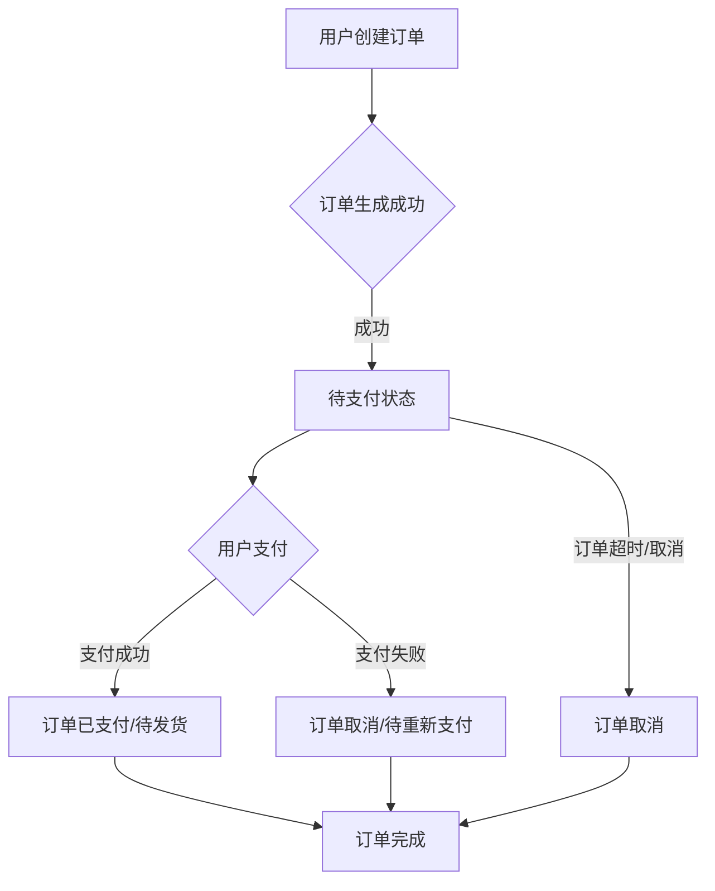

### 订单管理模块后端开发文档

#### 模块概述

负责处理用户订单相关的流程，包括订单创建、支付、状态更新、查询、退款等。

#### 订单处理流程图

#### 后端技术栈

- 主要技术：Spring Boot, MyBatis-Plus
- 数据库：MySQL
- 缓存：Redis

#### 核心实体与数据表

- 订单主表 (order)
- 订单项表 (order_item)
- 支付记录表 (payment_record)
- 退款记录表 (refund_record)
- 订单日志表 (order_log)

#### 主要API接口

- GET /api/orders: 获取订单列表
- GET /api/orders/{id}: 获取订单详情
- POST /api/orders: 创建新订单
- POST /api/orders/{id}/pay: 订单支付接口
- POST /api/orders/{id}/cancel: 取消订单
- POST /api/orders/{id}/refund: 申请退款

#### 开发注意事项

- 事务管理，确保订单、支付、库存等操作的原子性。
- 订单状态机的设计与实现。
- 支付回调处理。
- 幂等性考虑。 

---

## 相关前端UI图片

以下是与订单管理模块相关的部分前端UI截图，帮助理解订单功能在前端界面的展现：

### 工作台 - 订单管理入口 (示意图)

 