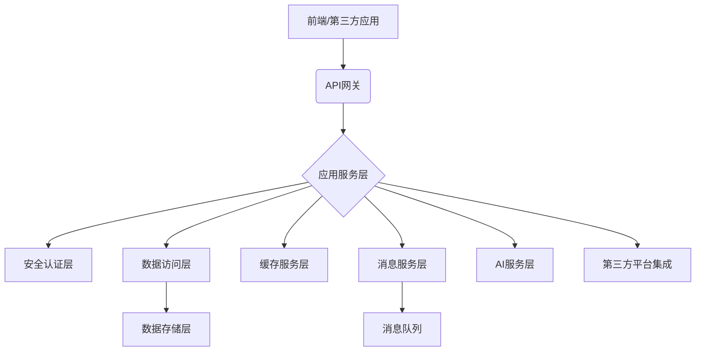

# 存客宝后端架构概述

## 一、整体架构

存客宝后端采用微服务架构设计，支持高并发、分布式部署和弹性扩展。系统分为核心业务模块、AI智能服务、数据存储层、消息队列以及第三方平台集成等部分，通过统一的API网关对外提供服务。

### 后端整体架构流程图

## 二、技术架构层次

- **应用服务层**：处理业务逻辑，实现各种功能模块
- **安全认证层**：提供用户身份验证和权限控制
- **数据访问层**：抽象数据库操作，提供数据持久化服务
- **缓存服务层**：提供高性能数据缓存能力
- **API网关层**：统一接口管理，负责路由和负载均衡
- **消息服务层**：实现系统内异步通信和解耦
- **AI服务层**：提供智能分析和自动化处理能力
- **部署运维层**：支持容器化部署和自动化运维

## 三、主要模块划分

为了实现上述架构目标，后端系统可以划分为以下主要模块：

1.  **用户与权限管理模块 (User & Permission Management Module)**
    *   功能：负责处理用户注册、登录、身份验证、会话管理以及基于角色的访问控制 (RBAC) 或其他权限管理机制。
    *   核心关注点：安全性、用户数据一致性、可扩展性。

2.  **核心业务逻辑模块 (Core Business Logic Module)**
    *   功能：包含存客宝的核心业务流程，例如客户关系管理 (CRM) 功能、营销活动管理、销售流程自动化等。
    *   核心关注点：业务规则的准确实现、流程的灵活性和可配置性、与其他模块的解耦。

3.  **数据持久化与管理模块 (Data Persistence & Management Module)**
    *   功能：负责所有业务数据的存储、检索、更新和删除。包括与数据库的交互、数据校验、事务管理等。
    *   核心关注点：数据一致性、完整性、查询性能、数据备份与恢复策略。

4.  **对外接口模块 (External API Module)**
    *   功能：提供 RESTful API、GraphQL 或其他形式的接口，供前端应用、移动应用或第三方系统集成调用。
    *   核心关注点：接口的安全性 (认证、授权、限流)、版本控制、文档清晰性、易用性。

5.  **消息与通知模块 (Messaging & Notification Module)**
    *   功能：处理系统内部及对外的消息通知，例如邮件通知、短信通知、应用内推送、异步任务处理等。
    *   核心关注点：消息的可靠传递、实时性、可扩展性。

6.  **任务调度与后台作业模块 (Task Scheduling & Background Job Module)**
    *   功能：执行定期的、耗时的或异步的后台任务，如数据同步、报表生成、缓存更新等。
    *   核心关注点：任务的可靠性、可监控性、执行效率。

7.  **配置管理模块 (Configuration Management Module)**
    *   功能：管理系统的各类配置项，如数据库连接信息、第三方服务凭证、业务参数等，支持动态更新和不同环境的配置。
    *   核心关注点：配置的安全性、易管理性、变更追踪。

8.  **日志与监控模块 (Logging & Monitoring Module)**
    *   功能：记录系统运行日志、错误信息，并对系统关键指标进行监控和告警。
    *   核心关注点：日志的全面性、查询效率、监控的实时性和准确性、告警的及时性。

9.  **第三方服务集成模块 (Third-party Service Integration Module)**
    *   功能：封装与外部服务的集成逻辑，如支付网关、短信服务、邮件服务、云存储等。
    *   核心关注点：接口的稳定性、错误处理、服务降级策略。

这种模块化的设计有助于降低系统的复杂度，提高可维护性和可扩展性。各模块之间应通过定义良好的接口进行通信，以实现高内聚、低耦合。

## 四、架构特点

1. **领域驱动设计**：基于业务领域模型划分系统边界，保持模块内高内聚、模块间低耦合
2. **服务解耦**：核心业务按领域模型拆分为多个服务，支持团队并行开发、独立部署
3. **统一接口标准**：API网关实现统一接口规范、认证鉴权、限流熔断
4. **数据分层**：业务数据、缓存、数据分析分层管理，满足不同场景需求
5. **安全框架**：全链路加密、数据脱敏、操作审计
6. **可伸缩架构**：支持水平扩展，应对业务增长
7. **开发规范**：统一接口设计、异常处理、返回格式
8. **可观测性**：完善的日志、监控、告警体系

## 五、数据流处理

1. **客户数据流**：多渠道获客 → 智能过滤 → 分配/打标 → 社交账号添加 → 客户沉淀
2. **内容数据流**：内容采集 → 分类存储 → 智能处理 → 多平台推送
3. **设备数据流**：设备接入 → 状态监控 → 任务分配 → 操作执行 → 结果回传
4. **分析数据流**：业务数据采集 → 数据清洗 → 多维分析 → 可视化呈现

## 六、系统扩展原则

- **模块化设计**：新增业务场景可通过新增模块实现，不影响现有功能
- **适配器模式**：通过标准化适配器支持新渠道、新平台的灵活对接
- **多租户架构**：系统设计考虑多租户场景，支持业务和客户规模扩展
- **事件驱动架构**：关键业务采用事件驱动模式，提高系统吞吐和可扩展性
- **服务治理**：实现服务注册、发现、负载均衡和容错机制

## 五、部署与运维考量

### 1. 部署策略
*   **容器化部署**：推荐使用 Docker 等容器化技术，简化部署流程，保证环境一致性。可配合 Kubernetes (K8s) 等容器编排工具实现自动化部署、扩缩容和故障恢复。
*   **持续集成/持续部署 (CI/CD)**：建立自动化的构建、测试和部署流水线，提高交付效率和质量。
*   **多环境部署**：区分开发、测试、预发布和生产环境，各环境配置隔离。

### 2. 监控与告警
*   **应用性能监控 (APM)**：集成 APM 工具，监控应用性能指标，如响应时间、吞吐量、错误率等。
*   **基础设施监控**：监控服务器、数据库、网络等基础设施的状态。
*   **日志集中管理**：将各模块日志收集到统一的日志管理平台，方便查询和分析。
*   **告警机制**：针对关键指标设置告警阈值，及时通知运维人员处理问题。

### 3. 安全性
*   **输入验证**：对所有外部输入进行严格验证和清理，防止注入攻击 (如 SQL 注入、XSS)。
*   **身份认证与授权**：确保所有接口和资源访问都有严格的认证和授权机制。
*   **数据加密**：对敏感数据（如密码、用户个人信息）进行加密存储和传输。
*   **依赖安全**：定期扫描和更新项目依赖的第三方库，防止已知漏洞。
*   **API 安全**：API 接口应考虑防刷、防重放、数据签名等安全措施。

### 4. 可扩展性与高可用
*   **水平扩展**：通过增加服务实例数量来提高系统处理能力。
*   **负载均衡**：在多个服务实例前部署负载均衡器，分发请求。
*   **数据库扩展**：考虑读写分离、分库分表等数据库扩展方案。
*   **缓存策略**：合理使用缓存（如 Redis、Memcached）减轻数据库压力，提升响应速度。
*   **服务降级与熔断**：在部分服务不可用时，保证核心功能可用，防止雪崩效应。

## 六、未来展望

随着业务的发展，后端架构需要持续演进。未来可能考虑的方向包括：
*   **微服务化**：将单体应用或大型模块拆分为更小、更自治的微服务，进一步提高灵活性和可扩展性。
*   **服务网格 (Service Mesh)**：引入服务网格来管理微服务之间的通信、监控和安全。
*   **事件驱动架构 (EDA)**：更多地采用异步消息和事件驱动的方式来解耦服务。
*   **大数据与AI集成**：集成大数据分析平台和人工智能能力，挖掘数据价值，提升智能化水平。

本架构概述提供了一个通用的后端设计指导，具体实现需根据业务需求和团队情况进行调整和细化。

---

> 本文档描述了存客宝后端整体架构设计，详细的模块实现文档请参考各子目录。 

## 七、相关前端UI图片

为了更直观地理解后端架构所支撑的前端界面，以下是部分核心UI截图：

### 存客宝首页

### 存客宝工作台

 