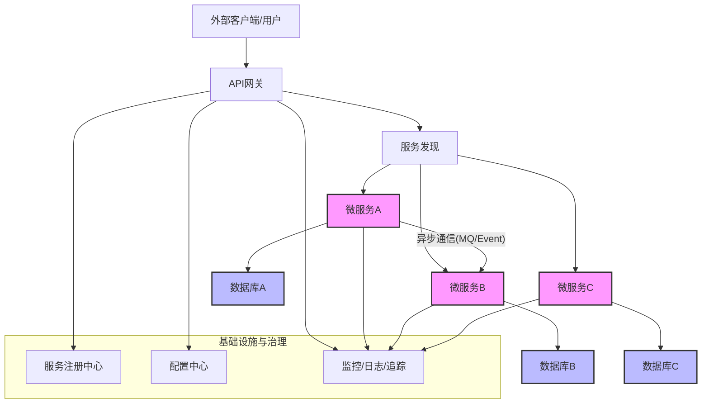

# 微服务架构设计指南

## 一、引言

### 1.1 背景与目的
本文档旨在为构建可扩展、有弹性、易于维护的后端系统提供一套微服务架构设计的指导原则和最佳实践。随着业务的快速发展和系统复杂性的增加，微服务架构能够将大型单体应用拆分为一组小型、独立、松耦合的服务，从而提高开发敏捷性、部署灵活性和技术异构性。

### 微服务架构概述流程图

### 1.2 适用范围
本指南适用于需要进行微服务改造的现有系统，或从头开始设计新的基于微服务的系统。具体的技术选型和实现细节可能因项目具体需求而异，但核心原则和设计考量具有普遍适用性。

### 1.3 核心目标
采用微服务架构旨在实现以下核心业务和技术目标：
- **敏捷性与快速迭代**: 允许小团队独立开发、测试、部署和扩展各自的服务。
- **技术多样性**: 允许不同服务根据其特定需求选择最合适的技术栈。
- **故障隔离**: 单个服务的故障不会导致整个系统瘫痪，提高系统整体韧性。
- **可扩展性**: 可以根据各个服务的具体负载独立进行扩展。
- **可维护性**: 代码库更小，逻辑更专注，易于理解和维护。
- **可部署性**: 服务可独立部署，简化CI/CD流程。

## 二、微服务架构核心原则

1.  **单一职责原则 (Single Responsibility Principle)**: 每个微服务应专注于一组内聚的业务功能，并将其做好。
2.  **面向服务设计 (Design for Services)**: 服务应通过明确定义的接口（API）暴露其功能，隐藏内部实现细节。
3.  **围绕业务能力构建 (Organized around Business Capabilities)**: 服务划分应反映业务领域，而非技术分层。
4.  **数据分离与自治 (Decentralized Data Management)**: 每个微服务应拥有其私有数据存储，避免服务间直接共享数据库。跨服务数据访问通过API进行。
5.  **去中心化治理 (Decentralized Governance)**: 团队在遵循统一架构原则的前提下，可以为自己的服务选择合适的技术和工具，但需有统一的服务治理框架。
6.  **为故障设计 (Design for Failure)**: 认识到服务可能且确实会失败，并在架构层面引入容错机制（如超时、重试、熔断、降级）。
7.  **基础设施自动化 (Infrastructure Automation)**: 采用自动化工具进行构建、测试、部署、监控和运维，以支持快速迭代和大规模部署。
8.  **演进式设计 (Evolutionary Design)**: 微服务架构不是一成不变的，应支持服务的持续演进和重构。

## 三、服务划分策略

### 3.1 划分原则
- **基于领域驱动设计 (DDD)**: 识别核心域、支撑域和通用域，根据限界上下文 (Bounded Context) 划分服务。
- **业务功能内聚性**: 将高度相关的业务功能组织在同一个服务中。
- **服务间低耦合**: 最小化服务之间的依赖关系。
- **数据独立性**: 服务应能独立管理其核心数据。
- **团队结构考量 (康威定律)**: 服务边界可以参考团队的组织结构。
- **服务粒度适中**: 避免过细导致服务数量过多、调用链过长；避免过粗导致服务内部复杂性过高、失去微服务的优势。
- **可独立部署和扩展**: 每个服务都应能够独立部署和按需扩展。

### 3.2 服务分类示例 (概念性)
根据业务特性，服务通常可以分为以下几类：

- **核心业务服务**: 直接实现核心业务逻辑的服务。例如：订单服务、用户账户服务、产品服务。
- **支撑业务服务**: 为核心业务提供支撑功能的服务。例如：支付集成服务、通知服务、库存管理服务。
- **聚合服务/编排服务**: 组合多个下游服务的功能，为特定用例或前端提供统一API的服务。
- **基础设施/通用服务**: 提供通用技术能力的服务。例如：认证授权服务、配置管理服务、文件存储服务、日志服务。
- **API网关服务**: 作为所有外部请求的统一入口，处理路由、安全、监控等横切关注点。

*(原文档中具体的服务列表如 `kr-user`, `kr-customer` 等，可以作为此处的具体实例化示例，但应强调其业务职责)*

## 四、架构视图

### 4.1 逻辑架构视图
描述系统的主要功能模块、组件及其相互关系，不涉及具体技术实现。通常包括用户界面层、应用层（API网关、业务服务）、数据持久层等。

*(此处可放置一个高层次的、技术无关的逻辑组件图，替代原文档中特定技术的架构图)*

### 4.2 物理部署视图 (概念性)
描述服务如何部署到物理或虚拟化基础设施上。涉及服务器、容器、网络配置、负载均衡器等。
- **容器化**: 讨论使用Docker等容器技术封装服务的好处。
- **编排**: 讨论使用Kubernetes、Nomad、Swarm或云厂商的容器服务（如ECS, EKS, GKE）进行服务部署、扩展和管理。
- **多区域/多可用区部署**: 讨论高可用性和灾备策略。

### 4.3 开发与技术栈视图 (通用讨论)
- **技术异构性**: 微服务允许不同服务采用最适合其需求的技术栈（语言、框架、数据库）。
- **标准化考量**: 尽管允许异构，但建议在某些方面进行标准化以降低复杂性，例如：
    - API接口规范 (如RESTful + OpenAPI, gRPC)。
    - 日志格式与追踪机制。
    - 基础镜像和安全基线。
    - CI/CD流程。
- **开发流程**: 讨论敏捷开发、DevOps文化在微服务环境下的实践。

## 五、跨服务通信机制

### 5.1 同步通信
- **场景**: 需要即时响应的请求-响应模式。
- **协议**: 
    - HTTP/REST: 广泛使用，易于理解和实现，配合JSON/XML。OpenAPI/Swagger可用于接口定义。
    - gRPC: 高性能，基于HTTP/2，使用Protocol Buffers进行接口定义和序列化，支持多种语言。
- **服务发现**: 客户端需要动态发现服务实例的网络位置。
- **负载均衡**: 客户端或API网关需要将请求分发到多个服务实例。
- **容错处理**: 实现超时、重试、熔断机制。
- **考量**: 紧耦合，调用方需等待响应，链式调用可能导致高延迟和级联故障。

### 5.2 异步通信
- **场景**: 无需即时响应，解耦服务，提高系统整体吞吐量和韧性，适用于事件驱动架构。
- **机制**: 通常通过消息中间件实现。
    - **消息队列 (Message Queue)**: 点对点通信，任务分发。如RabbitMQ, Kafka, ActiveMQ, SQS等。
    - **发布/订阅 (Publish/Subscribe)**: 一对多通信，事件通知。如Kafka, RabbitMQ (Topic/Fanout Exchange), Redis Pub/Sub, SNS等。
- **消息格式**: JSON, Avro, Protocol Buffers等。
- **消息可靠性**: 持久化、发送确认、消费确认、幂等性处理、死信队列。
- **考量**: 增加系统复杂性（消息中间件的运维），数据最终一致性，消息顺序保证（部分中间件支持）。

### 5.3 API网关 (API Gateway)
- **角色**: 作为所有外部客户端请求的统一入口点。
- **核心功能**:
    - **请求路由**: 将外部请求转发到内部相应的微服务。
    - **API组合/编排**: (可选)聚合多个微服务的调用结果返回给客户端。
    - **协议转换**: (可选) 如对外暴露REST，对内使用gRPC。
    - **认证与授权**: 统一处理安全策略。
    - **请求限流与配额**: 防止后端服务过载。
    - **熔断与降级**: 作为统一的熔断点。
    - **日志与监控**: 记录API调用日志，收集监控指标。
    - **负载均衡**: 对后端服务实例进行负载均衡。
    - **SSL/TLS终止**。
- **选型考量**: 性能、可扩展性、功能集、社区支持、云厂商提供或自建 (如Spring Cloud Gateway, Kong, Tyk, Apigee)。

## 六、数据管理策略

### 6.1 数据分离与所有权
- 每个微服务拥有其私有数据存储，负责其数据的完整性和一致性。
- 禁止其他服务直接访问本服务的数据存储；所有数据交互通过服务API进行。

### 6.2 数据库选型
- **按需选择 (Polyglot Persistence)**: 允许每个微服务根据其数据特性和需求选择最合适的数据库技术（如关系型SQL、NoSQL文档库、键值存储、图数据库、时序数据库）。
- **考量因素**: 数据模型、一致性要求 (CAP理论)、事务需求、读写负载、扩展性、运维成本。

### 6.3 分布式数据一致性
- **挑战**: 在多个独立服务间维护数据一致性。
- **最终一致性**: 是微服务架构中常见的选择。通过异步事件、补偿事务等机制，允许数据在短时间内不一致，但最终会达到一致状态。
- **策略**:
    - **Saga模式**: 将长事务拆分为一系列本地事务，每个本地事务完成后发布事件触发下一个本地事务。若某个步骤失败，则执行补偿操作回滚之前的步骤。
    - **两阶段提交 (2PC) / 三阶段提交 (3PC)**: 强一致性方案，但复杂性高，性能影响大，且协调者是单点瓶颈，在微服务中较少直接使用。
    - **事件溯源 (Event Sourcing)**: 将所有状态变更作为一系列事件持久化，当前状态通过重放事件计算得出。常与CQRS结合。
    - **CQRS (Command Query Responsibility Segregation)**: 将读操作和写操作分离，可以使用不同的数据模型和存储来优化各自的性能。
    - **消息队列保证最终一致性**: 通过可靠的消息传递确保状态变更最终被所有相关服务处理。
    - **定期对账/数据同步**: 作为补充手段，检测和修复不一致的数据。

### 6.4 分布式锁
- **场景**: 在分布式环境中控制对共享资源的并发访问，确保操作的原子性（如防止库存超卖）。
- **实现方式**: 基于Redis (如Redlock算法或SETNX命令)、ZooKeeper、数据库乐观锁/悲观锁等。
- **考量**: 死锁风险、锁的粒度、性能开销、可靠性。

## 七、服务治理

服务治理是确保微服务架构健康、稳定运行的关键机制集合。

### 7.1 服务注册与发现
- **目的**: 使得服务实例能够动态注册其网络位置，并被其他服务或API网关发现。
- **组件**: 服务注册中心 (Service Registry)，如Consul, Eureka, Zookeeper, Nacos, etcd，或云平台提供的服务发现机制。
- **流程**: 服务启动时向注册中心注册，并定期发送心跳。客户端查询注册中心获取服务实例列表。
- **健康检查**: 注册中心或客户端应能检测服务实例的健康状况，自动剔除不健康的实例。

### 7.2 配置管理
- **目的**: 集中管理和动态更新微服务的配置信息（如数据库连接、第三方服务凭证、功能开关、参数阈值等），避免硬编码和重启服务。
- **组件**: 配置中心 (Configuration Server)，如Spring Cloud Config, Consul KV, Nacos Config, Apollo，或使用环境变量、Kubernetes ConfigMaps/Secrets。
- **功能**: 配置版本控制、动态刷新、权限管理、多环境隔离。

### 7.3 弹性与容错 (Resilience)
- **超时控制 (Timeouts)**: 为所有网络调用设置合理的超时时间，防止长时间等待阻塞线程。
- **重试机制 (Retries)**: 对瞬时故障或可恢复错误自动进行重试。应配置重试次数、退避策略（如指数退避）。注意幂等性设计。
- **熔断器 (Circuit Breaker)**: 当某个服务的错误率或响应时间超过阈值时，暂时阻止对该服务的进一步调用，快速失败并返回错误或降级响应，防止级联故障。一段时间后尝试半开放状态，恢复正常调用。
- **舱壁隔离 (Bulkheads)**: 限制对某个服务或资源的并发调用数量，防止单个依赖的故障耗尽所有资源，影响其他服务。
- **限流 (Rate Limiting)**: 控制单位时间内允许的请求数量，保护服务不被突发流量冲垮。可在API网关或服务自身实现。
- **服务降级 (Fallback/Degradation)**: 当核心服务不可用或性能下降时，提供替代的、简化的功能或静态响应，保证核心业务流程的可用性。

### 7.4 监控与告警
- **目的**: 实时了解系统运行状态，快速发现和定位问题，评估系统健康度。
- **三驾马车 (Three Pillars of Observability)**:
    - **指标 (Metrics)**: 可聚合的数值型数据，反映系统某个方面随时间变化的度量（如请求速率、错误率、CPU使用率、队列长度）。使用Prometheus, InfluxDB, Graphite等收集，Grafana, Kibana等展示。
    - **日志 (Logging)**: 记录离散事件的文本信息，用于问题排查和审计。应采用结构化日志，并集中收集到如ELK Stack (Elasticsearch, Logstash, Kibana), Splunk, Loki等平台。
    - **追踪 (Tracing)**: 在分布式系统中，记录单个请求跨越多个服务的完整调用链路和耗时，用于分析性能瓶颈和理解服务交互。使用OpenTelemetry, Jaeger, Zipkin, SkyWalking等工具。
- **健康检查端点**: 每个服务应提供HTTP健康检查接口（如 `/health`），供监控系统和负载均衡器使用。
- **告警机制**: 基于关键指标和日志设定告警阈值，通过邮件、短信、IM等渠道及时通知相关人员。

## 八、多环境管理与部署

### 8.1 环境隔离策略
- **目标**: 确保开发、测试、预发布、生产等环境之间的独立性，防止交叉影响。
- **方法**:
    - **网络隔离**: 使用VPC、子网等进行网络隔离。
    - **资源隔离**: 为各环境分配独立的计算资源、存储、数据库实例、消息队列、缓存等。
    - **配置隔离**: 使用配置中心的不同命名空间/Profile，或不同的配置文件版本管理各环境的配置。
    - **凭证管理**: 各环境使用独立的API密钥、数据库密码等凭证。
    - **数据隔离**: 生产环境数据严格保护，非生产环境使用脱敏数据或测试数据。

### 8.2 容器化与编排
- **容器化 (Containerization)**: 使用Docker等技术将每个微服务及其依赖打包成独立的、可移植的容器镜像。
    - **优势**: 环境一致性、快速部署、资源隔离、易于扩展。
    - **Dockerfile**: 定义镜像构建过程。
- **容器编排 (Container Orchestration)**: 使用Kubernetes, Docker Swarm, Apache Mesos或云厂商的托管服务 (如AWS EKS/ECS, Azure AKS, Google GKE) 自动化部署、管理、扩展和联网容器化应用。
    - **核心功能**: 服务发现、负载均衡、自动扩缩容 (HPA)、滚动更新与回滚、自愈能力、配置和密钥管理 (ConfigMaps, Secrets)。

### 8.3 CI/CD (持续集成/持续交付/持续部署)
- **自动化流水线**: 建立从代码提交到构建、测试、打包、部署到各环境的自动化流程。
- **工具链**: Jenkins, GitLab CI/CD, GitHub Actions, ArgoCD等。
- **部署策略**: 
    - **蓝绿部署 (Blue/Green Deployment)**: 同时运行两个相同的生产环境（蓝和绿），流量在两者之间切换。
    - **金丝雀发布 (Canary Release)**: 将新版本逐步引入给一小部分用户，验证无误后再全量发布。
    - **滚动更新 (Rolling Update)**: 逐个替换旧版本的服务实例为新版本实例。

## 九、安全设计

### 9.1 认证与授权 (Authentication & Authorization)
- **统一身份认证**: 建立集中的身份认证服务（如基于OAuth 2.1 / OpenID Connect的认证服务器），负责用户身份验证和令牌颁发 (如JWT)。
- **API网关安全**: API网关作为安全策略的执行点，校验令牌、验证API Key，处理外部认证。
- **服务间认证**: 微服务之间调用也需要认证，确保请求来源可信。常用机制包括：
    - 双向TLS (mTLS)。
    - API Key/Secret。
    - 短期令牌 (如OAuth2客户端凭证模式获取的令牌)。
- **权限控制**: 基于角色的访问控制 (RBAC) 或更细粒度的策略（如ABAC），确保用户和服务只能访问其被授权的资源和操作。

### 9.2 数据安全
- **传输加密**: 所有外部通信和内部服务间通信均使用HTTPS/TLS。
- **静态数据加密**: 对敏感数据（如用户密码、支付信息、个人身份信息）在数据库或文件系统中进行加密存储。
- **敏感数据脱敏**: 在日志、监控、测试环境等非必要场景对敏感数据进行脱敏处理。
- **输入验证与输出编码**: 防止常见的Web攻击，如XSS、SQL注入。
- **密钥管理**: 使用专门的密钥管理服务 (KMS) 或硬件安全模块 (HSM) 安全地存储和管理加密密钥。

### 9.3 网络安全
- **网络分段**: 使用VPC、子网、安全组/防火墙规则限制服务间的网络访问，遵循最小权限原则。
- **API网关防护**: 在API网关层面部署Web应用防火墙 (WAF)，防御DDoS、SQL注入、XSS等常见攻击。
- **依赖安全**: 定期扫描和更新第三方库和基础镜像，修补已知漏洞。

### 9.4 安全审计与监控
- **审计日志**: 记录所有关键操作（如登录、权限变更、重要数据修改、安全配置更改）和安全事件。
- **安全信息和事件管理 (SIEM)**: 集中收集和分析安全日志和告警，进行威胁检测和应急响应。

## 十、演进与未来展望

- **持续优化服务边界**: 根据业务发展和团队变化，定期审视和调整服务边界。
- **引入新技术**: 关注云原生技术、Serverless、服务网格 (Service Mesh如Istio, Linkerd) 等新兴技术的发展，适时引入以提升效率和能力。
- **自动化水平提升**: 持续提升测试、部署、运维、监控等各环节的自动化水平。
- **韧性工程实践**: 引入混沌工程 (Chaos Engineering) 等实践，主动测试和提升系统的容错能力。
- **成本优化**: 关注云资源使用情况，进行成本分析和优化。

---
> 本文档提供了微服务架构设计的通用指导原则和核心考量，具体实践中需结合项目实际情况进行裁剪和调整。 

## 相关前端UI图片

由于微服务架构设计偏向后端基础设施，不直接对应具体前端功能，此处引用通用工作台页面作为系统入口示意图：

### 工作台页面 (系统入口示意图)

 