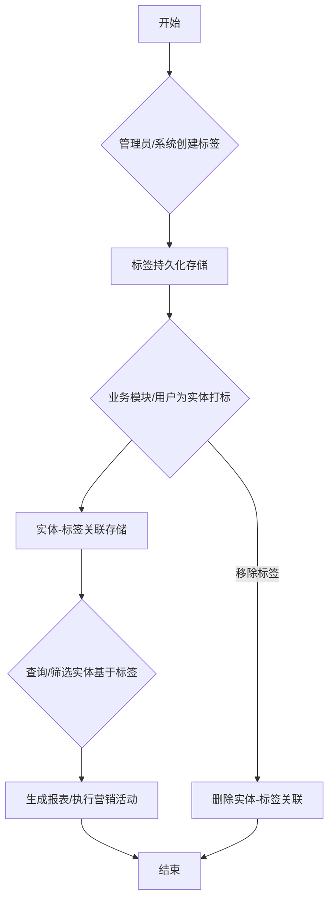

# 标签管理模块后端开发指南

## 一、引言与目标

### 1.1 模块定位
标签管理模块是客户关系管理 (CRM) 和用户画像系统的核心组成部分。它为系统提供了一种灵活的方式来分类、组织和细分客户（或其他实体），是实现精准营销、个性化服务和数据分析的基础。

### 1.2 设计目标
- **灵活性**: 支持创建多样化的标签，满足不同业务场景的需求。
- **易用性**: 提供简洁直观的接口和管理功能，方便运营人员使用。
- **高性能**: 高效处理大量标签数据以及客户与标签之间的关联关系。
- **可扩展性**: 易于集成新的标签类型、规则引擎或与其他业务模块联动。
- **一致性**: 保证标签数据及其关联关系在整个系统中的准确性和一致性。

## 二、模块概述 (原内容已整合和扩展)

本模块负责系统中客户标签（或其他适用实体的标签）的全生命周期管理。这包括标签的定义、创建、分类、修改、查询、停用/启用、删除，以及实体与标签之间关联关系的管理和维护。

### 标签管理核心流程图

## 三、核心数据实体/模型

为了实现标签管理功能，以下核心数据实体是必需的：

1.  **标签 (Tag)**
    *   `tag_id` (主键): 标签的唯一标识符。
    *   `name` (字符串, 必填, 唯一约束 - 可按分类或全局): 标签的显示名称。
    *   `description` (文本, 可选): 标签的详细描述。
    *   `category_id` (外键, 可选): 指向标签分类的ID，用于组织标签。
    *   `type` (枚举/字符串, 可选): 标签类型（例如：手动标签, 自动规则标签, 系统预设标签）。
    *   `color_code` (字符串, 可选): 用于UI展示的颜色代码。
    *   `status` (枚举/字符串, 默认: active): 标签状态 (例如: active, inactive, archived)。
    *   `creator_id` (外键, 可选): 创建该标签的用户或系统进程ID。
    *   `created_at` (时间戳): 创建时间。
    *   `updated_at` (时间戳): 最后更新时间。
    *   `usage_count` (整数, 可选): 该标签被关联的实体数量（可冗余或实时计算）。

2.  **标签分类 (TagCategory)**
    *   `category_id` (主键): 分类的唯一标识符。
    *   `name` (字符串, 必填, 唯一约束): 分类的显示名称。
    *   `description` (文本, 可选): 分类的详细描述。
    *   `parent_category_id` (外键, 可选): 指向父分类ID，支持层级分类。
    *   `sort_order` (整数, 可选): 用于UI展示的排序值。
    *   `created_at` (时间戳): 创建时间。
    *   `updated_at` (时间戳): 最后更新时间。

3.  **实体标签关联 (EntityTagLink)**
    *   `entity_id` (字符串/整数, 主键部分): 被打标实体的唯一标识符 (例如：客户ID, 用户ID)。
    *   `entity_type` (字符串, 主键部分, 可选): 被打标实体的类型 (例如：'customer', 'user', 'product')，用于支持多实体打标。
    *   `tag_id` (外键, 主键部分): 指向标签的ID。
    *   `assigned_at` (时间戳): 标签关联的创建时间。
    *   `assigned_by` (外键, 可选): 执行关联操作的用户或系统进程ID。
    *   (可选) `metadata` (JSON/文本): 存储与此次关联相关的额外信息。

## 四、功能模块划分

### 1. 标签定义与管理
    *   **标签CRUD**: 提供对标签实体的创建 (Create)、读取 (Read)、更新 (Update)、删除 (Delete) 操作。
        *   创建时需校验名称唯一性（可根据分类）、类型合法性。
        *   更新时需处理名称变更可能引发的冲突。
        *   删除标签时需考虑其关联关系的处理策略（例如：级联删除关联，或置空关联）。
    *   **标签分类管理**: 提供对标签分类的CRUD操作，支持层级分类。
    *   **标签状态管理**: 支持标签的启用、停用、归档等状态变更。停用的标签不应再用于新的关联。
    *   **批量操作**: 支持批量创建、更新、删除标签，以及批量修改标签状态。
    *   **导入/导出**: (可选) 支持通过文件（如CSV, Excel）批量导入标签定义，或导出标签列表。

### 2. 实体与标签关联管理
    *   **为实体打标**: 为指定的单个或多个实体关联一个或多个标签。
        *   需校验实体和标签的有效性。
        *   处理重复关联的情况（通常是忽略或返回成功）。
    *   **移除实体标签**: 移除指定实体与一个或多个标签之间的关联。
    *   **查询实体标签**: 根据实体ID查询其关联的所有标签。
    *   **查询标签下的实体**: 根据标签ID查询所有关联了该标签的实体列表（支持分页、筛选）。
    *   **批量关联/解绑**: 支持对一批实体批量添加或移除某些标签。

### 3. 自动标签 (可选，若支持)
    *   **规则定义**: (如果支持自动标签) 提供接口或机制来定义自动为实体打标的规则。
        *   规则可以基于实体的属性、行为数据或其他关联数据。
        *   例如："近30天消费超过1000元的客户自动打上'高价值客户'标签"。
    *   **规则引擎集成**: 与规则引擎交互，执行标签规则的匹配和应用。
    *   **规则执行与追溯**: 记录自动打标的执行情况和原因。

### 4. 标签查询与分析
    *   **标签列表查询**: 提供强大的标签查询接口，支持按名称、分类、类型、状态等条件筛选、排序和分页。
    *   **标签使用统计**: 统计每个标签被关联的实体数量、使用频率等。
    *   **标签关系分析**: (高级功能) 分析标签之间的共现关系、相似度等。
    *   **实体标签分布**: 查看不同实体群体中标签的分布情况。

## 五、API接口设计指导原则

所有对外暴露的API接口应遵循以下原则：

1.  **RESTful风格**: 尽可能遵循RESTful设计原则，使用标准的HTTP方法 (GET, POST, PUT, DELETE, PATCH)。
    *   `GET /tags`: 获取标签列表。
    *   `POST /tags`: 创建新标签。
    *   `GET /tags/{tag_id}`: 获取特定标签详情。
    *   `PUT /tags/{tag_id}`: 更新特定标签（全量更新）。
    *   `PATCH /tags/{tag_id}`: 部分更新特定标签。
    *   `DELETE /tags/{tag_id}`: 删除特定标签。
    *   `GET /entities/{entity_id}/tags`: 获取某实体的标签。
    *   `POST /entities/{entity_id}/tags`: 为某实体添加标签 (可批量)。
    *   `DELETE /entities/{entity_id}/tags/{tag_id}`: 移除某实体的特定标签。
2.  **统一数据格式**: 请求体和响应体主要使用JSON格式。
3.  **清晰的URL结构**: URL应直观易懂，反映资源层级。
4.  **版本控制**: API应考虑版本化 (例如：`/api/v1/tags`)，以便未来升级。
5.  **幂等性**: 对于创建、更新、删除操作，应考虑其幂等性。例如，多次执行相同的创建请求（如果资源已存在）应返回相同的成功结果或特定错误码。
6.  **参数校验**: 对所有输入参数进行严格校验（格式、类型、范围、必填项等）。
7.  **标准化响应码**: 使用标准的HTTP状态码来表示操作结果 (200 OK, 201 Created, 204 No Content, 400 Bad Request, 401 Unauthorized, 403 Forbidden, 404 Not Found, 500 Internal Server Error 等)。
8.  **统一错误响应格式**: 发生错误时，响应体应包含统一的错误信息结构，如错误码、错误消息、详细描述等。
9.  **分页与排序**: 对于列表查询接口，必须支持分页 (如 `offset`, `limit` 或 `page`, `size`) 和排序 (如 `sort_by`, `order`)。
10. **筛选**: 列表查询接口应支持根据关键字段进行筛选。
11. **安全性**:
    *   **认证 (Authentication)**: 所有接口（除非明确公开）都应受保护，需要有效的用户身份认证。
    *   **授权 (Authorization)**: 根据用户角色和权限控制对标签数据的访问和操作。
12. **审计日志**: 对所有写操作（创建、更新、删除标签及关联）记录详细的审计日志，包括操作人、操作时间、操作内容等。
13. **批量操作支持**: 对可能涉及大量数据的操作（如批量打标、批量删除）提供专门的批量接口，以提高效率并减少网络开销。

## 六、主要业务流程示例

### 1. 创建新标签流程
    1.  **请求接收**: API接收到创建标签的请求，包含标签名称、分类、描述等信息。
    2.  **输入校验**: 对请求参数进行校验（例如，名称是否为空，长度是否超限，分类是否存在等）。
    3.  **权限校验**: 检查当前用户是否有创建标签的权限。
    4.  **唯一性检查**: 检查标签名称在指定范围内（例如，同一分类下或全局）是否已存在。
    5.  **数据持久化**: 若校验通过，则将新标签信息存入数据库。
    6.  **响应返回**: 返回成功信息，包含新创建标签的ID和完整信息；若失败，则返回相应的错误码和信息。
    7.  **(可选) 消息通知**: (如果需要) 发送标签创建事件消息，供其他模块消费。

### 2. 为客户打标签流程
    1.  **请求接收**: API接收到为客户打标签的请求，包含客户ID列表和标签ID列表。
    2.  **输入校验**: 校验客户ID和标签ID的有效性、是否存在。
    3.  **权限校验**: 检查用户是否有为这些客户打这些标签的权限。
    4.  **循环处理 (针对每个客户和每个标签)**:
        a.  检查关联是否已存在，若已存在可跳过或返回特定提示。
        b.  创建客户与标签的关联记录到数据库。
        c.  (可选) 更新客户的标签冗余字段或标签的使用计数。
    5.  **响应返回**: 返回操作结果（成功数量、失败数量及原因）。
    6.  **(可选) 消息通知**: 发送客户被打标事件。

### 3. 查询客户的标签列表流程
    1.  **请求接收**: API接收到查询客户标签的请求，包含客户ID。
    2.  **输入校验**: 校验客户ID的有效性。
    3.  **权限校验**: (如果需要) 检查用户是否有查看该客户标签的权限。
    4.  **数据查询**: 从数据库中查询指定客户ID关联的所有有效标签信息。
    5.  **数据格式化**: 将查询结果格式化为API响应所需的结构。
    6.  **响应返回**: 返回标签列表。

## 七、技术考量与开发注意事项

1.  **性能优化**:
    *   **数据库索引**: 为 `EntityTagLink` 表的 `entity_id`, `tag_id` 以及组合键创建合适的索引。为 `Tag` 表的 `name`, `category_id`, `status` 创建索引。
    *   **缓存策略**: 考虑缓存热门标签信息、客户的标签列表等，以减少数据库查询压力。
    *   **反规范化 (Denormalization)**: (谨慎使用) 可以在客户实体中冗余部分标签信息（如标签ID列表或标签名称字符串），以加速查询，但需处理好数据同步问题。
    *   **批量操作优化**: 批量接口应在数据库层面进行优化，避免N+1查询。
2.  **数据一致性**:
    *   删除标签时，应明确其关联的处理逻辑（级联删除关联、或阻止删除仍被使用的标签）。
    *   标签名称或分类变更时，可能需要更新相关实体的冗余信息。
    *   使用事务保证标签操作及其关联操作的原子性。
3.  **可扩展性**:
    *   设计时考虑未来可能支持的标签类型（如基于AI推荐的标签）。
    *   模块间通过清晰的接口或事件进行交互，降低耦合度。
4.  **并发控制**:
    *   对于标签使用计数等字段的更新，需要考虑并发场景下的数据准确性（如使用乐观锁或数据库原子操作）。
5.  **层级标签管理**:
    *   如果支持层级标签，需要设计合理的数据结构（如邻接表、路径枚举、闭包表）并优化层级查询性能。
6.  **标签的语义与维护**:
    *   考虑提供标签治理功能，如查找相似标签、合并废弃标签、监控标签使用情况，避免标签泛滥和混乱。
7.  **与其他模块的集成**:
    *   **客户模块**: 标签模块强依赖客户信息。
    *   **搜索/筛选模块**: 标签是重要的搜索和筛选维度。
    *   **营销活动模块**: 基于标签进行人群圈选。
    *   **数据分析模块**: 基于标签进行用户画像和行为分析。
8.  **可测试性**: 模块设计应易于单元测试和集成测试。

## 八、数据校验与错误处理

1.  **输入校验**:
    *   所有API接口的输入参数都必须经过严格校验，包括类型、格式、长度、范围、非空等。
    *   对标签名称等关键字段进行特殊字符过滤或转义，防止XSS等注入攻击。
2.  **业务规则校验**:
    *   校验标签名称的唯一性（全局或分类下）。
    *   校验标签分类的层级关系是否合法（如避免循环引用）。
    *   校验实体是否存在、标签是否存在。
3.  **错误处理机制**:
    *   定义统一的错误码和错误消息格式。
    *   对于客户端错误 (4xx)，返回清晰的错误原因，指导用户修正。
    *   对于服务端错误 (5xx)，记录详细日志，返回通用错误提示，避免暴露敏感信息。
    *   关键操作应有明确的成功和失败反馈。

## 九、安全性考量

1.  **权限控制**:
    *   基于角色/权限体系 (RBAC)，细粒度控制用户对标签及分类的创建、查看、修改、删除权限。
    *   控制用户为哪些实体打标，或查看哪些实体的标签。
    *   敏感标签（如涉及用户隐私、财务状况）应有更严格的访问控制。
2.  **数据保护**:
    *   对于可能包含敏感信息的标签描述，应考虑是否需要脱敏或加密。
    *   防止通过标签查询接口泄露未授权访问的实体信息。
3.  **操作审计**:
    *   对所有标签及关联的写操作（增删改）记录详细的审计日志，包括操作者、时间、IP地址、操作内容等，便于追溯和安全分析。
4.  **防滥用**:
    *   考虑对标签创建频率、单个实体关联标签数量等进行限制，防止恶意使用或系统过载。

## 十、未来扩展方向 (可选)

*   **AI驱动的智能标签推荐**: 基于用户行为或内容分析，自动推荐合适的标签。
*   **标签语义网络**: 构建标签之间的语义关系（同义、反义、上下位等）。
*   **标签版本控制**: 支持标签定义的版本管理和回溯。
*   **跨团队标签共享与协作**: 支持更复杂的标签治理和协作流程。

## 相关前端UI图片

以下是与标签管理模块可能相关的部分前端UI截图，帮助理解用户如何在前端界面进行标签管理或查看相关信息：

### 我的 - 标签管理入口示例 (示意图)

