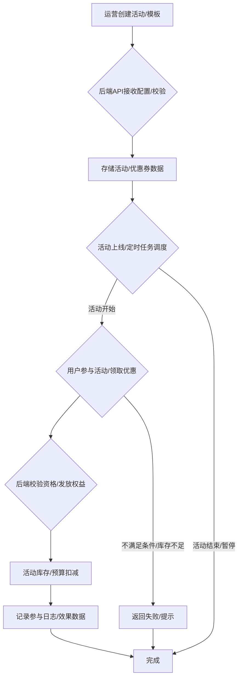

# 营销活动模块后端开发指南

## 一、引言与目标

### 1.1 模块定位
营销活动模块是驱动用户增长、提升用户活跃度、促进销售转化的核心业务引擎。它使平台能够设计、配置、执行和管理多样化的营销策略，如优惠券、折扣、满减、秒杀、拼团、积分换购等，以吸引和激励用户参与。

### 1.2 设计目标
- **灵活性与多样性**: 支持创建和组合不同类型的营销活动和规则，满足各种业务场景需求。
- **易用性与可配置性**: 提供直观的活动配置界面和API，方便运营人员快速创建和调整活动。
- **高性能与高并发**: 确保在高并发场景下（如秒杀、大规模领券）活动的稳定运行和规则的准确执行。
- **精准性与可控性**: 能够精确控制活动的目标用户、参与条件、优惠力度、预算和库存。
- **可靠性与一致性**: 保证活动状态的准确流转，以及优惠券、促销等权益在交易过程中的正确应用和核销，确保数据一致性。
- **可观测性与可分析性**: 提供活动参与数据、转化效果等关键指标的统计和分析，支持活动效果评估和优化。
- **可扩展性**: 易于扩展新的活动类型、促销规则和奖励机制。
- **安全性与防刷**: 防止恶意用户利用活动漏洞进行刷单、套利等行为。

### 营销活动创建与执行流程图

## 二、模块概述

本模块负责平台内各类营销活动的全生命周期管理。主要功能包括：活动定义与配置、优惠券模板创建与管理、优惠券的发放与核销、多样化促销规则的实现、活动参与资格校验、活动库存与预算控制、活动状态的自动流转（如定时上下线）、以及活动效果的数据追踪与分析。它旨在为运营团队提供强大的营销工具，驱动业务增长。

## 三、核心概念

- **营销活动 (Activity/Campaign)**: 一项有特定目标、规则、时间范围和目标用户的营销计划。例如："双十一全场满200减20活动"、"新用户注册送20元无门槛优惠券活动"。
- **活动类型 (Activity Type)**: 活动的具体形式，如优惠券活动、折扣活动、满减活动、秒杀、拼团、积分活动、抽奖等。
- **优惠券 (Coupon)**: 一种给予用户在购买商品或服务时减免金额或获得其他权益的凭证。
    - **优惠券模板 (Coupon Template)**: 定义了一类优惠券的规则，如面额、使用门槛、有效期、适用商品/分类、发放总量等。
    - **用户优惠券 (User Coupon)**: 用户实际领取或获得的优惠券实例，有其独立的生命周期（未使用、已使用、已过期）。
- **促销规则 (Promotion Rule)**: 定义了优惠如何生效的逻辑。例如：
    - *订单级促销*: 满X元减Y元、订单满X件打Z折、整单包邮。
    - *商品级促销*: 特定商品打折、买N免M、第二件半价。
- **参与条件/资格 (Participation Condition/Eligibility)**: 用户参与活动或使用优惠所需满足的条件，如用户等级、用户标签、首次购买、指定渠道来源等。
- **奖励/权益 (Reward/Benefit)**: 用户参与活动或使用优惠后获得的具体好处，如价格减免、赠品、积分、免运费等。
- **活动预算与库存 (Budget & Stock)**: 活动的总成本预算、优惠券总发放量、秒杀/特价商品的总库存限制。
- **活动生命周期 (Activity Lifecycle)**: 活动从创建到结束的各个状态，如草稿、待开始、进行中、已暂停、已结束、已归档。
- **核销 (Redemption/Write-off)**: 用户使用优惠券或享受促销优惠的过程，通常在订单支付环节完成。

## 四、核心数据实体/模型

1.  **活动定义 (ActivityDefinition)**
    *   `activity_id` (主键): 活动的唯一标识符。
    *   `name` (字符串, 必填): 活动名称。
    *   `activity_type` (枚举, 必填): 活动类型 (e.g., COUPON_CAMPAIGN, DISCOUNT_SALE, FLASH_SALE, GROUP_BUY)。
    *   `description` (文本, 可选): 活动详细描述。
    *   `start_time` (时间戳, 必填): 活动开始时间。
    *   `end_time` (时间戳, 必填): 活动结束时间。
    *   `status` (枚举: DRAFT, PENDING_START, ACTIVE, PAUSED, ENDED, ARCHIVED): 活动状态。
    *   `target_audience_rules` (JSON, 可选): 目标用户规则 (如用户等级、标签、注册时间段)。
    *   `participation_rules` (JSON, 可选): 参与次数限制、频率限制等。
    *   `budget_total` (十进制, 可选): 活动总预算。
    *   `budget_used` (十进制, 可选): 已使用预算。
    *   `created_by` (外键, 可选): 创建人ID。
    *   `created_at`, `updated_at` (时间戳)。
    *   `activity_specific_config` (JSON, 可选): 存储特定活动类型所需的额外配置 (如秒杀商品ID与价格、拼团人数等)。

2.  **优惠券模板 (CouponTemplate)**
    *   `template_id` (主键): 优惠券模板的唯一标识符。
    *   `activity_id` (外键, 可选): 关联的营销活动ID（如果此模板专属于某活动）。
    *   `name` (字符串, 必填): 优惠券名称 (如 "20元满199减免券")。
    *   `coupon_type` (枚举: CASH_VOUCHER, DISCOUNT_PERCENT, FREE_SHIPPING, GIFT_COUPON): 优惠券类型。
    *   `value` (十进制, 条件必填): 面额（如20元）或折扣率（如0.8代表8折）。
    *   `minimum_spend` (十进制, 可选, 默认0): 最低消费门槛。
    *   `validity_type` (枚举: FIXED_DATE_RANGE, DYNAMIC_DAYS_FROM_ISSUE): 有效期类型。
    *   `valid_from` (时间戳, 条件必填): 固定有效期开始时间。
    *   `valid_to` (时间戳, 条件必填): 固定有效期结束时间。
    *   `days_valid_after_issue` (整数, 条件必填): 领取后有效天数。
    *   `total_quantity` (整数, 可选): 发放总量上限。
    *   `issued_quantity` (整数, 默认0): 已发放数量。
    *   `per_user_limit` (整数, 可选, 默认1): 每用户可领取/使用上限。
    *   `applicable_scope_rules` (JSON, 可选): 适用范围规则 (如指定商品ID、分类、品牌，或排除某些商品)。
    *   `status` (枚举: ACTIVE, INACTIVE, EXPIRED_GENERATION): 模板状态。
    *   `created_at`, `updated_at` (时间戳)。

3.  **用户优惠券 (UserCoupon)**
    *   `user_coupon_id` (主键): 用户优惠券的唯一实例ID。
    *   `user_id` (外键, 必填): 所属用户ID。
    *   `template_id` (外键, 必填): 关联的优惠券模板ID。
    *   `coupon_code` (字符串, 可选, 唯一): (如果需要) 优惠券码。
    *   `status` (枚举: UNUSED, USED, EXPIRED, LOCKED): 优惠券状态。
    *   `issued_at` (时间戳): 发放/领取时间。
    *   `valid_from` (时间戳, 必填): 此券的生效时间 (根据模板计算得出)。
    *   `valid_to` (时间戳, 必填): 此券的失效时间 (根据模板计算得出)。
    *   `used_at` (时间戳, 可选): 使用时间。
    *   `used_order_id` (外键, 可选): 使用该券的订单ID。

4.  **促销规则配置 (PromotionRuleConfig)** (可作为活动定义的一部分或独立实体)
    *   `rule_id` (主键)。
    *   `activity_id` (外键)。
    *   `rule_type` (枚举: ORDER_FIXED_DISCOUNT, ORDER_PERCENT_DISCOUNT, ITEM_SPECIFIC_PRICE, BUY_N_GET_M_FREE)。
    *   `conditions` (JSON): 规则生效条件（如订单总额、商品数量、特定商品）。
    *   `actions` (JSON): 规则匹配后执行的动作（如减免金额、打折、赠送商品）。

5.  **活动参与日志 (ActivityParticipationLog)**
    *   `log_id` (主键)。
    *   `activity_id` (外键)。
    *   `user_id` (外键)。
    *   `participation_time` (时间戳)。
    *   `result` (JSON, 可选): 参与结果（如秒杀成功、拼团状态）。

## 五、功能模块划分

1.  **活动管理模块**
    *   营销活动的创建、配置、编辑、复制、上下线（手动或定时）。
    *   活动状态管理和生命周期控制。
    *   活动目标用户群组的定义和管理。
2.  **优惠券管理模块**
    *   优惠券模板的CRUD操作。
    *   优惠券的生成、发放（主动推送、用户领取、活动触发等）。
    *   用户优惠券列表查询、状态管理（未使用、已使用、已过期）。
    *   优惠券核销逻辑（与订单模块集成）。
    *   优惠券使用条件校验。
3.  **促销规则引擎/应用模块**
    *   定义和管理各类促销规则（满减、折扣、买赠、包邮等）。
    *   在购物车或订单提交流程中，根据当前商品和用户信息，匹配并应用适用的促销规则。
    *   处理多种促销规则叠加或互斥的逻辑。
4.  **活动参与与资格校验模块**
    *   校验用户是否有资格参与特定活动（基于目标用户规则、参与次数限制等）。
    *   处理用户参与活动的请求（如领券、报名参加秒杀）。
5.  **库存与预算控制模块**
    *   活动（如秒杀商品、优惠券）的库存/发放量控制和实时扣减。
    *   活动预算的监控和超限预警/控制。
6.  **定时任务与状态流转模块**
    *   活动定时开始、定时结束。
    *   优惠券定时生效、定时过期检查。
    *   (可选) 周期性活动（如每日签到）的重置。
7.  **数据统计与效果分析模块**
    *   统计活动参与人数、转化率、优惠券使用率、活动带来的订单量/销售额等。
    *   提供API供数据分析或BI工具使用。

## 六、API接口设计指导原则

- **资源**: `activities`, `coupon-templates`, `users/{userId}/coupons`, `promotions/rules`。
- **活动管理API**: (示例)
    - `POST /activities`: 创建新活动。
    - `GET /activities`: 获取活动列表 (可按类型、状态、时间范围筛选)。
    - `GET /activities/{activity_id}`: 获取活动详情。
    - `PUT /activities/{activity_id}`: 更新活动信息。
    - `POST /activities/{activity_id}/publish`: 上线活动。
    - `POST /activities/{activity_id}/pause`: 暂停活动。
    - `POST /activities/{activity_id}/end`: 结束活动。
- **优惠券模板API**: (示例)
    - `POST /coupon-templates`: 创建优惠券模板。
    - `GET /coupon-templates`: 获取模板列表。
    - `GET /coupon-templates/{template_id}`: 获取模板详情。
- **用户优惠券API**: (示例)
    - `POST /users/{user_id}/coupons/issue`: (后台接口) 为用户发放指定模板的优惠券。
    - `POST /users/{user_id}/coupons/claim`: (用户接口) 用户主动领取优惠券（基于活动或公开券码）。
    - `GET /users/{user_id}/coupons`: 获取用户的优惠券列表 (可按状态筛选)。
    - `GET /users/{user_id}/coupons/{user_coupon_id}`: 获取用户单张优惠券详情。
    - `POST /orders/calculate-promotions`: (购物车/订单环节调用) 传入订单信息，返回适用的优惠和最终价格。
- **通用原则**: RESTful, JSON, 标准状态码，统一错误响应，认证授权，审计日志。

## 七、主要业务流程示例

### 1. 创建并发布一个"新用户专享10元无门槛优惠券"活动
    1.  **创建优惠券模板**: 运营人员通过API创建优惠券模板：名称="新用户10元券", 类型=CASH_VOUCHER, 面额=10, 最低消费=0, 发放总量=10000, 每人限领=1, 有效期类型=DYNAMIC_DAYS_FROM_ISSUE, 有效天数=7, 适用范围=全场通用, 目标用户=新用户。
    2.  **创建营销活动**: 运营人员创建活动：名称="新用户见面礼", 类型=COUPON_CAMPAIGN, 开始/结束时间, 关联上述优惠券模板, 目标用户规则配置为"注册时间在7天内且未领取过此券的用户"。
    3.  **发布活动**: 活动状态置为"ACTIVE"。
    4.  **用户触发**: 用户注册成功后，系统检查其是否符合活动目标人群。若符合，则自动为其发放一张该模板的优惠券到其账户 (`UserCoupon`表新增记录)。

### 2. 用户在下单时使用优惠券
    1.  用户在购物车页面或结算页面。系统展示用户可用的优惠券列表。
    2.  用户选择一张优惠券。
    3.  前端将选中的`user_coupon_id`和订单商品信息提交给后端订单服务或促销计算服务。
    4.  后端服务：
        a.  校验`user_coupon_id`的有效性（是否存在、是否属于该用户、是否未使用、是否在有效期内）。
        b.  校验该优惠券是否适用于当前订单中的商品/分类（基于`CouponTemplate`的`applicable_scope_rules`）。
        c.  校验是否满足使用门槛（基于`CouponTemplate`的`minimum_spend`）。
        d.  如果都满足，则计算优惠金额，更新订单总价。
        e.  (可选) 临时锁定该优惠券，防止并发使用。
    5.  用户确认支付后，订单服务在创建订单时，记录所使用的`user_coupon_id`，并将该`UserCoupon`状态更新为`USED`，记录`used_at`和`used_order_id`。

### 3. 商品秒杀活动流程
    1.  **创建秒杀活动**: 运营配置秒杀活动：选择特定商品SKU、设定秒杀价格、秒杀库存量、活动开始/结束时间、用户参与资格（如每人限购1件）。
    2.  **活动开始前**: 前端展示活动预告，用户可订阅提醒。
    3.  **活动开始**: 用户涌入抢购。
        a.  后端接口接收抢购请求，包含用户ID、秒杀活动ID、商品SKU ID。
        b.  **资格校验**: 检查用户是否已抢购过、是否符合其他参与条件。
        c.  **库存校验与扣减 (高并发点)**:
            i.  快速读取秒杀专用库存 (可使用Redis等缓存)。
            ii. 若库存 > 0，则尝试原子性扣减库存 (如Redis `DECR`或Lua脚本)。
            iii.若扣减成功，则认为抢购成功，生成一个唯一的抢购凭证或直接引导用户下单。
            iv. 若库存不足或扣减失败，则返回抢购失败。
        d.  **限流与防刷**: 对接口进行限流，防止系统过载。识别和拦截机器人刷单行为。
    4.  **下单转化**: 抢购成功的用户需在规定时间内凭抢购凭证完成订单支付，否则名额释放。
    5.  **活动结束**: 定时任务将活动状态置为"ENDED"。

## 八、技术考量与开发注意事项

1.  **规则引擎设计**: 对于复杂的促销规则组合（如叠加、互斥、最优选择），可能需要设计或引入轻量级规则引擎。
2.  **高并发处理**: 秒杀、大规模领券等场景对系统并发能力要求极高。
    *   **库存扣减**: 采用Redis等内存数据库配合Lua脚本实现原子性操作，或使用分布式锁，防止超卖。
    *   **请求队列**: 对抢购请求进行排队处理，削峰填谷。
    *   **前端限流与校验**: 前端配合进行部分校验和限流，减轻后端压力。
    *   **数据最终一致性**: 考虑极端情况下的数据同步问题。
3.  **事务管理与数据一致性**: 领券、用券、活动库存扣减等操作需保证事务性。特别是涉及多个服务（如订单、库存、用户）的分布式事务，需要谨慎设计（如采用Saga、TCC或最终一致性方案）。
4.  **定时任务的可靠性与精度**: 活动的自动上下线、优惠券的自动过期等依赖定时任务。需确保定时任务框架的稳定可靠，以及任务执行的准时性。考虑分布式定时任务的选型和配置。
5.  **可扩展性**: 模块设计应易于添加新的活动类型、优惠券类型和促销规则，例如通过策略模式或插件化设计。
6.  **与核心业务模块的紧密集成**: 营销活动模块与产品、用户、订单、支付等模块高度耦合。接口设计和数据交互需清晰高效。
7.  **用户体验**: 优惠信息展示清晰，领取和使用流程便捷。避免复杂的规则让用户困惑。
8.  **性能优化**: 优惠券列表查询、促销规则匹配等操作需要优化性能，避免影响用户交易流程。合理使用缓存。
9.  **活动效果追踪**: 埋点记录用户在活动中的关键行为，以便分析活动效果。

## 九、数据校验与错误处理

1.  **活动配置校验**: 如活动时间设置是否合理、关联商品是否存在、优惠力度是否在允许范围内。
2.  **用户参与资格校验**: 严格校验用户是否满足活动的所有条件。
3.  **优惠券使用条件校验**: 在用户使用优惠券时，再次校验其适用范围、门槛、有效期等。
4.  **库存/预算校验**: 实时检查活动库存或预算是否充足。
5.  **并发冲突处理**: 如多人同时领取最后一张优惠券或抢购最后一件商品，系统应能正确处理冲突，保证只有一个成功。
6.  **错误信息友好提示**: 向用户或运营人员返回清晰明确的错误信息。

## 十、安全性与防刷考量

1.  **防恶意刷券/刷单**: 
    *   设置合理的领取限制（IP、设备、用户每日/总计）。
    *   对异常行为进行监控和识别（如短时间大量相似请求）。
    *   引入验证码、滑块验证等机制增加机器人操作难度。
    *   风控系统介入，对高风险用户或订单进行拦截或审核。
2.  **接口安全**: 保护活动配置、优惠券发放等关键接口不被未授权访问。
3.  **防止条件绕过**: 确保所有参与条件和使用限制在后端都得到严格校验，不能仅依赖前端。
4.  **优惠金额计算安全**: 防止通过篡改请求参数等方式获得不当优惠。
5.  **数据篡改防护**: 保护活动配置、优惠券数据不被非法修改。
6.  **操作审计**: 对重要的营销活动配置变更、优惠券发放等操作记录审计日志。

---
> 本文档为营销活动模块后端开发提供通用设计指南，具体实现需结合业务特性和技术栈进行细化。 

## 相关前端UI图片

以下是与营销活动模块相关的部分前端UI截图，帮助理解后端功能在前端界面的展现：

### 工作台 - 营销活动入口 (示意图)

 