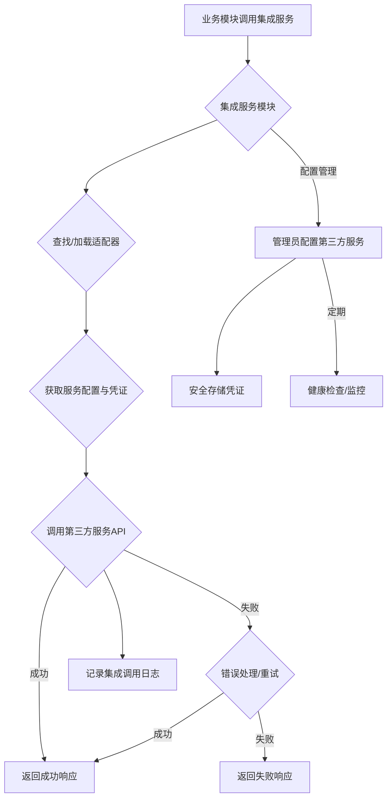

# 第三方服务集成管理模块后端开发指南

## 一、引言与目标

### 1.1 模块定位
第三方服务集成管理模块是平台与外部系统和服务进行交互的枢纽。它负责统一配置、管理和监控所有对外部第三方服务（如消息推送服务、支付网关、数据分析工具、身份验证提供商、云存储服务等）的连接与调用。

### 1.2 设计目标
- **统一管理**: 提供集中的界面和API来管理所有第三方服务的配置信息。
- **安全性**: 确保敏感凭证（API密钥、Token等）的安全存储和使用。
- **可靠性与容错**: 保证与外部服务通信的稳定性，并提供优雅的错误处理和重试机制。
- **可扩展性**: 易于添加对新的第三方服务的支持（例如通过适配器模式）。
- **可观测性**: 记录详细的集成调用日志，监控集成点的健康状况和性能。
- **解耦**: 将业务逻辑与具体的第三方服务实现细节解耦。
- **易用性**: 简化开发人员配置和使用第三方服务的流程。

## 二、模块概述

本模块提供对平台集成的各类外部第三方服务的全生命周期管理。这包括服务的注册与配置、凭证管理、健康检查、调用适配、以及与外部服务交互的日志记录和监控。其目的是标准化外部服务集成方式，提高系统的稳定性和可维护性。

### 第三方服务集成流程图

## 三、核心概念

- **第三方服务 (Third-Party Service)**: 平台依赖的外部系统或API，例如短信/邮件服务商、支付网关、社交媒体平台、地图服务、企业级SaaS工具等。
- **集成点 (Integration Point)**: 系统中调用第三方服务的具体位置或功能。
- **适配器 (Adapter)**: 针对特定第三方服务封装其API调用、认证、数据格式转换等逻辑的组件。这是实现可扩展性的关键。
- **配置凭证 (Configuration & Credentials)**: 连接和使用第三方服务所需的参数，如API Key, Secret, App ID, 服务端点URL, 回调地址等。
- **集成契约 (Integration Contract)**: 定义了平台与特定类型第三方服务交互的标准化接口或数据格式。
- **健康检查 (Health Check)**: 用于检测与第三方服务连接是否正常、配置是否有效的功能。

## 四、核心数据实体/模型

1.  **第三方服务配置 (ThirdPartyServiceConfiguration)**
    *   `service_id` (主键): 服务配置的唯一标识符。
    *   `service_name` (字符串, 必填): 服务的可读名称 (如 "邮件发送服务-SendGrid", "短信服务-Twilio")。
    *   `service_type` (枚举/字符串, 必填): 服务的类型 (如 EMAIL_SERVICE, SMS_SERVICE, PAYMENT_GATEWAY, OAUTH_PROVIDER)。用于关联适配器。
    *   `description` (文本, 可选): 服务描述。
    *   `configurations` (JSON/加密文本, 必填): 存储该服务的具体配置参数和凭证（如API Key, Secret, 端点URL等）。**此字段必须加密存储敏感信息。**
    *   `is_enabled` (布尔, 默认: true): 该服务配置是否启用。
    *   `default_timeout_ms` (整数, 可选): 调用此服务的默认超时时间（毫秒）。
    *   `retry_policy` (JSON, 可选): 配置调用失败时的重试策略（如最大次数、退避算法）。
    *   `health_check_endpoint` (字符串, 可选): 用于健康检查的API端点（如果适用）。
    *   `created_at` (时间戳): 创建时间。
    *   `updated_at` (时间戳): 最后更新时间。

2.  **集成调用日志 (IntegrationCallLog)**
    *   `log_id` (主键): 日志唯一标识符。
    *   `service_id` (外键): 关联的第三方服务配置ID。
    *   `service_type` (字符串): 服务类型。
    *   `request_timestamp` (时间戳): 请求发起时间。
    *   `response_timestamp` (时间戳, 可选): 收到响应时间。
    *   `duration_ms` (整数, 可选): 调用耗时（毫秒）。
    *   `request_endpoint` (字符串): 调用的外部API端点。
    *   `request_payload` (文本/JSON, 可选, 注意脱敏): 发送给第三方服务的请求体。
    *   `response_status_code` (整数, 可选): 第三方服务返回的HTTP状态码。
    *   `response_payload` (文本/JSON, 可选, 注意脱敏): 第三方服务返回的响应体。
    *   `is_success` (布尔): 调用是否成功。
    *   `error_message` (文本, 可选): 如果失败，记录错误信息。
    *   `correlation_id` (字符串, 可选): 用于追踪的关联ID。

## 五、功能模块划分

1.  **服务配置管理模块**
    *   第三方服务配置的CRUD操作（创建、读取、更新、删除）。
    *   启用/禁用特定服务配置。
    *   安全地管理和存储服务凭证。
    *   版本化配置 (可选)。
2.  **集成适配器管理与执行模块**
    *   加载和管理针对不同`service_type`的适配器。
    *   提供统一的内部接口，供业务模块通过适配器调用外部服务，屏蔽具体实现细节。
    *   处理请求参数转换、认证头构建、响应解析等。
3.  **连接性测试与健康检查模块**
    *   提供测试特定服务配置连通性的功能。
    *   (可选) 定期对已启用的服务进行健康检查，并在失败时告警。
4.  **日志与监控模块**
    *   记录所有对第三方服务的调用尝试（成功与失败）。
    *   提供查询集成调用日志的接口。
    *   监控集成点的调用频率、成功率、平均耗时等关键指标。

## 六、API接口设计指导原则

- **资源**: `integrations/services` (第三方服务配置), `integrations/logs` (集成调用日志)。
- **服务配置API**: (示例)
    - `POST /integrations/services`: 添加新的第三方服务配置。
    - `GET /integrations/services`: 获取已配置的服务列表 (可按类型、状态筛选)。
    - `GET /integrations/services/{service_id}`: 获取特定服务配置详情 (凭证应脱敏或不返回)。
    - `PUT /integrations/services/{service_id}`: 更新服务配置。
    - `DELETE /integrations/services/{service_id}`: 删除服务配置。
    - `POST /integrations/services/{service_id}/enable`: 启用服务。
    - `POST /integrations/services/{service_id}/disable`: 禁用服务。
    - `POST /integrations/services/{service_id}/test-connection`: 测试与该第三方服务的连接性。
- **集成日志API**: (示例)
    - `GET /integrations/logs`: 获取集成调用日志列表 (支持按服务ID、时间范围、状态等筛选)。
    - `GET /integrations/logs/{log_id}`: 获取特定日志详情。
- **通用原则**: 遵循RESTful, JSON格式，标准化HTTP状态码和错误响应，所有接口需认证授权。

## 七、主要业务流程示例

### 1. 管理员添加并启用一个新的短信服务集成
    1.  管理员通过后台界面或API提交添加新服务配置的请求。
        *   请求体包含：`service_name`="阿里云短信服务", `service_type`="SMS_PROVIDER_ALIYUN", `configurations`={ "accessKeyId": "...", "accessKeySecret": "...", "signName": "...", "templateCode": "..." }, `is_enabled`=false。
    2.  API接收请求，对`configurations`中的敏感信息进行加密处理后，持久化到数据库。
    3.  管理员调用 `POST /integrations/services/{new_service_id}/test-connection` 测试配置是否正确。
        *   模块内部找到对应的"SMS_PROVIDER_ALIYUN"适配器，使用配置尝试发送一条测试短信或调用服务商的测试接口。
    4.  测试成功后，管理员调用 `POST /integrations/services/{new_service_id}/enable` 启用该服务。

### 2. 业务模块通过集成点发送邮件
    1.  用户注册成功后，账户服务需要发送一封欢迎邮件。
    2.  账户服务调用一个内部的"通知服务"或直接与"集成服务"交互，请求发送邮件。
        *   请求参数可能为：`service_type_preference`=["EMAIL_PROVIDER_PRIMARY", "EMAIL_PROVIDER_BACKUP"], `recipient`="user@example.com", `subject`="Welcome!", `body`="Hello..."。
    3.  集成服务模块：
        a.  查找已启用的、类型匹配的邮件服务配置（如 SendGrid）。
        b.  获取对应的邮件服务适配器。
        c.  使用适配器和配置信息，调用第三方邮件服务的API发送邮件。
        d.  记录本次调用的详细日志到 `IntegrationCallLog` 表，包括请求、响应、状态等。
    4.  向账户服务返回发送成功或失败的结果。

## 八、技术考量与开发注意事项

1.  **适配器模式 (Adapter Pattern)**: 强烈推荐为每种第三方服务或每种服务类型（如邮件、短信）实现适配器。这使得添加新服务或替换服务商变得容易，而无需修改核心业务逻辑。
2.  **凭证安全管理**:
    *   API密钥、密码等敏感凭证绝不能硬编码或明文存储在配置文件中。
    *   应使用专门的密钥管理服务 (如 HashiCorp Vault, AWS KMS, Azure Key Vault) 或数据库加密功能进行安全存储。
    *   访问凭证的权限应受到严格控制。
3.  **超时与重试机制**:
    *   为外部调用设置合理的超时时间。
    *   对可恢复的错误（如网络抖动、服务商临时不可用）实现重试逻辑（例如指数退避）。配置应灵活。
4.  **容错与降级**:
    *   当某个第三方服务不可用时，系统应能优雅处理，避免级联失败。
    *   考虑备用服务商切换逻辑（如主短信通道失败，自动切换到备用通道）。
    *   对于非核心集成，可实现熔断机制。
5.  **异步处理**: 对于耗时较长或不需要立即响应的集成调用（如批量数据同步），考虑使用消息队列进行异步处理。
6.  **API版本控制与兼容性**: 第三方服务的API可能会更新。适配器需要关注其版本变化，并处理好向后兼容性或进行适配器升级。
7.  **日志记录的粒度与内容**: 日志应足够详细以便排查问题，但需注意脱敏请求/响应中的敏感数据。
8.  **标准化错误处理**: 统一内部错误码和错误信息格式，方便上层业务处理。
9.  **限流与配额**: 注意第三方服务商对API调用频率的限制和配额，避免超出限制导致服务被暂停。模块内部可实现相应的限流控制。
10. **可测试性**: 方便对适配器逻辑、连接测试等进行单元测试和集成测试。使用Mock服务模拟第三方API行为。

## 九、数据校验与错误处理

1.  **配置校验**:
    *   对用户输入的服务配置参数进行格式和有效性校验。
    *   确保关键凭证字段不为空。
2.  **调用前校验**:
    *   检查服务配置是否启用。
    *   检查所需参数是否齐全。
3.  **响应处理**:
    *   根据第三方服务返回的HTTP状态码和响应体判断操作是否成功。
    *   解析错误信息，转换为内部标准错误。
4.  **网络异常处理**: 捕获和处理网络连接超时、DNS解析失败等异常。

## 十、安全性考量

1.  **凭证安全**: (已在技术考量中重点强调) 加密存储，最小权限访问，定期轮换（如果服务商支持）。
2.  **数据传输安全**: 与第三方服务通信优先使用HTTPS/TLS。
3.  **回调安全 (如果集成涉及接收回调)**:
    *   验证回调请求的来源IP是否可信。
    *   使用签名机制（如HMAC）验证回调请求的真实性和完整性。
    *   处理好回调的幂等性。
4.  **防止信息泄露**: 避免在日志或错误信息中无意泄露敏感配置或数据。
5.  **输入验证**: 如果配置中允许用户输入可执行脚本或模板（不推荐），需严格审查和沙箱化执行。
6.  **权限控制**: 严格控制对集成配置API的访问权限，只有授权管理员可进行修改。

## 相关前端UI图片

以下是与第三方服务集成管理模块可能相关的部分前端UI截图，帮助理解用户或管理员如何在前端界面查看和管理集成服务：

### 系统设置 - 集成管理入口示例 (示意图)

### 我的 - 集成相关入口示例 (示意图)

---
> 本文档旨在提供第三方服务集成管理的通用后端设计指导。具体实现需根据平台特性和所集成服务的具体要求进行调整。 